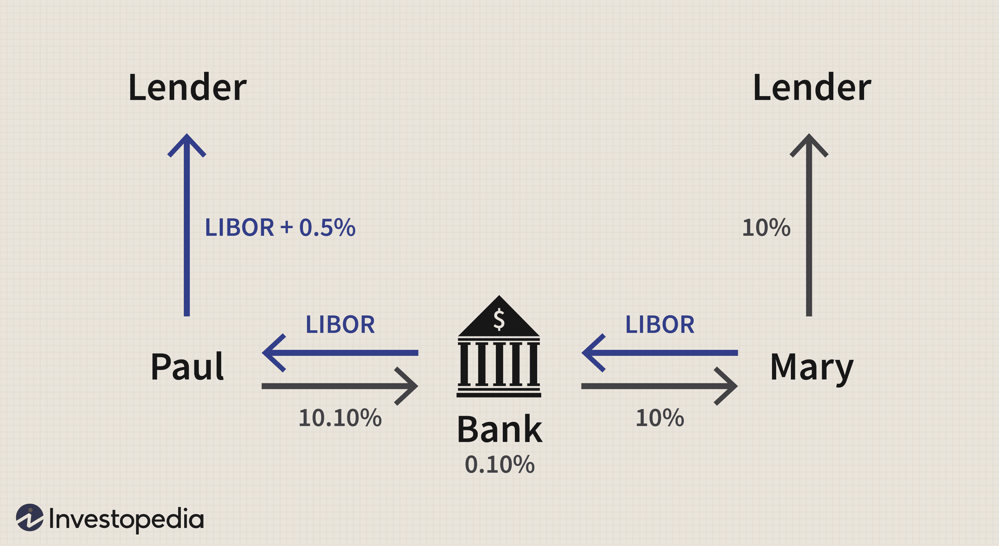

The financial world is constantly evolving, with sophisticated strategies being developed to enhance trading efficiency and risk management. One area where this is evident is the use of swap networks and their integration with algorithmic trading. As global financial systems become more interconnected, the demand for efficient and robust mechanisms to manage financial risks increases. Financial swaps and swap networks play a pivotal role in managing currency and interest rate risks, providing critical support to global financial markets.

This article explores the functionality of financial swaps, swap networks, and the increasing impact of algorithmic trading on these tools. Financial swaps, being derivative contracts, are instrumental for entities looking to hedge against market volatility or engage in speculative trading with defined financial parameters. Swap networks, similarly, enable central banks to exchange currencies, ensuring liquidity and financial stability. 



Algorithmic trading, characterized by the use of automated systems to execute trades based on predefined criteria, has revolutionized trading practices. In conjunction with swaps, algorithmic trading enhances transaction speed and accuracy, offering traders strategic advantages in a highly competitive market landscape. The intersection of these elements necessitates an understanding of how these components work together to optimize financial strategies.

Our discussion will elucidate the potential benefits and inherent risks involved in these complex trading mechanisms. While the innovations in swap networks and algo trading provide opportunities for strategic advantages, they also introduce complexities that require careful risk management and regulatory consideration. By identifying the synergies and challenges of these strategies, we aim to provide a comprehensive overview of their role in modern financial markets.

## Table of Contents

## Understanding Swap Networks

A swap network is a reciprocal credit arrangement between two or more central banks, allowing them to exchange currencies to maintain a stable and liquid currency market. These arrangements, also known as currency swap lines, play an essential role in enhancing liquidity and managing financial risks across both domestic and international spheres. Swap networks provide a flexible mechanism for central banks to handle currency fluctuations and potential economic disruptions by securing access to foreign currencies when needed.

The U.S. Federal Reserve provides a notable example of swap network utilization, having established extensive swap network facilities with central banks around the world during the 2007–2008 financial crisis. These swap agreements expanded the Federal Reserve's capacity to inject liquidity into the global financial system by exchanging U.S. dollars for foreign currencies. This measure was critical in addressing the severe liquidity shortages faced by many central banks at the time, allowing them to support their commercial banks and mitigate the impacts of the crisis.

By maintaining [liquidity](/wiki/liquidity-risk-premium) through currency swaps, swap networks enable commercial banks to meet reserve requirements effectively. This, in turn, influences interbank lending rates, ensuring that lending activities continue smoothly despite financial uncertainties or credit crunch situations. Swap lines help stabilize financial markets by providing central banks with a tool to counterbalance temporary liquidity shortages, thereby reducing stress on the banking system and preventing wider economic destabilization.

In conclusion, swap networks are vital instruments for maintaining currency market stability and liquidity. Their strategic implementation during financial crises underscores their importance in supporting global financial stability and managing risk. As financial systems evolve and adapt to new challenges, the role of swap networks in fortifying economic resilience remains critical.

## Financial Swaps: Types and Applications

Financial swaps are derivative contracts facilitating the exchange of cash flows between parties based on predefined financial parameters. These instruments typically involve two parties agreeing to exchange future financial obligations, making swaps versatile tools for risk management and speculative purposes. 

Interest rate swaps are one of the most prevalent types and involve exchanging fixed-rate interest payments for floating-rate payments. This mechanism is instrumental in managing [interest rate](/wiki/interest-rate-trading-strategies) exposure, allowing companies to stabilize cash flows and predict future financial obligations. For example, a company with a fixed-rate loan may enter an interest rate swap to benefit from potentially lower floating rates, thereby reducing its overall interest expense.

Mathematically, an interest rate swap can be represented by two cash flow streams: one fixed and one floating. The present value of the fixed cash flows can be denoted as $PV_{\text{fixed}}$ and the present value of the floating cash flows as $PV_{\text{floating}}$. The net swap payment at evaluation can be expressed as:

$$
\text{Net Payment} = PV_{\text{floating}} - PV_{\text{fixed}}
$$

Currency swaps are another significant class of swaps, designed to address foreign exchange risk. These swaps involve the exchange of principal and interest payments in one currency for principal and interest payments in another. Unlike interest rate swaps, currency swaps involve exchanges of notional amounts at the start and maturity of the contract, offering a complete hedge against foreign currency fluctuation. This is particularly beneficial for multinational corporations with obligations in multiple currencies, as it allows them to manage exposure efficiently and ensure predictable cash flows across different currencies.

Equity swaps involve the exchange of returns on a stock or stock index for a different type of cash flow, typically a fixed or floating rate of interest. This enables investors to gain exposure to equity markets without owning the underlying stocks, facilitating strategic positioning in the market without direct investment.

Credit default swaps (CDS) represent a type of swap that acts as a form of insurance against the default of a borrower. In a CDS contract, the buyer pays periodic premiums to the seller, and in exchange, the seller agrees to compensate the buyer if the underlying financial instrument defaults. This financial innovation allows for the management of credit risk, providing protection against potential loss due to borrower defaults.

Each type of swap serves distinct financial objectives, such as hedging against fluctuations in interest rates, currency exchange rates, equity returns, or credit risk, enabling entities to fortify their financial strategies and attain their risk management goals effectively. These instruments also offer opportunities for speculation by allowing market participants to take positions based on expected movements in interest rates, currency exchange rates, or default probabilities, thus playing a pivotal role in the global financial markets.

## Algorithmic Trading in the Swap Market

Algorithmic trading, commonly known as algo trading, employs automated systems to conduct trading activities by following predefined criteria. In the swap market, the integration of [algorithmic trading](/wiki/algorithmic-trading) has revolutionized the management and execution of complex transactions, primarily due to its ability to process real-time data and adjust trading positions dynamically. This section examines how these algorithms function within the swap market, the mechanisms behind their effective hedging and speculation capabilities, and the advancements that enable more sophisticated market interactions.

The primary advantage of algorithmic trading in the swap market lies in its speed and efficiency. Automated systems can evaluate vast amounts of data instantaneously, making real-time decisions that would be impossible for human traders to achieve consistently. For example, algorithms can monitor interest rate differentials between countries and immediately execute swaps when advantageous conditions are detected. This responsiveness enables traders to capitalize on fleeting market inefficiencies and optimize the timing of their trades.

Effective hedging, made possible by algorithmic trading, primarily hinges on the integration of predictive models with historical data analysis. By analyzing patterns and trends from historical data, algorithms can forecast potential market movements and adjust trading strategies accordingly. This predictive capability is critical in the swap market, where participants often use financial swaps to mitigate risks such as interest rate fluctuations and currency exchange variability. For instance, an algo trading system could be programmed to engage in interest rate swaps when it predicts adverse changes in interest rates based on historical trends and economic indicators.

Moreover, innovative algorithmic strategies aim to enhance the trader's decision-making process by allowing for more sophisticated market interactions. Cutting-edge algorithms use technologies such as [machine learning](/wiki/machine-learning) and [artificial intelligence](/wiki/ai-artificial-intelligence) to continuously learn from new data inputs. These technologies can improve decision-making accuracy over time, enabling more effective execution of complex trade strategies. For example, a machine learning algorithm might be trained on historical swap trade data to identify patterns that precede successful trades, which can then inform future trading decisions.

To illustrate the practical implementation of these concepts, consider a simplified Python code snippet used to execute a swap based on specific market conditions:

```python
import numpy as np
from sklearn.linear_model import LinearRegression

# Example data: interest rates over time
interest_rates = np.array([1.5, 2.0, 1.7, 2.1, 1.9])
time = np.arange(len(interest_rates)).reshape(-1, 1)

# Predict future interest rate using linear regression
model = LinearRegression()
model.fit(time, interest_rates)
future_time = np.array([[5]])  # Predict for the next time step
predicted_rate = model.predict(future_time)[0]

# Execute swap if predicted rate exceeds a threshold
threshold = 2.0
if predicted_rate > threshold:
    print("Execute swap: Anticipated interest rate increase")
else:
    print("Hold: No swap execution necessary")
```

This simple code exemplifies how predictions based on historical data can drive trading decisions in an algorithmic system.

Overall, algorithmic trading in the swap market underscores the transformative role of technology in contemporary finance. By enabling rapid decision-making, effective risk management, and enhanced market interactions, these algorithms offer both immense opportunities and significant challenges. As they continue to evolve, the future promise of algorithmic trading is poised to deepen its impact on the financial landscape.

## The Benefits and Risks of Swap and Algo Trading

Swaps provide significant strategic advantages in the management of financial risks, offering a cost-effective means to handle exposure to various financial variables. One of their primary benefits is the ability to customize financial contracts to meet specific needs, which affords participants considerable flexibility in managing cash flows and risk exposures. This customization is particularly advantageous in structures requiring precise alignment with underlying financial positions or anticipated cash flows, allowing participants to optimize their financial strategies.

However, swaps are not without risks. One of the most significant concerns is counterparty risk, which is the risk that the other party in the swap agreement will default on their contractual obligations. This risk became particularly evident during financial crises when the likelihood of defaults increased. To mitigate counterparty risk, robust risk management strategies are essential. Financial institutions commonly use measures such as collateral requirements, regular mark-to-market assessments, and the use of central clearinghouses to offset potential credit exposure.

Algorithmic trading, often referred to as algo trading, complements swap transactions by introducing automation, speed, and efficiency to trading activities. Algo trading reduces transaction costs by minimizing the bid-ask spread and optimizing trade execution, thus enhancing liquidity in the markets. This approach is enabled by automated systems that execute trades based on predefined criteria, utilizing real-time data analysis to make dynamic adjustments to trading positions.

Despite its benefits, algorithmic trading poses challenges. High-frequency and high-[volume](/wiki/volume-trading-strategy) trades can contribute to market [volatility](/wiki/volatility-trading-strategies), as evidenced during numerous "flash crashes." These are instances where rapid selling leads to abrupt declines in market prices within a short period. Additionally, algorithmic trading requires compliance with regulatory frameworks designed to ensure market integrity and protect investors. Regulations such as the European Union's Markets in Financial Instruments Directive (MiFID) and the United States' Dodd-Frank Act impose stringent controls on algorithmic trading activities. Adhering to these regulations necessitates sophisticated compliance mechanisms within trading systems.

In conclusion, the integration of swaps and algorithmic trading has propelled financial markets toward greater efficiency and responsiveness. However, the inherent risks underscore the need for sophisticated risk management strategies and adherence to regulatory requirements to fully capitalize on their strategic potential.

## Conclusion

Swap networks and algorithmic trading are increasingly seen as influential developments that are shaping the future of financial markets. These tools enhance both flexibility and efficiency in managing various financial risks, crucially supporting the stability and fluidity of modern economic systems. With the integration of advanced technology into swap instruments, significant strategic advantages are realized, allowing financial entities to conduct transactions more effectively and with greater precision.

However, the benefits of such integration come with the necessity for careful risk management and compliance with regulatory frameworks. The intricate nature of swap operations, combined with the high-speed execution and complexity of algorithmic trading, requires robust oversight to mitigate potential risks such as counterparty default and market disruption. Adhering to regulations becomes essential in ensuring that the advantages of these financial tools do not compromise market integrity or investor confidence.

As financial technology continues to evolve, the pace of change presents both challenges and opportunities. Ongoing learning and adaptation emerge as key factors for entities looking to leverage the full potential of these strategic tools. Staying informed about technological advancements and regulatory updates will be essential for navigating the increasingly sophisticated financial landscape.

Mastering the applications and implications of swap networks and algorithmic trading can secure pivotal advantages for market participants. In an environment that is highly interconnected and dynamic, the ability to effectively employ these tools can drive competitive differentiation and strategic success. As financial markets continue to modernize, those capable of harnessing the power of technology in swaps and algorithmic trading will be well-positioned to capitalize on new opportunities and manage risks more proficiently.

## References & Further Reading

[1]: ["Currency Swaps and Emerging Markets: Economic and Systemic Benefits"](https://www.jstor.org/stable/26753060) - Bank of England Working Paper

[2]: ["Algorithmic Trading: Winning Strategies and Their Rationale"](https://www.wiley.com/en-us/Algorithmic+Trading%3A+Winning+Strategies+and+Their+Rationale-p-9781118746912) by Ernie Chan

[3]: ["Interest Rate Swaps and Other Derivatives"](https://cupola.columbia.edu/3c8e3f.pdf) by Howard Corb

[4]: ["The Handbook of Trading: Strategies for Navigating and Profiting from Currency, Bond, and Stock Markets"](https://www.amazon.com/Handbook-Trading-Strategies-Navigating-McGraw-Hill/dp/0071743537) by Greg N. Gregoriou

[5]: ["Principles of Financial Engineering"](https://www.sciencedirect.com/book/9780123735744/principles-of-financial-engineering) by Robert L. Kosowski and Salih N. Neftci