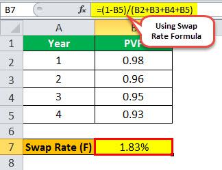

Interest rate swaps are pivotal financial instruments within the markets, typically used by corporations, governments, and financial institutions to manage the risk associated with fluctuating interest rates. These swaps are agreements between two parties to exchange one stream of interest payments for another, typically exchanging fixed-rate obligations for floating-rate obligations or vice versa. This exchange enables participants to hedge against unfavorable rate movements, ensuring greater predictability of interest expenses and revenues, and thus supporting effective risk management strategies in diverse economic conditions.

At the core of money market transactions lies the swap rate, the fixed interest rate secured within the swap agreement, which is crucial for determining the pricing of these contracts. The swap rate reflects the market's expectation of future interest rate movements and is influenced by various factors, including current interest rates, economic forecasts, and the overall demand and supply for money market instruments. By providing a reference point for valuation, swap rates play an essential role in financial trading, offering insights into market sentiment and aiding in the assessment of the potential cost or benefit of entering into a swap agreement.

Financial swaps, including interest rate swaps, are instrumental in managing risks and can also serve speculative purposes. Through swaps, market participants can adjust their exposure to interest rate fluctuations, align their interest obligations with their financial objectives, and capitalize on market conditions. This flexibility enhances market efficiency and allows for the dynamic allocation of financial resources.

With the advent of algorithmic trading, the landscape of trading swaps has evolved significantly. Algorithmic trading utilizes computer algorithms to execute trades at high speeds, minimizing human intervention and increasing the efficiency and liquidity of the trades. In the context of swaps, algos can optimize execution strategies, identify arbitrage opportunities, and respond swiftly to market fluctuations. By integrating algorithmic methods with swap trading, participants can achieve refined precision in decision-making and risk management while capitalizing on technological advancements in the financial markets.

## Table of Contents

## What is an Interest Rate Swap?

An interest rate swap represents a financial derivative contract between two parties who agree to exchange interest rate cash flows based on a specified principal amount. These swaps typically involve the exchange of fixed interest rate payments for floating interest rate payments, or vice versa, at predetermined intervals. This contract plays a critical role in financial markets by allowing parties to manage interest rate risk, improve cash flow stability, and engage in speculative activities.

The structure of an interest rate swap is generally bilateral. The two principal parties involved are the fixed-rate payer and the floating-rate payer. The fixed-rate payer agrees to pay a fixed interest rate over the life of the swap, while the floating-rate payer agrees to pay an interest rate that fluctuates according to an agreed-upon reference rate, commonly the London Interbank Offered Rate (LIBOR) or an alternative benchmark.

Let's consider an example to illustrate fixed vs. floating rate exchanges. Suppose Company A, a corporation with variable-rate debt, enters into an [interest rate](/wiki/interest-rate-trading-strategies) swap with Company B, a financial institution. Company A agrees to pay a fixed rate of 3% per annum to Company B, while Company B will pay LIBOR plus 0.5% to Company A. This arrangement will benefit Company A if LIBOR rises above 2.5%, effectively converting its floating rate exposure into a fixed rate, providing predictability in its interest expenses.

Interest rate swaps serve two main purposes: hedging and speculation. Through hedging, entities manage and mitigate their exposure to fluctuations in interest rates. For instance, a firm with existing floating-rate obligations may enter into a swap to receive floating payments and pay fixed rates, thereby stabilizing its cash flow. This can safeguard against potential hikes in interest rates that would increase borrowing costs.

On the other hand, the speculative use of interest rate swaps allows investors to take advantage of anticipated movements in interest rates to gain financial profit. Speculators might enter a swap if they believe future interest rates will rise or fall significantly. By correctly predicting these movements, traders can earn profits by strategically structuring swaps to benefit from discrepancies between fixed and floating rate payments. 

Thus, interest rate swaps are versatile instruments in financial markets, offering customizable solutions for managing interest rate exposure and pursuing speculative gains. Their widespread use underscores their importance in enhancing market stability and efficiency.

## Understanding Swap Rate

The swap rate is a critical concept within the context of interest rate swaps, functioning as the fixed interest rate that one party agrees to pay in exchange for receiving a floating interest rate from another party. Its determination is crucial for both the pricing and valuation of swap agreements.

### Definition and Calculation of the Swap Rate

The swap rate can be understood as the rate at which the present value of cash flows from fixed payments equals the present value of expected floating-rate payments. This equilibrium ensures that there is no [arbitrage](/wiki/arbitrage) opportunity at the outset of the swap. The swap rate can be calculated using the formula:

$$
\text{Swap Rate} = \frac{\sum \text{Floating Cash Flows}}{\sum \text{Fixed Cash Flows}}
$$

To compute the specific swap rate in practice, the following steps are typically involved:
1. Estimate the future floating rates over the swap's life using the forward rate curve.
2. Discount these expected floating-rate payments to their present value using an appropriate discount rate.
3. The fixed rate (swap rate) is then set so that the present value of fixed payments matches the discounted present value of floating payments.

### Factors Influencing Swap Rates

Several factors influence swap rates. Key among these are:

1. **Interest Rate Expectations**: Expectations about future interest rate movements significantly impact the swap rate. If market participants expect interest rates to rise, the swap rate might increase to reflect the anticipated rise in floating rates.

2. **Market Conditions**: Economic indicators such as inflation rates, central bank policies, and economic growth forecasts can alter market conditions, influencing investor demand and consequently affecting swap rates.

3. **Credit Risk**: The perceived risk of the counterparty defaulting can impact the swap rate. Higher credit risk may lead to higher swap rates to compensate for the increased risk.

4. **Liquidity and Supply-Demand Dynamics**: Market liquidity and the balance of supply and demand for swaps can lead to variations in swap rates. More liquid markets generally exhibit more stable swap rates.

### Role of Swap Rate in Swap Agreements

The swap rate is integral to the valuation and structuring of swap agreements. It serves as a benchmark for determining the fixed leg payments, directly impacting the cost and benefit analysis for both parties involved. By fixing one side of the interest payment equation, swap rates enable companies to manage interest rate exposure, providing certainty and facilitating better financial planning.

In financial management, understanding swap rates allows institutions to hedge against interest rate fluctuations effectively or to take speculative positions based on interest rate movements. The swap rate, therefore, plays a pivotal role in risk management and strategic financial operations, emphasizing its significance in both individual agreements and broader financial markets.

## Types of Financial Swaps

Financial swaps are critical instruments that enable parties to exchange different financial obligations or cash flows, with each type serving distinct purposes related to risk management, capital access, or speculative strategies. Several prevalent types of financial swaps include interest rate swaps, currency swaps, and credit default swaps, each tailored to specific financial needs and market conditions.

### Interest Rate Swaps

Interest rate swaps are the most common form of swaps, primarily used to manage interest rate risk. In these agreements, two parties exchange cash flows based on different interest rates, typically swapping a fixed interest rate for a floating rate. For example, one party may pay a fixed interest rate and receive a floating rate based on a reference rate like LIBOR (London Interbank Offered Rate). This structure allows parties to hedge against interest rate fluctuations or take advantage of changing market conditions. A typical formula for an interest rate swap payment might look like this:

$$
\text{Payment} = (\text{Notional Principal} \times \text{Rate}) \times \frac{\text{Days}}{360}
$$

This formula calculates the payment based on a notional principal amount, the agreed interest rate, and the fraction of the year the rate applies to.

### Currency Swaps

Currency swaps involve the exchange of principal and interest payments in one currency for principal and interest payments in another currency. They are utilized to hedge against currency risk, allowing institutions to secure more favorable borrowing conditions in international markets. For instance, a company operating in the United States but generating revenue in euros might enter into a currency swap to manage exchange rate exposure. This swap typically involves an initial exchange of principal amounts in different currencies, followed by periodic interest payments and a re-exchange of principal at maturity.

### Credit Default Swaps

Credit default swaps (CDS) are pivotal in managing credit risk. In a CDS, one party (the protection buyer) pays a periodic fee to another party (the protection seller) in exchange for compensation if a third party defaults on a loan or bond. These swaps are essential for investors looking to hedge against the risk of default and for speculators betting on the creditworthiness of a particular entity. For example, a CDS may cover the default risk of a corporate bond, allowing investors to mitigate potential losses due to the issuer's insolvency.

### Other Types of Swaps

Beyond these primary categories, there are other specialized swaps, such as commodity swaps, equity swaps, and inflation swaps, each catering to unique market demands and hedging requirements. Commodity swaps involve exchanging cash flows related to commodity price fluctuations, while equity swaps involve payments linked to equity indices or stock performance. Inflation swaps are designed to hedge against inflation risk by swapping fixed cash flows for payments linked to an inflation index.

Each swap type offers distinct advantages depending on the market conditions and the parties' objectives. Their tailored structures provide flexibility and vital tools for risk management, ensuring capital efficiency and stability in financial markets.

## The Role of Algo Trading in Swaps

Algorithmic trading, commonly referred to as algo trading, plays a pivotal role in modern financial markets by enhancing trading efficiency and [liquidity](/wiki/liquidity-risk-premium). It involves the use of computer algorithms to automate trading decisions, based on predefined criteria like timing, price, or market trends. This automation allows traders to execute high-frequency trades, responding to market changes in milliseconds, thereby improving market liquidity and reducing transaction costs.

In the context of the swap market, algo trading is increasingly vital. Swaps, often complex and customized, benefit from the precision and speed of algorithmic execution. By automating the management and execution of swap transactions, algo trading helps traders navigate large data sets and execute trades with minimal human intervention. This capability is particularly useful in interest rate and currency swaps, where rapid execution can lead to substantial cost savings and risk mitigation.

Algo trading in swaps can be utilized in several ways. One common application is in liquidity management. Algorithms can be designed to identify and capitalize on liquidity opportunities in the market, ensuring that traders can enter and [exit](/wiki/exit-strategy) positions efficiently. Additionally, algorithmic systems can be used to hedge against interest rate fluctuations by dynamically rebalancing swap positions in response to changing market conditions.

The benefits of [algorithmic trading](/wiki/algorithmic-trading) in swaps are multifaceted. Primarily, it enhances market efficiency by increasing the speed at which trades are executed, thus narrowing bid-ask spreads and improving overall market liquidity. Furthermore, algorithmic systems can analyze vast amounts of market data to identify arbitrage opportunities, allowing traders to profit from small price discrepancies across different markets or instruments.

However, the adoption of algorithmic strategies in swap trading is not without risks. One notable risk is the potential for algorithmic errors, where a flaw in the system's logic or code can lead to significant financial losses. Additionally, the high speed of algo trading can exacerbate market [volatility](/wiki/volatility-trading-strategies), as rapid execution can lead to abrupt price swings. The 2010 Flash Crash is a historical example where algorithmic trading played a role in a sudden, severe market crash.

To mitigate these risks, traders and firms must implement robust risk management strategies and regularly monitor their algorithmic systems for performance and accuracy. This may include stress testing algorithms under various market conditions, deploying real-time monitoring systems to detect anomalies, and ensuring compliance with regulatory frameworks that govern algorithmic trading practices.

In conclusion, while algorithmic trading in swaps offers significant advantages in terms of efficiency and liquidity, it necessitates careful management to address inherent risks. The integration of advanced technologies and real-time data processing continues to shape the landscape of swap trading, offering new possibilities and challenges for market participants.

## Implementing Swaps in a Trading Strategy

Interest rate swaps are key instruments for managing interest rate risk and improving portfolio performance. They allow market participants to exchange cash flows in a manner that aligns with their financial goals. Utilizing swaps effectively demands a well-conceived strategy that incorporates risk management, speculative opportunities, and diversification.

**Managing Interest Rate Risk**

One primary strategy for using swaps is to manage interest rate risk, which arises when there is uncertainty about future interest rate movements. By entering into an interest rate swap, an entity can stabilize their cash flows and protect against rate fluctuations. For example, a company with floating-rate debt exposed to rising interest rates could use a swap to convert its variable-rate obligations into fixed rates, thus securing predictable payments.

**Enhancing Portfolio Performance**

Interest rate swaps can also be used to enhance portfolio returns. They enable investors to take advantage of the spread between different interest rates, known as the interest rate differential. When the fixed rate on a swap is higher than the floating rate, the investor gains from the positive spread, thus increasing portfolio yield. This requires astute market analysis and timing to capitalize on favorable rate movements.

**Diversifying Investment Portfolios**

Swaps contribute significantly to portfolio diversification by providing exposure to various interest rate environments without altering the underlying investments. This diversification reduces portfolio risk by spreading exposure across different interest rate regimes and compensating for other assets' volatility. A well-diversified portfolio can improve a fund's overall Sharpe ratio, balancing reward and risk.

**Examples of Swaps in Action**

Consider a pension fund managing its liabilities by engaging in a pay-fixed, receive-floating interest rate swap. This arrangement allows the fund to hedge against declining interest rates that could increase its liability valuation. By fixing its cash outflows, the pension fund ensures stability in meeting its future obligations.

Another example is an investment firm anticipating an interest rate rise. It might enter a receive-fixed, pay-floating swap to benefit from falling bond prices due to rising rates. Such a strategy could potentially lead to gains from both the bond market and the swap agreement, thereby amplifying returns.

In conclusion, implementing swaps in a trading strategy offers robust tools for interest rate risk management and portfolio optimization. By strategically using swaps, investors can stabilize their cash flows, enhance returns, and achieve diversification. As financial markets continue to evolve, the role of swaps is likely to expand, offering greater opportunities for sophisticated modeling and strategy development.

## Risk Management and Regulatory Considerations

Interest rate swaps, like any other financial derivatives, come with inherent risks that participants must manage effectively to ensure financial stability and optimize returns. Three primary risks associated with swap trading are counterparty risk, market risk, and liquidity risk. Understanding these risks is crucial for effective risk management and adherence to regulatory standards.

**Counterparty Risk**

Counterparty risk represents the possibility that one party involved in the swap may default on its obligations, leading to financial loss for the other party. This risk is particularly significant in over-the-counter (OTC) derivatives markets where swaps are predominantly traded. To mitigate counterparty risk, market participants commonly use credit support annexes (CSAs) in swap agreements. CSAs require counterparties to post collateral proportional to their exposure, which can be recalibrated periodically to account for market fluctuations. Central clearing through clearinghouses is another method that reduces counterparty risk by ensuring swap obligations are met even if a counterparty defaults.

**Market Risk**

Market risk in swaps arises from fluctuations in interest rates, which can lead to losses. Since swaps involve fixed and floating interest rates, changes in the underlying rates can affect the valuation of these contracts. To manage market risk, traders can employ strategies such as duration matching, interest rate forecasting models, or dynamic hedging. These strategies involve using derivatives to offset potential losses from adverse movements in interest rates. A common approach is using interest rate futures or options to hedge exposure to interest rate changes.

**Liquidity Risk**

Liquidity risk is the threat of being unable to buy or sell swaps quickly without causing a significant impact on the market price. This can be particularly acute in periods of market stress or in swaps involving less liquid currencies or bespoke terms. Ensuring access to diverse liquidity providers and trading platforms can mitigate liquidity risk. Furthermore, electronic trading platforms and algorithmic trading have improved liquidity conditions by facilitating faster and more efficient order execution.

**Regulatory Frameworks**

Various regulatory frameworks have been established to manage the risks associated with swap trading. In the United States, the Dodd-Frank Wall Street Reform and Consumer Protection Act introduced significant changes to derivatives markets, requiring many swaps to be cleared through central counterparties and reported to trade repositories. Similarly, the European Market Infrastructure Regulation (EMIR) in the European Union imposes obligations on counterparties to centrally clear certain classes of derivatives and report trades to authorized trade repositories.

Globally, the International Swaps and Derivatives Association (ISDA) continues to work towards standardizing swap trading rules, promoting transparency, and establishing best practices to mitigate systemic risk.

**Best Practices for Mitigating Risks in Swap Trading**

Effective risk management in swap trading involves several best practices:

1. **Robust Credit Assessment:** Regularly evaluate the creditworthiness of counterparties to anticipate potential defaults and adjust collateral requirements accordingly.

2. **Central Clearing:** Utilize central clearing services when possible to reduce counterparty risk.

3. **Diversification:** Engage in swaps across various financial institutions to spread counterparty and liquidity risks.

4. **Regular Monitoring:** Continuously monitor market conditions and adjust hedging strategies to manage exposure to market risks effectively.

5. **Adherence to Regulation:** Ensure compliance with relevant regulatory requirements and maintain transparency in communication with regulatory bodies.

By adhering to these practices and understanding the associated risks, participants in the swaps market can navigate complex transactions while minimizing potential losses and maintaining compliance with regulatory expectations.

## Future Trends in Swaps and Algo Trading

The future of swap markets and algorithmic trading is poised for significant evolution driven by technological advancements and regulatory changes. One of the most notable shifts is the transition from the London Interbank Offered Rate (LIBOR) to alternative reference rates. LIBOR, traditionally used in a wide range of financial products, is being phased out due to its susceptibility to manipulation and lack of transaction-based data. This transition is expected to affect both the pricing and liquidity of swaps, as market participants adapt to new benchmarks like the Secured Overnight Financing Rate (SOFR) in the United States and the Euro Short-Term Rate (€STR) in Europe.

Technological advancements are likely to play a critical role in shaping the future of swap markets. The increase in computational power and the development of sophisticated algorithms are enhancing the speed and accuracy of trading operations. These advancements facilitate high-frequency trading, and [machine learning](/wiki/machine-learning) algorithms capable of analyzing vast datasets in real-time provide insights that can inform trading strategies. One example of such technology is the use of [artificial intelligence](/wiki/ai-artificial-intelligence) to identify patterns and predict market movements, thereby optimizing trading decisions.

Furthermore, blockchain technology is emerging as a transformative influence in swap markets. Its decentralized ledger system can increase transparency and reduce the operational risks associated with swaps, such as counterparty and settlement risks. Smart contracts, which are self-executing contracts with the terms of the agreement written into code, may automate swap settlements, leading to increased efficiency and reduced transaction costs.

Algorithmic trading in swaps is expected to grow, not only enhancing market liquidity but also incorporating risk management tools to adjust strategies in response to market volatility. As more data becomes available, algorithmic strategies that adapt to changing market conditions in real-time will become more prevalent. This shift demands advancements in both technology and the skill sets of trading professionals who must interpret and implement these sophisticated systems.

In summary, the swap markets are undergoing profound changes driven by both technological advancements and regulatory shifts. The transition from LIBOR to alternative reference rates will redefine benchmarks, while technology will enhance the efficiency, transparency, and adaptability of trading practices in this sector. These changes will likely usher in a new era of innovation and growth in swaps and algorithmic trading.

## Conclusion

Interest rate swaps and swap rates play a crucial role in financial markets, offering a versatile tool for risk management and speculative opportunities. These financial instruments enable parties to exchange cash flows, primarily to hedge interest rate risk or to gain from favorable rate movements. The mechanism of interest rate swaps, where a fixed interest payment is exchanged for a floating one, provides flexibility and financial leverage that is indispensable in sophisticated financial strategies.

The integration of financial swaps with algorithmic trading enhances these strategies by improving efficiency and liquidity in the market. Algorithmic trading enables rapid and precise execution of swap transactions, optimizing conditions for both hedgers and speculators. The advantages include reduced transaction costs, better pricing, and the ability to capitalize on arbitrage opportunities quickly. However, it also necessitates a deeper understanding of underlying algorithms and the associated risks, such as those related to market volatility and execution risk.

In navigating the complexities of financial swaps and algorithmic trading, ongoing exploration and understanding are paramount. The dynamic nature of financial markets and the continuous evolution of trading technologies make it essential for market participants to stay informed of the latest developments. By developing a robust understanding of swaps, traders and financial professionals can leverage these instruments to enhance portfolio performance and manage risk effectively.

As the swaps market continues to evolve, it is expected that technological advancements and regulatory changes will shape its future landscape. For instance, the transition from LIBOR to alternative reference rates presents both challenges and opportunities. Proactively engaging with these changes will ensure that individuals and institutions remain well-positioned to benefit from the potential of interest rate swaps and related financial tools.

## References & Further Reading

[1]: ["Swap Markets and Institutions" (2001)](https://link.springer.com/content/pdf/10.1007/978-1-349-26273-1_16.pdf) by Allan D. Shapiro and Alan White

[2]: ["The Interest Rate Swap: Introduction, Analysis, and Applications" (2013)](https://www.investopedia.com/terms/i/interestrateswap.asp) by Clifford W. Smith Jr. and Charles W. Smithson

[3]: ["Interest Rate Swaps and Other Derivatives" (2011)](https://www.jstor.org/stable/10.7312/corb15964) by Howard Corb

[4]: Hull, J. C. (2018). ["Options, Futures, and Other Derivatives"](https://www.semanticscholar.org/paper/Options%2C-Futures%2C-and-Other-Derivatives-Hull/89bdee500c8623864fc9eb7a471546aa713acc44) (9th Edition). Pearson Education.

[5]: ["Algorithmic Trading and DMA: An Introduction to Direct Access Trading Strategies" (2009)](https://archive.org/details/algorithmictradi0000john) by Barry Johnson