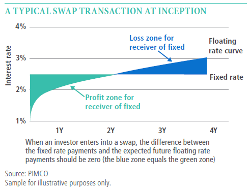

## Table of Contents

## What is a swap rate?

A swap rate is like an interest rate that banks and big companies use when they swap money with each other. Imagine you and your friend want to trade money, but you want to know how much interest you will get or have to pay. That's what a swap rate helps decide. It's a key number in the world of finance, especially for something called interest rate swaps, where two parties agree to exchange cash flows based on different interest rates.

Swap rates are important because they help set the price for many financial deals. They are often based on things like government bond rates and how much risk people think there is in the market. If you hear people talking about the "5-year swap rate," they're talking about the rate for a swap that lasts five years. These rates can change every day, just like other interest rates, and they give everyone a good idea of what's happening in the financial world.

## How is a swap rate calculated?

A swap rate is calculated by looking at several different things that affect the price of money. One big thing is the yield on government bonds, like the ones from the U.S. Treasury. If the yield on these bonds goes up, the swap rate usually goes up too. Another thing that matters is the credit risk, which is how likely it is that someone won't pay back the money they borrowed. If there's more risk, the swap rate might be higher because people want more money to take that risk.

To figure out the exact swap rate, people use something called a swap curve. This is like a line on a graph that shows what the swap rates are for different lengths of time, like one year, two years, and so on. To find the swap rate for a specific time, you look at where that time falls on the swap curve. The curve is built using a bunch of math that takes into account all the different factors, like bond yields and credit risk, to come up with the rates.

## What is the purpose of a swap rate in financial markets?

The purpose of a swap rate in financial markets is to help big companies and banks figure out how much they should pay or get when they swap money with each other. Imagine two friends deciding to trade money, but they need to agree on how much interest they will pay or receive. The swap rate is like a guide that tells them what's fair. It's a key number that helps set the price for something called an [interest rate](/wiki/interest-rate-trading-strategies) swap, which is a deal where two parties exchange cash flows based on different interest rates.

Swap rates are really important because they give everyone a good idea of what's happening in the financial world. They're based on things like the interest rates of government bonds and how much risk people think there is in the market. When these rates change, it can tell us a lot about what people think about the economy and where they think interest rates are heading. So, by looking at swap rates, people in finance can make smarter decisions about their money and plan for the future.

## What are the different types of swap rates?

Swap rates come in different types, and each one helps with a specific kind of money swap. The most common type is the fixed-for-floating interest rate swap. This is when one party pays a fixed interest rate, and the other pays a floating rate that can change over time. The swap rate here is the fixed rate that gets agreed upon. Another type is the basis swap, where both parties pay floating rates, but these rates are based on different things, like different kinds of loans or bonds.

There's also the currency swap rate, which is used when people want to swap money in different currencies. In this case, the swap rate helps figure out the interest rates for each currency in the swap. Lastly, there are commodity swaps, where the swap rate is tied to the price of things like oil or gold. Each of these swap rates helps set the terms for the swap, making sure everyone knows what they're getting into.

These different types of swap rates are important because they let banks and companies manage their money better. By using swap rates, they can protect themselves from changes in interest rates, currency values, or commodity prices. This helps them plan for the future and make sure they're not caught off guard by big changes in the market.

## How do fixed and floating swap rates differ?

Fixed and floating swap rates are two parts of an interest rate swap, where two parties agree to exchange cash flows. A fixed swap rate is a set interest rate that stays the same for the whole time of the swap. Imagine you agree to pay your friend 5% interest every year for five years. No matter what happens, you pay that 5% every year. This can be good if you want to know exactly what you'll pay or get, no matter what happens in the market.

On the other hand, a floating swap rate changes over time. It's usually tied to a benchmark rate, like the LIBOR or SOFR, which can go up or down. So, if you're paying a floating rate, you might pay 3% one year, 4% the next year, and so on, depending on what the benchmark rate does. This can be good if you think interest rates might go down, because then you'll pay less. But it can also be risky if rates go up, because then you'll pay more.

These two types of swap rates help people manage their money in different ways. A fixed rate gives you stability and predictability, which can be really helpful for planning. A floating rate gives you flexibility and can save you money if rates go down, but it also comes with the risk that rates might go up. By choosing the right mix of fixed and floating rates, banks and companies can protect themselves from big changes in interest rates and make smarter financial decisions.

## What is the relationship between swap rates and interest rates?

Swap rates and interest rates are closely connected. Swap rates are often based on government bond yields, which are a type of interest rate. When the yield on government bonds goes up, swap rates usually go up too. This is because swap rates are used to set the price for interest rate swaps, where two parties agree to exchange cash flows based on different interest rates. So, if the interest rates in the market change, the swap rates will change to match them.

The relationship between swap rates and interest rates also helps people predict what might happen with interest rates in the future. For example, if the swap rate for a long-term swap goes up, it might mean that people think interest rates will go up in the future. This is because the swap rate is like a bet on where interest rates are headed. By looking at swap rates, banks and companies can get a good idea of what the market thinks about future interest rates and plan their money moves accordingly.

## How do swap rates affect the valuation of swaps?

Swap rates play a big role in figuring out how much a swap is worth. Think of a swap like a deal where two people agree to swap money based on different interest rates. The swap rate is the fixed rate in this deal, and it helps decide how much each person will pay or get. If the swap rate goes up, the value of the swap changes because it affects the cash flows that the two parties will exchange. If you're the one paying the fixed rate and the swap rate goes up, your swap becomes less valuable because you're locked into a lower rate than what's now available in the market.

On the other hand, if you're receiving the fixed rate and the swap rate goes up, your swap becomes more valuable because you're getting a better rate than what's currently available. The valuation of a swap is all about comparing the agreed-upon swap rate to the current market rates. If the market rates change, the value of the swap changes too. This means that people who have swaps need to keep an eye on swap rates because they can affect how much their swaps are worth at any given time.

## What factors influence the movement of swap rates?

Swap rates move because of a few big things. One is the interest rates on government bonds, like those from the U.S. Treasury. When these rates go up or down, swap rates usually follow because they're based on these bond yields. Another big thing is how much risk people think there is in the market. If people think there's more risk, they might want more money to take that risk, and that can push swap rates up. The overall health of the economy also matters. If the economy is doing well, people might think interest rates will go up, and that can make swap rates go up too.

Another [factor](/wiki/factor-investing) is what people think will happen with interest rates in the future. If people think rates will go up, swap rates will often go up too because they're like a bet on where rates are headed. Central banks, like the Federal Reserve, can also affect swap rates by changing their policies. If the central bank raises or lowers interest rates, that can move swap rates. Finally, things like inflation and how much money is being borrowed in the market can also make swap rates go up or down. All these things together help decide where swap rates are heading.

## How are swap rates used in risk management?

Swap rates are a big help in managing risk for banks and big companies. Imagine you're a company that borrowed money at a floating interest rate, which can go up or down. You might worry that if rates go up, you'll have to pay a lot more money. But if you use a swap, you can switch to paying a fixed rate that won't change. The swap rate tells you what that fixed rate will be. By doing this, you can protect yourself from the risk of interest rates going up, because you'll know exactly what you'll pay no matter what happens.

Swap rates also help with another kind of risk called credit risk. This is the risk that the other person in the swap won't be able to pay you back. The swap rate can change based on how much risk people think there is in the market. If people think there's more risk, the swap rate might go up because they want more money to take that risk. By keeping an eye on swap rates, companies can get a good idea of how much risk they're taking on and make smarter decisions about their swaps. This way, they can manage their money better and avoid big surprises.

## What is the impact of monetary policy on swap rates?

Monetary policy, which is what central banks do to control the amount of money in the economy, has a big effect on swap rates. When a central bank like the Federal Reserve decides to change interest rates, it can make swap rates go up or down. If the central bank raises interest rates to slow down the economy, swap rates usually go up too. This is because swap rates are often based on government bond yields, which go up when the central bank raises rates. On the other hand, if the central bank lowers interest rates to help the economy grow, swap rates usually go down because bond yields go down too.

Central banks can also affect swap rates by changing how much money is available in the market. If they make more money available, it can lower swap rates because there's more money to lend and borrow. If they make less money available, it can push swap rates up because money becomes more expensive to borrow. By watching what central banks do, people in finance can get a good idea of where swap rates might be heading and plan their money moves accordingly. This helps them manage their risks and make smarter decisions about their swaps.

## How do market participants forecast future swap rates?

Market participants forecast future swap rates by looking at a bunch of things that can give them clues about where rates might be headed. One big thing they watch is what central banks are doing with interest rates. If the central bank says it might raise rates soon, people might think swap rates will go up too. They also look at the economy to see if it's growing or slowing down. If the economy is doing well, people might think interest rates will go up, which can make swap rates go up. Another thing they watch is what's happening with government bond yields, because swap rates are often based on these yields. If bond yields are going up, swap rates might go up too.

Another way market participants forecast swap rates is by using something called the swap curve. This is like a line on a graph that shows what swap rates are for different lengths of time, like one year, two years, and so on. By looking at the swap curve, people can see what the market thinks about future interest rates. If the swap curve is going up, it might mean people think rates will go up in the future. They also use other tools like economic reports and what experts are saying to help them guess where swap rates might be headed. By putting all these clues together, market participants can make better guesses about future swap rates and plan their money moves accordingly.

## What are the advanced strategies for trading swap rates?

Advanced strategies for trading swap rates involve using a mix of market knowledge and special tools to make smart guesses about where rates might go. One strategy is called curve trading, where people look at the swap curve to find spots where they think the rates might change more than expected. They might buy or sell swaps at different points on the curve to make money from these changes. Another strategy is called relative value trading, where people compare swap rates to other rates, like bond yields, to find deals that might be underpriced or overpriced. By spotting these differences, they can trade swaps to take advantage of the price gaps.

Another advanced strategy is using options on swaps, which are called swaptions. These let traders bet on where swap rates might go without having to actually swap money right away. They can buy or sell swaptions to protect themselves from big changes in swap rates or to make money if their guesses about future rates are right. Lastly, some traders use a strategy called [macro trading](/wiki/macro-trading), where they look at big things happening in the world, like central bank policies or economic reports, to guess where swap rates might be headed. By understanding these big trends, they can make trades that fit with what they think will happen to swap rates in the future.

## What is a Swap Rate and how can it be understood?

The swap rate is a critical concept within the context of interest rate swaps, functioning as the fixed interest rate that one party agrees to pay in exchange for receiving a floating interest rate from another party. Its determination is crucial for both the pricing and valuation of swap agreements.

### Definition and Calculation of the Swap Rate

The swap rate can be understood as the rate at which the present value of cash flows from fixed payments equals the present value of expected floating-rate payments. This equilibrium ensures that there is no [arbitrage](/wiki/arbitrage) opportunity at the outset of the swap. The swap rate can be calculated using the formula:

$$
\text{Swap Rate} = \frac{\sum \text{Floating Cash Flows}}{\sum \text{Fixed Cash Flows}}
$$

To compute the specific swap rate in practice, the following steps are typically involved:
1. Estimate the future floating rates over the swap's life using the forward rate curve.
2. Discount these expected floating-rate payments to their present value using an appropriate discount rate.
3. The fixed rate (swap rate) is then set so that the present value of fixed payments matches the discounted present value of floating payments.

### Factors Influencing Swap Rates

Several factors influence swap rates. Key among these are:

1. **Interest Rate Expectations**: Expectations about future interest rate movements significantly impact the swap rate. If market participants expect interest rates to rise, the swap rate might increase to reflect the anticipated rise in floating rates.

2. **Market Conditions**: Economic indicators such as inflation rates, central bank policies, and economic growth forecasts can alter market conditions, influencing investor demand and consequently affecting swap rates.

3. **Credit Risk**: The perceived risk of the counterparty defaulting can impact the swap rate. Higher credit risk may lead to higher swap rates to compensate for the increased risk.

4. **Liquidity and Supply-Demand Dynamics**: Market liquidity and the balance of supply and demand for swaps can lead to variations in swap rates. More liquid markets generally exhibit more stable swap rates.

### Role of Swap Rate in Swap Agreements

The swap rate is integral to the valuation and structuring of swap agreements. It serves as a benchmark for determining the fixed leg payments, directly impacting the cost and benefit analysis for both parties involved. By fixing one side of the interest payment equation, swap rates enable companies to manage interest rate exposure, providing certainty and facilitating better financial planning.

In financial management, understanding swap rates allows institutions to hedge against interest rate fluctuations effectively or to take speculative positions based on interest rate movements. The swap rate, therefore, plays a pivotal role in risk management and strategic financial operations, emphasizing its significance in both individual agreements and broader financial markets.

## What are the types of financial swaps?

Financial swaps are critical instruments that enable parties to exchange different financial obligations or cash flows, with each type serving distinct purposes related to risk management, capital access, or speculative strategies. Several prevalent types of financial swaps include interest rate swaps, currency swaps, and credit default swaps, each tailored to specific financial needs and market conditions.

### Interest Rate Swaps

Interest rate swaps are the most common form of swaps, primarily used to manage interest rate risk. In these agreements, two parties exchange cash flows based on different interest rates, typically swapping a fixed interest rate for a floating rate. For example, one party may pay a fixed interest rate and receive a floating rate based on a reference rate like LIBOR (London Interbank Offered Rate). This structure allows parties to hedge against interest rate fluctuations or take advantage of changing market conditions. A typical formula for an interest rate swap payment might look like this:

$$
\text{Payment} = (\text{Notional Principal} \times \text{Rate}) \times \frac{\text{Days}}{360}
$$

This formula calculates the payment based on a notional principal amount, the agreed interest rate, and the fraction of the year the rate applies to.

### Currency Swaps

Currency swaps involve the exchange of principal and interest payments in one currency for principal and interest payments in another currency. They are utilized to hedge against currency risk, allowing institutions to secure more favorable borrowing conditions in international markets. For instance, a company operating in the United States but generating revenue in euros might enter into a currency swap to manage exchange rate exposure. This swap typically involves an initial exchange of principal amounts in different currencies, followed by periodic interest payments and a re-exchange of principal at maturity.

### Credit Default Swaps

Credit default swaps (CDS) are pivotal in managing credit risk. In a CDS, one party (the protection buyer) pays a periodic fee to another party (the protection seller) in exchange for compensation if a third party defaults on a loan or bond. These swaps are essential for investors looking to hedge against the risk of default and for speculators betting on the creditworthiness of a particular entity. For example, a CDS may cover the default risk of a corporate bond, allowing investors to mitigate potential losses due to the issuer's insolvency.

### Other Types of Swaps

Beyond these primary categories, there are other specialized swaps, such as commodity swaps, equity swaps, and inflation swaps, each catering to unique market demands and hedging requirements. Commodity swaps involve exchanging cash flows related to commodity price fluctuations, while equity swaps involve payments linked to equity indices or stock performance. Inflation swaps are designed to hedge against inflation risk by swapping fixed cash flows for payments linked to an inflation index.

Each swap type offers distinct advantages depending on the market conditions and the parties' objectives. Their tailored structures provide flexibility and vital tools for risk management, ensuring capital efficiency and stability in financial markets.

## References & Further Reading

[1]: ["Swap Markets and Institutions" (2001)](https://link.springer.com/content/pdf/10.1007/978-1-349-26273-1_16.pdf) by Allan D. Shapiro and Alan White

[2]: ["The Interest Rate Swap: Introduction, Analysis, and Applications" (2013)](https://www.investopedia.com/terms/i/interestrateswap.asp) by Clifford W. Smith Jr. and Charles W. Smithson

[3]: ["Interest Rate Swaps and Other Derivatives" (2011)](https://www.jstor.org/stable/10.7312/corb15964) by Howard Corb

[4]: Hull, J. C. (2018). ["Options, Futures, and Other Derivatives"](https://www.semanticscholar.org/paper/Options%2C-Futures%2C-and-Other-Derivatives-Hull/89bdee500c8623864fc9eb7a471546aa713acc44) (9th Edition). Pearson Education.

[5]: ["Algorithmic Trading and DMA: An Introduction to Direct Access Trading Strategies" (2009)](https://archive.org/details/algorithmictradi0000john) by Barry Johnson