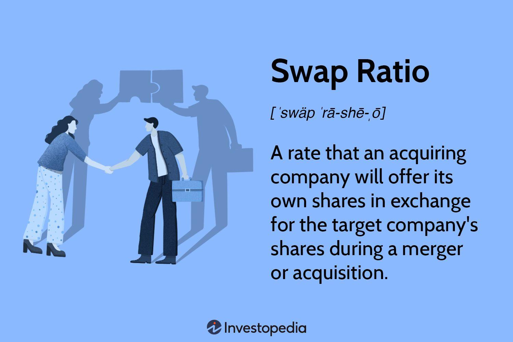

## Table of Contents

## What is a swap ratio?

A swap ratio is a number that tells you how many shares of one company you get for each share of another company during a merger or acquisition. Imagine you have shares in Company A, and Company A is merging with Company B. The swap ratio will tell you how many shares of Company B you will receive for each share of Company A you own. For example, if the swap ratio is 2:1, you will get 2 shares of Company B for every 1 share of Company A.

This ratio is important because it helps shareholders understand the value they will get from the merger. Companies usually decide on the swap ratio after looking at things like the value of each company, their financial health, and how the market sees them. Getting the swap ratio right is key to making sure the merger is fair and that shareholders are happy with the deal.

## How is a swap ratio calculated?

To calculate a swap ratio, companies look at the value of each company involved in the merger or acquisition. They might use different methods like comparing the market value of the shares, looking at the book value of the companies, or even using financial ratios like price-to-earnings (P/E) ratios. The goal is to figure out how much each company is worth and then decide how many shares of one company should be swapped for shares of the other company. This often involves negotiations between the companies to agree on a ratio that seems fair to both sides.

Once the companies have a good idea of their values, they can set the swap ratio. For example, if Company A's shares are worth $50 each and Company B's shares are worth $100 each, a simple way to calculate the swap ratio might be to say that for every share of Company B, you get 2 shares of Company A (because $100 is twice $50). But it's not always this straightforward. Companies might adjust the ratio based on other factors like future growth potential, debts, or even the strategic benefits of the merger. The final swap ratio is usually announced to shareholders so they know what they will receive after the merger is complete.

## Why is the swap ratio important in mergers and acquisitions?

The swap ratio is really important in mergers and acquisitions because it tells shareholders how many shares of the new company they will get for their old shares. This is a big deal because it shows if the merger is a good deal for them. If the swap ratio is not fair, shareholders might not be happy and could even vote against the merger. So, getting the swap ratio right is key to making sure everyone feels good about the deal.

Also, the swap ratio helps decide how much control each group of shareholders will have in the new company. If one company gets a lot more shares than the other, they will have more say in how the new company is run. This can affect things like who gets to be on the board of directors or what big decisions are made. So, the swap ratio is not just about money; it's also about power and control in the new company.

## Can you explain the concept of swap ratio with a simple example?

Imagine you have shares in a company called "Green Trees," and another company called "Blue Skies" wants to merge with Green Trees. The people in charge have decided that for every share of Green Trees you own, you will get 3 shares of Blue Skies. This number, 3 shares of Blue Skies for 1 share of Green Trees, is called the swap ratio. It tells you how many shares of the new company you will get for your old shares.

The swap ratio is important because it shows if the merger is a good deal for you. If you think 3 shares of Blue Skies is a fair trade for your 1 share of Green Trees, you might be happy with the merger. But if you think it's not enough, you might not want to go along with it. The swap ratio helps everyone understand the value they are getting from the merger and makes sure the deal is fair for all shareholders.

## What factors influence the determination of a swap ratio?

When companies decide on a swap ratio for a merger or acquisition, they look at many things. One big thing is the value of each company. They might compare the market value of the shares, which is how much the shares are worth on the stock market. They could also look at the book value, which is what the company's assets are worth on paper. Another thing they consider is how much money the companies are making, often using ratios like price-to-earnings (P/E) to see how profitable the companies are. All these numbers help them figure out how many shares of one company should be swapped for shares of the other.

But it's not just about numbers. Companies also think about other stuff like how much debt each company has, what their future growth might look like, and even the strategic benefits of the merger. For example, if one company has a lot of debt, the swap ratio might be adjusted to make the deal fairer. Or if one company is expected to grow a lot in the future, they might get a better swap ratio. The final swap ratio is often the result of negotiations between the companies, trying to find a number that everyone agrees is fair.

## How does the valuation of companies affect the swap ratio?

When companies are figuring out the swap ratio for a merger, the value of each company plays a big role. They look at things like how much the shares are worth on the stock market, which is called the market value. They also check the book value, which is what the company's stuff is worth on paper. Another thing they consider is how much money the companies make, using things like the price-to-earnings ratio to see how profitable they are. All these numbers help them decide how many shares of one company should be swapped for shares of the other. If one company is worth a lot more, the swap ratio might give them fewer shares in return.

But it's not just about the numbers. Companies also think about other stuff like how much debt each company has, what their future might look like, and even why they want to merge in the first place. For example, if one company has a lot of debt, the swap ratio might be adjusted to make the deal fairer. Or if one company is expected to grow a lot, they might get a better swap ratio. The final swap ratio comes from talking it out between the companies, trying to find a number that everyone thinks is fair.

## What are the common methods used to determine a fair swap ratio?

When companies want to figure out a fair swap ratio for a merger, they often use a few common methods. One way is to look at the market value of the shares. This means they check how much the shares are worth on the stock market. Another method is to look at the book value, which is what the company's stuff is worth on paper. They might also use the price-to-earnings ratio, which helps them see how much money the companies are making. All these numbers help them decide how many shares of one company should be swapped for shares of the other.

But it's not just about the numbers. Companies also think about other things like how much debt each company has, what their future might look like, and even why they want to merge in the first place. For example, if one company has a lot of debt, the swap ratio might be adjusted to make the deal fairer. Or if one company is expected to grow a lot, they might get a better swap ratio. The final swap ratio comes from talking it out between the companies, trying to find a number that everyone thinks is fair.

## How do regulatory considerations impact the swap ratio in cross-border mergers?

When companies from different countries want to merge, they have to think about the rules in each country. These rules can change the swap ratio. For example, some countries might have laws about how much of a company foreigners can own. If these laws make it hard for one company to own a lot of the other, the swap ratio might need to be adjusted to follow the rules. Also, different countries might have different ways of figuring out how much a company is worth. This can make it tricky to agree on a fair swap ratio.

Another thing to think about is taxes. When companies merge across borders, they might have to pay taxes in different countries. This can affect how much money each company gets from the merger, which can change the swap ratio. Sometimes, companies might need to talk to the people who make the rules to make sure the swap ratio is okay. All these things can make it harder to decide on a fair swap ratio, but they are important to make sure the merger goes smoothly and follows all the rules.

## What are the potential risks associated with an unfavorable swap ratio?

An unfavorable swap ratio can cause big problems for shareholders. If the ratio is not fair, shareholders might feel like they are not getting a good deal. This can make them unhappy and they might even vote against the merger. If a lot of shareholders are unhappy, the merger might not happen at all. Also, if the swap ratio is too low, shareholders might lose money because the new shares they get are not worth as much as their old shares.

Another risk is that an unfavorable swap ratio can mess up the balance of power in the new company. If one group of shareholders gets a lot more shares than the other, they will have more say in how the company is run. This can lead to fights between the shareholders about who gets to make decisions. It can also make it hard for the new company to work well together because everyone might not agree on what to do. So, getting the swap ratio right is really important to keep everyone happy and make sure the merger goes smoothly.

## How can companies negotiate a better swap ratio?

Companies can negotiate a better swap ratio by first doing their homework. They need to understand their own value and the value of the other company really well. This means looking at things like how much their shares are worth on the stock market, what their stuff is worth on paper, and how much money they are making. If a company can show that it is worth more than the other company thinks, they might be able to get a better swap ratio. They can also use experts like financial advisors to help them make a strong case for why they deserve a better deal.

Another way to get a better swap ratio is to talk about other things that are important in the merger. For example, if one company has a lot of debt, they might be able to negotiate a better swap ratio by agreeing to take on less debt after the merger. Or if a company has a lot of potential to grow in the future, they can use that to argue for a better swap ratio. It's all about finding the right balance and making sure both companies feel like they are getting a fair deal. Good communication and being ready to compromise can help a lot in these negotiations.

## What role does shareholder approval play in finalizing a swap ratio?

Shareholder approval is really important when it comes to finalizing a swap ratio in a merger. The swap ratio tells shareholders how many shares of the new company they will get for their old shares. If shareholders think the swap ratio is not fair, they might vote against the merger. This means the companies need to make sure the swap ratio is something that most shareholders will agree with. If too many shareholders are unhappy, the merger might not happen at all.

To get shareholder approval, companies often have to explain why they think the swap ratio is fair. They might show how they figured out the value of each company and why the swap ratio makes sense. If shareholders understand and agree with the reasons, they are more likely to vote yes on the merger. But if they feel like they are not getting a good deal, they might say no. So, getting the swap ratio right and explaining it well to shareholders is key to making the merger work.

## How have historical swap ratios influenced current practices in corporate mergers?

Looking at how swap ratios were used in the past helps companies figure out how to do mergers today. In the old days, companies often used simple ways to decide on swap ratios, like just looking at how much each company's shares were worth on the stock market. But sometimes, these simple methods led to problems. Shareholders would get upset if they felt the swap ratio was not fair, and sometimes mergers would fail because of it. So, companies learned that they needed to think about more than just the numbers. They started to consider things like how much debt a company had, what its future might look like, and even the reasons for the merger.

Today, companies use a lot more information to decide on swap ratios. They look at the market value, the book value, and how much money the companies are making. But they also think about other stuff like taxes, laws in different countries, and what shareholders might think. This helps them come up with a swap ratio that is more likely to be fair and get approved by shareholders. By learning from the past, companies now try to make sure everyone feels good about the merger, which makes it more likely to succeed.

## References & Further Reading

[1]: Gaughan, P. A. (2017). ["Mergers, Acquisitions, and Corporate Restructurings."](https://onlinelibrary.wiley.com/doi/book/10.1002/9781119380771) Wiley.

[2]: Damodaran, A. (2005). ["The Value of Synergy,"](https://people.stern.nyu.edu/adamodar/pdfiles/ovhds/dam2ed/synergy.pdf) Stern School of Business, New York University.

[3]: DePamphilis, D. (2020). ["Mergers, Acquisitions, and Other Restructuring Activities."](https://www.sciencedirect.com/book/9780123748782/mergers-acquisitions-and-other-restructuring-activities) Academic Press.

[4]: Charitou, M., Louca, C., & Vafeas, N. (2007). ["Boards, Ownership Structure, and Involuntary Delisting from the New York Stock Exchange,"](https://www.sciencedirect.com/science/article/pii/S0278425407000075) Journal of Financial and Quantitative Analysis.

[5]: Elder, A. (2014). ["The New Trading for a Living: Psychology, Discipline, Trading Tools and Systems, Risk Control, Trade Management."](https://www.amazon.com/New-Trading-Living-Psychology-Discipline/dp/1118443926) Wiley.

[6]: Koller, T., Goedhart, M., & Wessels, D. (2020). ["Valuation: Measuring and Managing the Value of Companies."](https://www.wiley.com/en-us/Valuation%3A+Measuring+and+Managing+the+Value+of+Companies%2C+7th+Edition-p-9781119610885) John Wiley & Sons.

[7]: Lopez de Prado, M. (2018). ["Advances in Financial Machine Learning."](https://www.amazon.com/Advances-Financial-Machine-Learning-Marcos/dp/1119482089) Wiley.