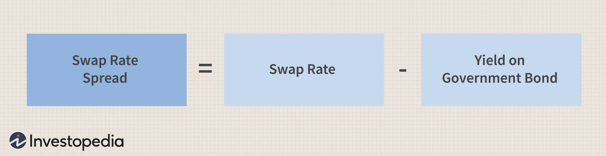

## Table of Contents

## What is a swap spread?

A swap spread is the difference between the fixed interest rate of a swap and the yield of a government bond with the same maturity. A swap is a financial agreement where two parties exchange cash flows, usually one fixed rate and one floating rate. The swap spread is important because it shows how much extra return investors want for taking on the risk of the swap compared to the safer government bond.

Swap spreads can change based on many things, like how the economy is doing, how much risk investors are willing to take, and how much people want to buy or sell swaps and bonds. When the economy is doing well, swap spreads might get bigger because investors feel more confident and want higher returns for taking on more risk. On the other hand, if the economy is not doing well, swap spreads might get smaller as investors look for safety and are willing to accept lower returns.

## How is a swap spread calculated?

To calculate a swap spread, you need to find the difference between the fixed interest rate of an interest rate swap and the yield of a government bond with the same time until it matures. For example, if the fixed rate on a 10-year swap is 3% and the yield on a 10-year government bond is 2%, the swap spread would be 1%. This number shows how much more return investors want for the risk of the swap compared to the safer government bond.

Swap spreads can change every day because of things like how the economy is doing, how much risk people are willing to take, and how much people want to buy or sell swaps and bonds. If the economy is doing well, investors might want a bigger swap spread because they feel more confident and want higher returns for taking on more risk. But if the economy is not doing well, the swap spread might get smaller as investors look for safety and are willing to accept lower returns.

## What factors influence the swap spread?

Swap spreads can change because of many things. One big thing is how the economy is doing. When the economy is doing well, people might want a bigger swap spread. They feel more confident and want higher returns for taking on more risk. But if the economy is not doing well, the swap spread might get smaller. People look for safety and are willing to accept lower returns.

Another thing that can change swap spreads is how much risk people are willing to take. If people are feeling scared and don't want to take risks, they might want smaller swap spreads. They would rather have safer investments like government bonds. On the other hand, if people are feeling brave and want to take risks, they might want bigger swap spreads. They are looking for higher returns and are okay with the risk that comes with swaps.

The last thing that can affect swap spreads is how much people want to buy or sell swaps and bonds. If lots of people want to buy swaps, the swap spread might get bigger because there's more demand. But if lots of people want to sell swaps, the swap spread might get smaller. The same thing can happen with government bonds. If more people want to buy them, the swap spread might get smaller because the bond yield goes down. If more people want to sell them, the swap spread might get bigger because the bond yield goes up.

## Why are swap spreads important in financial markets?

Swap spreads are important in financial markets because they show how much extra return investors want for taking on the risk of a swap compared to a safer government bond. This difference, or spread, helps people understand how much risk investors are willing to take and how confident they feel about the economy. When swap spreads are bigger, it means investors want more return for the risk they're taking, which usually happens when they feel good about the economy. When swap spreads are smaller, it means investors are looking for safety and are okay with lower returns, which usually happens when they're worried about the economy.

Swap spreads also help people make decisions about buying and selling swaps and bonds. If swap spreads are getting bigger, it might mean more people want to buy swaps, which could make their prices go up. If swap spreads are getting smaller, it might mean more people want to sell swaps, which could make their prices go down. This information is very useful for banks, investors, and anyone else who works with these financial products. By watching swap spreads, they can make smarter choices and manage their risks better.

## How do swap spreads relate to the yield curve?

Swap spreads and the yield curve are connected because they both tell us something about how investors feel about the economy and the risks they're willing to take. The yield curve shows the difference in interest rates for government bonds with different times until they mature. When the yield curve is steep, it means long-term interest rates are much higher than short-term rates, which usually happens when investors think the economy will do well in the future. Swap spreads, on the other hand, show the difference between the fixed rate of a swap and the yield of a government bond with the same time until it matures. If swap spreads are big, it means investors want more return for the risk of the swap, which can also mean they feel good about the economy.

When we look at swap spreads and the yield curve together, we can get a better picture of what's happening in the economy. For example, if the yield curve is steep and swap spreads are big, it's a strong sign that investors are confident and want higher returns for taking on more risk. But if the yield curve is flat or even upside down (where short-term rates are higher than long-term rates) and swap spreads are small, it might mean investors are worried about the economy and are looking for safety. By watching both swap spreads and the yield curve, people who work in finance can make better decisions about buying and selling swaps and bonds.

## What are the typical applications of swap spreads in financial analysis?

Swap spreads are used in financial analysis to help people understand how investors feel about the economy and the risks they're willing to take. By looking at swap spreads, analysts can see if investors want more return for the risk of a swap compared to a safer government bond. If swap spreads are big, it means investors feel good about the economy and want higher returns. But if swap spreads are small, it means investors are worried and looking for safety. This information helps analysts make predictions about where the economy might be going and how investors might act in the future.

Another way swap spreads are used in financial analysis is to help with trading decisions. If swap spreads are getting bigger, it might mean more people want to buy swaps, which could make their prices go up. On the other hand, if swap spreads are getting smaller, it might mean more people want to sell swaps, which could make their prices go down. By watching these changes, traders can decide when to buy or sell swaps and bonds to make money. Swap spreads also help banks and other financial institutions manage their risks better by giving them a clearer picture of the market.

## How can swap spreads be used to assess market conditions?

Swap spreads can help people understand what's going on in the market. They show the difference between the fixed [interest rate](/wiki/interest-rate-trading-strategies) of a swap and the yield of a government bond with the same time until it matures. If swap spreads are big, it means investors want more return for the risk of the swap compared to the safer government bond. This usually happens when the economy is doing well and investors feel confident. But if swap spreads are small, it means investors are looking for safety and are okay with lower returns. This usually happens when the economy is not doing well and investors are worried.

By watching swap spreads, people can get a good idea of how investors feel about the economy and the risks they're willing to take. For example, if swap spreads are getting bigger, it might mean more people want to buy swaps, which could make their prices go up. This can be a sign that investors are feeling good about the economy. On the other hand, if swap spreads are getting smaller, it might mean more people want to sell swaps, which could make their prices go down. This can be a sign that investors are worried about the economy. By keeping an eye on swap spreads, people can make better decisions about buying and selling swaps and bonds.

## Can you explain the role of swap spreads in risk management?

Swap spreads play a big role in risk management for banks and other financial institutions. They help these institutions understand how much extra return investors want for taking on the risk of a swap compared to a safer government bond. By watching swap spreads, banks can see if investors feel good or worried about the economy. If swap spreads are big, it means investors want more return for the risk of the swap, which usually happens when they feel confident. But if swap spreads are small, it means investors are looking for safety and are okay with lower returns, which usually happens when they're worried.

This information helps banks manage their risks better. For example, if swap spreads are getting bigger, banks might decide to buy more swaps because they think the prices will go up. But if swap spreads are getting smaller, banks might decide to sell swaps because they think the prices will go down. By using swap spreads to make these decisions, banks can protect themselves from losing money and make smarter choices about their investments.

## What are some common strategies involving swap spreads?

One common strategy involving swap spreads is called "riding the swap spread curve." This means investors buy swaps when they think the swap spread will get bigger. If the swap spread does get bigger, the price of the swap goes up, and the investor can sell it for a profit. This strategy works well when the economy is doing well and investors feel confident. They want more return for the risk of the swap, so swap spreads get bigger.

Another strategy is called "relative value trading." This means investors look at the difference between swap spreads and other things like government bond yields or other types of swaps. If they think the swap spread is too big or too small compared to these other things, they might buy or sell swaps to take advantage of the difference. This strategy helps investors make money by finding and using small differences in the market.

A third strategy is using swap spreads for hedging. This means banks and other financial institutions use swaps to protect themselves from changes in interest rates. If they think interest rates will go up, they might buy swaps to lock in a fixed rate. If interest rates do go up, the swap will help them save money compared to floating rates. By watching swap spreads, they can decide when to buy or sell swaps to manage their risks better.

## How do swap spreads impact the pricing of financial instruments?

Swap spreads play a big role in how financial instruments are priced. They show the difference between the fixed interest rate of a swap and the yield of a government bond with the same time until it matures. If swap spreads are big, it means investors want more return for the risk of the swap compared to the safer government bond. This can make the price of swaps go up because more people want to buy them. On the other hand, if swap spreads are small, it means investors are looking for safety and are okay with lower returns. This can make the price of swaps go down because more people want to sell them.

By watching swap spreads, people who work with financial instruments can make better decisions about buying and selling. For example, if swap spreads are getting bigger, it might mean more people want to buy swaps, which could make their prices go up. Traders might decide to buy swaps now to sell them later for a profit. But if swap spreads are getting smaller, it might mean more people want to sell swaps, which could make their prices go down. Traders might decide to sell swaps now before the prices drop even more. This way, swap spreads help people understand how to price and trade financial instruments more effectively.

## What are the historical trends in swap spreads and what do they indicate?

Swap spreads have changed a lot over time, and these changes can tell us about how investors feel about the economy. For example, in the early 2000s, swap spreads were usually pretty small because the economy was stable and investors didn't want much extra return for the risk of swaps. But during the financial crisis in 2008, swap spreads got much bigger. This happened because investors were really worried and wanted a lot more return for taking on the risk of swaps. They were scared and looking for safety, so they wanted higher returns to feel okay about the risk.

After the financial crisis, swap spreads started to get smaller again as the economy got better and investors felt more confident. But they never went back to being as small as they were before the crisis. This shows that even though the economy was doing better, investors still wanted some extra return for the risk of swaps. In recent years, swap spreads have been going up and down based on things like interest rates, how much risk investors are willing to take, and how the economy is doing. By watching these trends, people can get a good idea of how investors feel about the economy and make better decisions about buying and selling swaps and bonds.

## How do expert traders use swap spread analysis to predict market movements?

Expert traders use swap spread analysis to predict market movements by looking at the difference between the fixed interest rate of a swap and the yield of a government bond with the same maturity. If swap spreads are getting bigger, it means investors want more return for the risk of the swap compared to the safer government bond. This usually happens when the economy is doing well and investors feel confident. Traders might see this as a sign that swap prices will go up, so they might buy swaps now to sell them later for a profit. On the other hand, if swap spreads are getting smaller, it means investors are looking for safety and are okay with lower returns. This usually happens when the economy is not doing well and investors are worried. Traders might see this as a sign that swap prices will go down, so they might sell swaps now before the prices drop even more.

By watching these changes in swap spreads, expert traders can make better decisions about when to buy or sell swaps and bonds. They can also use swap spread analysis to understand how investors feel about the economy and the risks they're willing to take. For example, if swap spreads are getting bigger and the economy is doing well, traders might predict that investors will keep wanting higher returns for the risk of swaps. This can help them make smarter choices about their investments and manage their risks better. By using swap spread analysis, expert traders can get a clearer picture of the market and make more informed predictions about where it might be going.

## What is a Swap Spread?

Swap spreads are a key financial indicator representing the difference between the yield on a fixed-rate interest rate swap and the yield on a comparable government bond, such as a Treasury bond. Typically expressed in basis points, swap spreads serve as a critical measure of credit risk and liquidity conditions in the financial markets.

The formula for calculating a swap spread can be represented as follows:

$$
\text{Swap Spread} = \text{Swap Rate} - \text{Treasury Yield}
$$

where:
- **Swap Rate** refers to the fixed interest rate agreed upon in a swap agreement.
- **Treasury Yield** corresponds to the yield on a government bond with a similar maturity period as the swap.

Swap spreads are generally used as a barometer for credit risk and [liquidity](/wiki/liquidity-risk-premium). A wider swap spread typically indicates increased credit risk or decreased liquidity, reflecting heightened concern about the creditworthiness of financial institutions. Conversely, a narrowing swap spread suggests reduced credit risk or improved liquidity conditions in the market.

For financial institutions, swap spreads provide valuable insights into the relative cost of borrowing. Institutions with perceived higher risk may experience wider swap spreads, which results in higher borrowing costs in the swap market compared to risk-free government bonds. Consequently, swap spreads are essential for assessing the perceived creditworthiness of these institutions.

Understanding swap spreads is crucial for evaluating market conditions and potential risks. Changes in swap spreads can signal shifts in market sentiment, helping investors and traders anticipate movements in interest rates and economic conditions. Additionally, they are instrumental in risk management, as they assist in pricing and hedging strategies for various financial instruments.

Overall, swap spreads are a significant component of the financial ecosystem, offering insights into both macroeconomic trends and the financial health of institutions. Comprehending their implications allows market participants to make informed decisions and optimize their strategies in an ever-changing financial landscape.

## References & Further Reading

[1]: Choudhry, M. (2018). ["The Bond & Money Markets: Strategy, Trading, Analysis."](https://www.sciencedirect.com/book/9780750646772/the-bond-and-money-markets) Butterworth-Heinemann.

[2]: Fabozzi, F.J., Mann, S.V., & Choudhry, M. (2003). ["The Handbook of European Fixed Income Securities."](https://www.mhebooklibrary.com/doi/book/10.1036/9781260473902?contentTab=true) Wiley.

[3]: Hull, J.C. (2018). ["Options, Futures, and Other Derivatives."](https://www.semanticscholar.org/paper/Options%2C-Futures%2C-and-Other-Derivatives-Hull/89bdee500c8623864fc9eb7a471546aa713acc44) Pearson.

[4]: Sun, G. (2018). ["Interest Rate Swaps and Their Derivatives: A Practitioner's Guide."](https://www.wiley.com/en-us/Interest+Rate+Swaps+and+Their+Derivatives%3A+A+Practitioner%27s+Guide-p-9780470443941) Wiley.

[5]: Malz, A. (2011). ["Financial Risk Management: Models, History, and Institutions."](https://books.google.com/books/about/Financial_Risk_Management.html?id=67G6AQAACAAJ) Wiley.