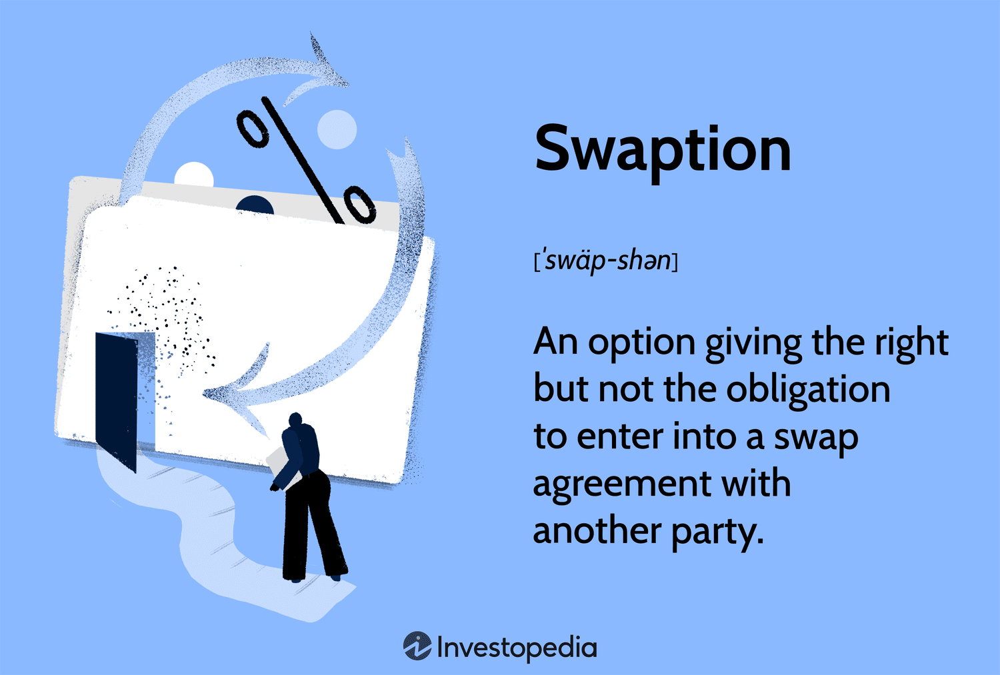

## Table of Contents

## What is a swaption?

A swaption is a type of financial instrument that gives the holder the right, but not the obligation, to enter into an interest rate swap. An interest rate swap is an agreement between two parties to exchange one stream of interest payments for another, based on a specified principal amount. The swaption can be thought of as an option on a swap, allowing the holder to benefit from favorable interest rate movements without being obligated to enter the swap if rates move unfavorably.

There are two main types of swaptions: a payer swaption and a receiver swaption. A payer swaption gives the holder the right to enter into a swap where they will pay a fixed rate and receive a floating rate. Conversely, a receiver swaption gives the holder the right to enter into a swap where they will receive a fixed rate and pay a floating rate. Swaptions are commonly used by financial institutions and investors to manage interest rate risk or to speculate on future changes in interest rates.

## What are the types of swaptions?

Swaptions come in two main types: payer swaptions and receiver swaptions. A payer swaption gives the person holding it the right to enter into an interest rate swap where they will pay a fixed interest rate and receive a floating interest rate. This can be useful if the holder thinks that interest rates will go up in the future, because they can then pay the lower fixed rate and receive the higher floating rate.

On the other hand, a receiver swaption gives the holder the right to enter into a swap where they will receive a fixed [interest rate](/wiki/interest-rate-trading-strategies) and pay a floating interest rate. This is beneficial if the holder believes that interest rates will go down, allowing them to receive the higher fixed rate while paying the lower floating rate. Both types of swaptions help people manage their risk or make bets on where interest rates are headed.

## How does a swaption work?

A swaption is like a special kind of choice you can buy. It gives you the right to start a swap deal, but you don't have to if you don't want to. A swap deal is when two people agree to trade different kinds of interest payments, usually one fixed and one that changes. If you have a swaption, you can decide to start this swap at a certain time in the future if it's good for you.

There are two main types of swaptions: a payer swaption and a receiver swaption. With a payer swaption, you can choose to start a swap where you pay a fixed interest rate and get a floating one. This can be good if you think interest rates will go up. A receiver swaption lets you start a swap where you get a fixed interest rate and pay a floating one. This can be helpful if you think interest rates will go down. Swaptions help people protect themselves from interest rate changes or try to make money by guessing what will happen to rates.

## What are the key components of a swaption?

A swaption is like a special ticket that lets you choose to start a swap deal later if you want to. The swap deal is an agreement between two people to trade different types of interest payments, usually one that stays the same and one that can change. The key parts of a swaption include the date when you can start the swap, called the exercise date, and the price you pay for the swaption, which is called the premium. The exercise date is important because it's when you decide if you want to go ahead with the swap or not.

Another key part of a swaption is the type of swap it lets you start. There are two kinds: a payer swaption and a receiver swaption. With a payer swaption, you can choose to start a swap where you pay a fixed interest rate and get a floating one. This can be good if you think interest rates will go up. A receiver swaption lets you start a swap where you get a fixed interest rate and pay a floating one, which is helpful if you think interest rates will go down. The terms of the swap, like how long it lasts and the interest rates involved, are also important parts of the swaption.

## What are the common uses of swaptions?

Swaptions are like special tickets that let you choose to start a swap deal later if you want to. People use them to protect themselves from changes in interest rates. For example, if you think interest rates might go up, you can buy a payer swaption. This gives you the right to start a swap where you pay a fixed rate and get a floating rate. If rates do go up, you can use the swaption to start the swap and benefit from the higher floating rate while paying the lower fixed rate.

Swaptions are also used to make money by guessing what will happen to interest rates. If you think rates will go down, you can buy a receiver swaption. This lets you start a swap where you get a fixed rate and pay a floating rate. If rates do go down, you can use the swaption to start the swap and earn more from the fixed rate while paying less on the floating rate. This way, swaptions help people manage their money better and take advantage of changes in the market.

## How is the price of a swaption determined?

The price of a swaption, also called the premium, is figured out by looking at a few important things. One big thing is the difference between the current interest rates and the rates in the swaption. If the rates in the swaption are way off from the current rates, the swaption might be more expensive because it could be more useful. Another thing is how long you have until you can start the swap, called the time to expiration. The longer you have to wait, the more chances there are for rates to change, which can make the swaption more valuable and pricier.

Also, how much the interest rates might change, called [volatility](/wiki/volatility-trading-strategies), is very important. If people think rates are going to jump around a lot, the swaption could be worth more because it gives you a chance to make more money if rates move in your favor. Finally, the creditworthiness of the people involved in the swap matters too. If there's a risk that one of them might not be able to pay, the price of the swaption could go up to cover that risk. All these things together help decide how much you have to pay for a swaption.

## What are the risks associated with swaptions?

Swaptions can be useful, but they also come with some risks. One big risk is interest rate risk. If interest rates move in a way you didn't expect, the swaption might not be worth as much as you hoped. For example, if you bought a payer swaption thinking rates would go up, but they go down instead, you might not want to use the swaption and could lose the money you paid for it.

Another risk is credit risk. This means that the other person in the swap might not be able to pay what they owe. If that happens, you could lose money even if the swaption itself worked out well. There's also the risk of market volatility. If interest rates change a lot, it can make it hard to predict how valuable your swaption will be. All these risks mean you need to think carefully before deciding to buy a swaption.

## How do interest rate movements affect swaptions?

Interest rate movements have a big impact on swaptions. If you have a payer swaption, it lets you start a swap where you pay a fixed rate and get a floating rate. So, if interest rates go up, the floating rate you receive will be higher, which is good for you. This means your payer swaption becomes more valuable because you can use it to benefit from the higher rates. On the other hand, if interest rates go down, the floating rate you would receive won't be as high, making your payer swaption less valuable because it's not as useful.

With a receiver swaption, it's the opposite. A receiver swaption lets you start a swap where you get a fixed rate and pay a floating rate. If interest rates go down, the floating rate you pay will be lower, which is good for you. This makes your receiver swaption more valuable because you can use it to benefit from the lower rates. But if interest rates go up, the floating rate you would have to pay would be higher, making your receiver swaption less valuable because it's not as useful. So, whether your swaption becomes more or less valuable depends a lot on which way interest rates move.

## What is the difference between a swaption and a swap?

A swaption and a swap are both financial tools, but they work differently. A swap is an agreement between two people to exchange different types of interest payments over time. Usually, one person pays a fixed interest rate and the other pays a floating rate that can change. Swaps are used to manage interest rate risk or to get a better deal on borrowing money.

A swaption, on the other hand, is like a special ticket that gives you the right to start a swap at a future date, but you don't have to if you don't want to. There are two types of swaptions: a payer swaption, which lets you start a swap where you pay a fixed rate and get a floating rate, and a receiver swaption, which lets you start a swap where you get a fixed rate and pay a floating rate. Swaptions are useful for protecting against interest rate changes or trying to make money by guessing where rates will go.

## How can swaptions be used for hedging purposes?

Swaptions can be used for hedging to protect against changes in interest rates. If you have a loan with a floating interest rate and you're worried that rates might go up, you can buy a payer swaption. This gives you the right to start a swap where you pay a fixed rate and get a floating rate. If interest rates do go up, you can use the swaption to start the swap, so you'll pay the lower fixed rate and get the higher floating rate, which helps balance out the higher cost of your loan.

On the other hand, if you have a loan with a fixed interest rate and you're worried that rates might go down, you can buy a receiver swaption. This gives you the right to start a swap where you get a fixed rate and pay a floating rate. If interest rates do go down, you can use the swaption to start the swap, so you'll get the higher fixed rate and pay the lower floating rate, which helps you benefit from the lower rates. By using swaptions, you can manage your risk and protect yourself from unexpected changes in interest rates.

## What are the legal and regulatory considerations for swaptions?

Swaptions, like other financial instruments, are subject to various legal and regulatory considerations. In the United States, the Dodd-Frank Wall Street Reform and Consumer Protection Act introduced rules that impact swaptions, including requirements for clearing certain types of swaps through central counterparties and reporting transactions to trade repositories. This is to increase transparency and reduce risk in the financial system. Additionally, the Commodity Futures Trading Commission (CFTC) and the Securities and Exchange Commission (SEC) have rules that govern the trading and documentation of swaptions, ensuring that parties involved understand their rights and obligations.

In the European Union, the Markets in Financial Instruments Directive (MiFID II) and the European Market Infrastructure Regulation (EMIR) set out similar requirements for swaptions. These regulations focus on transparency, risk mitigation, and the protection of investors. They require that swaptions be reported to trade repositories and, in some cases, cleared through central counterparties. Compliance with these regulations is crucial for financial institutions and investors to avoid legal issues and ensure the smooth operation of swaption markets.

## What advanced strategies can be implemented using swaptions?

Swaptions can be used for some fancy strategies that help people make money or protect their investments in smart ways. One strategy is called a swaption spread, where you buy one swaption and sell another at the same time. For example, you could buy a payer swaption that lets you start a swap where you pay a fixed rate and get a floating rate, and sell a receiver swaption that lets you start a swap where you get a fixed rate and pay a floating rate. By doing this, you can make money from the difference in the prices of the two swaptions, no matter which way interest rates go.

Another advanced strategy is using swaptions for yield curve plays. This means you're trying to make money by guessing how the shape of the yield curve, which shows the interest rates for different lengths of time, will change. If you think the difference between short-term and long-term rates will get bigger, you might buy a payer swaption on a long-term swap and a receiver swaption on a short-term swap. If the yield curve does change the way you thought, you can use the swaptions to start swaps that help you earn more money. These strategies need a good understanding of how interest rates work and how to use swaptions to your advantage.

## What are the pricing models for swaptions?

Swaption pricing is a sophisticated process that involves a range of quantitative models to capture the complexities of interest rate derivatives. Among the most recognized models in practice is the Black-Scholes framework and its derivatives, such as the Black model specifically adapted to accommodate swaptions. 

The Black model for swaptions, an extension of the Black-Scholes model, is widely used in the pricing of European swaptions. This model assumes that the underlying swap rate follows a lognormal distribution. The formula for a payer swaption under the Black model is given by:

$$
C = P \times (F \times N(d_1) - K \times N(d_2))
$$

where:
- $C$ is the price of the payer swaption,
- $P$ is the present value of a basis point (PVBP) of the underlying interest rate swap,
- $F$ is the forward swap rate,
- $K$ is the strike rate of the swaption,
- $N(\cdot)$ is the cumulative distribution function of the standard normal distribution,
- $d_1 = \frac{\ln(\frac{F}{K}) + \frac{\sigma^2}{2}T}{\sigma\sqrt{T}}$,
- $d_2 = d_1 - \sigma\sqrt{T}$,
- $\sigma$ is the volatility of the forward swap rate,
- $T$ is the time to expiry of the swaption.

In the context of [algorithmic trading](/wiki/algorithmic-trading), understanding the intricacies of such models is fundamental. These models heavily [factor](/wiki/factor-investing) in the volatility of interest rates, which can fluctuate based on economic conditions, as well as the time remaining until the swaption's expiration. Current market conditions are also pivotal, influencing forward rates and discount factors used in these calculations.

Real-world swaption pricing may also leverage more sophisticated models, such as the Hull-White model, which incorporates stochastic interest rate paths. This model is particularly useful for capturing the dynamics of interest rates over time. Python libraries such as QuantLib can facilitate the implementation of these advanced models, allowing algorithmic traders to simulate and evaluate swaption pricing effectively.

For instance, using QuantLib in Python, a basic Black model swaption pricer can be set up as follows:

```python
import QuantLib as ql

# Parameters
settlement_date = ql.Date(15, ql.May, 2022)
expiry_date = ql.Date(15, ql.May, 2023)
strike_rate = 0.03
forward_rate = 0.035
volatility = 0.20
day_count = ql.Actual360()
calendar = ql.NullCalendar()

# Setup
ql.Settings.instance().evaluationDate = settlement_date
exercise = ql.EuropeanExercise(expiry_date)
payoff = ql.PlainVanillaPayoff(ql.Option.Call, strike_rate)
swaption = ql.Swaption(payoff, exercise)

# Black Pricing Engine
term_structure = ql.YieldTermStructureHandle(
    ql.FlatForward(settlement_date, forward_rate, day_count))
flat_vol_ts = ql.BlackVolTermStructureHandle(
    ql.BlackConstantVol(settlement_date, calendar, volatility, day_count))
engine = ql.BlackSwaptionEngine(term_structure, flat_vol_ts)

# Price the swaption
swaption.setPricingEngine(engine)
swaption_price = swaption.NPV()
print(f"The swaption price is {swaption_price:.2f}")
```

Such implementations allow traders to efficiently evaluate and respond to market changes, integral to executing informed trading strategies involving swaptions. Accurately pricing these instruments within an algorithmic framework requires a comprehensive grasp of the underlying models and their applicability to various market scenarios.

## References & Further Reading

[1]: Black, F., & Scholes, M. (1973). ["The Pricing of Options and Corporate Liabilities."](https://www.cs.princeton.edu/courses/archive/fall09/cos323/papers/black_scholes73.pdf) Journal of Political Economy, 81(3), 637–654.

[2]: Hull, J. (2018). ["Options, Futures, and Other Derivatives."](https://www.semanticscholar.org/paper/Options%2C-Futures%2C-and-Other-Derivatives-Hull/89bdee500c8623864fc9eb7a471546aa713acc44) Pearson Education.

[3]: Fabio Mercurio & Nicola Moreni (2006). ["Affine models for pricing inflation-linked derivatives."](https://papers.ssrn.com/sol3/papers.cfm?abstract_id=1337811) Finance and Stochastics.

[4]: Rebonato, R. (2002). ["Modern Pricing of Interest-Rate Derivatives: The LIBOR Market Model and Beyond."](https://www.jstor.org/stable/j.ctt7rpkk) Princeton University Press.

[5]: ["Swaps and Other Derivatives"](https://onlinelibrary.wiley.com/doi/book/10.1002/9781119206224) by The ICE (Intercontinental Exchange).