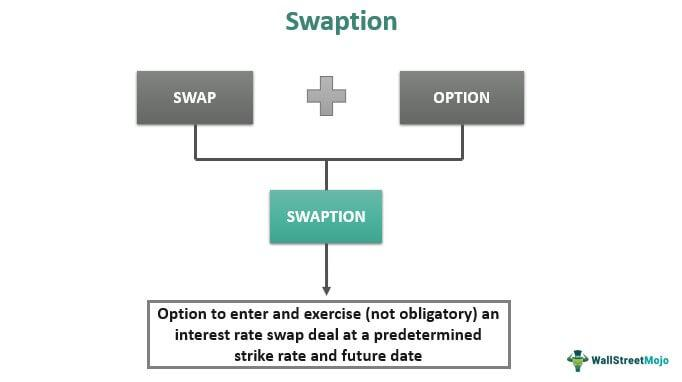

In today's dynamic financial markets, managing interest rate risks has become increasingly vital for both individual and institutional investors. Swaptions, or swap options, have emerged as essential instruments in this regard. Essentially, a swaption offers the right, but not the obligation, to enter into an interest rate swap at predefined terms on a specified future date. This capability makes swaptions indispensable for those navigating the complexities inherent in financial derivatives. The flexibility they provide allows participants to hedge against unfavorable interest rate movements or, alternatively, to take advantage of anticipated conditions in a strategic manner.

Understanding the critical aspects of swaptions involves examining their types, pricing models, and how they integrate into algorithmic trading frameworks. Swaptions can be categorized into payer and receiver types, each serving different strategic needs depending on the direction of interest rate movements. The mathematical intricacies of their pricing involve sophisticated models, including variations of the Black-Scholes model and advanced stochastic approaches like the Hull-White model, which consider the uncertainty of future interest rate paths.



From an algorithmic trading perspective, swaptions enhance not only risk management but also the precision and speed of execution, adapting rapidly to market changes. This article aims to equip traders and investors with a comprehensive understanding, focusing on leveraging the strategic advantages that swaptions offer. By exploring the intrinsic characteristics and potential applications of swaptions, readers will be better positioned to incorporate these derivatives into their financial strategies effectively.

## Table of Contents

## What are Swaptions?

Swaptions, commonly referred to as swap options, are sophisticated financial derivatives that grant holders the right, but not the obligation, to engage in an interest rate swap at a predetermined future date. This optionality aspect makes them versatile instruments in the financial markets, as they confer flexibility in managing interest rate exposure. Specifically, swaptions serve as a vital tool for traders and investors aiming to strategize around fluctuations in interest rates.

The fundamental structure of a swaption involves two parties: one acquiring the right, or the option, and the other assuming the potential obligation. Unlike outright interest rate swaps, where parties agree to exchange interest payments calculated on different reference rates, a swaption offers the holder the ability to decide whether or not to enter the swap based on prevailing market conditions at the time of exercise. This characteristic is critical as it provides market participants with the liberty to respond to unexpected changes in interest rates, thereby optimizing financial strategies.

Swaptions serve multiple functions in financial management, prominently in hedging and speculation. For hedging purposes, they are employed to mitigate the risks associated with adverse interest rate movements. For instance, a corporation anticipating a potential rise in interest rates could purchase a payer swaption, thereby ensuring the future capability to fix its borrowing costs while having the option to refrain if the rates remain stable or decrease. Conversely, if an investor predicts favorable rate conditions, swaptions can be used speculatively to leverage anticipated market shifts for profit. This speculative use involves acquiring swaptions with an anticipation of benefiting from movements in interest rates that align with the investor's predictions.

The inherent flexibility of swaptions, accommodating both hedging and speculative strategies, underscores their broad applicability in risk management frameworks. Financial professionals utilize these instruments to tailor their [interest rate](/wiki/interest-rate-trading-strategies) exposure dynamically, based on market forecasts, thus enhancing their overall financial management and strategic approach.

## Types of Swaptions

Swaptions, a form of financial derivative, can be broadly classified into two types: payer swaptions and receiver swaptions. Each type provides distinct strategic advantages based on the anticipated movement of interest rates.

A payer swaption provides the holder with the right, but not the obligation, to enter into an interest rate swap agreement where they pay a predetermined fixed interest rate and receive a floating rate. This type of swaption is particularly beneficial in environments where interest rates are expected to rise. By locking in a fixed rate, the payer swaption protects the holder against the risk of increased interest payments associated with floating rates. 

Conversely, a receiver swaption allows the holder to receive a fixed rate while paying a floating rate. This type of swaption proves advantageous when interest rates are anticipated to decline. By securing a fixed rate, the receiver swaption protects against potential decreases in income that would result from falling floating rates.

Swaptions can be exercised in different styles, offering a range of flexibilities. The most common exercise styles are European, American, and Bermudan:

1. **European Style:** This allows the swaption to be exercised only at the expiration date. It is straightforward and is often used when the holder has a specific future date in view for executing the swaption.

2. **American Style:** This provides the flexibility to exercise the swaption at any time before or on the expiration date. Although more flexible, it is relatively less common in swaption markets due to complexity in valuation.

3. **Bermudan Style:** This offers a middle ground, allowing the swaption to be exercised on several predetermined dates up to the expiration. This style is valued for its flexibility compared to the European style while avoiding the complexity of the American style.

These exercise styles allow market participants to tailor their strategies depending on their forecasts and risk management needs.

## Swaptions in Algorithmic Trading

Integrating swaptions in [algorithmic trading](/wiki/algorithmic-trading) significantly enhances both risk management and strategic positioning within financial markets. Through the use of sophisticated algorithms, traders can swiftly evaluate critical market factors, such as interest rate [volatility](/wiki/volatility-trading-strategies) and economic indicators, to make informed trading decisions. This capability is vital for navigating the complex dynamics of financial derivatives and optimizing returns.

Algorithmic trading systems, when applied to swaptions, enable rapid execution in response to market changes. This agility is crucial in today's fast-paced trading environment where market conditions can shift dramatically in short periods. By employing algorithms, traders can automate the identification and execution of swaption trades, leveraging patterns and trends that might be too subtle or rapid for manual trading strategies.

The integration of pricing models, like the Black-Scholes model, plays a vital role in this process. Although originally developed for options pricing, the Black model, a variant of Black-Scholes, is particularly adapted for European swaptions pricing. This model helps in calculating the theoretical value of swaptions by considering the underlying swap’s volatility, the time to expiration, and current interest rate levels. The formula for the Black model in the context of a payer swaption, for example, can be expressed as:

$$

C = P \left( S \cdot N(d_1) - K \cdot e^{-rT} \cdot N(d_2) \right)
$$

Where $C$ is the swaption price, $P$ is the notional principal, $S$ is the forward swap rate, $K$ is the strike rate, $r$ is the risk-free rate, $T$ is the time to expiration, and $N$ is the cumulative distribution function of the standard normal distribution. $d_1$ and $d_2$ are calculated as:

$$

d_1 = \frac{\ln(\frac{S}{K}) + \left(r + \frac{\sigma^2}{2}\right)T}{\sigma \sqrt{T}} 
$$
$$

d_2 = d_1 - \sigma \sqrt{T} 
$$

Where $\sigma$ represents the volatility of the underlying swap rate.

These models facilitate the assessment of potential profit or loss under various market scenarios, aiding traders in optimizing their strategic positioning. By aligning algorithmic models with market data, traders can also predict future market behavior and adjust their swaption positions to either hedge against potential risks or capitalize on anticipated movements.

In conclusion, incorporating swaptions into algorithmic trading not only enhances efficiency but also provides a robust framework for managing risk and improving strategic positioning in financial markets. As the trading landscape becomes increasingly complex, these technologies continue to offer significant advantages to traders seeking to leverage swaptions as part of their financial strategies.

## Pricing Models for Swaptions

Swaption pricing involves utilizing sophisticated models to accurately determine the value of these financial derivatives. Among the numerous pricing models, the Black model, an adaptation of the Black-Scholes framework, is predominantly applied to European swaptions. The Black model relies on several key parameters, including current and anticipated interest rates, volatility, time to expiration, and the strike rate, to calculate the present value of the swaption.

At its core, the Black model formulates the price $C$ of a European swaption as:

$$

C = P \times [ F \times N(d_1) - K \times N(d_2) ]
$$

where:
- $P$ denotes the present value of a basis point, representing the bond equivalent yield of the underlying swap.
- $F$ symbolizes the forward swap rate.
- $K$ is the swaption strike rate.
- $N(\cdot)$ is the cumulative distribution function of the standard normal distribution.
- $d_1$ and $d_2$ are calculated as:

$$
d_1 = \frac{\ln\left(\frac{F}{K}\right) + \frac{\sigma^2 \times T}{2}}{\sigma \times \sqrt{T}}
$$

$$
d_2 = d_1 - \sigma \times \sqrt{T}
$$

where $\sigma$ represents the volatility and $T$ the time to maturity.

Beyond the Black model, more complex methods such as the Hull-White model introduce stochastic interest rate paths, thus accommodating the randomness inherent in the dynamics of interest rates. The Hull-White model extends the Heath-Jarrow-Morton framework by incorporating mean reversion in interest rates. This approach attempts to refine valuation by considering how present and expected future volatility and interest rate movements interact, therefore offering a more realistic simulation of market conditions.

The Hull-White model employs a short rate model given by:

$$
dr(t) = (\theta(t) - a \cdot r(t)) \, dt + \sigma \cdot dW(t)
$$

where:
- $r(t)$ is the short rate at time $t$,
- $a$ is the speed of mean reversion,
- $\theta(t)$ is the time-dependent drift term,
- $\sigma$ represents the volatility of the short rate,
- $dW(t)$ is a Wiener process.

The flexibility of the Hull-White model in considering time-variant elements and reflecting interest rate processes more naturally makes it a valuable tool for financial professionals seeking refined swaption valuations.

Professionals looking to effectively price swaptions thus have a spectrum of models to choose from, varying based on the complexity of the market environment they envisage and the computational resources at their disposal.

## Risks Associated with Swaptions

Swaptions, as potent derivatives in the financial markets, involve several types of risks that market participants need to consider carefully. One of the primary concerns is market risk, which stems from the fluctuations in interest rates. Since the value of a swaption is heavily influenced by changes in interest rates, any adverse movements can result in significant financial impacts. This risk necessitates continuous monitoring and adjustment of swaption positions to align with market expectations regarding interest rate shifts.

Counterparty risk is another critical [factor](/wiki/factor-investing), given that swaptions are generally traded over-the-counter (OTC). This risk arises from the possibility that the counterparty may default on its contractual obligations. Unlike exchange-traded derivatives, OTC swaptions do not have a centralized clearinghouse, making the assessment of a counterparty's creditworthiness an integral part of risk management in swaption trading.

Liquidity risk also plays a crucial role as swaptions are often less liquid than other financial instruments. This risk is heightened during periods of market stress when selling or unwinding swaption positions might entail significant costs or delays. Traders must evaluate the [liquidity](/wiki/liquidity-risk-premium) profile of swaptions and consider strategies like staggering expirations or using standardized contracts to mitigate liquidity constraints.

Operational risk emerges from the sophisticated processes involved in executing swaption trades. The complexity of these transactions can lead to errors in trade execution, settlement, or valuation processes, particularly if robust management systems are not in place. To counter such risks, firms need to invest in advanced technology solutions and ensure thorough staff training to handle the intricacies of swaption execution.

Incorporating a comprehensive risk management framework that addresses these various risks is essential for entities engaged in swaption trading. This includes leveraging financial models to simulate interest rate scenarios, performing thorough counterparty assessments, and implementing systems that enhance operational efficiency. Through vigilant risk management practices, market participants can mitigate the potential downsides while capitalizing on the strategic benefits swaptions offer.

## Strategies in Swaption Trading

Swaptions serve as vital instruments in managing risks and capitalizing on market opportunities through strategic trading approaches. These instruments are particularly valuable for duration management, capital structure optimization, and portfolio diversification. 

**Duration Management:** Swaptions are effective tools for managing the duration of a portfolio. By choosing the appropriate swaption, traders can modify the interest rate sensitivity of their portfolios to align with their investment goals. This is crucial for insurance companies and pension funds, which often need to match the duration of their assets and liabilities. The use of payer or receiver swaptions allows these institutions to effectively hedge against interest rate movements, thus stabilizing their financial forecasts.

**Capital Structure Optimization:** Corporations utilize swaptions to optimize their capital structures by managing interest expenditures efficiently. By integrating swaptions into their financial strategies, companies can maintain flexible funding operations, allowing them to lock in desirable interest rates or protect against unfavorable movements. For example, a company anticipating an increase in interest rates might use payer swaptions to fix its future loan costs at current rates, thereby ensuring better control over its financial expenses.

**Portfolio Diversification:** Swaptions add a layer of complexity to investment portfolios, offering diversification advantages by introducing exposure to interest rate environments different from traditional assets like stocks and bonds. They enable investors to construct portfolios that better reflect their risk tolerances and return expectations in variable interest rate climates.

**Hedging Strategies:** In hedging strategies, swaption positions are aligned with the forecasted movements of interest rates. If a rise in interest rates is anticipated, investors may use payer swaptions to lock in current rates, safeguarding against future increases. Conversely, receiver swaptions can hedge against declining rates, securing higher returns on fixed-income assets. These strategies are crucial for entities exposed to interest rate fluctuations, such as banks and mortgage lenders.

**Speculative Strategies:** Speculative strategies involve leveraging swaptions to profit from anticipated rate changes. Traders might engage in speculative swaption trading by predicting interest rate trends and strategically using payer or receiver swaptions to benefit from these movements. This requires accurate forecasting and swift execution, often supported by algorithmic trading systems.

**Algorithmic Trading Models:** Incorporating algorithmic models is essential for effectively implementing both hedging and speculative strategies. These models automate decision-making processes, allowing rapid response to market changes and optimizing returns. Algorithms evaluate numerous variables such as rate volatility, economic indicators, and historical data to inform swaption trading strategies. Python, a preferred language, is often used for developing these models due to its extensive libraries and ease of integration with financial analytics tools. Here’s a simple example of calculating the swaption payoff using Python:

```python
def swaption_payoff(fixed_rate, strike_rate, notional, swap_rate):
    """
    Calculate the payoff of a swaption.

    fixed_rate: The agreed fixed rate of the swap
    strike_rate: The strike rate of the swaption
    notional: The notional principal amount
    swap_rate: The current market swap rate
    """
    return max(0, (swap_rate - strike_rate) * notional)

# Example values
fixed_rate = 0.05
strike_rate = 0.04
notional = 1000000
swap_rate = 0.045

payoff = swaption_payoff(fixed_rate, strike_rate, notional, swap_rate)
print(f"The swaption payoff is: {payoff}")
```

This example illustrates the basic mechanism of calculating a swaption payoff, fundamental in evaluating the net benefit or cost of holding a swaption under different market conditions. The integration of such computational tools enhances the strategic application of swaptions in modern financial trading.

## Conclusion

Swaptions are strategic financial derivatives integral to managing interest rate risk effectively. Their flexibility allows market participants to tailor hedging and speculative strategies to fit their unique financial objectives. In hedging contexts, swaptions provide a safeguard against adverse interest rate movements, enabling traders and investors to protect existing positions or future cash flows from potential rate hikes or declines. In speculative scenarios, swaptions facilitate leveraging anticipated interest rate trends to derive potential profits, thus adding a layer of dynamism to trading strategies.

Algorithmic trading models significantly augment the utility of swaptions by allowing for intricate analyses and swift execution, optimizing both risk management and potential returns. These algorithms can incorporate complex models to process large datasets rapidly, rendering them indispensable for modern traders who need to respond swiftly to market fluctuations. By employing models like the Black formula or Hull-White for pricing and valuation, algorithmic systems can finely tune swaption trades to maximize efficiency and effectiveness.

To navigate swaption trading proficiently, it is crucial to possess a comprehensive understanding of underlying financial models and market conditions. This includes familiarity with pricing mechanisms, volatility assessment, and economic indicators that influence interest rate movements. Knowledge of operational, liquidity, and counterparty risks also plays a crucial role in crafting informed swaption strategies. Mastery over these elements enables traders and investors to exploit the full potential of swaptions for optimizing financial outcomes while mitigating inherent risks.

## References & Further Reading

Explore foundational texts like Black and Scholes' work on options pricing to gain a strong understanding of financial derivatives. The Black-Scholes model, introduced by Fischer Black, Myron Scholes, and Robert Merton, is a pioneering framework for valuing options and has been adapted for European swaptions through the Black model. Their seminal paper, "The Pricing of Options and Corporate Liabilities" (1973), is a must-read for grasping the iterative developments in options and derivatives theory.

For further insights into derivatives, consider reviewing John C. Hull's comprehensive guide, "Options, Futures, and Other Derivatives." Hull's work provides detailed explanations of derivative instruments including swaptions, offering clarity on valuation models, market dynamics, and hedging strategies. His book is a cornerstone for both academics and practitioners looking to deepen their understanding of the financial markets' intricacies.

Staying updated with recent trends in swaption markets is crucial. Financial journals and publications such as the Journal of Derivatives or the Journal of Finance provide empirical research, case studies, and analytical insights into market behaviors. By exploring these resources, one can keep abreast of innovations, regulatory impacts, and strategic shifts in the market.

Algorithmic trading frameworks and quantitative tools are invaluable for implementing swaption strategies effectively. Python is widely used for developing trading algorithms due to its versatile libraries like NumPy, Pandas, and quantlib, which facilitate data analysis, financial modeling, and optimization. Exploring open-source platforms and quantitative finance communities can enhance your practical skills and broaden your strategic toolkit. Here is a simple Python example using the Black model to price a European swaption:

```python
from scipy.stats import norm
import numpy as np

def black_swaption_price(forward_rate, strike, volatility, time_to_expiry, notional, type='payer'):
    d1 = (np.log(forward_rate / strike) + 0.5 * volatility**2 * time_to_expiry) / (volatility * np.sqrt(time_to_expiry))
    d2 = d1 - volatility * np.sqrt(time_to_expiry)

    if type == 'payer':
        price = notional * (forward_rate * norm.cdf(d1) - strike * norm.cdf(d2))
    else:  # receiver
        price = notional * (strike * norm.cdf(-d2) - forward_rate * norm.cdf(-d1))

    return price

forward_rate = 0.03
strike = 0.025
volatility = 0.2
time_to_expiry = 1
notional = 1000000

price = black_swaption_price(forward_rate, strike, volatility, time_to_expiry, notional, type='payer')
print(f"The Black model swaption price is: {price:.2f}")
```

This script calculates the price of a payer swaption using the Black model. By diving into such algorithmic frameworks, practitioners can enhance their trading strategies and optimize their risk-return profiles.