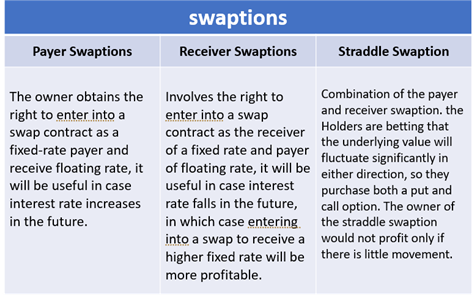

## Table of Contents

## What is a swaption and how does it function in financial markets?

A swaption is a financial tool that gives the buyer the right, but not the obligation, to enter into an interest rate swap at a future date. An interest rate swap is an agreement between two parties to exchange one stream of interest payments for another, based on a specified principal amount. The swaption essentially gives the buyer flexibility to manage interest rate risks without being locked into the swap immediately.

In financial markets, swaptions are used by companies and investors to hedge against fluctuations in interest rates. For example, if a company expects interest rates to rise, it might buy a swaption that allows it to enter into a swap where it can pay a fixed rate and receive a floating rate. This way, if rates do go up, the company can benefit from the swap. If rates stay the same or fall, the company can simply let the swaption expire without exercising it, limiting their financial exposure.

## What are the basic types of swaptions?

There are two main types of swaptions: payer swaptions and receiver swaptions. A payer swaption gives the buyer the right to enter into an interest rate swap where they will pay a fixed rate and receive a floating rate. This type of swaption is useful if the buyer expects interest rates to rise. By exercising the swaption, they can lock in a fixed rate they will pay, while receiving a floating rate that will increase as interest rates go up.

On the other hand, a receiver swaption gives the buyer the right to enter into an [interest rate](/wiki/interest-rate-trading-strategies) swap where they will receive a fixed rate and pay a floating rate. This is beneficial if the buyer believes interest rates will fall. By exercising the receiver swaption, they can lock in a higher fixed rate they will receive, while paying a lower floating rate as interest rates decrease.

Both types of swaptions provide flexibility and can be used to hedge against interest rate risks. The buyer of a swaption pays a premium for this right, but they are not obligated to exercise the swaption if it does not benefit them. This makes swaptions a valuable tool in managing financial risk.

## Can you explain the difference between a payer swaption and a receiver swaption?

A payer swaption is a type of swaption where the buyer has the right to enter into a swap where they will pay a fixed interest rate and receive a floating interest rate. This is helpful if the buyer thinks that interest rates are going to go up. If rates do rise, they can use the swaption to lock in a fixed rate they'll pay, while getting a higher floating rate in return. If rates don't go up, they can just let the swaption expire without using it, and they only lose the premium they paid for it.

A receiver swaption is different. Here, the buyer gets the right to enter into a swap where they will receive a fixed interest rate and pay a floating interest rate. This is good if the buyer believes that interest rates are going to fall. By using the swaption, they can lock in a higher fixed rate they'll receive, while paying out a lower floating rate as interest rates drop. If rates don't fall, they can let the swaption expire without exercising it, and again, they only lose the premium they paid.

Both types of swaptions help people manage the risk of changing interest rates, but they work in opposite ways. A payer swaption is useful when rates are expected to rise, and a receiver swaption is useful when rates are expected to fall.

## What are the common underlying swaps for swaptions?

The most common underlying swaps for swaptions are interest rate swaps. These are agreements between two parties to exchange interest payments over time. One party pays a fixed interest rate, while the other pays a floating interest rate based on a benchmark like LIBOR or SOFR. When someone buys a swaption, they're getting the right to enter into this kind of swap at a future date. This can help them manage the risk of interest rates changing in a way that could hurt them financially.

Another type of underlying swap for swaptions is a currency swap. In a currency swap, two parties exchange principal and interest payments in different currencies. For example, one might pay dollars and receive euros. Swaptions on currency swaps give the buyer the right to enter into this exchange at a future date. This can be useful for businesses or investors who need to manage the risk of currency exchange rates changing. By using a swaption, they can protect themselves from unfavorable shifts in currency values.

## How do the expiration date and settlement date of a swaption work?

The expiration date of a swaption is the last day the buyer can decide to use their right to enter into the underlying swap. If they choose to go ahead with the swap, this is called exercising the swaption. If they don't want to enter into the swap, they can just let the swaption expire and they won't have to do anything more. The buyer pays a premium upfront for this right, and if they don't exercise the swaption, they lose this premium.

The settlement date of a swaption is when the actual swap starts if the buyer decides to exercise their right. This is usually a short time after the expiration date, often just a few business days. On the settlement date, the terms of the swap kick in, and the parties start exchanging payments according to the swap agreement. So, the expiration date is when you decide, and the settlement date is when you start the swap if you've decided to go ahead with it.

## What are the key factors that influence the pricing of swaptions?

The price of a swaption depends on a few important things. One big [factor](/wiki/factor-investing) is the current interest rates and what people think they will be in the future. If interest rates are expected to go up a lot, a payer swaption might be more expensive because it lets the buyer lock in a good fixed rate. On the other hand, if rates are expected to go down, a receiver swaption might be pricier. The time left until the swaption expires also matters. The longer the time until expiration, the more expensive the swaption usually is, because there's more time for interest rates to change in a way that could benefit the buyer.

Another thing that affects swaption prices is how much the market expects interest rates to move around, which is called volatility. If the market thinks rates will jump around a lot, swaptions become more valuable and more expensive because they offer more potential benefit to the buyer. The premium the buyer pays for the swaption is also influenced by the terms of the underlying swap, like the fixed rate, the floating rate, and how long the swap will last. All these factors together help decide how much a swaption should cost.

## How do European and American styles of swaptions differ?

European and American swaptions are similar because they both give the buyer the right to enter into an interest rate swap at a future date. The main difference is when the buyer can use this right. With a European swaption, the buyer can only use their right on the expiration date. This means they have to wait until that specific date to decide if they want to go ahead with the swap or not.

On the other hand, an American swaption gives the buyer more flexibility. They can choose to use their right any time from when they buy the swaption up until the expiration date. This means if something changes with interest rates or their financial situation, they can act right away instead of waiting. Both types of swaptions have their own uses, depending on what the buyer needs and how they want to manage their risks.

## What are the strategic uses of swaptions in portfolio management?

Swaptions can be very useful for people managing a portfolio because they help control the risk that comes from changes in interest rates. If someone thinks that interest rates are going to go up, they might buy a payer swaption. This lets them lock in a fixed rate they will pay, and if rates do go up, they can switch to the swap and get a higher floating rate back. This can protect their investments from losing value because of higher interest rates. On the other hand, if they think rates are going to go down, they might buy a receiver swaption. This lets them lock in a good fixed rate they will receive, and if rates drop, they can switch to the swap and pay a lower floating rate. This way, they can make sure their portfolio keeps [earning](/wiki/earning-announcement) well even if rates fall.

Another way swaptions can be used in portfolio management is to give more flexibility and options for future planning. Sometimes, people might not be sure if they want to enter into a swap right away, but they want the option to do so if things change. By buying a swaption, they can keep their options open without being locked into a swap right away. This can be really helpful for managing a portfolio because it lets the manager adapt to new information or market changes. Whether it's a European swaption that can only be used on the expiration date or an American swaption that can be used anytime up to the expiration date, swaptions give portfolio managers the tools they need to make smart decisions and protect their investments.

## How does the exercise of a swaption affect the underlying swap?

When someone decides to use a swaption, it means they are choosing to start the swap that the swaption gives them the right to enter. This swap is an agreement where one party pays a fixed interest rate and the other pays a floating interest rate, or vice versa, depending on the type of swaption. If it's a payer swaption, the person who exercises it will start paying the fixed rate and receiving the floating rate. If it's a receiver swaption, they will start receiving the fixed rate and paying the floating rate. The terms of the swap, like the fixed rate, the floating rate, and how long it lasts, are set when the swaption is bought, so exercising the swaption just activates these terms.

Exercising a swaption doesn't change the terms of the swap itself; it just starts the swap. The person who sold the swaption has to go along with the swap if the buyer decides to use it. This can affect their financial planning because now they have to deal with the payments from the swap. For the buyer, exercising the swaption can help them manage their risks better, especially if interest rates have moved in a way that makes the swap beneficial. If they don't exercise the swaption, nothing happens with the swap, and the buyer just loses the premium they paid for the swaption.

## What are the risks associated with trading swaptions?

Trading swaptions comes with several risks that people need to be aware of. One big risk is the chance that interest rates might not move the way you expect. If you buy a swaption hoping interest rates will go up or down and they don't, you could lose the money you paid for the swaption, which is called the premium. Another risk is that swaptions can be complicated, and if you don't understand them well, you might make bad decisions. Also, the value of a swaption can go up and down a lot because it depends on how much people think interest rates will change, which is called volatility. If the market's view on volatility changes suddenly, it can hurt the value of your swaption.

Another thing to consider is that when you exercise a swaption, you start a swap, which means you have to deal with the payments of that swap. This can be risky if the swap payments turn out to be more than you expected or if they don't fit well with your other financial plans. There's also what's called counterparty risk, which means the other person in the swap might not be able to make their payments. If they can't pay, you could lose money. Finally, trading swaptions can involve a lot of costs like transaction fees and the costs of managing the swaption, which can eat into any profits you make.

## Can you discuss the impact of interest rate volatility on swaption valuation?

Interest rate volatility is really important when it comes to figuring out how much a swaption is worth. Volatility means how much interest rates might change in the future. If people think interest rates are going to jump around a lot, swaptions become more valuable. This is because swaptions give the buyer the right to enter into a swap if interest rates move in a way that helps them. So, if there's a lot of uncertainty about where interest rates are headed, the swaption's value goes up because it could be more useful to the buyer.

On the other hand, if interest rates are expected to stay pretty steady, swaptions might not be worth as much. When there's less chance of big changes in interest rates, the swaption's potential to help the buyer isn't as great. This means the buyer might not be willing to pay as much for the swaption. So, the more volatile interest rates are expected to be, the higher the price of a swaption, and the less volatile, the lower the price.

## How do swaptions fit into complex financial strategies like interest rate risk management?

Swaptions are a key tool in managing interest rate risk because they give people the flexibility to handle changes in interest rates without being locked into a swap right away. If someone thinks interest rates are going to go up, they can buy a payer swaption. This lets them lock in a fixed rate they'll pay, and if rates do rise, they can switch to the swap and get a higher floating rate in return. This helps protect their investments from losing value because of higher interest rates. On the other hand, if they think rates will go down, they can buy a receiver swaption. This lets them lock in a good fixed rate they'll receive, and if rates fall, they can switch to the swap and pay a lower floating rate. This way, they can make sure their investments keep earning well even if rates drop.

Swaptions also help in planning for the future because they give people the option to enter into a swap later if it turns out to be a good idea. This is really useful in complex financial strategies because it lets people adapt to new information or changes in the market. For example, a company might not be sure if they want to enter into a swap right now, but they want the option to do so if interest rates change in a way that could hurt them. By buying a swaption, they can keep their options open without being committed to a swap immediately. This flexibility is a big part of why swaptions are used in managing interest rate risk in complex financial strategies.

## What role do swaptions play in algorithmic trading?

Integrating swaptions in [algorithmic trading](/wiki/algorithmic-trading) significantly enhances both risk management and strategic positioning within financial markets. Through the use of sophisticated algorithms, traders can swiftly evaluate critical market factors, such as interest rate [volatility](/wiki/volatility-trading-strategies) and economic indicators, to make informed trading decisions. This capability is vital for navigating the complex dynamics of financial derivatives and optimizing returns.

Algorithmic trading systems, when applied to swaptions, enable rapid execution in response to market changes. This agility is crucial in today's fast-paced trading environment where market conditions can shift dramatically in short periods. By employing algorithms, traders can automate the identification and execution of swaption trades, leveraging patterns and trends that might be too subtle or rapid for manual trading strategies.

The integration of pricing models, like the Black-Scholes model, plays a vital role in this process. Although originally developed for options pricing, the Black model, a variant of Black-Scholes, is particularly adapted for European swaptions pricing. This model helps in calculating the theoretical value of swaptions by considering the underlying swap’s volatility, the time to expiration, and current interest rate levels. The formula for the Black model in the context of a payer swaption, for example, can be expressed as:

$$

C = P \left( S \cdot N(d_1) - K \cdot e^{-rT} \cdot N(d_2) \right)
$$

Where $C$ is the swaption price, $P$ is the notional principal, $S$ is the forward swap rate, $K$ is the strike rate, $r$ is the risk-free rate, $T$ is the time to expiration, and $N$ is the cumulative distribution function of the standard normal distribution. $d_1$ and $d_2$ are calculated as:

$$

d_1 = \frac{\ln(\frac{S}{K}) + \left(r + \frac{\sigma^2}{2}\right)T}{\sigma \sqrt{T}} 
$$
$$

d_2 = d_1 - \sigma \sqrt{T} 
$$

Where $\sigma$ represents the volatility of the underlying swap rate.

These models facilitate the assessment of potential profit or loss under various market scenarios, aiding traders in optimizing their strategic positioning. By aligning algorithmic models with market data, traders can also predict future market behavior and adjust their swaption positions to either hedge against potential risks or capitalize on anticipated movements.

In conclusion, incorporating swaptions into algorithmic trading not only enhances efficiency but also provides a robust framework for managing risk and improving strategic positioning in financial markets. As the trading landscape becomes increasingly complex, these technologies continue to offer significant advantages to traders seeking to leverage swaptions as part of their financial strategies.

## What are the pricing models for swaptions?

Swaption pricing involves utilizing sophisticated models to accurately determine the value of these financial derivatives. Among the numerous pricing models, the Black model, an adaptation of the Black-Scholes framework, is predominantly applied to European swaptions. The Black model relies on several key parameters, including current and anticipated interest rates, volatility, time to expiration, and the strike rate, to calculate the present value of the swaption.

At its core, the Black model formulates the price $C$ of a European swaption as:

$$

C = P \times [ F \times N(d_1) - K \times N(d_2) ]
$$

where:
- $P$ denotes the present value of a basis point, representing the bond equivalent yield of the underlying swap.
- $F$ symbolizes the forward swap rate.
- $K$ is the swaption strike rate.
- $N(\cdot)$ is the cumulative distribution function of the standard normal distribution.
- $d_1$ and $d_2$ are calculated as:

$$
d_1 = \frac{\ln\left(\frac{F}{K}\right) + \frac{\sigma^2 \times T}{2}}{\sigma \times \sqrt{T}}
$$

$$
d_2 = d_1 - \sigma \times \sqrt{T}
$$

where $\sigma$ represents the volatility and $T$ the time to maturity.

Beyond the Black model, more complex methods such as the Hull-White model introduce stochastic interest rate paths, thus accommodating the randomness inherent in the dynamics of interest rates. The Hull-White model extends the Heath-Jarrow-Morton framework by incorporating mean reversion in interest rates. This approach attempts to refine valuation by considering how present and expected future volatility and interest rate movements interact, therefore offering a more realistic simulation of market conditions.

The Hull-White model employs a short rate model given by:

$$
dr(t) = (\theta(t) - a \cdot r(t)) \, dt + \sigma \cdot dW(t)
$$

where:
- $r(t)$ is the short rate at time $t$,
- $a$ is the speed of mean reversion,
- $\theta(t)$ is the time-dependent drift term,
- $\sigma$ represents the volatility of the short rate,
- $dW(t)$ is a Wiener process.

The flexibility of the Hull-White model in considering time-variant elements and reflecting interest rate processes more naturally makes it a valuable tool for financial professionals seeking refined swaption valuations.

Professionals looking to effectively price swaptions thus have a spectrum of models to choose from, varying based on the complexity of the market environment they envisage and the computational resources at their disposal.

## References & Further Reading

Explore foundational texts like Black and Scholes' work on options pricing to gain a strong understanding of financial derivatives. The Black-Scholes model, introduced by Fischer Black, Myron Scholes, and Robert Merton, is a pioneering framework for valuing options and has been adapted for European swaptions through the Black model. Their seminal paper, "The Pricing of Options and Corporate Liabilities" (1973), is a must-read for grasping the iterative developments in options and derivatives theory.

For further insights into derivatives, consider reviewing John C. Hull's comprehensive guide, "Options, Futures, and Other Derivatives." Hull's work provides detailed explanations of derivative instruments including swaptions, offering clarity on valuation models, market dynamics, and hedging strategies. His book is a cornerstone for both academics and practitioners looking to deepen their understanding of the financial markets' intricacies.

Staying updated with recent trends in swaption markets is crucial. Financial journals and publications such as the Journal of Derivatives or the Journal of Finance provide empirical research, case studies, and analytical insights into market behaviors. By exploring these resources, one can keep abreast of innovations, regulatory impacts, and strategic shifts in the market.

Algorithmic trading frameworks and quantitative tools are invaluable for implementing swaption strategies effectively. Python is widely used for developing trading algorithms due to its versatile libraries like NumPy, Pandas, and quantlib, which facilitate data analysis, financial modeling, and optimization. Exploring open-source platforms and quantitative finance communities can enhance your practical skills and broaden your strategic toolkit. Here is a simple Python example using the Black model to price a European swaption:

```python
from scipy.stats import norm
import numpy as np

def black_swaption_price(forward_rate, strike, volatility, time_to_expiry, notional, type='payer'):
    d1 = (np.log(forward_rate / strike) + 0.5 * volatility**2 * time_to_expiry) / (volatility * np.sqrt(time_to_expiry))
    d2 = d1 - volatility * np.sqrt(time_to_expiry)

    if type == 'payer':
        price = notional * (forward_rate * norm.cdf(d1) - strike * norm.cdf(d2))
    else:  # receiver
        price = notional * (strike * norm.cdf(-d2) - forward_rate * norm.cdf(-d1))

    return price

forward_rate = 0.03
strike = 0.025
volatility = 0.2
time_to_expiry = 1
notional = 1000000

price = black_swaption_price(forward_rate, strike, volatility, time_to_expiry, notional, type='payer')
print(f"The Black model swaption price is: {price:.2f}")
```

This script calculates the price of a payer swaption using the Black model. By diving into such algorithmic frameworks, practitioners can enhance their trading strategies and optimize their risk-return profiles.

