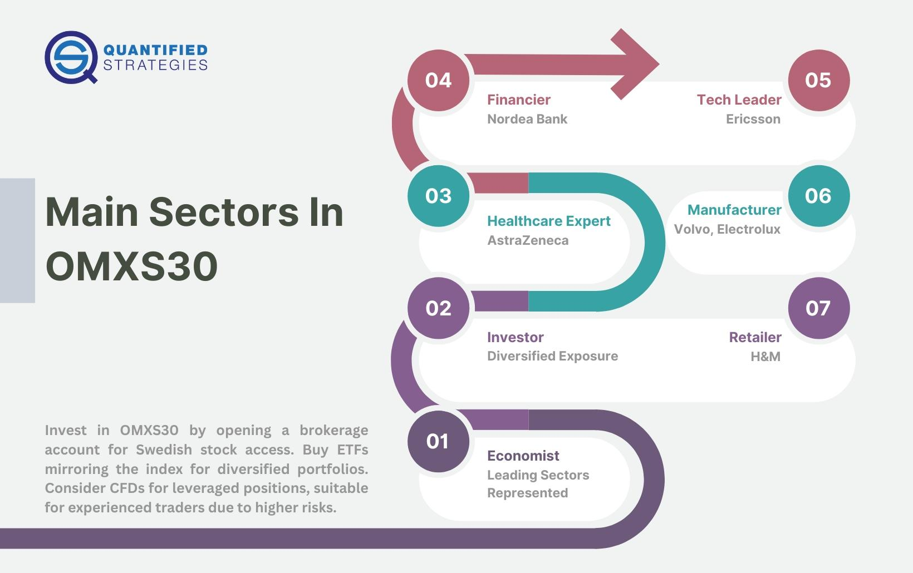

## Table of Contents

## What is the OMX Stockholm 30 Index?

The OMX Stockholm 30 Index, often just called OMXS30, is a stock market index that tracks the performance of the 30 most traded stocks on the Stockholm Stock Exchange in Sweden. It's like a scoreboard that shows how well these big companies are doing. People use it to see how the Swedish stock market is doing overall, since these companies are some of the biggest and most important in Sweden.

The index was started in 1986 and is managed by Nasdaq Nordic, which is part of the Nasdaq group. The companies in the OMXS30 come from different industries, like technology, finance, and manufacturing. This mix helps give a good picture of the whole economy. The index is updated every 15 seconds during trading hours, so it's always showing the most recent information.

## How does the OMX trading strategy work in Sweden?

The OMX trading strategy in Sweden involves buying and selling stocks that are part of the OMX Stockholm 30 Index. Traders look at the performance of these 30 companies to make decisions. They might buy stocks when they think the index will go up and sell them when they think it will go down. This strategy can be used by both individual investors and big investment firms. The goal is to make money by predicting how the market will move based on the index's performance.

To use the OMX trading strategy, traders often look at different pieces of information. They check the news, financial reports, and economic indicators that might affect the companies in the index. If a company in the OMXS30 is doing well, its stock price might go up, which could push the whole index higher. Traders might also use technical analysis, which means looking at charts and patterns to guess where the index is headed next. By combining all this information, traders try to make smart choices about when to buy and sell stocks.

## What are the basic principles behind the OMX trading strategy?

The OMX trading strategy is all about using the OMX Stockholm 30 Index to decide when to buy and sell stocks. Traders watch the index closely because it shows how the 30 biggest and most traded companies in Sweden are doing. If they think the index will go up, they might buy stocks from those companies. If they think it will go down, they might sell their stocks. The idea is to make money by guessing the right time to buy low and sell high based on the index's movements.

To make these guesses, traders look at a lot of different information. They read the news, check financial reports, and keep an eye on economic indicators that could affect the companies in the index. For example, if a company in the OMXS30 is doing well, its stock price might go up, which could make the whole index go up too. Traders also use something called technical analysis, which means they look at charts and patterns to try to predict where the index is going next. By putting all this information together, traders try to make smart choices about when to buy and sell stocks.

## What are the key components of the OMX index that traders should be aware of?

The OMX Stockholm 30 Index, or OMXS30, is made up of the 30 most traded stocks on the Stockholm Stock Exchange. These companies come from different industries like technology, finance, and manufacturing. This mix helps show how the whole Swedish economy is doing. Traders need to know that the index is updated every 15 seconds during trading hours, so it always shows the latest information. The companies in the index can change over time, so traders should keep an eye on which companies are included.

Traders should also understand that the OMXS30 is a good way to see the overall health of the Swedish stock market. If the index goes up, it usually means the market is doing well, and if it goes down, the market might be struggling. Traders use this information to decide when to buy or sell stocks. They look at news, financial reports, and economic indicators that might affect the companies in the index. By understanding these key components, traders can make better decisions about their investments.

## How can beginners start trading using the OMX strategy in Sweden?

To start trading using the OMX strategy in Sweden, beginners should first learn about the OMX Stockholm 30 Index. This index shows how the 30 biggest and most traded companies in Sweden are doing. You can find this information on financial websites or through trading platforms. It's important to understand that the index changes every 15 seconds during trading hours, so it always shows the latest information. Beginners should also know that the companies in the index can change over time, so it's good to keep an eye on which companies are included.

Once you understand the OMXS30, you can start making trading decisions. If you think the index will go up, you might want to buy stocks from the companies in the index. If you think it will go down, you might want to sell your stocks. To make these decisions, you can look at news, financial reports, and economic indicators that might affect the companies in the index. You can also use charts and patterns to try to predict where the index is going next. By putting all this information together, you can start making smart choices about when to buy and sell stocks using the OMX strategy.

## What are the common tools and platforms used for OMX trading in Sweden?

For OMX trading in Sweden, many people use online trading platforms. Some popular ones are Avanza, Nordnet, and the official Nasdaq Nordic platform. These platforms let you see the OMX Stockholm 30 Index in real time, buy and sell stocks, and check financial news and reports. They are easy to use and have tools that help you make trading decisions, like charts and analysis features.

Another common tool is a mobile app. Avanza and Nordnet both have apps that let you trade on the go. These apps show the latest index updates and let you quickly buy or sell stocks from your phone. They also have alerts that can tell you when the index moves a lot, so you don't miss important changes.

Some traders also use special software for technical analysis. This software helps you look at charts and patterns to guess where the OMXS30 might go next. Examples include MetaTrader and TradingView. These tools can be a bit more complicated, but they give you a lot of information to help with your trading decisions.

## What are the risks associated with the OMX trading strategy?

Trading with the OMX strategy can be risky because the stock market can be unpredictable. The OMX Stockholm 30 Index can go up and down a lot, and it's hard to always guess right. If you buy stocks thinking the index will go up but it goes down instead, you could lose money. Also, the companies in the index can change, which means the index might not always include the same big companies. If a new company in the index doesn't do well, it can pull the whole index down.

Another risk is that economic news and reports can affect the companies in the OMXS30. If there's bad news about the economy or a specific company, their stock prices might drop, which can make the index go down too. Beginners might not know how to handle these changes and could make bad trading decisions. It's important to always be learning and watching the market closely to try to reduce these risks.

## How can one analyze the performance of the OMX strategy over time?

To analyze the performance of the OMX strategy over time, you need to look at how the OMX Stockholm 30 Index has moved in the past. You can do this by checking historical data on financial websites or trading platforms. Look at the index's highs and lows, and see if there are any patterns or trends. For example, you might notice that the index goes up during certain times of the year or after certain economic reports come out. By comparing these patterns to when you bought and sold stocks, you can see if your strategy worked well or if you need to change it.

Another way to analyze the OMX strategy's performance is by keeping track of your own trades. Write down when you bought and sold stocks, and how much money you made or lost each time. Over time, you can see if you're making more money than you're losing. If you're losing money, you might need to adjust your strategy. It's also helpful to compare your results to the overall performance of the OMXS30. If the index is going up but you're losing money, it might mean you're not [picking](/wiki/asset-class-picking) the right times to buy and sell. By looking at both the index's performance and your own trades, you can get a good idea of how well the OMX strategy is working for you.

## What advanced techniques can be used to optimize the OMX trading strategy?

One advanced technique to optimize the OMX trading strategy is using [algorithmic trading](/wiki/algorithmic-trading). This means using computer programs to buy and sell stocks automatically based on certain rules. For example, you can set up the program to buy stocks when the OMX Stockholm 30 Index goes up by a certain amount and sell them when it goes down by a certain amount. This can help you make trades faster and without letting your emotions get in the way. You can also use these programs to test different trading strategies on past data to see which ones work best before using them with real money.

Another technique is to use more advanced technical analysis. This means looking at more detailed charts and patterns to predict where the OMXS30 might go next. You can use tools like moving averages, which show the average price of the index over time, or the Relative Strength Index (RSI), which shows if the index is overbought or oversold. By combining these tools, you can get a better idea of when to buy and sell stocks. It's also helpful to use [fundamental analysis](/wiki/fundamental-analysis), which means looking at the financial health of the companies in the index. By understanding both the technical and fundamental sides, you can make smarter trading decisions and improve your OMX strategy.

## How do macroeconomic factors influence the OMX trading strategy in Sweden?

Macroeconomic factors can have a big impact on the OMX trading strategy in Sweden. These factors include things like interest rates, inflation, and the overall health of the economy. For example, if the Swedish central bank raises interest rates, it might make borrowing money more expensive for companies. This could slow down their growth and make their stock prices go down, which would affect the OMX Stockholm 30 Index. Traders need to keep an eye on these big economic changes because they can change how the index moves and affect when to buy or sell stocks.

Another important macroeconomic [factor](/wiki/factor-investing) is the global economy. Since many Swedish companies in the OMXS30 do business all over the world, what happens in other countries can affect their stock prices. If there's a big economic problem in a country that buys a lot of Swedish products, it could hurt those companies and pull the index down. Traders using the OMX strategy need to watch international news and economic reports to understand how these global changes might affect the Swedish market. By understanding these big economic factors, traders can make better decisions about their OMX trading strategy.

## What are some case studies of successful OMX trading strategies in Sweden?

One successful OMX trading strategy in Sweden was used by a trader named Erik. Erik noticed that the OMX Stockholm 30 Index often went up after positive economic news from the European Union. He decided to buy stocks from the companies in the index right after good news came out. Over time, Erik made a lot of money by following this strategy. He always kept an eye on the news and was quick to act when he saw the right signals. This showed how important it is to understand how big economic changes can affect the index.

Another example is a group of traders at a Swedish investment firm. They used a computer program to help them trade based on the OMXS30. The program looked at past data to find the best times to buy and sell stocks. The traders set up the program to automatically make trades when certain conditions were met, like when the index went up or down by a certain amount. This strategy worked well for them because it took the emotion out of trading and made decisions based on data. It showed how technology can help make trading more successful.

## How can expert traders adapt the OMX strategy to different market conditions in Sweden?

Expert traders can adapt the OMX strategy to different market conditions in Sweden by paying close attention to economic indicators and news. For example, if they see that the economy is growing and interest rates are low, they might decide to buy more stocks because they think the OMX Stockholm 30 Index will go up. On the other hand, if they see signs of a slowdown or high inflation, they might sell their stocks or wait for better conditions. By understanding how these big economic changes can affect the companies in the index, expert traders can make smarter decisions about when to buy and sell.

Another way expert traders adapt their OMX strategy is by using advanced tools and techniques. They might use computer programs to automatically make trades based on certain rules, which can help them react quickly to changes in the market. They also use detailed charts and patterns to predict where the index might go next. By combining these tools with a deep understanding of the Swedish economy, expert traders can adjust their strategy to fit whatever market conditions they are facing. This helps them make more money and avoid big losses, no matter what is happening in the market.

## References & Further Reading

[1]: Bergstra, J., Bardenet, R., Bengio, Y., & Kégl, B. (2011). ["Algorithms for Hyper-Parameter Optimization."](https://papers.nips.cc/paper/4443-algorithms-for-hyper-parameter-optimization) Advances in Neural Information Processing Systems 24.

[2]: ["Advances in Financial Machine Learning"](https://www.amazon.com/Advances-Financial-Machine-Learning-Marcos/dp/1119482089) by Marcos Lopez de Prado

[3]: ["Evidence-Based Technical Analysis: Applying the Scientific Method and Statistical Inference to Trading Signals"](https://www.amazon.com/Evidence-Based-Technical-Analysis-Scientific-Statistical/dp/0470008741) by David Aronson

[4]: ["Machine Learning for Algorithmic Trading"](https://github.com/stefan-jansen/machine-learning-for-trading) by Stefan Jansen

[5]: ["Quantitative Trading: How to Build Your Own Algorithmic Trading Business"](https://books.google.com/books/about/Quantitative_Trading.html?id=j70yEAAAQBAJ) by Ernest P. Chan