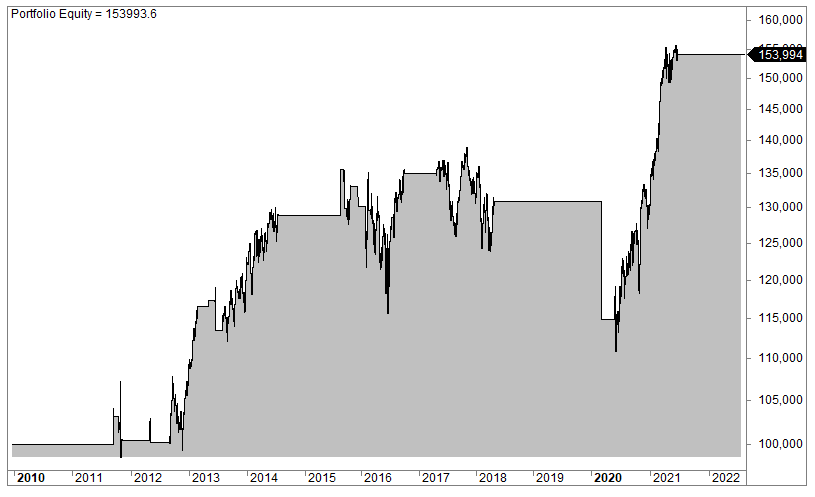

Algorithmic trading, often referred to as algo trading, has fundamentally transformed the global financial markets by enabling automated, data-driven decision-making. This approach harnesses the power of advanced mathematical models and high-speed computer programs to execute trades at speeds and frequencies unachievable by human traders. The proliferation of algo trading has opened up a myriad of opportunities for traders, particularly in the trading of stock indices, which represent a basket of powerful companies within an economy. One such index with substantial potential is the OMXS30 Index.

The OMXS30 Index is a benchmark stock market index that includes the 30 largest and most actively traded companies on the Stockholm Stock Exchange. These companies provide a robust representation of the Swedish economy and serve as crucial indicators of market performance within the region. The index encompasses prominent companies such as AstraZeneca, Ericsson, and Volvo, making it a significant focal point for both domestic and international investors.



This article examines how algorithmic trading strategies can be applied effectively to the OMXS30 Index, highlighting the diverse opportunities and potential challenges that traders may encounter. The dynamic nature of the stock market, paired with the unique attributes of the OMXS30, presents a fertile ground for deploying sophisticated trading algorithms. These algorithms are designed to exploit specific patterns and behaviors intrinsic to the index, enabling traders to make informed decisions and potentially enhance their trading outcomes.

Understanding the unique characteristics and market dynamics of the OMXS30 is crucial for traders looking to capitalize on its movements. Factors such as European Union economic policies, inflation rates, and Nordic market trends significantly influence the index's performance, necessitating a comprehensive understanding for successful trading strategy development.

In essence, algorithmic trading offers a promising avenue for traders interested in the OMXS30 Index. By leveraging sophisticated algorithms that process and analyze market data in real time, traders can potentially uncover and exploit lucrative trading opportunities. This article serves to explore these dimensions, providing insight into how traders can effectively navigate the complexities of the OMXS30 through algorithmic trading.

## Table of Contents

## Understanding OMXS30 and Its Market Dynamics

The OMXS30 Index serves as a benchmark for the Swedish stock market, encompassing the 30 most actively traded stocks on the Nasdaq Stockholm Exchange. By focusing on market capitalization, the OMXS30 provides a representation of the performance and overall health of key industry players in Sweden. Introduced in 1986, this free float, capitalization-weighted index includes major companies such as AstraZeneca and Ericsson, making it a focal point for investors interested in the Nordic markets.

Key characteristics of the OMXS30 arise from its methodology. A free float, capitalization-weighted index implies that stocks are weighted according to the number of shares available for trading, reflecting their actual market impact more accurately than a total capitalization approach. This allows for a clearer picture of market sentiment and priorities, particularly when interpreting market dynamics and trends.

Several important economic factors play critical roles in shaping the dynamics of the OMXS30, influencing how [algorithmic trading](/wiki/algorithmic-trading) strategies are designed and implemented:

1. **EU Economic Policies:** As Sweden is part of the European Union's single market, decisions made at the EU level, such as monetary policy by the European Central Bank or regulatory decisions, can significantly affect Swedish companies' operations and valuations. This interconnectedness, along with Sweden's own policy decisions, creates a complex environment where traders must stay informed about political and regulatory developments.

2. **Inflation Rates:** The central bank of Sweden, known as the Riksbank, regularly adjusts interest rates to manage inflation. These adjustments can influence borrowing costs, consumer spending, and corporate investment, all of which subsequently impact the trading prices of OMXS30 constituent stocks. Algorithmic strategies must, therefore, incorporate economic indicators reflecting inflationary changes to accurately assess future price movements.

3. **Nordic Market Trends:** The economic health of neighboring Nordic countries can also influence the OMXS30. With many Swedish companies engaging in cross-border trade and investment within this region, economic trends in Denmark, Norway, and Finland can alter market conditions significantly. Algorithmic trading strategies that factor in regional trends may gain an edge by understanding these interconnected market dynamics.

Understanding these factors is essential for traders employing algorithmic methods in the OMXS30 market. By analyzing EU policies, tracking inflation trends, and monitoring Nordic economic happenings, investors can refine their algorithmic approaches to better anticipate market movements, making data-driven decisions aligned with broader economic indicators.

## Algorithmic Trading Strategies for OMXS30

Algorithmic trading strategies have transformed the way traders approach the OMXS30 Index, offering automated solutions for capitalizing on market movements. Two primary strategies—trend-following and mean-reversion—can be effectively employed in trading OMXS30 futures and contracts for difference (CFDs).

Trend-following strategies aim to identify and benefit from the continuation of a price movement. A common technique involves using moving averages to signal potential trends. Traders might use the Simple Moving Average (SMA) or the Exponential Moving Average (EMA) to smooth out price data and highlight the direction of the trend. For instance, a crossover strategy might employ two moving averages of different time periods, generating buy signals when the shorter-term average crosses above the longer-term average, or sell signals when the opposite occurs. This method assumes that once a trend is established, it is more likely to continue than reverse.

Python code for a simple moving average crossover strategy might look like this:

```python
import pandas as pd

def moving_average_crossover(data, short_window, long_window):
    signals = pd.DataFrame(index=data.index)
    signals['price'] = data['Close']
    signals['short_mavg'] = data['Close'].rolling(window=short_window, min_periods=1).mean()
    signals['long_mavg'] = data['Close'].rolling(window=long_window, min_periods=1).mean()
    signals['signal'] = 0
    signals['signal'][short_window:] = np.where(signals['short_mavg'][short_window:] > signals['long_mavg'][short_window:], 1, 0)
    signals['positions'] = signals['signal'].diff()

    return signals
```

Conversely, mean-reversion strategies are predicated on the assumption that prices will revert to their mean or average over time. In this context, traders might use indicators such as the Relative Strength Index (RSI) or Williams %R to identify overbought or oversold conditions. The RSI, for instance, measures the speed and change of price movements on a scale of 0 to 100. An RSI value above 70 may suggest an overbought condition, indicating a potential sell signal, while a value below 30 could signal an oversold condition and a potential buying opportunity.

A Python function to calculate the RSI might be implemented as follows:

```python
import numpy as np

def relative_strength_index(data, window):
    delta = data['Close'].diff()
    gain = (delta.where(delta > 0, 0)).rolling(window=window).mean()
    loss = (-delta.where(delta < 0, 0)).rolling(window=window).mean()
    rs = gain / loss
    rsi = 100 - (100 / (1 + rs))

    return rsi
```

Both trend-following and mean-reversion strategies are valuable tools in the algorithmic trader's toolkit. However, their effectiveness often depends on the specific market conditions of the OMXS30, and traders should consider incorporating robust [backtesting](/wiki/backtesting) approaches to evaluate their performance against historical data before implementation. Additionally, continuously adjusting and optimizing these strategies is crucial to account for new market dynamics and ensure sustained profitability.

## Key Tools and Platforms for OMXS30 Algo Trading

Prominent trading platforms provide vital support for traders interested in leveraging algorithmic trading opportunities with the OMXS30 Index. One of the widely used platforms is IG, which offers Contracts for Difference (CFDs) on OMXS30, allowing traders to take advantage of leverage and a variety of trading tools. Leverage can amplify both potential profits and losses, thereby offering increased exposure to the market with comparatively less initial capital. This makes CFDs a popular choice for traders looking to exploit short-term market movements.

Apart from IG, platforms like TradingView and MetaTrader 4 are beneficial for traders seeking advanced charting capabilities and the integration of custom trading algorithms. TradingView is known for its user-friendly interface and extensive suite of customizable indicators, allowing traders to analyze historical price data efficiently and identify trading opportunities. MetaTrader 4, although traditionally used for [forex](/wiki/forex-system), also supports index trading. It provides a robust environment for algorithm development through its MetaEditor tool where traders can write scripts in the MQL4 language. This is particularly useful for executing strategies involving complex algorithms.

Backtesting tools are an integral part of developing successful algorithmic trading strategies. They allow traders to test strategies on historical data before committing real capital. This helps in identifying potential flaws and optimizing strategies for better performance. In Python, libraries such as `Backtrader` and `Zipline` are popular for backtesting due to their extensive features and ease of use. A simple Python script for backtesting a moving average crossover strategy could look like this:

```python
import backtrader as bt

class MovingAverageCrossover(bt.SignalStrategy):
    def __init__(self):
        short_ma = bt.ind.SMA(period=10)
        long_ma = bt.ind.SMA(period=30)
        self.signal_add(bt.SIGNAL_LONG, long_ma - short_ma)

# Create a cerebro entity
cerebro = bt.Cerebro()

# Add a strategy
cerebro.addstrategy(MovingAverageCrossover)

# Load the data
data = bt.feeds.YahooFinanceData(dataname='OMXS30.ST', fromdate=datetime.datetime(2020, 1, 1), todate=datetime.datetime(2021, 1, 1))
cerebro.adddata(data)

# Run over everything
cerebro.run()
```

This script sets up a basic backtest using the moving average crossover technique, which is a common trend-following strategy. It highlights how traders can utilize Python to test and refine their algorithmic trading strategies for indices like the OMXS30. When leveraging these tools and platforms, traders can enhance their trading processes, optimizing their strategies for better decision-making in their algorithmic trading endeavors.

## Challenges and Risks in Algo Trading OMXS30

Algorithmic trading, while transformative, is not without its challenges and risks, especially when applied to the OMXS30 Index. One of the primary challenges is the inherent [volatility](/wiki/volatility-trading-strategies) of financial markets, which can result in rapid price changes that affect algorithm-driven trades. This volatility is amplified when using leveraged financial instruments such as futures and Contracts for Difference (CFDs), which can magnify both gains and losses.

Algorithmic traders must account for high-frequency fluctuations that can impact trade execution. These fluctuations can lead to slippage, where the final executed price differs from the intended price, potentially eroding profits. Effective risk management strategies are crucial to safeguarding trading capital, particularly in a volatile market. Traders often employ stop-loss orders and position sizing to mitigate potential losses.

Another significant risk in algorithmic trading is the presence of algorithmic biases. These biases can arise from overfitting models to historical data, leading to strategies that perform well in backtesting but fail in live markets. This discrepancy often stems from not accounting for changing market conditions or the introduction of unforeseen market variables.

Optimizing algorithms to mitigate these biases involves a process of continuous refinement and testing. Traders frequently adjust their models to enhance robustness, often by employing [machine learning](/wiki/machine-learning) techniques that allow algorithms to adapt to changing data patterns. 

```python
import numpy as np
from sklearn.model_selection import train_test_split
from sklearn.ensemble import RandomForestClassifier

# Sample code to demonstrate a basic model training process
# Simulate some data for the purpose of the example
np.random.seed(0)
features = np.random.randn(1000, 10)
labels = np.random.randint(0, 2, 1000)

# Split the data into training and testing sets
X_train, X_test, y_train, y_test = train_test_split(features, labels, test_size=0.3, random_state=42)

# Initialize a Random Forest model
model = RandomForestClassifier(n_estimators=100, random_state=42)

# Train the model
model.fit(X_train, y_train)

# Test the model
accuracy = model.score(X_test, y_test)
print(f"Model accuracy: {accuracy:.2f}")
```

The use of backtesting tools plays a crucial role in minimizing risks. Backtesting involves running your trading algorithm on historical data to evaluate its performance, helping in identifying potential pitfalls before real-time deployment. However, traders must be cautious of the overfitting trap during backtesting, ensuring the chosen strategies are generalized enough to withstand a variety of market conditions.

Moreover, algorithmic trading strategies should also consider external market factors such as changes in economic policies, geopolitical events, or unexpected news releases, which can trigger market movements that are difficult to predict.

In conclusion, while algo trading offers powerful advantages, understanding its inherent risks is essential. Traders should continuously evolve their strategies with a strong emphasis on risk management and algorithm optimization to succeed in the dynamic environment of the OMXS30.

## Conclusion: The Future of OMXS30 Algo Trading

Algorithmic trading continues to evolve, particularly in indices like the OMXS30, presenting traders with opportunities to refine their strategies through advanced algorithms and increasingly comprehensive data sets. As technology progresses, traders gain access to more powerful computational tools that enhance data analysis, enabling quicker and more accurate decision-making processes. This advancement allows for the development of more sophisticated trading models that can handle large datasets with improved precision.

A critical [factor](/wiki/factor-investing) in the future of OMXS30 algorithmic trading will be the ability of traders to stay informed and adaptable in response to shifting technology and regulatory landscapes. The rise of machine learning and [artificial intelligence](/wiki/ai-artificial-intelligence) can further enhance trading strategies by identifying patterns and trends that traditional methods might overlook. Simultaneously, evolving financial regulations necessitate continuous learning and adaptation to ensure compliance and optimize trading performance.

Effective risk management remains paramount for traders seeking to capitalize on OMXS30's price movements. The inherent volatility of financial markets, compounded by the leveraged nature of many trading instruments, underscores the importance of robust risk management practices. Employing strategies such as stop-loss orders and position sizing can mitigate potential risks and safeguard trading capital.

In conclusion, the future of OMXS30 algorithmic trading holds significant promise for traders who can adeptly combine sound strategies with a comprehensive approach to risk management. By leveraging technological advancements and maintaining an adaptive mindset, traders can enhance their profitability and sustain competitive edges in the dynamic arena of algorithmic trading.

## FAQ: Common Questions About OMXS30 And Algo Trading

### What are the basic components of OMXS30 futures that traders need to know?

OMXS30 futures are derivative contracts that allow traders to speculate on the future value of the OMXS30 Index. The basic components include:

1. **Contract Size**: Each futures contract represents a specific amount of the index's value, typically multiplied by a given amount of currency (e.g., SEK) per index point.

2. **Expiration Date**: Futures contracts have a set maturity date, after which they must be settled. Most contracts are settled in cash.

3. **Margin Requirements**: To trade futures, traders must deposit an initial margin, which is a percentage of the contract's value, to cover potential losses.

4. **Tick Size**: Futures prices move in minimum increments known as ticks. For OMXS30 futures, the tick size will be specified by the exchange.

5. **Leverage**: Futures trading involves leverage, enabling traders to control a larger position size while placing only a fraction of the capital.

### How does currency fluctuation impact OMXS30 trading?

Currency fluctuations can significantly impact OMXS30 trading, primarily if trades are executed by international investors or the companies within the index engage in substantial foreign business. Here’s how:

1. **Exchange Rate Risk**: International traders who convert their currency into Swedish Krona (SEK) to trade OMXS30 may be affected by currency fluctuations. A depreciation of SEK can negatively impact returns when converting back to their home currency.

2. **Economic Indicators**: Currency fluctuations often respond to economic indicators such as interest rates, inflation, and GDP growth, which can also influence investor sentiment towards Swedish equities.

3. **Corporate Revenues**: Many companies in the OMXS30 have global operations. Thus, foreign exchange rates can affect their revenues and profits, influencing their stock prices and, subsequently, the index value.

### What are effective risk management practices when using algorithmic strategies in the OMXS30 market?

Effective risk management is crucial in algorithmic trading to safeguard capital and optimize returns in the OMXS30 market. Key practices include:

1. **Diversification**: Avoid concentrating on a single asset or strategy. By diversifying, traders can spread risk across various assets or strategies.

2. **Stop-Loss Orders**: Implementing stop-loss orders can help protect against significant losses by automatically selling a position when it reaches a predetermined price level.

3. **Backtesting**: Before deploying a strategy in live markets, thorough backtesting should be conducted using historical data to evaluate its performance and identify potential weaknesses.

4. **Position Sizing**: Properly sizing positions according to risk tolerance and capital allocation limits exposure to any single trade’s losses.

5. **Monitoring and Adjustment**: Constant monitoring of algorithms and market conditions ensures timely adjustments to strategies in response to market changes or unexpected behaviors. 

By incorporating these practices, traders can better manage the inherent risks of algorithmic trading within the OMXS30 Index.

## References & Further Reading

[1]: Bergstra, J., Bardenet, R., Bengio, Y., & Kégl, B. (2011). ["Algorithms for Hyper-Parameter Optimization."](https://papers.nips.cc/paper/4443-algorithms-for-hyper-parameter-optimization) Advances in Neural Information Processing Systems 24.

[2]: ["Advances in Financial Machine Learning"](https://www.amazon.com/Advances-Financial-Machine-Learning-Marcos/dp/1119482089) by Marcos Lopez de Prado

[3]: ["Evidence-Based Technical Analysis: Applying the Scientific Method and Statistical Inference to Trading Signals"](https://www.amazon.com/Evidence-Based-Technical-Analysis-Scientific-Statistical/dp/0470008741) by David Aronson

[4]: ["Machine Learning for Algorithmic Trading"](https://github.com/stefan-jansen/machine-learning-for-trading) by Stefan Jansen

[5]: ["Quantitative Trading: How to Build Your Own Algorithmic Trading Business"](https://books.google.com/books/about/Quantitative_Trading.html?id=j70yEAAAQBAJ) by Ernest P. Chan