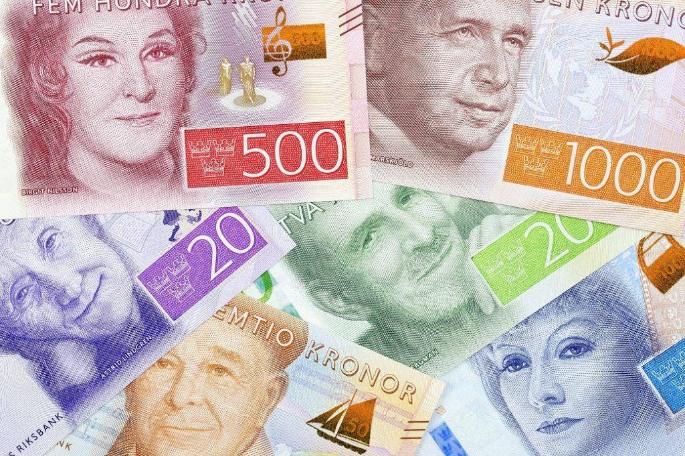

## Table of Contents

## What is the Swedish Krona?

The Swedish Krona is the official currency of Sweden. It is often written as SEK, which stands for "Svensk Krona" in Swedish. People use the Krona to buy things in Sweden, just like how you might use dollars or euros in other countries.

The Krona has been around since 1873. It replaced an older currency called the Riksdaler. Today, you can find Krona coins and banknotes with different values, like 1, 5, 10, 20, 50, 100, 200, 500, and 1000 Krona. The Krona is managed by Sweden's central bank, called the Riksbank, which makes sure the currency works well for everyone in the country.

## How is the Swedish Krona abbreviated?

The Swedish Krona is abbreviated as SEK. This stands for "Svensk Krona," which means "Swedish Crown" in English.

You will see SEK used in many places, like on price tags, in banks, and when you're looking at exchange rates. It helps people quickly understand that the amount is in Swedish Krona.

## What is the history of the Swedish Krona?

The Swedish Krona has been around since 1873. Before that, Sweden used a currency called the Riksdaler. The Krona was introduced as part of a new monetary system called the Scandinavian Monetary Union, which also included Denmark and Norway. This union wanted to make it easier for people in these countries to trade with each other by using the same kind of money. The Krona was based on a certain amount of gold, which was common back then.

Over the years, the Swedish Krona went through many changes. In 1931, Sweden left the gold standard, which means the Krona was no longer tied to a specific amount of gold. This allowed the government to have more control over the currency. In 1992, Sweden decided not to join the Euro, which is the currency used by many countries in Europe. Instead, Sweden kept the Krona as its official money. Today, the Krona is managed by the Riksbank, Sweden's central bank, which works to keep the currency stable and useful for everyone in Sweden.

## What are the denominations of Swedish Krona banknotes and coins?

Swedish Krona banknotes come in different amounts. You can find banknotes worth 20 Krona, 50 Krona, 100 Krona, 200 Krona, 500 Krona, and 1000 Krona. Each banknote has a different color and picture to help people tell them apart easily.

Swedish Krona coins also come in different amounts. There are coins worth 1 Krona, 2 Krona, 5 Krona, and 10 Krona. The coins are made of different metals and have different sizes, which makes it easy to know which coin is which.

## How does the Swedish Krona function within Sweden's economy?

The Swedish Krona is the money used in Sweden. It helps people buy things like food, clothes, and other stuff they need. When people work, they get paid in Krona, and then they use that money to buy things or save it for later. Businesses also use Krona to pay for things they need to run their shops or factories. The Krona makes it easy for everyone in Sweden to trade with each other because they all use the same money.

The Riksbank, which is Sweden's central bank, takes care of the Krona. They make sure there is enough money in the country and that it stays valuable. If the Krona becomes too weak or too strong, the Riksbank can do things to fix it. This helps keep prices stable so that people can plan their spending and saving. The Krona also helps Sweden trade with other countries because it can be changed into other kinds of money, like dollars or euros.

## What is the role of the Riksbank in relation to the Swedish Krona?

The Riksbank is Sweden's central bank, and it takes care of the Swedish Krona. Its main job is to make sure the Krona stays stable and useful for everyone in Sweden. The Riksbank does this by controlling how much money is in the country. If there's too much money, prices can go up, which is not good. If there's too little money, it can be hard for people to buy things they need. So, the Riksbank tries to keep the right amount of money to help the economy work well.

The Riksbank also sets interest rates, which is like the cost of borrowing money. When the Riksbank changes these rates, it can affect how much people want to borrow and spend. This helps control how fast the economy grows. Another important job of the Riksbank is to make sure the Krona can be easily changed into other currencies, like dollars or euros. This helps Sweden trade with other countries and keeps the Krona strong in the world.

## How does the value of the Swedish Krona compare to other major currencies?

The value of the Swedish Krona can change compared to other major currencies like the US Dollar, the Euro, and the British Pound. For example, if 1 US Dollar can buy 10 Swedish Krona, then the Krona is weaker than the Dollar. But if 1 US Dollar can only buy 8 Swedish Krona, then the Krona is stronger. The value changes because of things like how well Sweden's economy is doing, what other countries think about Sweden, and even big events in the world. 

The Krona often moves up and down compared to the Euro because many countries in Europe use the Euro. Sweden chose not to use the Euro, so the Krona has its own value. Sometimes, the Krona can be strong against the Euro, making it cheaper for Swedes to buy things from Europe. Other times, the Krona can be weak, making European goods more expensive. The Riksbank, Sweden's central bank, works to keep the Krona's value stable so that it doesn't change too much and cause problems for people and businesses in Sweden.

## What factors influence the exchange rate of the Swedish Krona?

The exchange rate of the Swedish Krona is affected by many things. One big [factor](/wiki/factor-investing) is how well Sweden's economy is doing. If Sweden's economy is growing and people are buying more things, the Krona can become stronger. Another factor is what other countries think about Sweden. If they think Sweden is a good place to invest money, the Krona can get stronger. Also, the interest rates set by the Riksbank can change the Krona's value. If the Riksbank raises interest rates, it can make the Krona stronger because people want to save money in Sweden.

Big events in the world can also change the Krona's value. For example, if there is a big problem in another country, people might want to move their money to Sweden, making the Krona stronger. On the other hand, if there is a problem in Sweden, the Krona can get weaker. The value of other major currencies, like the US Dollar and the Euro, also affects the Krona. If the Euro becomes weaker, the Krona might get stronger compared to it. The Riksbank tries to keep the Krona's value stable by doing things like buying or selling other currencies, but it's not always easy because so many things can change the exchange rate.

## How has the Swedish Krona performed historically against inflation?

The Swedish Krona has had its ups and downs when it comes to fighting inflation. Inflation means that prices go up over time, and the Krona's value can change because of this. In the past, Sweden has seen times when inflation was high, like in the 1970s and 1980s. During these times, the Krona lost some of its value because people needed more Krona to buy the same things. The Riksbank, Sweden's central bank, tried different ways to control inflation, like changing interest rates and how much money was in the country.

In more recent years, the Riksbank has been better at keeping inflation under control. Since the 1990s, Sweden has had a goal to keep inflation around 2% each year. This has helped the Krona stay more stable. The Riksbank uses tools like setting interest rates to make sure the Krona keeps its value and people can plan their spending and saving better. Even though there are still times when the Krona's value changes, overall, it has been more stable against inflation in the last few decades.

## What are the monetary policy tools used by Sweden to manage the Krona?

Sweden uses different tools to manage the Krona and keep the economy stable. One important tool is setting interest rates. The Riksbank, which is Sweden's central bank, can change the [interest rate](/wiki/interest-rate-trading-strategies) to control how much people want to borrow and spend money. If the Riksbank raises the interest rate, borrowing money becomes more expensive, and people might spend less. This can help slow down inflation, which is when prices go up. If the Riksbank lowers the interest rate, borrowing money becomes cheaper, and people might spend more, which can help the economy grow.

Another tool Sweden uses is controlling the amount of money in the country. The Riksbank can buy or sell government bonds to change how much money is available. If the Riksbank buys bonds, it puts more money into the economy, which can help it grow. If it sells bonds, it takes money out of the economy, which can help control inflation. The Riksbank also keeps an eye on the exchange rate of the Krona against other currencies. By buying or selling foreign currency, the Riksbank can influence the Krona's value and help keep it stable. These tools help Sweden manage the Krona and keep the economy running smoothly.

## How does the Swedish Krona impact Sweden's international trade?

The Swedish Krona plays a big role in Sweden's international trade. When the Krona is strong, it means that Swedish goods and services become more expensive for people in other countries. This can make it harder for Swedish businesses to sell things abroad because other countries might find it too pricey. On the other hand, a strong Krona makes it cheaper for Sweden to buy things from other countries. So, if the Krona is strong, Sweden might import more and export less.

When the Krona is weak, the opposite happens. Swedish goods and services become cheaper for people in other countries, which can help Swedish businesses sell more abroad. This can be good for Sweden's exports. But a weak Krona also means that things Sweden buys from other countries become more expensive. So, if the Krona is weak, Sweden might import less and export more. The Riksbank, Sweden's central bank, tries to keep the Krona's value stable to help balance these effects and keep Sweden's international trade healthy.

## What are the future prospects and challenges for the Swedish Krona?

The future of the Swedish Krona depends on many things. If Sweden's economy keeps growing and people keep trusting the Krona, it can stay strong. The Riksbank will keep trying to control inflation and keep the Krona's value stable. If Sweden can keep its economy healthy and people around the world want to invest in Sweden, the Krona could do well. But, if there are big problems in the world or if Sweden's economy has trouble, the Krona might get weaker.

There are also challenges for the Krona. One big challenge is that the world's economy can change a lot. If other countries have problems, it can affect the Krona. Also, if Sweden's economy grows too fast or too slow, it can be hard to keep the Krona stable. Another challenge is that more and more people are using digital money, which can change how people think about the Krona. The Riksbank will need to keep up with these changes and find new ways to make sure the Krona stays useful and trusted.

## References & Further Reading

[1]: Bergstra, J., Bardenet, R., Bengio, Y., & Kégl, B. (2011). ["Algorithms for Hyper-Parameter Optimization."](https://papers.nips.cc/paper/4443-algorithms-for-hyper-parameter-optimization) Advances in Neural Information Processing Systems 24.

[2]: ["Advances in Financial Machine Learning"](https://www.amazon.com/Advances-Financial-Machine-Learning-Marcos/dp/1119482089) by Marcos Lopez de Prado

[3]: ["Evidence-Based Technical Analysis: Applying the Scientific Method and Statistical Inference to Trading Signals"](https://www.amazon.com/Evidence-Based-Technical-Analysis-Scientific-Statistical/dp/0470008741) by David Aronson

[4]: ["Machine Learning for Algorithmic Trading"](https://github.com/stefan-jansen/machine-learning-for-trading) by Stefan Jansen

[5]: ["Quantitative Trading: How to Build Your Own Algorithmic Trading Business"](https://www.amazon.com/Quantitative-Trading-Build-Algorithmic-Business/dp/1119800064) by Ernest P. Chan