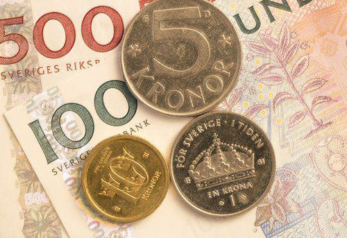

The Swedish Krona (SEK) serves as Sweden's official currency and holds a prominent position in the global forex market. Renowned for its stability and resilience, the SEK attracts attention from both casual and professional traders. Its consistent performance is underpinned by Sweden's robust economic framework and export-driven economy, which contribute to a reliable exchange rate.

Technological advancements have significantly altered the trading landscape, and algorithmic trading in SEK is now a favored strategy to leverage the currency's market movements. This form of trading employs complex algorithms and computational power to execute trades, addressing the need for speed and precision that human traders alone cannot achieve. Algorithmic trading adapts to shifts in market conditions, using pre-defined parameters and statistical models to make informed trading decisions.



This article provides an analytical view on trading the Swedish Krona using algorithmic methods. It highlights the key advantages such as speed and data analysis, the challenges including system maintenance and market reactivity, and the various opportunities available to traders in this evolving landscape. Readers will gain insight into the potential of algorithmic trading in optimizing their engagement with the Swedish Krona, alongside understanding the risks and strategic considerations involved.

## Table of Contents

## Understanding the Swedish Krona

The Swedish Krona (SEK) is the official currency of Sweden, symbolized as 'kr' and subdivided into 100 öre. It was introduced in 1873, replacing the Swedish riksdaler, and has since been recognized for its stability. Sweden's decision to retain the Krona, rather than adopting the Euro, is a reflection of both public opinion and the country's economic resilience. Notably, Sweden held a referendum in 2003 where the majority voted against joining the Eurozone, reinforcing their preference for keeping the Krona.

The value of the Swedish Krona is closely tied to various aspects of Sweden's economy. Primarily, the strength and health of the economy, indicated by factors such as GDP growth, unemployment rates, and inflation, have a direct impact on the currency's value. Furthermore, Sweden’s robust export-oriented economy plays a significant role in determining the Krona's strength. Since Sweden is a major exporter of goods like vehicles, machinery, and pharmaceutical products, any fluctuations in export levels can influence the SEK's value on the foreign exchange market.

Additionally, international trade dynamics also play a part in influencing the Krona. Sweden's trade relations, especially with major partners such as the European Union and the United States, can have significant implications on the SEK. Changes in trade policies, tariffs, and foreign demand for Swedish goods can lead to variations in the currency's value. Consequently, understanding these economic indicators and trade relationships is crucial for those engaging in trading activities involving the Swedish Krona. The SEK's performance is thus a reflection of both national economic priorities and broader international economic trends.

## Algorithmic Trading in SEK

Algorithmic trading utilizes computer algorithms to automate the trading of financial securities, including the Swedish Krona (SEK). These algorithms are designed to analyze market data, identify trading opportunities, and execute trades at speeds far beyond the capability of human traders. This type of trading enables rapid decision-making and efficient execution, capitalizing on the small price movements that occur in the [forex](/wiki/forex-system) market.

In the context of the Swedish Krona, [algorithmic trading](/wiki/algorithmic-trading) models are developed to leverage specific market conditions to execute trades based on pre-determined parameters and advanced statistical models. These parameters might include price, timing, order size, or any combination thereof. The primary goal is to optimize trading performance by processing large volumes of data to generate profitable trades.

The [volatility](/wiki/volatility-trading-strategies) and [liquidity](/wiki/liquidity-risk-premium) of SEK make it a prime candidate for algorithmic trading strategies. Volatility refers to the degree of variation of trading prices, while liquidity indicates the ease with which an asset can be bought or sold without affecting its price. The Swedish Krona exhibits sufficient volatility to present frequent trading opportunities while maintaining stable liquidity levels, thereby allowing algorithms to operate efficiently.

Algorithmic trading strategies for SEK typically make use of models that incorporate statistical [arbitrage](/wiki/arbitrage), [market making](/wiki/market-making), and [trend following](/wiki/trend-following). Statistical arbitrage involves exploiting price differences of SEK across different markets or securities. Market making strategies aim to profit from the bid-ask spread, while maintaining a constant presence in the market to provide liquidity. Trend following relies on algorithms to identify and follow sustained price movements, aiming to profit from longer-term trends.

Mathematical models often underpin these strategies, with core components including time-series analysis, regression models, and stochastic calculus. For instance, a simple moving average crossover strategy might involve buying SEK when a short-term moving average crosses above a long-term moving average.

Python is commonly used for developing algorithmic trading models due to its extensive libraries and frameworks like NumPy for numerical calculations, pandas for data manipulation, and scikit-learn for [machine learning](/wiki/machine-learning) integration. An example of a basic algorithmic trading strategy in Python might look like this:

```python
import pandas as pd
import numpy as np

# Calculate moving averages
def calculate_moving_averages(data, short_window=40, long_window=100):
    data['Short_MA'] = data['Close'].rolling(window=short_window, min_periods=1).mean()
    data['Long_MA'] = data['Close'].rolling(window=long_window, min_periods=1).mean()
    return data

# Generate trading signals
def generate_signals(data):
    data['Signal'] = 0
    data['Signal'][short_window:] = np.where(data['Short_MA'][short_window:] > data['Long_MA'][short_window:], 1, 0)
    data['Position'] = data['Signal'].diff()
    return data

# Data loading and preparation
data = pd.read_csv('sek_forex_data.csv') # Replace with actual data source
data = calculate_moving_averages(data)
data = generate_signals(data)

# Print data with signals
print(data[['Close', 'Short_MA', 'Long_MA', 'Signal', 'Position']])
```

Algorithmic trading in SEK offers an effective method for traders to capitalize on its market dynamics, providing a systematic approach to capturing trading opportunities in the competitive realm of the forex market.

## Benefits of Algorithmic Trading in SEK

Algorithmic trading offers several benefits when implemented in trading the Swedish Krona (SEK). One of the primary advantages is the speed of execution. Unlike human traders, algorithmic systems can execute trades within fractions of a second, thus reducing latency and slippage, which are critical in the fast-moving forex markets. This rapid execution minimizes the risks associated with human error, such as delays in decision-making or inaccurate order placements, ensuring that trades align with the strategy's criteria without hesitation.

Another significant benefit is the ability to process and analyze vast amounts of data swiftly. Algorithmic trading systems are designed to handle large datasets, evaluating multiple variables simultaneously to identify potential trading opportunities. This computational efficiency results in more informed and timely trading decisions, as the systems can incorporate information from various sources, such as price trends, economic indicators, and news feeds, into their decision-making processes.

Moreover, automated trading models operate around the clock, taking advantage of the forex market's 24-hour trading cycle. This allows traders to capture opportunities that may arise in different time zones, without the need for constant manual monitoring. The continuous operation ensures that trading strategies can be applied consistently across different market conditions, enhancing the probability of catching profitable trades that may occur outside conventional trading hours.

In essence, algorithmic trading provides traders with the ability not only to remain competitive in a high-frequency trading environment but also to leverage advanced technology for optimizing their SEK trading strategies.

## Challenges and Risks

The complexity inherent in building and maintaining algorithmic trading systems for the Swedish Krona (SEK) necessitates a significant investment of time and resources. Developing a robust algorithm requires expertise in quantitative analysis, programming, and an understanding of financial markets. The foundation of these systems involves sophisticated computational models and the expertise to keep them operational in changing market environments.

One of the primary challenges is adapting to rapidly fluctuating market conditions. Forex markets, including those for the SEK, are dynamic, with prices influenced by a multitude of factors, such as economic indicators, geopolitical events, and market sentiment. Algorithms must be continually updated and optimized to ensure they respond appropriately to these shifts. Failure to adjust algorithms in response to evolving market trends can result in suboptimal trading decisions and financial losses.

Additionally, technical glitches or malfunctions can substantially impact the effectiveness of algorithmic trading. Such issues may arise from bugs in the code, network latency, or system outages. For instance, an error in the execution logic could result in trades being placed at incorrect prices or times, leading to significant financial losses. A more serious concern is a "flash crash," where automatic trading systems exacerbate price movements due to erratic behavior.

Robust risk management practices are essential for mitigating these risks. Traders often incorporate stop-loss orders and position size limits into their algorithms to minimize potential losses from unforeseen market movements or technical failures. Regularly conducting stress tests and simulations can also help identify vulnerabilities within a trading system and reduce the likelihood of malfunctions.

In conclusion, while algorithmic trading in SEK offers numerous advantages, the challenges are non-trivial. Building a successful trading system requires not only initial investments but also ongoing adaptation and vigilance to manage the inherent risks.

## Effective Strategies and Tools

Effective strategies and tools play a crucial role in optimizing algorithmic trading for the Swedish Krona (SEK). Trend-following algorithms are a popular method used by traders. These algorithms are designed to identify and exploit sustained price movements. Essentially, they work on the premise that assets that are trending upwards or downwards will continue to do so for some time. This approach can be particularly advantageous in the case of SEK, which may experience strong trends influenced by Sweden’s economic metrics or global market conditions. A basic example of a trend-following strategy can be implemented using a moving average crossover:

```python
import pandas as pd

def moving_average_strategy(prices, short_window=40, long_window=100):
    signals = pd.DataFrame(index=prices.index)
    signals['price'] = prices
    signals['short_mavg'] = prices.rolling(window=short_window, min_periods=1).mean()
    signals['long_mavg'] = prices.rolling(window=long_window, min_periods=1).mean()

    signals['signal'] = 0
    signals['signal'][short_window:] = \
        np.where(signals['short_mavg'][short_window:] > signals['long_mavg'][short_window:], 1, 0)
    signals['positions'] = signals['signal'].diff()

    return signals
```

Mean reversion strategies aim to capitalize on temporary price dips or peaks, under the assumption that prices will revert to their historical mean or trend line. This can be an effective strategy for SEK during periods of short-term volatility. Traders might look for conditions where SEK is overbought or oversold, using indicators like the Relative Strength Index (RSI) to generate buy or sell signals.

The advancement of technology provides traders with sophisticated tools such as back-testing, optimization software, and machine learning models to enhance the efficacy of their trading strategies. Back-testing involves analyzing historical data to assess how a trading strategy would have performed in the past, which is crucial for understanding potential risks and returns. Optimization tools help in fine-tuning algorithm parameters such as entry and [exit](/wiki/exit-strategy) points to maximize performance. Meanwhile, machine learning models can identify complex patterns and relationships within market data that traditional models might overlook.

A basic application of machine learning in trading might involve using supervised learning algorithms to predict future price movements based on historical data features:

```python
from sklearn.ensemble import RandomForestClassifier
from sklearn.model_selection import train_test_split

def train_ml_model(features, labels):
    X_train, X_test, y_train, y_test = train_test_split(features, labels, test_size=0.3, random_state=42)
    clf = RandomForestClassifier(n_estimators=100, random_state=42)
    clf.fit(X_train, y_train)
    accuracy = clf.score(X_test, y_test)
    return clf, accuracy
```

Incorporating these methods into a comprehensive trading strategy can significantly enhance decision-making processes and profit potential when dealing with the Swedish Krona in the forex market.

## Regulatory Considerations

Algorithmic trading, like all financial market activities, is closely monitored by regulatory bodies to ensure fair and transparent trading practices. In Sweden, the Finansinspektionen (FI) serves as the primary regulatory authority overseeing financial markets. At the European level, the European Securities and Markets Authority (ESMA) provides regulatory oversight and ensures that local laws align with broader EU standards.

Key regulatory aspects for algorithmic trading involve preventing market manipulation and ensuring transparency. Market manipulation, such as spoofing or layering, can distort market reality and are strictly prohibited. Algorithms, by operating at high speeds, have the potential to unintentionally breach these regulations if not properly monitored or designed. Thus, traders employing algorithmic strategies must implement robust compliance frameworks to detect and prevent such activities. 

Transparency is another critical consideration. Market participants, including those engaged in algorithmic trading, are required to maintain comprehensive records of their trading activities. This includes audit trails of trade decisions and communications, which allow regulatory bodies to scrutinize and ensure fair trading practices. The Markets in Financial Instruments Directive II (MiFID II), a key EU regulation, mandates such record-keeping and highlights the necessity for systems to be designed with this transparency from the outset.

Traders must also comply with circuit breaker mechanisms that aim to curb excessive volatility caused by algorithmic trading. These mechanisms temporarily halt trading if a security's price fluctuates beyond certain thresholds, allowing the market time to stabilize. 

Staying informed about the latest regulatory updates is essential for traders. This might involve consistent communication with legal experts and participation in industry forums discussing regulatory changes. Automated systems can be designed to receive updates from regulatory news sources, ensuring traders remain compliant with evolving laws.

In summary, algorithmic trading of the Swedish Krona requires strict adherence to both local and EU regulations. By maintaining transparency and preventing manipulative practices, traders can operate effectively within these frameworks while harnessing the benefits of algorithmic trading.

## Conclusion

Algorithmic trading presents a promising prospect for traders eager to tap into the distinct attributes of the Swedish Krona (SEK). This foreign exchange strategy leverages advanced computational methods to navigate market dynamics, offering significant potential for profit due to the SEK's inherent volatility and liquidity. One of the primary attractions of algorithmic trading in this context is the ability to analyze and act upon vast quantities of market data with precision and speed, minimizing human error and emotional decision-making.

However, traders must remain vigilant to the various risks associated with algorithmic trading systems. The complexity involved in developing and maintaining these systems requires substantial investments of time and resources. Monitoring real-time market conditions is crucial, as algorithms need frequent updates and optimizations to be effective in fluctuating environments. Furthermore, technical malfunctions can lead to severe financial repercussions, emphasizing the importance of implementing robust risk management protocols.

A deep understanding of the technological tools and strategies involved is essential for successfully navigating the challenges and opportunities that SEK trading presents. By employing trend-following algorithms or exploiting mean reversion strategies, traders can better predict and benefit from market movements. Utilizing back-testing tools, optimization software, and machine learning models can further enhance the performance and adaptability of trading algorithms.

In conclusion, while algorithmic trading in SEK offers notable advantages, it also demands a commitment to continuous learning and system management. With a strategic approach and a thorough grasp of technological advancements, traders can effectively exploit the Swedish Krona's potential, balancing risk with opportunity.

## References & Further Reading

[1]: Bergstra, J., Bardenet, R., Bengio, Y., & Kégl, B. (2011). ["Algorithms for Hyper-Parameter Optimization."](https://papers.nips.cc/paper/4443-algorithms-for-hyper-parameter-optimization) Advances in Neural Information Processing Systems 24.

[2]: ["Advances in Financial Machine Learning"](https://www.amazon.com/Advances-Financial-Machine-Learning-Marcos/dp/1119482089) by Marcos Lopez de Prado

[3]: ["Evidence-Based Technical Analysis: Applying the Scientific Method and Statistical Inference to Trading Signals"](https://www.amazon.com/Evidence-Based-Technical-Analysis-Scientific-Statistical/dp/0470008741) by David Aronson

[4]: ["Machine Learning for Algorithmic Trading"](https://github.com/stefan-jansen/machine-learning-for-trading) by Stefan Jansen

[5]: ["Quantitative Trading: How to Build Your Own Algorithmic Trading Business"](https://www.amazon.com/Quantitative-Trading-Build-Algorithmic-Business/dp/1119800064) by Ernest P. Chan