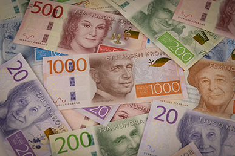

## Table of Contents

## What is the Swedish Krona?

The Swedish Krona is the official money used in Sweden. It is also called the Swedish Crown. People in Sweden use it to buy things like food, clothes, and other stuff they need. The symbol for the Swedish Krona is "kr" and sometimes you might see it written as "SEK" which stands for Swedish Krona.

The Swedish Krona started being used in 1873. Before that, Sweden used different kinds of money. The Riksbank, which is Sweden's central bank, is in charge of the Krona. They make sure there is enough money and that it stays valuable. The Krona is used every day by people in Sweden, and it's also used when Sweden trades with other countries.

## How is the Swedish Krona abbreviated?

The Swedish Krona is abbreviated in two main ways. The first way is "kr," which is used a lot in Sweden when people write prices or talk about money. For example, if something costs 100 Swedish Kronor, you might see it written as 100 kr.

The second way to abbreviate the Swedish Krona is "SEK." This is used more often when people are talking about money in an international setting, like in business or finance. So, if you are looking at exchange rates or trading money, you might see the Swedish Krona written as SEK.

## What is the history of the Swedish Krona?

The Swedish Krona started being used in 1873. Before that, Sweden used different kinds of money like the Riksdaler. The Krona was part of a new system called the Scandinavian Monetary Union, which also included Denmark and Norway. They all agreed to use the same kind of money, but each country had its own name for it. Sweden called it the Krona, Denmark called it the Krone, and Norway called it the Krone too. This union lasted until World War I, when the countries started using their own money again.

After World War II, Sweden decided to keep using the Krona. They made some changes to the money, like adding new coins and banknotes. The Riksbank, which is Sweden's central bank, is in charge of the Krona. They make sure there is enough money and that it stays valuable. Over the years, the Krona has changed a lot. New designs have been added to the coins and banknotes, and the money has been updated to keep up with new technology and security needs. Today, the Swedish Krona is still used every day by people in Sweden, and it's also used when Sweden trades with other countries.

## What are the denominations of Swedish Krona banknotes and coins?

Swedish Krona banknotes come in different amounts. You can find them in 20 kronor, 50 kronor, 100 kronor, 200 kronor, 500 kronor, and 1000 kronor. Each banknote has a different color and picture on it to help people tell them apart easily. The pictures on the banknotes show famous people from Sweden's history, like writers and scientists.

Swedish Krona coins also come in different amounts. There are 1 krona, 2 kronor, 5 kronor, and 10 kronor coins. The 1 krona and 2 kronor coins are made of a metal that looks like copper. The 5 kronor and 10 kronor coins are made of a metal that looks like silver. Each coin has a picture on one side and the value of the coin on the other side.

## How does the exchange rate of the Swedish Krona work?

The exchange rate of the Swedish Krona tells you how much one Krona is worth in another country's money. For example, if you want to know how many US dollars you can get for one Krona, you look at the exchange rate. This rate changes every day because it depends on things like how much people want to buy or sell Kronor, what's happening in the world economy, and what Sweden's central bank, the Riksbank, decides to do.

When you travel to Sweden or buy something from Sweden, you need to change your money into Kronor. If the exchange rate is good, you get more Kronor for your money. If it's bad, you get less. Banks and money exchange places use the exchange rate to figure out how much to give you. Sometimes, they add a little extra charge, so it's a good idea to check different places to get the best deal.

## What factors influence the value of the Swedish Krona?

The value of the Swedish Krona can change because of many things. One big thing is how much people want to buy or sell Kronor. If a lot of people want to buy Kronor, its value goes up. If a lot of people want to sell Kronor, its value goes down. Another thing that can change the Krona's value is what's happening in the world economy. If the world economy is doing well, the Krona might be worth more. If the world economy is not doing well, the Krona might be worth less.

Sweden's central bank, the Riksbank, also has a big say in the Krona's value. They can change interest rates, which is how much it costs to borrow money. If the Riksbank makes interest rates higher, more people might want to buy Kronor to get a better return on their money, and the Krona's value goes up. If they make interest rates lower, fewer people might want to buy Kronor, and the Krona's value goes down. Other things like how much Sweden trades with other countries, how much money the government spends, and even big news events can also make the Krona's value go up or down.

## How is the Swedish Krona managed by the Riksbank?

The Riksbank is Sweden's central bank, and it is in charge of the Swedish Krona. They make sure there is enough money in Sweden and that the Krona stays valuable. One way they do this is by changing interest rates. Interest rates are how much it costs to borrow money. If the Riksbank makes interest rates higher, more people might want to buy Kronor because they can get a better return on their money. This can make the Krona's value go up. If they make interest rates lower, fewer people might want to buy Kronor, and the Krona's value might go down.

The Riksbank also keeps an eye on how much money is being used in Sweden. They can add or take away money from the economy to help keep things stable. If there is too much money, prices might go up too fast, which is called inflation. The Riksbank tries to stop this from happening. They also watch what's happening in the world economy because it can affect the Krona's value. By doing all these things, the Riksbank helps make sure the Swedish Krona stays strong and useful for people in Sweden.

## What is the role of the Swedish Krona in the global economy?

The Swedish Krona plays a part in the global economy because Sweden trades with other countries. When Sweden buys things from other countries or sells things to them, they use the Krona. The value of the Krona can affect how much Sweden can buy or sell. If the Krona is strong, it means Sweden can buy more from other countries. If the Krona is weak, it means Sweden can sell more to other countries because their products are cheaper for people in other countries to buy.

The Krona also matters to people and businesses around the world who want to invest in Sweden. If the Krona is doing well, more people might want to put their money into Swedish companies or buy Swedish stocks. This can help Sweden's economy grow. The Riksbank, Sweden's central bank, works to keep the Krona stable so that it can be a reliable part of the global economy.

## How has the Swedish Krona performed against major currencies in the last decade?

Over the last decade, the Swedish Krona has had ups and downs against major currencies like the US Dollar and the Euro. At the start of the decade, the Krona was fairly strong against the US Dollar. But then, from around 2013 to 2015, the Krona got weaker. This meant that one US Dollar could buy more Kronor. After 2015, the Krona started to get a bit stronger again, but it has not been as strong as it was at the beginning of the decade. Against the Euro, the Krona has also seen changes. It was weaker in the early part of the decade, but it has been getting a bit stronger in recent years.

The value of the Krona has been affected by many things, like what the Riksbank does with interest rates, how the world economy is doing, and what's happening in Sweden. For example, when the Riksbank decided to keep interest rates very low or even negative, the Krona became weaker. This was because people did not want to keep their money in Kronor if they could not get a good return on it. Also, when there were big events in the world, like the financial crisis in Europe or changes in oil prices, these things could make the Krona weaker or stronger. Overall, the Krona's performance against major currencies has been a bit up and down, but it has been trying to find a stable place in the last few years.

## What are the economic policies affecting the Swedish Krona?

The Swedish Krona is affected by different economic policies that Sweden's government and the Riksbank use. One big policy is interest rates. The Riksbank can change these rates to make borrowing money more or less expensive. If they make rates higher, it can make the Krona stronger because people want to keep their money in Sweden to get a good return. If they make rates lower, the Krona might get weaker because people might take their money somewhere else to get a better return.

Another policy that affects the Krona is how much the government spends. If the government spends a lot of money, it can make the Krona weaker because there is more money in the economy, which can lead to higher prices, or inflation. The Riksbank tries to keep inflation under control by changing how much money is in the economy. They can do this by buying or selling government bonds, which is called monetary policy. All these policies work together to help keep the Krona stable and useful for people in Sweden and for trading with other countries.

## How do inflation and interest rates impact the Swedish Krona?

Inflation and interest rates are two big things that can change how much the Swedish Krona is worth. Inflation is when prices go up over time. If Sweden has a lot of inflation, it can make the Krona weaker. That's because if prices in Sweden are going up a lot, people from other countries might not want to buy things from Sweden as much. They might also not want to keep their money in Kronor because it's losing value. So, the Riksbank, which is Sweden's central bank, tries to keep inflation under control to help keep the Krona strong.

Interest rates are how much it costs to borrow money. The Riksbank can change these rates to affect the Krona. If they make interest rates higher, it can make the Krona stronger. That's because more people might want to keep their money in Sweden to get a good return on it. But if the Riksbank makes interest rates lower, it can make the Krona weaker. That's because people might take their money somewhere else to get a better return. So, the Riksbank has to be careful with interest rates to help keep the Krona stable.

## What are the future prospects for the Swedish Krona in the context of European economic integration?

The future of the Swedish Krona depends a lot on what happens with European economic integration. Sweden is part of the European Union, but it has not joined the Eurozone, which means it still uses the Krona instead of the Euro. Some people think Sweden might join the Eurozone one day, but right now, it seems like Sweden wants to keep using the Krona. If Sweden stays out of the Eurozone, the Krona will keep being affected by what Sweden's central bank, the Riksbank, does with interest rates and other policies. It will also be affected by how the world economy is doing and what's happening in Sweden.

If Sweden ever decides to join the Eurozone, the Krona would be replaced by the Euro. This would mean big changes for Sweden's economy. People would use Euros instead of Kronor, and Sweden's money would be managed by the European Central Bank instead of the Riksbank. This could make things more stable for Sweden because it would be part of a bigger group of countries. But it could also mean Sweden has less control over its own money. For now, it looks like Sweden will keep using the Krona, but things could change in the future depending on what happens with European economic integration.

## References & Further Reading

[1]: Bergstra, J., Bardenet, R., Bengio, Y., & Kégl, B. (2011). ["Algorithms for Hyper-Parameter Optimization."](https://papers.nips.cc/paper/4443-algorithms-for-hyper-parameter-optimization) Advances in Neural Information Processing Systems 24.

[2]: ["Advances in Financial Machine Learning"](https://www.amazon.com/Advances-Financial-Machine-Learning-Marcos/dp/1119482089) by Marcos Lopez de Prado

[3]: ["Evidence-Based Technical Analysis: Applying the Scientific Method and Statistical Inference to Trading Signals"](https://www.amazon.com/Evidence-Based-Technical-Analysis-Scientific-Statistical/dp/0470008741) by David Aronson

[4]: ["Machine Learning for Algorithmic Trading"](https://github.com/stefan-jansen/machine-learning-for-trading) by Stefan Jansen

[5]: ["Quantitative Trading: How to Build Your Own Algorithmic Trading Business"](https://www.amazon.com/Quantitative-Trading-Build-Algorithmic-Business/dp/1119800064) by Ernest P. Chan