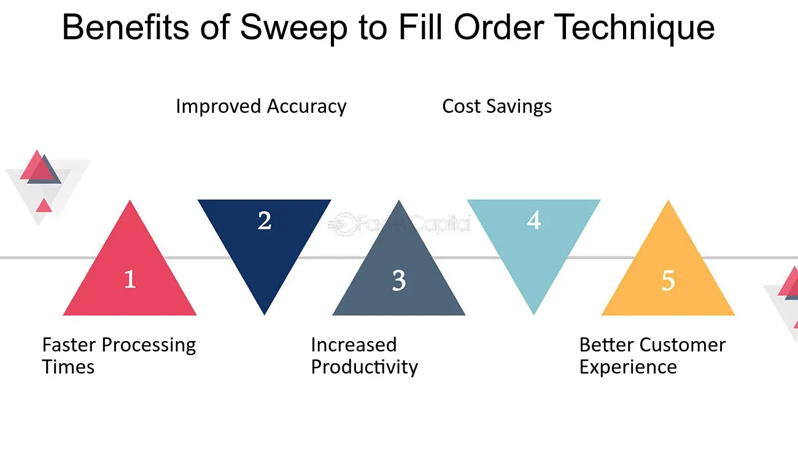

## Table of Contents

## What is a Sweep-To-Fill Order?

A Sweep-To-Fill Order is a type of order used in trading. It helps traders buy or sell a large number of shares quickly. When a trader places a Sweep-To-Fill Order, the order is sent to multiple exchanges at the same time. This is done to find the best price available across these exchanges. The goal is to fill the entire order as fast as possible.

This type of order is useful for traders who need to execute large orders without causing big price changes. By spreading the order across different exchanges, it reduces the impact on the price of the stock. This can help traders get a better average price for their trades. Sweep-To-Fill Orders are often used by institutional investors who trade large volumes.

## How does a Sweep-To-Fill Order work?

When a trader wants to buy or sell a lot of shares quickly, they can use a Sweep-To-Fill Order. This order is sent to many different exchanges at the same time. The reason for this is to find the best prices available across all these places. By doing this, the trader can fill their entire order faster than if they only used one exchange.

Using multiple exchanges helps keep the price of the stock from changing too much. If a trader tried to buy or sell a large number of shares on just one exchange, it could make the price go up or down a lot. But with a Sweep-To-Fill Order, the order is spread out, which can help the trader get a better average price. This is why big investors, like those from institutions, often use Sweep-To-Fill Orders when they need to trade large volumes.

## What are the benefits of using a Sweep-To-Fill Order?

Using a Sweep-To-Fill Order has many benefits. One big benefit is that it helps traders buy or sell a lot of shares quickly. When a trader sends this order to many exchanges at once, it can find the best prices available. This means the trader can fill their entire order faster than if they used just one exchange. This is really helpful for people who need to trade large amounts of shares in a short time.

Another benefit is that it can help keep the price of the stock from changing too much. If a trader tried to buy or sell a lot of shares on just one exchange, it could make the price go up or down a lot. But with a Sweep-To-Fill Order, the order is spread out across different exchanges. This can help the trader get a better average price for their shares. This is why big investors, like those from institutions, often use Sweep-To-Fill Orders when they need to trade large volumes.

## In which markets can Sweep-To-Fill Orders be used?

Sweep-To-Fill Orders can be used in many different markets where stocks and other securities are traded. These markets include stock exchanges like the New York Stock Exchange (NYSE) and the NASDAQ. They can also be used in other types of markets where electronic trading happens, like futures and options markets.

These orders are especially useful in markets that have a lot of trading activity and many different exchanges. By using Sweep-To-Fill Orders, traders can take advantage of the best prices available across all these places. This helps them buy or sell large amounts of shares quickly and at a good average price.

## What are the potential risks associated with Sweep-To-Fill Orders?

One risk of using Sweep-To-Fill Orders is that they might show other traders what you are planning to do. When you send an order to many exchanges at once, it can be easy for others to see that you want to buy or sell a lot of shares. This can make the price of the stock go up or down before your order is fully filled. This is called "market impact," and it can make it harder for you to get the price you want.

Another risk is that the technology used for Sweep-To-Fill Orders might not work perfectly. If there is a problem with the system, your order might not go to all the exchanges at the same time. This can slow down how fast your order is filled and might make you miss out on the best prices. It's important to make sure the technology is working well before you use a Sweep-To-Fill Order.

## How does a Sweep-To-Fill Order differ from other types of orders?

A Sweep-To-Fill Order is different from other types of orders because it sends the order to many exchanges at the same time. This helps the trader find the best prices available across all these places. Other types of orders, like a Limit Order, only go to one exchange. With a Limit Order, the trader sets a specific price they want to buy or sell at, and the order will only be filled if that price is met. A Sweep-To-Fill Order, on the other hand, is more about speed and getting the best average price quickly.

Another way a Sweep-To-Fill Order differs is that it is designed to handle large volumes of shares. This makes it useful for big investors who need to trade a lot of shares without causing big price changes. For example, a Market Order will buy or sell at the current market price, but it might move the price a lot if the order is large. A Sweep-To-Fill Order spreads the order across different exchanges, which can help keep the price stable and get a better average price for the trader.

## What are the key considerations before placing a Sweep-To-Fill Order?

Before placing a Sweep-To-Fill Order, it's important to think about how it might affect the price of the stock. When you send an order to many exchanges at once, other traders might see what you're doing. This can make the price go up or down before your order is fully filled. This is called market impact, and it can make it harder to get the price you want. So, you need to think about whether the stock you're trading is likely to have a big price change because of your order.

Another thing to consider is the technology you're using. Sweep-To-Fill Orders rely on technology to send the order to many places at the same time. If there's a problem with the system, your order might not go out correctly. This can slow down how fast your order is filled and might make you miss out on the best prices. It's a good idea to make sure the technology is working well before you use a Sweep-To-Fill Order.

## Can Sweep-To-Fill Orders be used for both buying and selling?

Yes, Sweep-To-Fill Orders can be used for both buying and selling. When you want to buy a lot of shares quickly, you can use a Sweep-To-Fill Order to send your order to many exchanges at the same time. This helps you find the best prices available and fill your order faster than if you used just one exchange. It's useful for big investors who need to buy large amounts of shares without causing the price to go up too much.

The same goes for selling. If you need to sell a lot of shares quickly, a Sweep-To-Fill Order can help you do that. By sending your order to many exchanges, you can find the best prices to sell your shares and fill your order faster. This can help you get a better average price for your shares and avoid big price drops that might happen if you sold all your shares on just one exchange.

## How do regulatory requirements affect the use of Sweep-To-Fill Orders?

Regulatory requirements can affect how traders use Sweep-To-Fill Orders. Different countries and markets have rules about how orders can be placed and filled. For example, some places might have rules about how much information traders need to share when they place a big order. This can make it harder to use Sweep-To-Fill Orders because the trader might have to be more careful about how they send their orders to different exchanges.

Also, regulators might watch for things like market manipulation. If a trader uses a Sweep-To-Fill Order in a way that tries to trick the market, they could get in trouble. So, traders need to make sure they follow all the rules when they use these orders. This means understanding the regulations in the markets where they trade and making sure their orders are placed in a way that follows those rules.

## What advanced strategies can be implemented using Sweep-To-Fill Orders?

Sweep-To-Fill Orders can be part of advanced trading strategies like "iceberg orders." In this strategy, a trader breaks a big order into smaller pieces. They use Sweep-To-Fill Orders to send these smaller pieces to different exchanges. This helps hide how big their total order is. By doing this, they can buy or sell a lot of shares without making the price move too much. It's like putting just the tip of an iceberg above water, so no one can see the whole thing.

Another advanced strategy is called "smart order routing." This is when a trader uses Sweep-To-Fill Orders to take advantage of the best prices across many exchanges. The trader's computer system looks at all the prices and decides where to send the order to get the best deal. This can help the trader get a better average price for their shares. It's like shopping at many stores to find the best price for what you want to buy.

## How can technology and trading platforms support the execution of Sweep-To-Fill Orders?

Technology and trading platforms play a big role in making Sweep-To-Fill Orders work well. These orders need to be sent to many exchanges at the same time, and that's where technology comes in. Trading platforms have special systems that can do this quickly and correctly. They use fast computers and good internet connections to make sure the orders go out to all the right places without any delays. This helps traders get the best prices and fill their orders fast.

Also, trading platforms often have tools that help traders manage their Sweep-To-Fill Orders. These tools can show traders the best prices available on different exchanges and help them decide where to send their orders. Some platforms even have smart order routing, which means the computer decides the best way to send the order to get the best price. This makes it easier for traders to use Sweep-To-Fill Orders and get good results.

## What case studies or real-world examples illustrate the effective use of Sweep-To-Fill Orders?

One real-world example of using Sweep-To-Fill Orders effectively is seen in the trading activities of large institutional investors like pension funds. These investors often need to buy or sell large amounts of shares without causing big price changes. For instance, a pension fund might want to buy a million shares of a company. By using a Sweep-To-Fill Order, the fund can send this order to multiple exchanges at the same time. This helps them find the best prices available and fill their order quickly. As a result, they can buy the shares at a better average price and avoid causing a big jump in the stock's price.

Another example comes from high-frequency trading firms. These firms use advanced technology to trade stocks very quickly. They might use Sweep-To-Fill Orders to take advantage of small price differences between different exchanges. For example, a high-frequency trading firm might see that a stock is slightly cheaper on one exchange than on another. By using a Sweep-To-Fill Order, they can buy the stock at the lower price and sell it at the higher price, making a small profit. This strategy works well because Sweep-To-Fill Orders help them fill their orders fast and at the best possible prices.

## References & Further Reading

[1]: Bergstra, J., Bardenet, R., Bengio, Y., & Kégl, B. (2011). ["Algorithms for Hyper-Parameter Optimization."](https://dl.acm.org/doi/10.5555/2986459.2986743) Advances in Neural Information Processing Systems 24.

[2]: ["Advances in Financial Machine Learning"](https://www.amazon.com/Advances-Financial-Machine-Learning-Marcos/dp/1119482089) by Marcos Lopez de Prado

[3]: ["Evidence-Based Technical Analysis: Applying the Scientific Method and Statistical Inference to Trading Signals"](https://www.amazon.com/Evidence-Based-Technical-Analysis-Scientific-Statistical/dp/0470008741) by David Aronson

[4]: ["Machine Learning for Algorithmic Trading"](https://github.com/stefan-jansen/machine-learning-for-trading) by Stefan Jansen

[5]: ["Quantitative Trading: How to Build Your Own Algorithmic Trading Business"](https://www.amazon.com/Quantitative-Trading-Build-Algorithmic-Business/dp/1119800064) by Ernest P. Chan