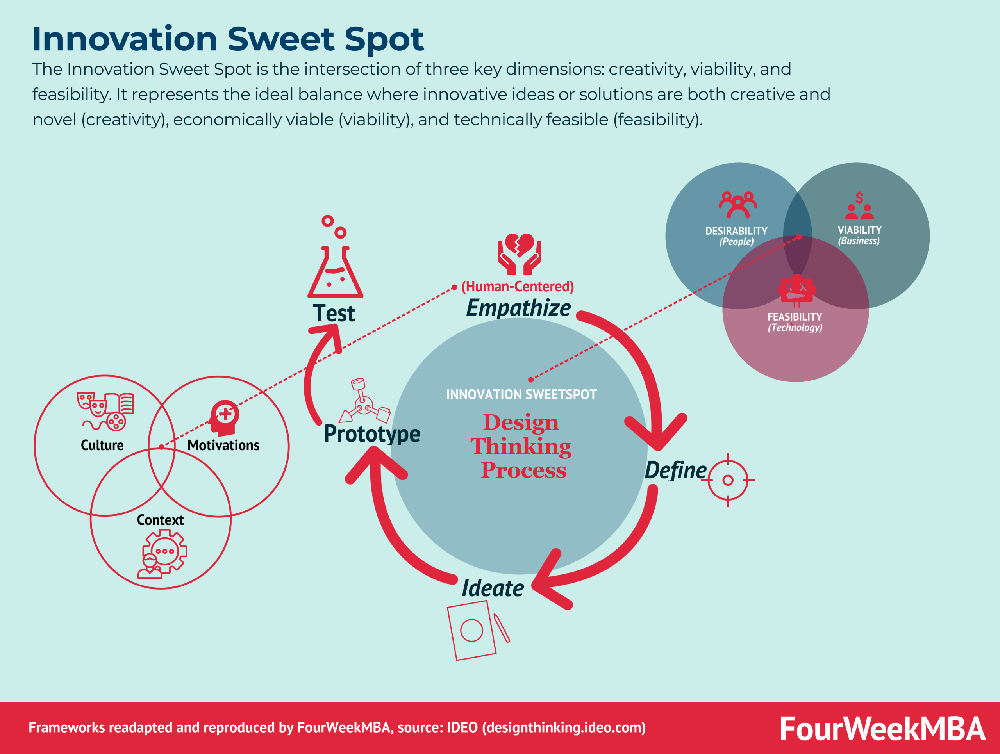

## Table of Contents

## What is the concept of a 'Sweet Spot' in economic terms?

In economic terms, the 'Sweet Spot' refers to a situation where conditions are just right for businesses, consumers, or the economy as a whole. It's like finding the perfect balance where everything works smoothly. For a business, this might mean they are making good profits without facing too much competition. For consumers, it could mean they have enough money to buy what they need and want, without prices being too high.

The concept can also apply to the overall economy. When an economy is in its sweet spot, it is growing steadily, unemployment is low, and inflation is under control. This balance is hard to maintain because many factors can change, like government policies, global events, or shifts in consumer behavior. Economists and policymakers often aim to find and keep this sweet spot, but it can be tricky because what works today might not work tomorrow.

## How does the 'Sweet Spot' relate to supply and demand?

The 'Sweet Spot' in economics is closely tied to the balance of supply and demand. When supply and demand are in equilibrium, it means that the amount of a product that people want to buy is exactly the same as the amount that businesses are willing to sell. This balance creates a sweet spot where prices are stable, and both buyers and sellers are happy. If the price is too high, demand might drop, and if it's too low, supply might not meet the demand, causing shortages.

Finding this sweet spot can be tricky because many things can change the balance. For example, if a new technology makes it cheaper to produce a product, the supply might increase, which could lower prices and increase demand. On the other hand, if people suddenly want more of a product because it becomes trendy, demand might outstrip supply, pushing prices up. Economists and businesses always try to find this sweet spot because it's where they can make the most profit while keeping customers satisfied.

## Can you explain the functionality of the 'Sweet Spot' in a business context?

In a business context, the 'Sweet Spot' is where a company finds the perfect balance between what it offers and what customers want. This means the business is selling products or services at a price that customers are happy to pay, while also making a good profit. For example, if a company sells coffee, the sweet spot would be where they charge enough to cover their costs and make money, but not so much that customers go to another coffee shop. Finding this balance helps the business grow and stay competitive.

The sweet spot can change over time because of things like new competitors, changes in what customers want, or shifts in the economy. A business needs to keep an eye on these changes and adjust its prices, products, or services to stay in the sweet spot. If they do this well, they can keep their customers happy and their profits healthy. It's like walking a tightrope; it takes skill and attention to stay balanced and successful.

## What are the key factors that contribute to finding a 'Sweet Spot' in the market?

Finding a 'Sweet Spot' in the market means finding the right balance where a business can make good profits and customers are happy. This balance depends on a few important things. One key factor is understanding what customers want and need. If a business knows its customers well, it can offer products or services that match their desires at a price they are willing to pay. Another important factor is keeping an eye on the competition. If other businesses are selling similar things, a company needs to find a way to stand out, maybe by offering better quality, lower prices, or unique features.

Another factor is the cost of making and selling the product. If a business can keep its costs low, it can charge less and still make a good profit, which can attract more customers. The overall economy also plays a big role. When the economy is doing well, people have more money to spend, which can make it easier to find the sweet spot. But if the economy is struggling, people might not want to spend as much, and businesses may need to adjust their prices or offerings to keep customers coming back. By paying attention to these factors and being ready to change when needed, a business can find and stay in the sweet spot.

## How does the 'Sweet Spot' influence pricing strategies?

The 'Sweet Spot' helps businesses figure out the best price for their products or services. It's all about finding the right balance where the price is not too high, so customers will buy, and not too low, so the business can still make money. If a business finds this sweet spot, they can set a price that keeps customers happy and keeps the business profitable. For example, if a store sells t-shirts, the sweet spot might be a price that people are willing to pay but is also enough to cover the cost of making and selling the t-shirts, plus a little extra for profit.

The sweet spot can change because of things like new competitors or shifts in what customers want. If a new store starts selling cheaper t-shirts, the first store might need to lower its prices to stay in the sweet spot. Or if people suddenly want more eco-friendly products, the store might need to adjust its prices to match the new demand. By keeping an eye on these changes, a business can tweak its pricing strategy to stay in the sweet spot. This helps them keep making money and keeping customers happy, even when the market changes.

## What role does consumer behavior play in defining the 'Sweet Spot'?

Consumer behavior is super important in figuring out the 'Sweet Spot' in the market. It's all about understanding what people like, what they need, and how much they're willing to pay for things. If a business knows what customers want, they can set prices that people are happy to pay. For example, if a lot of people want to buy a new type of phone, the company can set a price that matches what people are willing to spend, and still make a good profit.

But consumer behavior can change, which means the sweet spot can move too. If people suddenly start caring more about the environment, they might be willing to pay more for eco-friendly products. Or if a new trend comes along, people might want different things than before. Businesses need to keep an eye on these changes and adjust their prices and products to stay in the sweet spot. By understanding and responding to consumer behavior, businesses can keep their customers happy and keep making money.

## How can businesses leverage the 'Sweet Spot' to maximize profits?

Businesses can use the 'Sweet Spot' to make more money by finding the perfect price for their products or services. This means setting a price that customers are happy to pay and that also lets the business make a good profit. If a business knows what people want and how much they're willing to spend, they can find this sweet spot. For example, if a bakery finds out that people love their chocolate cake and are willing to pay $5 a slice, they can set that price and sell a lot of cake, making good money.

But the sweet spot can change, so businesses need to keep watching what customers do and what's happening in the market. If a new bakery opens nearby and sells cheaper cake, the first bakery might need to lower its prices to stay in the sweet spot. Or if people start wanting healthier options, the bakery might need to offer new types of cakes at different prices. By always paying attention to what customers want and adjusting prices and products, businesses can stay in the sweet spot and keep making the most profit possible.

## What are the challenges in maintaining the 'Sweet Spot' over time?

Keeping the 'Sweet Spot' over time can be tough for businesses. One big challenge is that what customers want can change a lot. People might start liking different things, or new trends can come up. If a business doesn't notice these changes and adjust what they offer or how much they charge, they might lose the sweet spot. Also, new competitors can make it hard to stay in the sweet spot. If another company starts selling the same thing but cheaper or better, customers might go to them instead.

Another challenge is the economy. When the economy is good, people have more money to spend, and it's easier to find the sweet spot. But if the economy gets bad, people might not want to spend as much, and businesses have to lower their prices to keep customers. This can make it hard to keep making a good profit. Plus, things like new laws or technology can change how much it costs to make and sell things, which can move the sweet spot. Businesses need to be ready to change and adapt to keep finding and staying in the sweet spot.

## How does the 'Sweet Spot' affect global economic trends?

The 'Sweet Spot' can have a big impact on global economic trends. When a lot of countries find their sweet spots at the same time, it can make the whole world's economy grow. This happens because businesses are making good profits and people are buying more things. When this happens, it can lead to more jobs and more money being spent, which helps the global economy. But if something changes, like a big event or a new law, it can push countries out of their sweet spots, and this can slow down the whole world's economy.

Sometimes, finding the sweet spot in one country can affect other countries too. For example, if a big country like the United States finds its sweet spot and starts buying more things from other countries, it can help those countries' economies grow. But if the U.S. loses its sweet spot and people start buying less, it can hurt other countries too. So, the sweet spot in one place can have a ripple effect around the world, making it important for countries to work together to keep the global economy in a good place.

## Can you discuss case studies where the 'Sweet Spot' significantly impacted a company's global strategy?

One good example of the 'Sweet Spot' affecting a company's global strategy is Apple. Apple found its sweet spot with the iPhone, which was priced just right for people to want to buy it but also made a lot of money for the company. They kept an eye on what people wanted, like better cameras and bigger screens, and kept updating the iPhone to stay in the sweet spot. This helped Apple grow into a huge global company. But when they tried to sell the iPhone in China, they had to adjust their prices and features to fit what Chinese customers wanted, showing how the sweet spot can be different in different places.

Another case is Toyota with their Prius. Toyota found a sweet spot with the Prius because it was a car that saved gas and was good for the environment, which people wanted. They priced it so that it was not too expensive but still made a profit. This helped Toyota sell a lot of Priuses all over the world. But when gas prices went down, people didn't want to buy as many hybrid cars, so Toyota had to change their strategy to stay in the sweet spot. They started making more electric cars and adjusted their prices to keep up with what people wanted, showing how staying in the sweet spot means always being ready to change.

## What are the advanced analytical tools used to identify the 'Sweet Spot' in complex markets?

To find the 'Sweet Spot' in complex markets, businesses use advanced tools like data analytics and machine learning. These tools help companies look at a lot of information about what people buy, how much they spend, and what they like. With data analytics, businesses can see patterns and trends that they might miss otherwise. For example, they can find out that people in one country like a product more than people in another country, which can help them set the right price for each place. Machine learning can make these tools even better by learning from the data and getting smarter over time, so businesses can keep finding the sweet spot even as things change.

Another tool that businesses use is predictive analytics. This tool helps companies guess what people will want in the future by looking at what they did in the past. If a business can predict that more people will want a certain product next year, they can start making more of it now and set the right price to stay in the sweet spot. These advanced tools help businesses understand complex markets better and make smart choices about what to sell and how much to charge, so they can keep making money and keeping customers happy.

## How might future economic shifts alter the concept and application of the 'Sweet Spot'?

In the future, the 'Sweet Spot' might change because of big shifts in the economy. For example, if new technology makes it cheaper to make things, businesses might need to lower their prices to stay in the sweet spot. Or if people start caring more about the environment, they might be willing to pay more for green products, which would move the sweet spot up. Also, if more people start working from home, they might buy different things than before, like more home office stuff and less fancy clothes. Businesses will need to watch these changes and adjust what they sell and how much they charge to stay in the sweet spot.

Another way the 'Sweet Spot' could change is because of global events. If there's a big event like a war or a new disease, it can make the economy go up and down fast. This can make it hard for businesses to find and keep the sweet spot. For example, if a disease makes people stay home, they might buy more things online, so businesses that sell online might find a new sweet spot. But businesses that sell in stores might need to change what they do to find their sweet spot again. Keeping up with these big changes will be important for businesses to stay successful and keep their customers happy.

## What Defines the Sweet Spot in Economics?

The 'sweet spot' in economics describes a precise equilibrium where economic policies or indicators achieve maximum efficiency, balancing costs and benefits effectively. Within monetary policy, this concept often translates to setting interest rates at levels that control inflation without impeding economic growth. Achieving the correct interest rate can stabilize prices while encouraging investments and consumption, fostering a conducive environment for sustainable economic development. 

For example, if the inflation rate ($\pi$) is above target, central banks might increase the nominal interest rate ($i$), using the Taylor Rule formula:

$$
i = r^* + \pi + 0.5(\pi - \pi^*) + 0.5(y - y^*)
$$

Where:
- $r^*$ is the real interest rate consistent with full employment.
- $\pi^*$ is the target inflation rate.
- $y$ and $y^*$ are the logarithms of real GDP and potential GDP, respectively.

Balancing these components can position an economy at its sweet spot, reflecting optimal monetary policy execution.

Similarly, labor markets can achieve a sweet spot with employment levels fueling economic growth without sparking excessive inflation. When the labor market is robust, consumer spending typically increases, bolstering economic expansion. However, if employment levels surpass this optimal point, wage pressures might lead to inflation, disrupting the balance. Therefore, identifying and maintaining this equilibrium in employment necessitates vigilant monitoring of various indicators such as the unemployment rate, wage growth, and productivity levels.

This equilibrium, however, is intricate and often fully recognizable only in hindsight. Economic indicators are interdependent, and the optimal conditions might shift due to external factors like technological advancements or geopolitical events. Economists and policymakers continuously analyze data, employing sophisticated models to predict outcomes and fine-tune strategies, aiming for this elusive sweet spot in their economic frameworks.

## References & Further Reading

[1]: ["Advances in Financial Machine Learning"](https://www.amazon.com/Advances-Financial-Machine-Learning-Marcos/dp/1119482089) by Marcos Lopez de Prado

[2]: ["Evidence-Based Technical Analysis: Applying the Scientific Method and Statistical Inference to Trading Signals"](https://books.google.com/books/about/Evidence_Based_Technical_Analysis.html?id=MeoJAQAAMAAJ) by David Aronson

[3]: ["Machine Learning for Algorithmic Trading"](https://github.com/stefan-jansen/machine-learning-for-trading) by Stefan Jansen

[4]: ["Quantitative Trading: How to Build Your Own Algorithmic Trading Business"](https://www.amazon.com/Quantitative-Trading-Build-Algorithmic-Business/dp/1119800064) by Ernest P. Chan

[5]: Holzmann, R., & Jorgensen, S. (2000). ["Social Risk Management: A New Conceptual Framework for Social Protection and Beyond."](https://link.springer.com/article/10.1023/A:1011247814590) The World Bank.