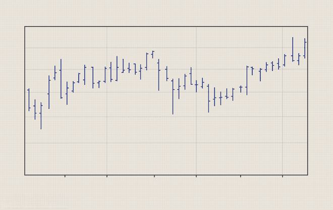

In the world of financial markets, swing trading has emerged as a widely adopted strategy among traders, offering a balanced approach between short-term day trading and longer-term investing. Swing mechanics, which entail the processes and techniques used to execute these trades effectively, are crucial for traders aiming to capitalize on price movements within a timeframe of several days to weeks. The objective in swing trading is not only to enter at the right time in these price cycles but also to exit with a profit before the momentum reverses.

Algorithmic trading, or algo trading, introduces computer algorithms to automate various trading processes, streamlining execution and minimizing the errors associated with manual trading. These algorithms are engineered to follow a set of predetermined instructions, which can range from deciding the timing of trades to executing orders when certain conditions are met. In the context of swing trading, algorithmic strategies can optimize the identification of entry and exit points by analyzing market data and executing trades with precision and speed that are beyond human capability. This integration has revolutionized trading strategies, allowing traders to respond swiftly to market dynamics—an essential aspect of swing trading.



This article addresses frequently asked questions regarding the mechanics of swing trading and the integration of algorithmic trading strategies. The focus will encompass the essential components of swing mechanics, such as trend analysis, momentum indicators, and resistance/support levels, and how these can be automated to enhance trading performance. Through examining these key elements, we aim to provide insights into employing algorithms in swing trading to improve decision-making and execution efficiency.

## Table of Contents

## What is Swing Trading?

Swing trading is a strategic approach in financial markets aimed at capturing short to medium-term gains in stocks or other financial instruments. Unlike day trading, where positions are rarely held overnight, swing trading involves holding trades over several days to weeks. This strategy seeks to exploit market "swings," which are upward or downward movement trends that occur over these periods[^1^].

Traders who engage in swing trading employ various technical indicators to pinpoint potential price movements. Among the widely used tools are moving averages, relative strength index (RSI), and moving average convergence divergence (MACD). These indicators help in discerning the direction and strength of a market trend, allowing traders to make informed decisions about when to enter or exit a position[^2^].

The primary objective of swing trading is to capture a segment of an anticipated price change. Traders attempt to benefit from expected price reversals or significant price moves within the market cycle. Swing trading doesn't require monitoring the market constantly throughout the day; instead, it emphasizes analyzing daily or weekly charts to make strategic decisions.

A crucial aspect of swing trading is its holding period, which contrasts with the faster-paced [day trading](/wiki/day-trading-spy). By maintaining positions overnight, swing traders can leverage potentially higher profit margins compared to day trading, despite the additional risk exposure due to market fluctuations during non-trading hours[^3^].

[^1^]: Investopedia. (n.d.). Swing Trading. Retrieved from https://www.investopedia.com/terms/s/swingtrading.asp
[^2^]: Murphy, J. J. (1999). Technical Analysis of the Financial Markets. New York Institute of Finance.
[^3^]: CMT Association. (n.d.). Guide to Technical Analysis. Retrieved from https://cmtassociation.org/resources/technical-analysis/

## Understanding Swing Mechanics

Swing mechanics entail the essential processes and techniques required for effectively executing swing trades, focusing on capturing short to medium-term market movements. A comprehensive grasp of these mechanics is crucial for swing traders aiming to maximize profit potential while mitigating risks.

Key components of swing mechanics include trend analysis, chart patterns, [momentum](/wiki/momentum) indicators, and resistance/support levels. Trend analysis is fundamental, as it helps traders identify the overall direction of market prices. Using tools like moving averages can assist in determining whether a market is trending upward, downward, or moving sideways.

Chart patterns, such as head and shoulders, double tops, and flags, provide visual cues about potential future price movements. Recognizing these patterns allows traders to anticipate possible [breakout](/wiki/breakout-trading) or reversal scenarios. For example, a head and shoulders pattern may signal an impending market reversal, prompting traders to adjust their positions accordingly.

Momentum indicators, including the Relative Strength Index (RSI) and the Moving Average Convergence Divergence (MACD), are instrumental in evaluating the speed and magnitude of price changes. These indicators help traders ascertain whether a security is overbought or oversold, aiding in decision-making about entry and [exit](/wiki/exit-strategy) points. For instance, a high RSI may suggest that a security is overbought, potentially indicating a forthcoming price correction.

Resistance and support levels are pivotal in swing trading. These horizontal price levels act as psychological barriers where the price tends to stop and reverse. Traders often set buy orders near support levels and sell orders near resistance levels. The ability to accurately identify these levels enhances a trader's ability to predict potential price bounces or breakdowns.

Understanding market cycles and economic indicators is also crucial for forecasting future swings. Economic indicators such as GDP growth rates, employment figures, and consumer confidence indices can influence market sentiment and price [volatility](/wiki/volatility-trading-strategies). Swing traders who stay informed about these indicators are better equipped to anticipate market shifts and adjust their strategies accordingly.

Proficiency in reading charts and discerning key market signals is essential for making timely trading decisions. This skill enables traders to capitalize on emerging opportunities and safeguard against sudden market adversities. A disciplined approach, supplemented with continuous learning and adaptation to market dynamics, can significantly enhance a swing trader's success.

## How Does Algorithmic Trading Integrate with Swing Trading?

Algorithmic trading, known for employing computer algorithms to automate the execution of trades, stands as a critical tool in enhancing the efficiency and effectiveness of swing trading strategies. These algorithms are meticulously crafted with pre-programmed instructions that govern the precise entry and exit points of trades based on predetermined criteria. This automation not only streamlines the trading process but also significantly reduces the potential for human error.

In the context of swing trading, algorithms are strategically utilized to capitalize on short- to medium-term market movements. The core benefit of integrating [algorithmic trading](/wiki/algorithmic-trading) with swing trading lies in the capability to rapidly identify and react to potential price 'swings', which are critical for capturing profits.

### Automation of Entry and Exit Points

Swing trading often relies heavily on technical analysis to identify lucrative trading opportunities. By programming algorithms to recognize specific chart patterns, momentum indicators, and support/resistance levels, traders can automate their swing trading strategies. For instance, an algorithm could be designed to execute a buy order when a particular stock's price crosses above a critical moving average and sell when it subsequently dips below it.

### Pattern Recognition and Conditional Triggers

A common approach in algorithmic swing trading is leveraging historical data to craft strategies that mimic past successful trades. By identifying recurring patterns or conditions in past data, algorithms can be programmed to trigger trades under similar contemporary market scenarios. This historical insight facilitates a more systematic approach to trading, reducing reliance on intuition or emotional decision-making.

### Speed and Efficiency

One of the distinct advantages of algorithmic trading in swing trading is the speed at which trades can be executed. The swift processing of market data allows algorithms to respond almost instantaneously to favorable conditions. This heightened reaction time is particularly advantageous in swing trading, where timely executions are critical for harnessing short-term price fluctuations effectively.

### Example in Python

To illustrate, consider the use of a basic Python script leveraging libraries such as `pandas` and `numpy` for data manipulation, along with `TA-Lib` for technical analysis:

```python
import pandas as pd
import talib

# Sample data
data = pd.read_csv('market_data.csv')
close = data['Close'].values

# Calculate a Simple Moving Average (SMA)
sma_short = talib.SMA(close, timeperiod=10)
sma_long = talib.SMA(close, timeperiod=50)

# Generate buy/sell signals
buy_signals = (sma_short > sma_long) & (sma_short.shift(1) <= sma_long.shift(1))
sell_signals = (sma_short < sma_long) & (sma_short.shift(1) >= sma_long.shift(1))

# Execute trades
for i in range(len(data)):
    if buy_signals[i]:
        print(f"Buy signal on {data['Date'][i]}")
    elif sell_signals[i]:
        print(f"Sell signal on {data['Date'][i]}")
```

This script demonstrates a simple algorithm that trades based on the crossover of short-term and long-term moving averages, a common technical indicator used in swing trading. 

By integrating algorithmic trading into swing trading, traders can enhance their strategies' precision and adaptability, allowing them to efficiently manage and exploit market volatilities.

## Frequently Asked Questions

1. **What are the risks associated with swing trading using algorithms?**

Swing trading using algorithms carries several risks. One significant risk is the possibility of technical failures. Since algorithms rely on computer systems for execution, any malfunction or disruption in the system can result in missed trades or executed trades at undesirable prices. Additionally, over-optimization of algorithms—often referred to as curve fitting—can lead to strategies that perform well in [backtesting](/wiki/backtesting) but fail in real market conditions. There's also the risk of market anomalies; unexpected events can cause rapid market changes, which algorithms may not be equipped to handle if they are only designed for historical patterns.

2. **How does one determine the best indicators for swing trading?**

Determining the best indicators for swing trading involves a combination of historical analysis and personal trading goals. Common indicators used in swing trading include moving averages, the Relative Strength Index (RSI), and the Moving Average Convergence Divergence (MACD). The choice of indicators often depends on the trader's strategy—whether they focus more on momentum indicators or prefer trend-following indicators. Backtesting different indicators and combinations on historical data can help traders select those that are most effective for their specific trading strategy.

3. **Can beginners use algorithmic strategies for swing trading?**

Beginners can certainly use algorithmic strategies for swing trading, but it is advisable to start with simpler strategies and gradually increase complexity as they gain experience. Beginners should focus on understanding the fundamentals of how algorithms work and the principles of swing trading before automating their strategies. Utilizing platforms that offer paper trading or demo accounts can be beneficial, allowing beginners to test their algorithms in a risk-free environment. Furthermore, educational resources and community forums can provide valuable insights into effective algorithmic trading practices.

4. **What are the limitations of algorithmic trading in swing trading?**

Algorithmic trading in swing trading comes with limitations such as dependence on historical data for strategy formation, which may not accurately predict future market conditions. Algorithms may also struggle in volatile or thinly traded markets, where price fluctuations are rapid and [liquidity](/wiki/liquidity-risk-premium) is limited. Additionally, algorithms require continuous monitoring and updates to adapt to changing market conditions, which can be resource-intensive. Furthermore, regulatory and technical constraints, such as trading platform limitations, can restrict the full potential of algorithmic trading in swing contexts.

5. **How do market conditions affect swing trading strategies?**

Market conditions play a critical role in influencing swing trading strategies. In bullish market conditions, swing trading strategies might focus on capturing upward movements, while in bearish markets, strategies may shift towards taking advantage of downward swings or focusing on defensive stock positions. Volatile market conditions can necessitate tighter stop losses and alertness to sudden trend reversals. Economic indicators and news events also impact market behavior, requiring traders to adjust their strategies accordingly to optimize returns and manage risk.

## Best Practices for Successful Swing Trading

Utilize a combination of technical analysis tools to enhance decision-making. Technical analysis involves examining price movements and trading volumes to predict future market behavior. Tools such as moving averages, Relative Strength Index (RSI), and Bollinger Bands can provide insights into potential price movements. For instance, moving averages can help identify trends by smoothing out price data, whereas RSI can indicate overbought or oversold conditions, signaling potential reversal points.

Staying informed about ongoing market trends and economic news is vital for any swing trader. Economic indicators such as [interest rate](/wiki/interest-rate-trading-strategies) announcements, GDP reports, and employment data can have a significant impact on financial markets. Tools like economic calendars can help traders anticipate and react to market-moving events. Understanding the broader market context can better prepare traders to adjust their strategies in response to unexpected news or developments.

Establish strict risk management rules to protect capital and optimize returns. Effective risk management involves setting stop-loss orders to limit potential losses and defining position sizes that reflect personal risk tolerance. For instance, a common practice is to risk no more than 1-2% of an account's total capital on a single trade. Traders can use formulas like the Kelly Criterion to determine optimal bet sizes based on historical performance [statistics](/wiki/bayesian-statistics). By managing risks effectively, traders increase their chances of long-term success.

Regularly backtesting and optimizing trading algorithms ensures they remain effective in changing market conditions. Backtesting involves applying trading strategies to historical data to evaluate their performance. Python libraries like `[backtrader](/wiki/backtrader)` or `Zipline` can facilitate this process. Here's a simple Python example using `backtrader` to test a basic moving average crossover strategy:

```python
import backtrader as bt

class MA_CrossOver(bt.SignalStrategy):
    def __init__(self):
        self.signal_add(bt.SIGNAL_LONG, bt.indicators.CrossOver(self.data.close, bt.indicators.SimpleMovingAverage(self.data, period=20)))

cerebro = bt.Cerebro()
cerebro.addstrategy(MA_CrossOver)
data = bt.feeds.YahooFinanceData(dataname='AAPL', fromdate=datetime(2020, 1, 1), todate=datetime(2021, 1, 1))
cerebro.adddata(data)
cerebro.run()
```

The above script sets up a basic moving average crossover strategy on Apple's stock data. By continually refining algorithms through backtesting, traders can adapt to new patterns and enhance their strategies' performance. Reoptimization is crucial as market dynamics shift, ensuring strategies remain robust over time.

## Conclusion

Swing trading, when effectively supported by algorithmic strategies, remains a potent trading methodology with the potential to yield substantial profits. The core of successful swing trading lies in a comprehensive understanding of swing mechanics. This involves utilizing technical analysis tools, such as trend lines, chart patterns, and momentum indicators, to predict market movements and optimize entry and exit points. 

Algorithmic trading enhances these processes by automating trades based on predefined criteria, thus improving efficiency and reducing human error. The ability to quickly react to market changes through automated algorithms is crucial, particularly in capturing profitable price swings. These algorithms can be programmed to identify conditions that replicate past successful trades, offering a strategic advantage.

However, mastery of swing trading extends beyond mechanical execution. It demands continuous education and adaptation to evolving market conditions. Traders must stay informed about economic indicators and global financial trends that could impact market behavior. By regularly refining their strategies and backtesting their algorithms, traders can ensure their approaches remain effective in dynamic environments.

In conclusion, a deep understanding of swing mechanics combined with advanced algorithmic trading techniques empowers traders to navigate the financial markets with increased precision. Those committed to ongoing learning and responsive adjustments are best positioned to leverage the opportunities inherent in swing trading over the long term.

## References & Further Reading

[1]: Investopedia. (n.d.). ["Swing Trading."](https://www.investopedia.com/terms/s/swingtrading.asp)

[2]: Murphy, J. J. (1999). ["Technical Analysis of the Financial Markets."](https://archive.org/details/technicalanalysi0000murp) New York Institute of Finance.

[3]: CMT Association. (n.d.). ["Guide to Technical Analysis."](https://cmtassociation.org/video/an-introduction-to-technical-analysis/)

[4]: ["Advances in Financial Machine Learning"](https://www.amazon.com/Advances-Financial-Machine-Learning-Marcos/dp/1119482089) by Marcos Lopez de Prado

[5]: ["Machine Learning for Algorithmic Trading"](https://github.com/stefan-jansen/machine-learning-for-trading) by Stefan Jansen

[6]: ["Quantitative Trading: How to Build Your Own Algorithmic Trading Business"](https://www.amazon.com/Quantitative-Trading-Build-Algorithmic-Business/dp/1119800064) by Ernest P. Chan

[7]: ["Evidence-Based Technical Analysis: Applying the Scientific Method and Statistical Inference to Trading Signals"](https://www.amazon.com/Evidence-Based-Technical-Analysis-Scientific-Statistical/dp/0470008741) by David Aronson