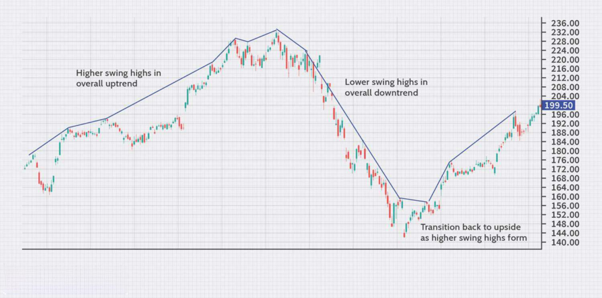

Swing trading is a popular trading strategy among financial market participants, characterized by holding positions for a duration ranging from a single day to several weeks. The primary objective of swing traders is to capitalize on short to medium-term price movements or 'swings' within a larger trend. This strategy is distinct from day trading, which involves opening and closing positions within a single trading day, and long-term investing, where positions are held for several months or years.

A critical component of swing trading is swing high analysis, a tool within technical analysis that assists traders in anticipating potential market reversals or continuations. By identifying swing highs, traders can gain insights into the prevailing market trend dynamics, thus enabling them to time their entry and exit points more effectively.



Swing high analysis is particularly useful because it helps traders recognize patterns in price movements, allowing them to distinguish between a temporary retracement and a trend reversal. This capability is essential for devising profitable trading strategies, as it informs decisions on whether to hold, sell, or buy more of an asset.

This article extends into exploring the technical analysis of swing highs, offering a comprehensive understanding of the strategies utilized in trading. Additionally, the discussion includes how algorithmic trading can serve as a powerful tool to enhance the effectiveness and precision of these strategies. Algorithmic trading can provide traders with the ability to automate the detection of swing highs, thereby improving decision-making efficiency and accuracy. Through such integration, traders can optimize their swing trading approaches, ultimately striving for increased trading profitability.

## Table of Contents

## Understanding Swing Highs

A swing high is a concept in technical analysis that marks a peak in the market price followed by a subsequent decline. It represents a potential point of reversal where price momentum shifts from bullish to bearish, providing traders with opportunities to enter or exit trades. Identifying these swing highs enables traders to understand the dynamics of the market trend and assess potential trading opportunities effectively.

Swing highs play a pivotal role in determining market trends. When higher swing highs are formed, they signify a strong uptrend, indicating that buyers are consistently pushing the price to new heights before a temporary pullback occurs. Conversely, the formation of lower swing highs may suggest a downtrend or a weakening in upward momentum, as prices fail to reach new peaks before retreating. This observation assists traders in assessing the prevailing market sentiment and making informed trading decisions.

Recognizing swing highs requires careful examination of price charts. Traders typically identify these points using price action analysis, often looking for patterns where a high is flanked by lower highs on both sides. This pattern signifies a local maximum in the price chart, suggesting a potential reversal point that traders can exploit.

In technical terms, a swing high occurs when a data point is higher than both its preceding and succeeding points in a time series. Mathematically, for a given price series $[p_1, p_2, ..., p_n]$, a swing high at point $p_i$ can be represented as:

$$
p_i > p_{i-1} \quad \text{and} \quad p_i > p_{i+1}
$$

Python can be used to identify swing highs programmatically:

```python
def find_swing_highs(prices):
    swing_highs = []
    for i in range(1, len(prices) - 1):
        if prices[i] > prices[i - 1] and prices[i] > prices[i + 1]:
            swing_highs.append((i, prices[i]))
    return swing_highs

prices = [100, 105, 102, 110, 108, 115, 112]
swing_highs = find_swing_highs(prices)
```

By employing such methods, traders can streamline the identification of swing highs, providing a systematic approach to evaluate trend strength and discover potential entry and [exit](/wiki/exit-strategy) points in the market.

## How Swing Highs Work

When a market price surpasses a recent high and subsequently experiences a decline, a swing high is confirmed. This pivot point in market behavior is significant for traders because it can be an early indicator of potential reversals or shifts in market sentiment. Key to analyzing swing highs is understanding the space between successive swing highs, as this distance can reveal crucial insights into the underlying strength of a trend.

A trend's vigor is often reflected in the separation of consecutive swing highs: wider gaps generally suggest stronger trends. For instance, in an uptrend, if subsequent swing highs are rising and increasingly spaced apart, it indicates that buyer sentiment is strong and the trend is robust. Conversely, if the distance between swing highs begins to decrease, it may signal that the trend is losing [momentum](/wiki/momentum) and a reversal may be pending.

To quantify these observations, traders may utilize chart patterns and price action analysis to enhance their predictions of future price movements. This involves mapping the highs and lows of market prices to visualize the trending path effectively. Additionally, calculating the rate of change in swing highs can provide additional insight. For example, a rapid rise in consecutive swing highs might suggest a momentum buildup. Traders often use this information to adjust their strategies, either by taking profits, adjusting stop-loss orders, or reevaluating entry points for new trades.

Understanding the mechanics of swing highs is about recognizing these patterns and using them to make informed decisions. This approach allows traders to better predict potential reversals or continuations in price movement, thereby optimizing their trading strategies to align with market conditions.

## Trading Methods Using Swing Highs

Traders implement swing highs in various strategies, primarily in trend trading and range-bound trading, to enhance their decision-making processes in the financial markets.

In trend trading, swing highs are pivotal in identifying retracement points where traders may consider shorting an asset. A swing high occurs when the market price reaches a peak and then declines, indicating the potential for a temporary reversal within a broader uptrend. During such retracements, traders anticipate that prices are likely to fall from the swing high before resuming the upward trend. By shorting the asset at this point, traders aim to capitalize on the expected downturn. The goal is to enter a short trade at or near the swing high, with a plan to cover the position once the price resumes its upward movement or breaches a significant support level.

For range-bound markets, swing highs and lows act as crucial reference points defining the upper and lower limits of the trading range. In these scenarios, traders exploit the oscillation of prices between the support level, represented by swing lows, and the resistance level, indicated by swing highs. The strategy involves buying the asset near the swing low, anticipating an increase in price towards the swing high, and subsequently selling at or near the swing high. This method allows traders to leverage the cyclical nature of range-bound markets, maximizing profits by buying low and selling high within the established price boundaries.

Employing swing highs as tools for support and resistance level identification provides traders with tangible data points for setting entry and exit strategies. By analyzing these market peaks, traders can refine their methods, optimize timing, and improve the accuracy of their trading decisions. Quantitative methods, such as the calculation of the rate of change or the application of exponential moving averages, may be utilized to support these strategies, enhancing the trader's ability to interpret market dynamics and identify profitable opportunities.

## Incorporating Technical Indicators

Technical indicators such as the Relative Strength Index (RSI) and Moving Average Convergence Divergence (MACD) can significantly complement swing high analysis by enhancing the precision of trading signals. These indicators help traders assess the momentum and potential reversals in the price action, thus improving decision-making processes in swing trading.

The RSI is a momentum oscillator that measures the speed and change of price movements, oscillating between 0 and 100. It is primarily used to identify overbought or oversold conditions. When applying RSI in swing high analysis, traders look for divergences between the RSI and the price movements. For example, when a swing high forms a new price peak, but the RSI fails to reach a new high, it suggests a potential reversal. This divergence indicates weakening momentum, hinting that the upward trend might be losing strength. 

Here is a simple Python example demonstrating how one might calculate RSI using the pandas library:

```python
import pandas as pd

def calculate_rsi(data, window=14):
    delta = data.diff()
    gain = (delta.where(delta > 0, 0)).rolling(window=window).mean()
    loss = (-delta.where(delta < 0, 0)).rolling(window=window).mean()
    rs = gain / loss
    rsi = 100 - (100 / (1 + rs))
    return rsi

# Sample usage
data = pd.Series([45.15, 46.23, 47.22, 43.72, 44.30, 46.01])
rsi = calculate_rsi(data)
print(rsi)
```

The MACD, on the other hand, is used to detect changes in the strength, direction, momentum, and duration of a trend. The MACD line is calculated by subtracting the 26-period exponential moving average (EMA) from the 12-period EMA. A signal line, the 9-period EMA of the MACD line, is then plotted to identify buy and sell signals. An intersection between the MACD line and the signal line, especially around swing highs, can serve as a confirmation of potential continuation or reversal of trends.

Divergences between price actions and technical indicators frequently preempt reversals or trend continuations. For instance, if a swing high coincides with a bullish MACD divergence, where the price is dropping to a new low while the MACD is not, it suggests the current downtrend may reverse upward. 

Utilizing swing highs with these technical indicators can enhance the reliability of trading signals, providing traders with a more robust framework to forecast future market movements and make more informed trading decisions. By combining the insights from technical indicators like RSI and MACD with swing high analysis, traders can improve their strategy's overall effectiveness, potentially leading to higher profitability and reduced risk.

## Algorithmic Trading and Swing High Analysis

Algorithmic trading systems are instrumental in the automation of swing high detection, facilitating timely and accurate trade execution. These systems utilize advanced computational algorithms to scan historical market data and identify swing high patterns that indicate potential market reversals or continuations.

By employing sophisticated algorithms, traders can automate the process of detecting swing highs, which are typically characterized by a peak in market price followed by a decline. The automation process leverages pattern recognition and statistical analysis to pinpoint these price peaks without the need for manual chart analysis. Algorithmic trading systems can, therefore, scan vast amounts of data much faster than manual methods, providing traders with a competitive edge.

Historical data analysis is critical in [algorithmic trading](/wiki/algorithmic-trading) as it allows traders to test various swing high strategies to determine their potential effectiveness. Traders can back-test these strategies against historical price data to identify optimal entry and exit points. For instance, using Python, one can employ libraries such as pandas for data manipulation and [backtesting](/wiki/backtesting).py for evaluating strategies:

```python
import pandas as pd
import backtesting

# Example backtesting strategy
def swing_high_strategy(data):
    # Define conditions for identifying swing highs
    swing_highs = (data['High'] > data['High'].shift(1)) & (data['High'] > data['High'].shift(-1))
    return swing_highs

# Load historical price data
data = pd.read_csv('historical_prices.csv')
backtest = backtesting.backtest(data, strategy=swing_high_strategy)
results = backtest.run()
print(results)
```

This example demonstrates a simple backtesting setup where historical price data is analyzed to pinpoint swing highs. The identified swing highs can then be used to determine suitable trade entry and exit points.

By adopting algorithmic trading strategies, traders not only enhance the efficiency of swing high analysis but also reduce the emotional biases that can adversely affect trading decisions. Automated systems provide consistency and the ability to execute trades based on pre-defined criteria, improving overall trading performance.

Additionally, algorithmic systems can continuously monitor the market, ensuring that trading decisions are made based on the most current information available. This real-time monitoring is crucial for acting swiftly when swing highs occur, maximizing the potential for profitable trades.

In summary, algorithmic trading systems significantly enhance swing high analysis by automating detection, enabling historical backtesting, and providing real-time execution advantages. Integration of these systems can improve trading accuracy, efficiency, and profitability for market participants.

## Examples and Case Studies

Real-world examples of swing highs can be observed in the stock price movements of major corporations like Apple Inc. Swing highs serve as a crucial indicator to determine changes in trend direction. For instance, during Apple's stock trading session, a distinct swing high might be identified following a significant price rally. This swing high often precedes a retracement, where the price reverses and heads lower. By examining Apple's historical price charts, one can spot these swing highs and use them to anticipate when the upward momentum might lose strength, presenting opportunities for traders to short the stock.

In one notable case study, analysts observed a series of higher swing highs in Apple's stock prices during a bullish market phase. This pattern signaled a continued uptrend, and traders capitalizing on these signals were able to enter long positions at optimal times, benefiting significantly as the stock price reached new heights.

In another instance, during a sideways trading phase, Apple's stock showed repetitive swing highs and lows, reflecting a range-bound market. Traders adept at recognizing these patterns engaged in strategies to buy near swing lows and sell near swing highs. This approach allowed them to capitalize on the predictable oscillations within the defined price range.

The use of swing highs becomes even more powerful when combined with other technical analysis tools. For instance, overlaying moving averages or employing the Relative Strength Index (RSI) in conjunction with swing high identification can provide traders with more precise entry and exit points. A combined analysis might show that an RSI divergence coincides with a swing high, suggesting an impending reversal. Traders using this composite strategy can thus maximize return potential by validating swing high signals with corroborative technical data.

Moreover, algorithmic trading systems can backtest historical data to refine these strategies further. By analyzing past performance of stocks like Apple, algorithms can learn to recognize patterns and predict future swing highs, automating trades accurately to capitalize on these movements. For instance, a Python script utilizing algorithms can scan through a stock's historical dataset to identify swing highs automatically and calculate the potential profit margins from such patterns. This approach not only optimizes trading efficiency but also significantly reduces the response time to market changes.

In summary, swing highs provide invaluable insights for traders when examining real-world stock movements such as those of Apple Inc. Coupled with other analytical tools and algorithmic technologies, traders can substantially enhance their ability to forecast trend changes and optimize their trading strategies for improved returns.

## Conclusion

Swing high technical analysis provides traders with critical insights into market movements, allowing them to identify potential reversals and continuations effectively. By analyzing patterns of swing highs, traders can make informed decisions about entry and exit points, capitalizing on shifts in market sentiment. The effectiveness of this approach lies in its ability to simplify complex market behaviors into identifiable peaks, offering concrete opportunities for strategic trading.

Integrating algorithm-based systems with traditional swing high methods can further enhance the accuracy and profitability of trading strategies. By automating the detection of swing highs, these systems facilitate timely and precise trade execution. Algorithms can process vast amounts of historical data, identifying patterns and trends that may not be immediately obvious to human traders. This computational power enables the development of sophisticated models that aid in predicting future price movements based on past behaviors.

Continued practice and detailed analysis of swing highs can lead to sustained success in trading. Traders who consistently apply swing high analysis can develop a keen sense of market timing, identifying optimal points to initiate or exit trades. This ongoing refinement of skills ensures that traders remain responsive to market dynamics, maintaining an edge in various market conditions. By combining traditional techniques with algorithmic tools, traders can optimize their strategies, increasing their chances of achieving long-term profitability.

## References & Further Reading

[1]: Schwager, J. D. (2017). ["Technical Analysis: The Complete Resource for Financial Market Technicians"](https://www.amazon.com/Technical-Analysis-Complete-Financial-Technicians/dp/0134137043). Wiley.

[2]: Murphy, J. J. (1999). ["Technical Analysis of the Financial Markets: A Comprehensive Guide to Trading Methods and Applications"](https://archive.org/details/technicalanalysi0000murp). New York Institute of Finance.

[3]: Pring, M. J. (2002). ["Technical Analysis Explained: The Successful Investor's Guide to Spotting Investment Trends and Turning Points"](https://www.amazon.com/Technical-Analysis-Explained-Fifth-Successful/dp/0071825177). McGraw-Hill.

[4]: Kirkpatick, C. D., & Dahlquist, J. R. (2010). ["Technical Analysis: The Complete Resource for Financial Market Technicians"](https://ptgmedia.pearsoncmg.com/images/9780134137049/samplepages/9780134137049.pdf). FT Press.

[5]: Chan, E. (2008). ["Quantitative Trading: How to Build Your Own Algorithmic Trading Business"](https://github.com/ftvision/quant_trading_echan_book). Wiley.

[6]: Elder, A. (2002). ["Trading for a Living: Psychology, Trading Tactics, Money Management"](https://www.amazon.com/Trading-Living-Psychology-Tactics-Management/dp/0471592242). Wiley.