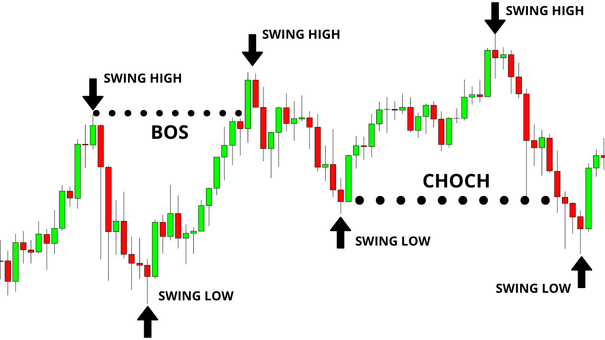

## Table of Contents

## What is a swing high in technical analysis?

A swing high in technical analysis is a peak point on a chart where the price of an asset reaches a high before turning back down. It's like the top of a hill that the price climbs to before it starts to drop again. Traders look for these swing highs because they can help identify where the price might start to fall, which can be useful for making trading decisions.

Swing highs are important because they show resistance levels, which are prices where the asset has trouble going higher. When the price hits a swing high and then falls, it suggests that sellers are stepping in at that level, pushing the price down. By spotting these swing highs, traders can set up strategies to sell near these peaks or to buy if the price breaks through the swing high, indicating that the price might keep going up.

## How can a swing high be identified on a price chart?

To spot a swing high on a price chart, look for a point where the price goes up to a peak and then starts to drop. Imagine the price moving like a roller coaster. When it reaches the top of a hill and then goes down the other side, that top is your swing high. On the chart, you'll see the price making higher highs until it hits this peak, and then it makes lower highs or lower lows as it starts to fall.

You can make it easier to find swing highs by using a simple rule. Look for a high point where there are lower highs on both sides of it. So, if you see a peak with a lower peak before it and a lower peak after it, that middle peak is your swing high. This method helps you clearly see where the price has turned around and started to go down, which is useful for figuring out where to trade.

## Why are swing highs important for traders?

Swing highs are important for traders because they show where the price of an asset has reached a peak before starting to fall. This helps traders see where the price might hit a resistance level, which is a point where the price has trouble going higher. Knowing these levels can help traders decide when to sell their assets. For example, if a trader sees the price nearing a swing high, they might choose to sell, expecting the price to drop soon.

Additionally, swing highs can help traders spot potential [breakout](/wiki/breakout-trading) opportunities. If the price breaks through a swing high, it might mean the price will keep going up. Traders can use this information to buy assets just after the price breaks through the swing high, hoping to profit from the upward movement. By paying attention to swing highs, traders can make better decisions about when to buy or sell, improving their chances of making successful trades.

## What is the difference between a swing high and a resistance level?

A swing high is a specific point on a price chart where the price of an asset reaches a peak before it starts to go down again. It's like the top of a hill that the price climbs to before rolling back down. Traders look at swing highs to see where the price has turned around in the past, which can help them guess where it might turn around again in the future.

A resistance level, on the other hand, is more like a zone or an area on the chart where the price has trouble moving higher. It's not just one point but a range where many traders might be selling, making it hard for the price to break through. While a swing high can help identify where a resistance level might be, the resistance level itself is broader and shows where the price might face difficulty moving up over time.

Both swing highs and resistance levels are important for traders, but they serve slightly different purposes. A swing high is a clear, single point that can help spot potential resistance, while a resistance level is a wider area that shows ongoing difficulty for the price to rise. Understanding both can help traders make better decisions about when to buy or sell.

## How can swing highs be used in trend analysis?

Swing highs are very helpful when you want to understand the direction of a trend in trading. They show the peaks where the price has turned around and started to go down. By connecting these swing highs with a line, you can see if the trend is going up or down. If the swing highs are getting higher over time, it means the trend is going up, which is called an uptrend. If the swing highs are getting lower, it means the trend is going down, which is called a downtrend. This helps traders see the big picture and make better guesses about where the price might go next.

Using swing highs in trend analysis also helps traders spot when a trend might be changing. If the price breaks through a swing high in an uptrend, it could mean the trend is getting stronger and might keep going up. But if the price can't break through a swing high and starts to go down, it might mean the trend is weakening or about to change direction. By watching these swing highs, traders can decide when to buy or sell based on whether the trend is still strong or starting to change.

## What are common trading strategies that utilize swing highs?

One common trading strategy that uses swing highs is called swing trading. In this strategy, traders try to buy an asset when its price is low and sell it when it reaches a swing high. They look for times when the price has gone down to a low point and then starts to go up again. When the price reaches a swing high, the trader sells, hoping to make a profit from the difference between the low and high prices. This strategy works well in markets that have clear ups and downs, letting traders take advantage of these price swings.

Another strategy is to use swing highs to find resistance levels. Traders watch for the price to hit a swing high and then start to go down. If the price hits the same swing high again and can't go higher, it might be a good time to sell. This is because the swing high shows where other traders might be selling, making it hard for the price to go up. By selling near the swing high, traders can make money as the price falls back down.

A third strategy involves watching for breakouts. If the price breaks through a swing high, it might mean the price will keep going up. Traders can buy the asset right after it breaks through the swing high, hoping to profit from the upward movement. This strategy works well when the market is strong and the price is likely to keep going up after breaking through the resistance level shown by the swing high.

## Can swing highs be used in conjunction with other technical indicators?

Yes, swing highs can be used with other technical indicators to help traders make better decisions. One common way is to use swing highs with moving averages. A moving average is a line on a chart that shows the average price over a certain time. If the price hits a swing high and then starts to fall below the moving average, it might mean the price will keep going down. Traders can use this to decide when to sell. On the other hand, if the price breaks through a swing high and stays above the moving average, it might mean the price will keep going up, and traders can use this to decide when to buy.

Another way to use swing highs is with the Relative Strength Index (RSI), which shows if an asset is overbought or oversold. If the price reaches a swing high and the RSI is over 70, it might mean the asset is overbought and the price could fall soon. Traders can use this to sell near the swing high. If the price breaks through a swing high and the RSI is under 30, it might mean the asset is oversold and the price could rise soon. Traders can use this to buy after the price breaks through the swing high. By combining swing highs with other indicators like moving averages and RSI, traders can get a clearer picture of what the market might do next and make better trading choices.

## How do false breakouts relate to swing highs?

False breakouts happen when the price of an asset looks like it's going to break through a swing high but then quickly turns back down. A swing high is the highest point the price reached before it started to fall. When the price goes up to that swing high and tries to go even higher, it might trick traders into thinking the price will keep going up. But if it turns back down soon after, that's a false breakout. Traders need to watch out for these because they can lead to bad trading decisions if you think the price will keep rising but it doesn't.

Traders can use swing highs to spot false breakouts by looking at how the price behaves around these peaks. If the price goes just a little bit above the swing high and then drops back below it quickly, that's a sign of a false breakout. To avoid getting caught by these, traders can wait for the price to stay above the swing high for a while before deciding to buy. They can also use other indicators, like [volume](/wiki/volume-trading-strategy) or [momentum](/wiki/momentum), to see if the breakout looks strong or weak. By paying attention to swing highs and how the price acts around them, traders can better tell the difference between real and false breakouts.

## What are some advanced techniques for confirming swing highs?

One advanced way to confirm swing highs is by using multiple time frames. Traders can look at the same swing high on different chart time frames, like daily and hourly charts. If the swing high shows up clearly on both, it's more likely to be a real peak. This helps traders feel more sure that the price will turn around at that point. Another way is to use volume analysis. If the volume, or the number of trades, goes up a lot when the price hits the swing high, it's a good sign that the peak is strong and the price might really start to fall.

Another technique is to use indicators like the Moving Average Convergence Divergence (MACD) or the Relative Strength Index (RSI). If the MACD shows a bearish divergence, where the price makes a new high but the MACD line doesn't, it can confirm that the swing high might lead to a price drop. Similarly, if the RSI is overbought (above 70) when the price hits the swing high, it suggests the price might be ready to fall. By combining these indicators with the swing high, traders can get a clearer picture of whether the peak is a good place to sell.

## How can swing highs be applied in different time frames?

Swing highs can be used on different time frames like daily, hourly, or even minute charts to help traders see where the price might turn around. On a daily chart, a swing high might show where the price reached a peak over several days before starting to fall. Traders can use this to guess where the price might hit resistance again in the future. On an hourly chart, swing highs show smaller peaks that happen over a few hours. These can be useful for traders who want to make quick trades and need to know where the price might turn around in a shorter time.

Using swing highs on different time frames can give traders a better overall view of the market. For example, if a swing high shows up on both a daily and an hourly chart, it's a stronger sign that the price might really turn around at that point. This can help traders feel more sure about their decisions. By looking at swing highs on different time frames, traders can see both the big picture and the smaller details, which can help them make better guesses about where the price might go next.

## What are the potential pitfalls of relying on swing highs for trading decisions?

Relying too much on swing highs for trading decisions can lead to some problems. One big issue is false breakouts. Sometimes, the price might look like it's going to keep going up after hitting a swing high, but then it quickly turns around and goes down. This can trick traders into buying too early, thinking the price will keep rising when it doesn't. Another problem is that swing highs can be hard to spot clearly, especially in markets that move a lot. If the price is jumping around, it can be tough to tell where the real swing high is, which can lead to bad trading choices.

Also, swing highs might not work the same way in all market conditions. In a strong uptrend, the price might break through many swing highs, making them less useful for spotting where the price will turn around. And if the market is moving sideways, without a clear up or down trend, swing highs might not give traders good information about where to buy or sell. Traders need to be careful and use other tools along with swing highs to make better decisions and avoid these pitfalls.

## Can you provide real-world examples of successful trades using swing highs?

In one real-world example, a trader named Sarah used swing highs to make a successful trade in the stock market. She noticed that the price of a tech company's stock had been going up and down over the past few weeks. She saw a clear swing high on the daily chart where the price had reached a peak before falling back down. When the price started to go up again and neared that same swing high, Sarah decided to sell her shares. Sure enough, the price hit the swing high and then dropped, allowing Sarah to make a profit by selling at the right time.

Another example involves a [forex](/wiki/forex-system) trader named Mike who used swing highs to spot a good buying opportunity. Mike was watching the EUR/USD currency pair and saw that the price had hit a swing high on the hourly chart, but then broke through it and kept going up. He waited to see if the price would stay above the swing high for a while, and when it did, he decided to buy. The price continued to rise, and Mike was able to sell later at a higher price, making a nice profit from his trade. By using swing highs to spot where the price might keep going up, Mike made a smart trading decision.

## What is the key to understanding swing highs?

A swing high is a concept in technical analysis that marks a peak in the market price followed by a subsequent decline. It represents a potential point of reversal where price momentum shifts from bullish to bearish, providing traders with opportunities to enter or exit trades. Identifying these swing highs enables traders to understand the dynamics of the market trend and assess potential trading opportunities effectively.

Swing highs play a pivotal role in determining market trends. When higher swing highs are formed, they signify a strong uptrend, indicating that buyers are consistently pushing the price to new heights before a temporary pullback occurs. Conversely, the formation of lower swing highs may suggest a downtrend or a weakening in upward momentum, as prices fail to reach new peaks before retreating. This observation assists traders in assessing the prevailing market sentiment and making informed trading decisions.

Recognizing swing highs requires careful examination of price charts. Traders typically identify these points using price action analysis, often looking for patterns where a high is flanked by lower highs on both sides. This pattern signifies a local maximum in the price chart, suggesting a potential reversal point that traders can exploit.

In technical terms, a swing high occurs when a data point is higher than both its preceding and succeeding points in a time series. Mathematically, for a given price series $[p_1, p_2, ..., p_n]$, a swing high at point $p_i$ can be represented as:

$$
p_i > p_{i-1} \quad \text{and} \quad p_i > p_{i+1}
$$

Python can be used to identify swing highs programmatically:

```python
def find_swing_highs(prices):
    swing_highs = []
    for i in range(1, len(prices) - 1):
        if prices[i] > prices[i - 1] and prices[i] > prices[i + 1]:
            swing_highs.append((i, prices[i]))
    return swing_highs

prices = [100, 105, 102, 110, 108, 115, 112]
swing_highs = find_swing_highs(prices)
```

By employing such methods, traders can streamline the identification of swing highs, providing a systematic approach to evaluate trend strength and discover potential entry and [exit](/wiki/exit-strategy) points in the market.

## References & Further Reading

[1]: Schwager, J. D. (2017). ["Technical Analysis: The Complete Resource for Financial Market Technicians"](https://www.amazon.com/Technical-Analysis-Complete-Financial-Technicians/dp/0134137043). Wiley.

[2]: Murphy, J. J. (1999). ["Technical Analysis of the Financial Markets: A Comprehensive Guide to Trading Methods and Applications"](https://archive.org/details/technicalanalysi0000murp). New York Institute of Finance.

[3]: Pring, M. J. (2002). ["Technical Analysis Explained: The Successful Investor's Guide to Spotting Investment Trends and Turning Points"](https://www.amazon.com/Technical-Analysis-Explained-Fifth-Successful/dp/0071825177). McGraw-Hill.

[4]: Kirkpatick, C. D., & Dahlquist, J. R. (2010). ["Technical Analysis: The Complete Resource for Financial Market Technicians"](https://ptgmedia.pearsoncmg.com/images/9780134137049/samplepages/9780134137049.pdf). FT Press.

[5]: Chan, E. (2008). ["Quantitative Trading: How to Build Your Own Algorithmic Trading Business"](https://github.com/ftvision/quant_trading_echan_book). Wiley.

[6]: Elder, A. (2002). ["Trading for a Living: Psychology, Trading Tactics, Money Management"](https://www.amazon.com/Trading-Living-Psychology-Tactics-Management/dp/0471592242). Wiley.