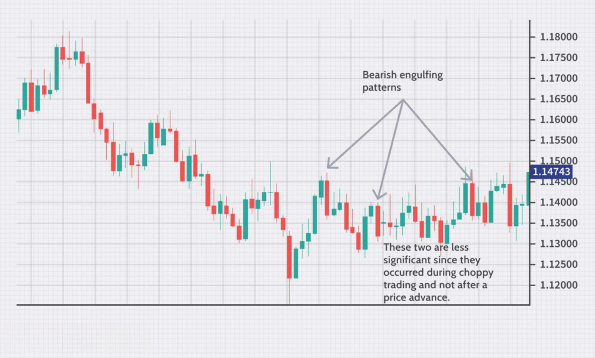

In the world of trading, financial success often hinges on employing strategies designed to make informed decisions. This article focuses on trading strategies, particularly technical analysis, swing lows, and algorithmic trading, providing insights into how these components can create a comprehensive trading plan.

Technical analysis involves studying historical price movements and patterns to forecast future price behavior. Identifying trends through various charts and indicators forms the backbone of this analytical approach, allowing traders to gauge market sentiment and potential price shifts.



Swing lows are integral to technical analysis, representing the lowest price point of an asset during a specific timeframe. Recognizing these formations can help traders identify potential reversal points and opportune moments to enter or exit trades. Understanding swing lows within different trend contexts enhances the predictive power of technical analysis.

Algorithmic trading has revolutionized market participation by facilitating swift, data-driven decision-making. Traders use predefined algorithms to execute trades based on quantitative analysis and statistical models. This method offers advantages such as speed, precision, and the minimization of emotional biases that can cloud trading decisions.

Each component, from trend identification using technical analysis to precise algorithmic execution, is crucial in optimizing trading outcomes. By employing these tactics, traders aim to gain an edge in competitive markets, enhancing both risk management and profit potential.

## Table of Contents

## Understanding Swing Lows in Technical Analysis

Swing low is a concept in technical analysis that represents the lowest point reached by a trading instrument within a specific timeframe. This point is crucial for traders as it often signals potential price reversals, providing opportunities for entering or exiting trades. Swing lows are identified by observing a sequence of price movements where the low is flanked by higher lows on each side. Technically, if a particular low is preceded and succeeded by higher lows, it is considered a swing low.

Identifying swing lows involves analyzing price charts using various tools and patterns. Common methods include using support and resistance levels, Fibonacci retracement, and trend lines. Support levels, in particular, are horizontal lines drawn to connect multiple low points, indicating areas where buying interest surpasses selling pressure, potentially leading to a reversal. 

The significance of swing lows lies in their predictive power for price movements. A swing low can indicate the end of a retracement within an uptrend, suggesting that the price might resume its upward trajectory. This provides traders with a potential entry point to capitalize on the continuation of the trend. Conversely, in a downtrend, identifying a swing low might help traders anticipate a temporary upward correction or a competitive point for short-selling.

Swing lows fit into broader trading strategies by aiding in the construction of trendlines and chart patterns. For instance, the identification of consecutive swing lows can help define an ascending trendline, signaling an overall bullish market sentiment. Traders also use swing lows in conjunction with technical indicators like the Relative Strength Index (RSI) or moving averages to confirm potential entry or [exit](/wiki/exit-strategy) points. By using these indicators, traders can measure the strength and sustainability of a price reversal, thereby improving their decision-making.

Furthermore, swing lows play a pivotal role in the development of algorithms for automated trading. Algorithms often incorporate the identification of swing lows to generate buy or sell signals as part of quantitative models that assess and react to market movements. By coding rules that detect these low points, traders can enhance the responsiveness and effectiveness of their automated strategies, capitalizing on repetitive market patterns identified by technical analysis.

In summary, recognizing and understanding swing lows is essential for traders seeking to predict market reversals and trend continuations. By applying technical analysis tools and integrating them into comprehensive trading strategies, traders can leverage swing lows to enhance their market positions and optimize returns.

## Incorporating Swing Lows into Trading Strategies

Incorporating swing lows into trading strategies involves recognizing the contexts in which they occur, particularly during trend retracements or reversals. A swing low is characterized by a trough in a price chart where the low is surrounded by higher lows on either side, signaling potential support and an opportunity to enter a trade at a favorable price point. Successfully identifying these points allows traders to time entry and exit strategies more effectively, thereby optimizing risk management and enhancing profit potential.

To confirm swing low formations, traders often leverage technical analysis tools such as moving averages and stochastic oscillators. Moving averages smooth out price data, providing a clearer view of the price trend. A commonly used approach is the combination of short-term and long-term moving averages. For instance, when the price closes above a short-term moving average following a swing low, it can signal a potential upward trend reversal. Stochastic oscillators, which measure the [momentum](/wiki/momentum) of price movements, can indicate oversold conditions when a swing low is forming. Typically, a stochastic value below 20 suggests that the asset is oversold, and the formation of a swing low could present a buying opportunity.

Strategies that utilize swing lows include:

1. **Entry Strategies**: 
   - **Breakout Entry**: Traders look for a price break above resistance following a swing low to confirm an entry signal, often corroborating this with increased trading volume.
   - **Pullback Entry**: After confirming a swing low, traders may wait for a slight price retracement and enter the trade when the price approaches a level of support, minimizing entry risk.

2. **Exit Strategies**:
   - **Profit Target Exit**: Setting profit targets based on previous resistance levels or Fibonacci retracement levels allows traders to lock in profits.
   - **Trailing Stops**: By implementing trailing stop orders below successive swing lows in an uptrend, traders can protect gains while allowing profits to run.

Python code can automate these strategies for traders. Here's a basic example of utilizing a moving average crossover strategy in Python, using the pandas and numpy libraries:

```python
import pandas as pd
import numpy as np

# Assuming 'data' is a DataFrame with 'Close' prices
short_window = 40
long_window = 100

data['Short_MA'] = data['Close'].rolling(window=short_window, min_periods=1).mean()
data['Long_MA'] = data['Close'].rolling(window=long_window, min_periods=1).mean()

# Generate signals
data['Signal'] = 0
data['Signal'][short_window:] = np.where(data['Short_MA'][short_window:] > data['Long_MA'][short_window:], 1, 0)

# Calculate daily returns
data['Return'] = data['Close'].pct_change()

# Apply strategy returns
data['Strategy_Return'] = data['Signal'].shift(1) * data['Return']

cumulative_strategy_return = (1 + data['Strategy_Return']).cumprod()

print(f"Cumulative Strategy Return: {cumulative_strategy_return.iloc[-1]}")
```

By systematically applying indicators like moving averages and oscillators, traders can confirm swing lows and integrate them into comprehensive trading strategies. Consistently monitoring market conditions and [backtesting](/wiki/backtesting) strategies ensures that trading approaches remain effective across different market environments.

## The Role of Algorithmic Trading in Modern Markets

Algorithmic trading, commonly referred to as algo trading, has revolutionized the financial markets by executing pre-programmed trading orders at lightning speed. These algorithms utilize quantitative models to assess various market criteria such as timing, price, and [volume](/wiki/volume-trading-strategy), enabling decisions that are not only swift but also detached from human emotions. 

One of the primary advantages of [algorithmic trading](/wiki/algorithmic-trading) is its unparalleled speed. In markets where milliseconds can mean the difference between profit and loss, the ability to execute high-frequency trades is invaluable. Algorithms can process vast amounts of data in real-time, allowing them to respond to market movements as they happen. This rapid execution minimizes latency, which is critical in volatile market conditions.

Precision is another key benefit of algorithmic trading. Algorithms follow a strict set of rules, ensuring that trades are executed with high accuracy. They eliminate the possibility of human errors that may arise from manual trading, such as incorrect order sizes or pricing. By adhering to predetermined strategies, algorithms maintain consistency in trade execution, which is crucial for maintaining the integrity of trading strategies.

Moreover, algo trading effectively removes the emotional component from trading decisions. Human traders might be prone to making impulsive decisions based on fear or greed, often leading to suboptimal trading outcomes. Algorithms, however, execute trades based solely on data and predefined criteria, significantly reducing the influence of emotions. This objectivity leads to more disciplined trading practices, enhancing overall strategy performance.

An example of a simple algorithmic trading strategy could involve a moving average crossover system. Here is a basic implementation in Python:

```python
import numpy as np
import pandas as pd

# Example data
prices = pd.Series([100, 102, 101, 104, 107, 110, 108, 106, 109, 111])

# Calculate moving averages
short_ma = prices.rolling(window=3).mean()
long_ma = prices.rolling(window=5).mean()

# Generate buy/sell signals
signals = np.where(short_ma > long_ma, "Buy", "Sell")

# Display results
trade_signals = pd.DataFrame({'Price': prices, 'Short MA': short_ma, 'Long MA': long_ma, 'Signal': signals})
print(trade_signals)
```

This example demonstrates how a simple algorithm can be set up to make data-driven decisions without the need for human intervention.

In conclusion, algorithmic trading has fundamentally altered the landscape of financial markets. By leveraging speed, precision, and emotion-free decision-making, these strategies enhance trading efficiency and efficacy. However, it is vital for traders utilizing these methods to continuously monitor and refine their algorithms to align with evolving market conditions.

## Designing Robust Algorithmic Strategies

Designing an effective algorithmic trading strategy involves several critical components: comprehensive data analysis, the formulation of trading rules, and thorough backtesting procedures. Each of these elements plays a vital role in ensuring that the strategy not only adapts to changing market conditions but also maximizes risk-adjusted returns.

Data analysis is the foundation of algorithmic trading. Traders must gather and scrutinize extensive market data to identify patterns, trends, and anomalies that could signal profitable trading opportunities. This analysis often involves quantitative approaches to evaluate historical price data, volume, and other relevant financial indicators. Machine learning techniques, such as regression analysis, classification, and clustering, can be employed to uncover insights that may not be immediately apparent through traditional technical analysis alone.

The next step in designing a robust algorithmic strategy is defining the trading rules that will govern the execution of trades. These rules should be derived from the insights gained during the data analysis phase and should detail specific conditions under which trades should be entered or exited. Python, a widely-used programming language in finance, provides numerous libraries, such as NumPy, pandas, and TA-Lib, which can aid in the creation and testing of these trading rules. An example of a simple trading strategy in Python might look like this:

```python
import pandas as pd
import numpy as np

# Load historical data
data = pd.read_csv('historical_data.csv')

# Calculate moving averages
data['MA_50'] = data['Close'].rolling(window=50).mean()
data['MA_200'] = data['Close'].rolling(window=200).mean()

# Generate buy/sell signals
data['Signal'] = np.where(data['MA_50'] > data['MA_200'], 1, -1)

# Output the signals
print(data[['Date', 'Close', 'Signal']])
```

Backtesting is a crucial procedure that involves testing the defined strategy on historical data to evaluate its performance before applying it to live markets. This process helps to assess the strategy's profitability and reliability, providing insights into its potential behavior under various market conditions. Comprehensive backtesting should include considerations for transaction costs, slippage, and the potential impact of market events. The goal is to simulate as closely as possible the real-world execution environment.

Performance evaluation of the strategy post-backtesting involves analyzing its risk-adjusted returns, which can be measured through metrics such as the Sharpe Ratio, Maximum Drawdown, and Winning Percentage. Continuous monitoring and optimization are essential, as market dynamics change over time, and a once-profitable strategy may become obsolete.

In summary, the design of a successful algorithmic trading strategy requires a methodical approach to data analysis, precise formulation of trading rules, and rigorous backtesting. Each of these steps contributes to building strategies that can effectively respond to market fluctuations and optimize the trade-off between risk and return.

## Combining Technical Analysis and Algorithmic Approaches

The integration of technical analysis with algorithmic trading presents a powerful toolset for modern traders, combining qualitative insights with quantitative precision. Technical analysis, with its diverse set of indicators such as moving averages, Relative Strength Index (RSI), and Bollinger Bands, provides valuable signals that can be algorithmically interpreted to enhance decision-making in trading systems.

Technical indicators serve as the backbone of trend analysis and momentum assessment. By incorporating these indicators into algorithmic models, traders can automate their strategies, allowing for consistent and precise execution of trades. For example, consider the implementation of a moving average crossover strategy: 

In Python, leveraging libraries such as `pandas` for data manipulation and `numpy` for numerical operations, a simple crossover strategy can be coded as follows:

```python
import pandas as pd
import numpy as np

def moving_average_crossover(data, short_window=40, long_window=100):
    data['short_mavg'] = data['price'].rolling(window=short_window, min_periods=1).mean()
    data['long_mavg'] = data['price'].rolling(window=long_window, min_periods=1).mean()

    data['signal'] = 0
    data['signal'][short_window:] = np.where(data['short_mavg'][short_window:] 
                                             > data['long_mavg'][short_window:], 1, 0)   
    data['positions'] = data['signal'].diff()
    return data

# Assume 'data' is a DataFrame with a 'price' column containing historical prices
data_with_signals = moving_average_crossover(data)
```

In this script, two moving averages are calculated—a short-term and a long-term—and a buy signal is generated when the short-term moving average crosses above the long-term average. This type of strategy leverages technical indicators for systematic trading decisions, eliminating emotional biases that might arise in manual trading.

The automation enabled by algorithmic trading also provides the advantage of backtesting strategies over historical data to evaluate their potential success. This ensures that strategies are not only theoretically sound but also practically viable. Python's `pandas` and `[backtrader](/wiki/backtrader)` library are often used for such evaluations.

Moreover, algorithmic trading facilitates the blending of multiple technical indicators, which can yield enhanced accuracy. For instance, combining RSI with moving average crossovers might filter false signals and refine entry and exit points, improving the overall strategy's robustness. The implementation of more complex systems often involves [machine learning](/wiki/machine-learning) frameworks to adapt strategies according to real-time market dynamics continuously.

In summary, the combination of technical analysis and algorithmic trading empowers traders to harness the strengths of both disciplines. By transforming qualitative assessments into quantitative models, traders can achieve higher levels of precision and reliability in their trading operations, leading to optimized trading outcomes.

## Challenges and Pitfalls in Swing Low and Algo Trading

Swing low analysis and algorithmic trading, though beneficial, come with several challenges that traders must address to ensure the effectiveness of their strategies. One of the significant pitfalls in swing low analysis is the potential for overfitting. Overfitting occurs when a model is excessively tailored to historical data, capturing noise rather than the underlying market patterns. This leads to strategies that perform well in backtesting but fail in live markets. To mitigate overfitting, traders can employ techniques such as cross-validation, where data is split into training and validation sets to test the model's predictive power.

Algorithmic trading faces its own set of challenges, chief among them being the accurate estimation of transaction costs. Transaction costs can significantly impact profitability but are often underestimated or ignored in backtests. These include broker fees, slippage, and the market impact of large orders. A robust strategy accounts for these costs, ensuring that the modeled returns are realistic.

For both swing low analysis and algorithmic trading, market conditions can vary widely. Strategies that perform well in trending markets may struggle in sideways conditions. Traders must develop adaptive strategies that can adjust to different market environments. This can be achieved by incorporating machine learning algorithms that dynamically adjust parameters based on ongoing market conditions.

Considerations such as data accuracy and signal noise also play a crucial role. Data errors or delays can lead to false signals in both technical analysis and algorithmic trading. Employing high-quality data sources and real-time processing capabilities is essential.

In addition to these technical factors, psychological biases can skew swing low analyses and algorithmic trades. Emotional biases, although minimized in algorithmic trading, can still creep into the initial development and adjustment phases of the strategies. Regular performance evaluation and adherence to predefined entry and exit criteria can reduce these biases.

The robustness of any trading strategy is tested by how well it can anticipate and adapt to unforeseen market events. Stress testing strategies against scenarios of extreme [volatility](/wiki/volatility-trading-strategies) or systemic market shocks can highlight weaknesses that might not be evident under normal conditions.

Overall, while swing low analysis and algorithmic trading provide sophisticated tools for contemporary trading, their efficacy depends heavily on careful consideration of the challenges outlined above. Continuous monitoring, iterative testing, and calibration are necessary to refine these strategies to withstand and thrive in diverse market landscapes.

## Conclusion

Trading strategies that incorporate technical analysis, swing lows, and algorithmic techniques provide traders with enhanced tools to improve decision-making processes. Technical analysis aids in the identification of market trends and potential reversal points, such as swing lows, offering a foundation for making informed trading choices. Algorithmic trading further refines this process, utilizing data-driven algorithms to execute trades with precision and speed, thus minimizing emotional biases.

Mastering these concepts is an ongoing task that demands dedication to continuous learning and adaptation to dynamic market environments. Backtesting is a crucial component, allowing traders to validate their strategies against historical data and refine them for better future performance. Understanding the limitations of each component is equally essential, ensuring that traders do not overly rely on any single indicator or technique.

By integrating these methodologies, traders can develop comprehensive strategies that are robust across varying market conditions. Continuous improvement and adaptation are vital, as markets evolve rapidly, requiring traders to stay informed and adjust their strategies accordingly. This holistic approach can lead to more consistent and favorable trading outcomes.

## References & Further Reading

[1]: Aronson, D. R. (2006). ["Evidence-Based Technical Analysis: Applying the Scientific Method and Statistical Inference to Trading Signals."](https://www.amazon.com/Evidence-Based-Technical-Analysis-Scientific-Statistical/dp/0470008741) Wiley.

[2]: Chan, E. P. (2008). ["Quantitative Trading: How to Build Your Own Algorithmic Trading Business."](https://github.com/ftvision/quant_trading_echan_book) John Wiley & Sons.

[3]: Jansen, S. (2018). ["Machine Learning for Algorithmic Trading: Predictive models to extract signals from market and alternative data for systematic trading strategies with Python."](https://www.amazon.com/Machine-Learning-Algorithmic-Trading-alternative/dp/1839217715) Packt Publishing.

[4]: Lopez de Prado, M. (2018). ["Advances in Financial Machine Learning."](https://www.amazon.com/Advances-Financial-Machine-Learning-Marcos/dp/1119482089) Wiley.

[5]: Bergstra, J., Bardenet, R., Bengio, Y., & Kégl, B. (2011). ["Algorithms for Hyper-Parameter Optimization."](https://dl.acm.org/doi/10.5555/2986459.2986743) Advances in Neural Information Processing Systems 24.