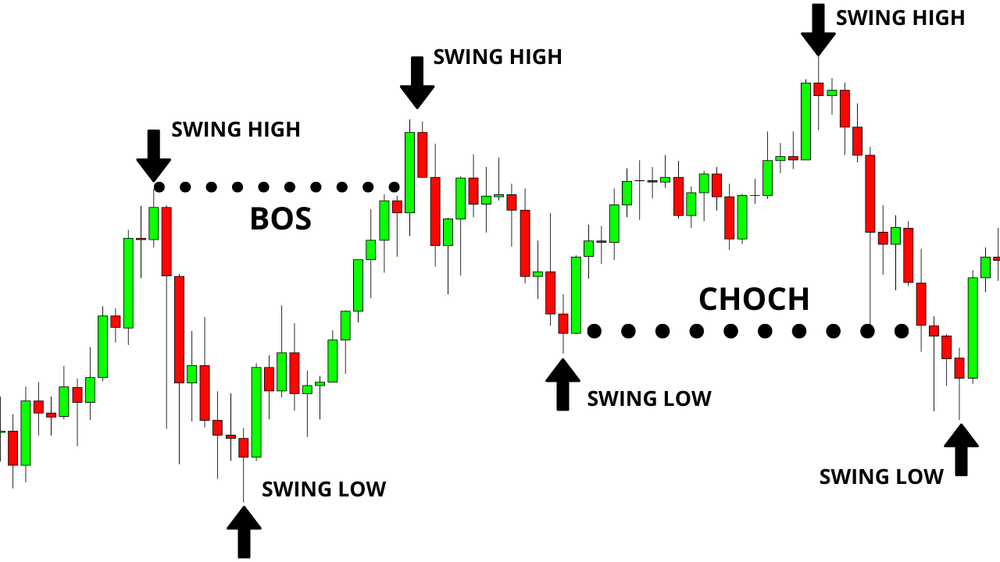

## Table of Contents

## What is a swing low in trading?

A swing low in trading is a point on a price chart where the price of an asset stops falling and starts to rise again. It's like the bottom of a swing where the price has been going down but then it turns around and begins to go up. Traders look for swing lows because they can signal that it might be a good time to buy the asset, hoping that the price will continue to increase.

Swing lows are important because they help traders identify potential support levels. Support levels are prices where the asset has trouble falling below, and they can be used to make decisions about when to enter or exit a trade. By spotting swing lows, traders can better understand the market's movements and make more informed trading choices.

## How can you identify a swing low on a price chart?

To identify a swing low on a price chart, you need to look for a point where the price of an asset stops going down and starts to go up. Imagine the price moving like a swing. When it reaches the bottom of the swing and then begins to rise, that bottom point is the swing low. You can spot this by looking at the chart and finding where the price makes a low point and then the next few price points are higher.

It's helpful to compare the low point with the prices before and after it. If the price before the low point is higher and the price after the low point is also higher, then you've found a swing low. Sometimes, traders use tools like trend lines or indicators to help them see these points more clearly, but the basic idea is to find where the price changes direction from down to up.

## What is the significance of a swing low in technical analysis?

In technical analysis, a swing low is important because it shows where the price of an asset has stopped going down and started to go up. This can be a signal for traders that it might be a good time to buy the asset. They think the price might keep going up after hitting a swing low. By looking at swing lows, traders can find good times to enter the market and hopefully make a profit.

Swing lows also help traders see where the price might find support. Support is like a floor that the price has trouble falling below. When the price hits a swing low, it often means that the price has reached a point where buyers step in and push the price back up. This can help traders decide when to buy or sell, making their trading decisions more informed and potentially more successful.

## How does a swing low differ from a swing high?

A swing low and a swing high are both important points on a price chart, but they show different things. A swing low is where the price of an asset stops going down and starts to go up again. It's like the bottom of a swing. Traders look for swing lows because they might be a good time to buy the asset, hoping the price will keep going up.

On the other hand, a swing high is where the price stops going up and starts to go down. It's like the top of a swing. Traders watch for swing highs because they might be a good time to sell the asset, hoping to avoid a drop in price. Both swing lows and swing highs help traders see where the price might change direction and make better trading decisions.

## Can you explain the role of swing lows in trend identification?

Swing lows play a big part in helping traders figure out which way the market is going. When you see a series of swing lows, you can start to see if the market is moving up or down. If the swing lows are getting higher over time, it's a sign that the market might be in an uptrend. This means that even though the price goes up and down, the overall direction is up. Traders look at these swing lows to decide when it might be a good time to buy, hoping to catch the next move up in the trend.

On the other hand, if the swing lows are getting lower over time, it might mean the market is in a downtrend. This shows that the overall direction of the price is down, even if there are some ups and downs along the way. By watching these swing lows, traders can see if the market is getting weaker and might be a good time to sell or avoid buying. Understanding where the swing lows are and how they're moving helps traders make better choices about when to get into or out of the market.

## What are common trading strategies that utilize swing lows?

One common trading strategy that uses swing lows is called swing trading. In swing trading, traders look for swing lows to find good times to buy an asset. They think that after the price hits a swing low, it might start going up again. So, they buy near the swing low and then sell when the price goes up to a swing high. This way, they can make money from the ups and downs of the market without holding onto the asset for a long time.

Another strategy is [trend following](/wiki/trend-following). Traders using this strategy watch swing lows to see if they are getting higher or lower over time. If the swing lows are getting higher, it might mean the market is in an uptrend. Traders will buy when they see a new swing low in an uptrend, hoping to ride the trend up. If the swing lows are getting lower, it might mean the market is in a downtrend. In this case, traders might avoid buying or even sell short, expecting the price to keep going down.

A third strategy is using swing lows to find support levels. Traders look at past swing lows to see where the price has stopped falling before. If the price gets close to one of these old swing lows again, it might be a good time to buy because the price might bounce back up from that support level. This strategy helps traders make decisions based on where the price has had trouble falling below in the past.

## How can swing lows be used to set stop-loss orders?

Swing lows can help traders set stop-loss orders to limit their losses. A stop-loss order is like a safety net that tells the computer to sell your asset if the price goes down too much. Traders often put their stop-loss just below a recent swing low. This way, if the price falls below the swing low, it might mean the trend is changing, and the trader can get out of the trade before losing too much money.

For example, if a trader buys an asset near a swing low hoping for the price to go up, they might set their stop-loss a little bit below that swing low. If the price goes down and hits the stop-loss, the trade will close automatically. This helps the trader protect their money by getting out of a trade that isn't working out. Using swing lows to set stop-losses can make trading safer and help traders manage their risk better.

## What are the potential pitfalls of relying solely on swing lows for trading decisions?

Relying only on swing lows for trading decisions can be risky because the market can be tricky. Just because a price hits a swing low doesn't mean it will always go up after. Sometimes, the price might keep falling, and if a trader buys at a swing low without looking at other things, they could lose money. Also, swing lows can be hard to spot clearly, and different traders might see them in different places. This can lead to confusion and bad trading choices if you're not using other tools to help you.

Another problem is that swing lows don't tell you everything about the market. They're just one piece of the puzzle. If a trader only looks at swing lows and ignores other important signs like the overall trend, news that affects the market, or what other traders are doing, they might miss out on important information. It's better to use swing lows along with other tools and information to make smarter trading decisions.

## How do swing lows interact with other technical indicators like moving averages or RSI?

Swing lows can work together with other technical indicators like moving averages to help traders make better decisions. A moving average is a line on the chart that shows the average price over a certain time. When a swing low happens near a moving average, it can be a stronger sign that the price might go up. For example, if the price hits a swing low and then bounces back up above the moving average, it might mean the price is starting to go up again. Traders can use this to decide when to buy, making their choice more confident because they see both the swing low and the moving average pointing in the same direction.

Swing lows can also be used with the Relative Strength Index (RSI), which measures how fast the price is going up or down. If the RSI is low when the price hits a swing low, it can mean the asset is oversold, and the price might go up soon. Traders look for times when the RSI is low and the price hits a swing low at the same time. This can be a good signal to buy because both indicators suggest the price might start going up. Using swing lows with other indicators like moving averages and RSI can give traders a clearer picture of what might happen next in the market.

## Can you discuss advanced techniques for confirming swing lows, such as volume analysis?

One advanced way to make sure a swing low is real is by looking at the trading [volume](/wiki/volume-trading-strategy). Volume is how many people are buying and selling the asset. When the price hits a swing low and the volume is high, it means a lot of people are interested in the asset at that price. This can be a strong sign that the swing low is important and the price might start going up. Traders look for high volume at swing lows because it shows that many people think the price is a good deal and are ready to buy, which can push the price higher.

Another way to confirm a swing low is by using other technical indicators along with volume. For example, if the price hits a swing low and the volume is high, traders might also check the Relative Strength Index (RSI) to see if it's in an oversold area. If the RSI is low and the volume is high at the swing low, it's a double sign that the price might go up soon. By combining volume analysis with other indicators, traders can feel more confident that the swing low they see is a good place to buy and that the price is likely to start moving up.

## How do different time frames affect the interpretation of swing lows?

Looking at swing lows on different time frames can change how you see them. On a short time frame, like a 5-minute chart, swing lows might happen a lot and be smaller. They can show quick changes in the price, but these might not mean much for the bigger picture. Traders who look at short time frames might use these small swing lows to make quick trades, hoping to catch small moves in the price.

On a longer time frame, like a daily or weekly chart, swing lows are bigger and happen less often. These swing lows can show important turning points in the market that last longer. Traders who look at longer time frames might use these swing lows to make bigger decisions, like when to buy or sell for a longer time. By looking at swing lows on different time frames, traders can get a better idea of both the short-term and long-term moves in the market.

## What are some real-world examples of successful trades based on swing lows?

In 2020, a trader named Sarah saw a swing low on the chart of a tech company's stock. The price had been going down for a few weeks but then hit a low point and started to go up again. Sarah noticed that the volume was high at this swing low, which made her think it was a good time to buy. She bought the stock near the swing low and held onto it. Over the next few months, the stock price kept going up, and Sarah sold it for a nice profit. She used the swing low and high volume to make a smart trading decision.

Another example is from 2018 when a trader named Mike was looking at the chart of a popular [cryptocurrency](/wiki/cryptocurrency). He saw that the price had been going down but then hit a swing low and started to go up. Mike also checked the RSI and saw it was in an oversold area, which made him feel more confident about the swing low. He bought the cryptocurrency near the swing low and waited. A few weeks later, the price went up a lot, and Mike sold it for a big profit. By using the swing low along with the RSI, Mike made a successful trade.

## References & Further Reading

[1]: Aronson, D. R. (2006). ["Evidence-Based Technical Analysis: Applying the Scientific Method and Statistical Inference to Trading Signals."](https://www.amazon.com/Evidence-Based-Technical-Analysis-Scientific-Statistical/dp/0470008741) Wiley.

[2]: Chan, E. P. (2008). ["Quantitative Trading: How to Build Your Own Algorithmic Trading Business."](https://github.com/ftvision/quant_trading_echan_book) John Wiley & Sons.

[3]: Jansen, S. (2018). ["Machine Learning for Algorithmic Trading: Predictive models to extract signals from market and alternative data for systematic trading strategies with Python."](https://www.amazon.com/Machine-Learning-Algorithmic-Trading-alternative/dp/1839217715) Packt Publishing.

[4]: Lopez de Prado, M. (2018). ["Advances in Financial Machine Learning."](https://www.amazon.com/Advances-Financial-Machine-Learning-Marcos/dp/1119482089) Wiley.

[5]: Bergstra, J., Bardenet, R., Bengio, Y., & Kégl, B. (2011). ["Algorithms for Hyper-Parameter Optimization."](https://dl.acm.org/doi/10.5555/2986459.2986743) Advances in Neural Information Processing Systems 24.