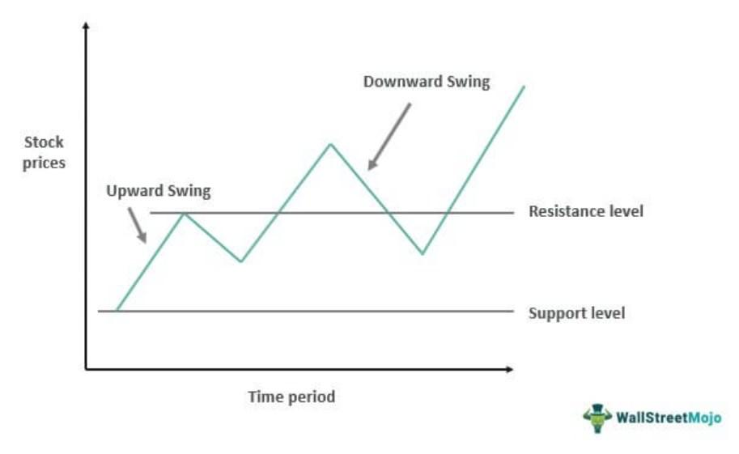

Financial derivatives have fundamentally reshaped the trading landscape by offering diverse opportunities for investment and risk management. Among these, swing options and algorithmic trading strategies are prominent, equipping traders with advanced tools to effectively harness market dynamics. In this article, we focus on the crucial elements of financial derivatives, specifically swing options, paralleled by the progression of trading strategies augmented through algorithmic frameworks.

Swing options, often applied in energy markets, offer distinctive advantages by enabling flexibility in commodity quantities and pricing, a necessity in the volatile environment of commodities like oil and natural gas. By utilizing swing options, traders can tailor their investment strategies to adapt to fluctuating market conditions, thereby enhancing their capacity to mitigate risks and maximize returns.



Algorithmic trading, on the other hand, revolutionizes the implementation of these trading strategies by employing computer algorithms to conduct trades with speed and precision. These algorithms are designed to analyze vast datasets and execute trades based on predetermined criteria, thereby increasing the efficiency and accuracy of trade execution. The inclusion of algorithmic strategies allows for the automation of complex trading scenarios, offering traders the ability to leverage market movements with heightened agility.

Understanding the synergy between swing options and algorithmic trading is vital for traders aiming to navigate the complexities of contemporary financial markets. By combining the flexibility of swing options with the analytical power of algorithms, traders can achieve a more refined approach to managing their portfolios. Furthermore, continuous learning and adaptation to technological advancements remain essential in maintaining a competitive edge in trading.

In summary, the integration of swing options and algorithmic trading strategies signifies a transformative development in financial trading, offering traders unparalleled flexibility and precision in their pursuit of navigating intricate market environments.

## Table of Contents

## Understanding Swing Options

Swing options are a versatile category of financial derivatives, prevalent in energy markets, providing buyers with critical flexibility in managing commodity quantities and pricing. These instruments, also referred to as "take-and-pay options" or "variable base-load [factor](/wiki/factor-investing) contracts," offer an adaptive mechanism suited to the inherently volatile nature of commodities like oil and natural gas.

Central to their utility is the flexibility they grant in adjusting contracted quantities within specified limits. Typically, swing options specify minimum and maximum quantities that a purchaser can take over the life of the contract. This feature is particularly advantageous in environments where demand can be unpredictable or where supply chain uncertainties are prevalent. By allowing variability in the quantity procured, swing options enable buyers to scale their purchases in response to real-time market conditions without renegotiating the entire contract.

Another defining characteristic of swing options is their role in hedging against price [volatility](/wiki/volatility-trading-strategies). In markets such as [crude oil](/wiki/crude-oil) or natural gas, price swings are commonplace, driven by geopolitical developments, regulatory changes, and shifts in global demand and supply. Swing options provide a mechanism for buyers to mitigate the risk of adverse price movements while capitalizing on favorable market conditions. Through these instruments, buyers can lock in prices for a portion of their required volumes while retaining the flexibility to adjust their acquisition strategies as market prices fluctuate.

Understanding the mechanics of swing options is crucial for traders and investors looking to integrate these tools into broader trading strategies. Typically, swing option contracts will stipulate a base price, with provisions for price adjustments based on market indices or other benchmarks. These contracts define specific conditions under which the prices and quantities can be altered, ensuring that both parties are protected from extreme market conditions.

In summary, swing options serve as important tools for managing risk and enhancing operational flexibility in commodity trading. By comprehending their structure and application, market participants can strategically hedge against uncertainties and leverage market opportunities more effectively.

## Integrating Options in Swing Trading

Options provide strategic advantages in swing trading by enabling traders to hedge positions and leverage market exposure. With the versatility of options, traders can build strategies that cater to varying market conditions and investment goals.

One fundamental strategy employed in swing trading is the covered call. In a covered call strategy, a trader holds a long position in an asset and sells call options on the same asset to generate income from option premiums. This strategy is most effective when the trader expects moderate rises in the asset's price or when the market is relatively flat. The income from the sold call options offers a cushion against potential losses from slight declines in the asset's value, thereby enhancing the overall return on the underlying asset.

Another significant strategy is the protective put, which serves as a form of insurance against adverse price movements. In this approach, a trader who owns an underlying asset buys put options for that asset. The protective put helps safeguard against significant declines in the asset's price, as the purchased put options offset losses by allowing the trader to sell the asset at a predetermined price. This method is particularly useful in volatile markets, where declines in asset prices can be swift and substantial.

Straddles, a more advanced options strategy, offer an opportunity to profit from substantial movements in either direction. Implementing a straddle involves purchasing both a call and a put option at the same strike price and expiration date. This strategy is beneficial when a trader anticipates significant volatility but is uncertain about the direction of the price movement. Profits are realized if the price moves significantly beyond the total premiums paid for the options, compensating for less accurate directional forecasts with overall market volatility.

In options trading for swing strategies, leverage emerges as a key consideration. Leverage allows traders to control a considerable position with relatively less capital outlay, magnifying potential returns. However, it equally elevates the risk of substantial losses, necessitating careful risk management. Traders must assess factors such as implied volatility, [liquidity](/wiki/liquidity-risk-premium), and the Greeks (Delta, Gamma, Theta, and Vega) to ensure that potential losses are managed effectively.

In summary, options trading within a swing trading framework allows traders to employ diverse strategies like covered calls, protective puts, and straddles, each serving particular market scenarios and trader objectives. However, success with these strategies hinges on meticulous risk management and a thorough understanding of the leverage inherent in options trading. With these components in place, traders can capitalize on market anomalies while minimizing exposure to market downturns.

## Algorithmic Trading: Transforming Swing Option Strategies

Algorithmic trading employs specialized computer programs to execute trades swiftly and accurately based on predefined rules. When integrated into swing option strategies, algorithms enhance efficiency by quickly processing extensive data and providing insights that inform trading decisions. This capability is crucial for swing trading, which involves holding positions from a few days to several weeks to profit from expected market movements.

Incorporating algorithms allows for the automatic execution of complex options strategies such as spreads and strangles. A spread involves buying and selling options of the same class but with different strike prices or expiration dates. A strangle involves holding both a call and a put option with different strike prices. Automating these processes with algorithms can maximize profitability by consistently applying trading strategies across various market conditions without human intervention.

Moreover, algorithms can adapt to changing market environments, which is vital for maintaining performance. This adaptive nature can be facilitated through [machine learning](/wiki/machine-learning) techniques. For instance, supervised learning models can be trained on historical data to predict future market trends and adjust strategies accordingly.

Here is a basic example of implementing an algorithmic strategy using Python. The code uses a hypothetical trading library for illustration purposes:

```python
import trading_library as tl

# Define entry and exit criteria
def entry_signal(data):
    return data['moving_average'] > data['price']

def exit_signal(data):
    return data['moving_average'] < data['price']

# Initialize trading strategy
strategy = tl.AlgorithmicStrategy(
    entry_criteria=entry_signal,
    exit_criteria=exit_signal,
    options_strategy='strangle'
)

# Simulate the trading strategy
backtest_results = strategy.backtest(historical_data)
print("Backtest performance:", backtest_results['performance_metrics'])

# Execute real-time trading
strategy.execute_on_market(live_data)
```

This example outlines an [algorithmic trading](/wiki/algorithmic-trading) strategy where the entry and [exit](/wiki/exit-strategy) signals are determined by comparing the moving average with the current price. The strategy, based on strangles, is backtested on historical data to evaluate performance before live execution.

For algorithmic trading to sustain optimal performance, continuous refinement and adaptation to the current market conditions are essential. This might involve modifying algorithms to incorporate new datasets, adjusting trading parameters, and employing advanced models that can handle the dynamic nature of financial markets. In practice, this continuous improvement could take the form of real-time monitoring systems that automatically update parameters to reflect shifts in market volatility or liquidity.

Ultimately, the integration of algorithmic trading into swing option strategies can significantly enhance a trader’s ability to capitalize on market opportunities while effectively managing risk. The use of technology not only streamlines the execution process but also provides a robust framework for developing advanced trading strategies that align with sophisticated trading goals.

## Developing Algorithmic Swing Trading Strategies

The development of algorithmic swing trading strategies begins with setting clear, measurable objectives. These objectives guide the selection of appropriate technical indicators, which serve as the foundation for decision-making within the algorithm. Common indicators include moving averages, relative strength index (RSI), and Bollinger Bands, each offering unique insights into market trends and [momentum](/wiki/momentum). The choice of indicators should align with the strategy's goals, whether focusing on identifying breakouts, reversals, or trend continuations.

Backtesting and optimization are essential processes for refining algorithmic strategies. Backtesting involves simulating the strategy using historical data to evaluate its performance over past market conditions. During this phase, it is crucial to employ robust statistical techniques to assess the strategy’s profitability, drawdown, and risk-reward ratio. Optimization further enhances this process by adjusting parameters to improve the strategy's performance. However, caution must be exercised to avoid overfitting, where a strategy is too closely tailored to historical data and may not perform well in live markets.

A robust algorithmic swing trading strategy not only defines entry and exit criteria but also outlines the implementation of options strategies and real-time adjustments. Entry and exit criteria can be based on technical signals, such as moving average crossovers or RSI thresholds. Incorporating options strategies like covered calls or protective puts can provide additional layers of risk management and leverage. Real-time adjustments are crucial, as they enable the algorithm to respond dynamically to market changes, maintaining an optimal trading position.

The successful implementation of an algorithmic strategy typically requires a reliable trading platform and programming knowledge. Platforms such as MetaTrader, NinjaTrader, and [Interactive Brokers](/wiki/interactive-brokers-api) offer comprehensive tools for executing algorithms and monitoring market conditions. Programming skills, particularly in languages such as Python, are advantageous for customizing algorithms and integrating advanced features. For instance, a basic Python script for executing trades based on a moving average crossover might look like this:

```python
import pandas as pd

def moving_average_strategy(data, short_window, long_window):
    data['Short_MA'] = data['Close'].rolling(window=short_window).mean()
    data['Long_MA'] = data['Close'].rolling(window=long_window).mean()
    data['Signal'] = 0
    data['Signal'][short_window:] = np.where(data['Short_MA'][short_window:] > data['Long_MA'][short_window:], 1, 0)
    data['Position'] = data['Signal'].diff()
    return data

# Example usage with sample data
# trades_data = pd.DataFrame(...) # Data containing 'Close' price column
# strategy_results = moving_average_strategy(trades_data, short_window=40, long_window=100)
```

In conclusion, developing algorithmic swing trading strategies involves a systematic approach, blending technical analysis with programmatic execution. By setting clear objectives, leveraging technical indicators, and rigorously [backtesting](/wiki/backtesting) and optimizing, traders can enhance their strategies' effectiveness. Moreover, integrating a reliable trading platform and acquiring programming skills can significantly contribute to implementing successful, adaptive trading algorithms.

## Risk Management and Future Trends

Risk management is an essential component of algorithmic options trading, crucial for mitigating the effects of market volatility and unforeseen events. Effective strategies to manage risk include dynamic hedging, stop-loss orders, and portfolio optimization.

Dynamic hedging involves continuously adjusting the hedge ratio in response to market changes to protect the portfolio against adverse price movements. An effective dynamic hedging strategy requires real-time data analysis and execution capabilities, often facilitated by modern algorithmic trading systems. This approach allows traders to maintain a balanced risk profile even as market conditions fluctuate rapidly.

Stop-loss orders are another fundamental risk management tool used in algorithmic trading. These orders automatically sell an asset when its price falls to a predetermined level, thereby limiting potential losses. Implementing stop-loss orders ensures that traders can enforce discipline in their trading activities and avoid letting emotional reactions to market changes dictate their actions.

Portfolio optimization is a critical strategy that involves constructing and managing a portfolio to maximize expected returns for a given level of risk. This process often employs quantitative models to assess various asset allocations' potential risks and returns, helping traders maintain an efficient and well-diversified portfolio. Techniques such as mean-variance optimization, which relies on statistical measures to balance risk and return, are commonly used in this context.

Looking into the future, algorithmic trading is poised to benefit significantly from advancements in [artificial intelligence](/wiki/ai-artificial-intelligence) (AI) and machine learning (ML). These technologies promise to enhance strategy development by enabling systems to identify complex patterns, predict market movements, and adapt to new information more effectively. For instance, machine learning models can be trained to detect subtle market signals that traditional models might overlook, potentially offering a performance edge.

As AI and ML become more integral to algorithmic trading, one can expect their application in developing more refined and adaptive trading strategies. This evolution might include leveraging [deep learning](/wiki/deep-learning) techniques to process and analyze vast amounts of unstructured data, offering deeper insights into market conditions.

Regulatory changes also play a substantial role in shaping the landscape of algorithmic trading. Regulatory bodies continually update rules to ensure market integrity, transparency, and the protection of investors. These changes can impact trading practices by imposing new constraints or reporting requirements on traders and firms. Consequently, traders must remain agile, updating strategies and systems to comply with evolving regulations while maintaining competitive performance.

In summary, effective risk management strategies, advancements in AI and ML, and adaptive responses to regulatory changes will drive future developments in algorithmic options trading. Embracing these elements will be key to successful trading in an increasingly complex and dynamic financial environment.

## Conclusion

Swing options and algorithmic trading form a potent synergy that significantly enhances both flexibility and precision in financial trading. By offering customizable parameters in terms of quantities and pricing, swing options empower traders to effectively manage risk and optimize returns amidst fluctuating market conditions. When these options are coupled with algorithmic trading, traders gain a formidable toolkit that can execute complex strategies with speed and precision.

Algorithmic trading systems revolutionize how swing options are utilized by enabling rapid analysis of large datasets and efficient execution of trades. This synergy not only reduces the emotional biases associated with manual trading but also leverages the computational power to identify [arbitrage](/wiki/arbitrage) opportunities and execute trades with minimal latency. For instance, algorithms can be programmed to automatically adjust swing options to align with current market conditions, an aspect crucial for maintaining profitability in dynamic environments.

As financial markets grow increasingly complex, traders who skillfully integrate swing options and algorithmic systems can manage market dynamics with greater assurance and operational efficiency. However, success in this domain is contingent upon continual learning and swift adaptation to technological advancements. Keeping abreast of the latest developments in machine learning and artificial intelligence can offer traders an edge in crafting more sophisticated strategies that anticipate market movements.

Furthermore, the evolving regulatory landscape necessitates an agile approach to trading practices. Traders must remain vigilant and responsive to regulatory updates, ensuring compliance while optimizing their strategies. Therefore, the path to maintaining a competitive edge in trading lies in the relentless pursuit of knowledge and technological innovation, enabling traders to harness the full potential of swing options and algorithmic trading.

## References & Further Reading

[1]: Bergstra, J., Bardenet, R., Bengio, Y., & Kégl, B. (2011). ["Algorithms for Hyper-Parameter Optimization."](https://proceedings.neurips.cc/paper/2011/file/86e8f7ab32cfd12577bc2619bc635690-Paper.pdf) Advances in Neural Information Processing Systems 24.

[2]: ["Advances in Financial Machine Learning"](https://www.amazon.com/Advances-Financial-Machine-Learning-Marcos/dp/1119482089) by Marcos Lopez de Prado

[3]: ["Evidence-Based Technical Analysis: Applying the Scientific Method and Statistical Inference to Trading Signals"](https://www.amazon.com/Evidence-Based-Technical-Analysis-Scientific-Statistical/dp/0470008741) by David Aronson

[4]: ["Machine Learning for Algorithmic Trading"](https://github.com/stefan-jansen/machine-learning-for-trading) by Stefan Jansen

[5]: ["Quantitative Trading: How to Build Your Own Algorithmic Trading Business"](https://www.amazon.com/Quantitative-Trading-Build-Algorithmic-Business/dp/1119800064) by Ernest P. Chan