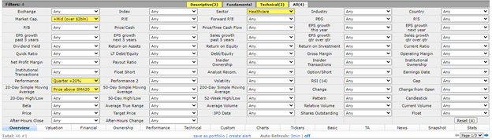

## Table of Contents

## What is swing trading and how does it differ from other trading styles?

Swing trading is a style of trading where you hold onto stocks, currencies, or other financial instruments for a few days to a few weeks. The goal is to make money from short-term price movements. Swing traders look for patterns in price charts that suggest a stock might go up or down soon. They then buy or sell based on these patterns, hoping to sell at a higher price than they bought or buy back at a lower price than they sold.

Swing trading is different from day trading and long-term investing. Day traders buy and sell within the same day, often many times, and never hold positions overnight. They aim to make quick profits from small price changes. On the other hand, long-term investors hold onto their investments for months or years, focusing on the overall growth of the company rather than short-term price movements. Swing trading sits in the middle, taking advantage of price swings that happen over days or weeks, without the stress of constant monitoring that day trading requires.

## What are the essential tools and resources needed for a swing trader's daily routine?

A swing trader needs a good computer with a fast internet connection to keep up with the fast-moving markets. They also need a reliable trading platform that can show them charts and let them buy and sell easily. A charting software is very important because it helps them see patterns in the price movements of stocks or other financial instruments. They also need to have access to financial news and market analysis to stay informed about what's happening that might affect their trades.

Another essential tool is a trading journal where they can write down their trades, what they thought would happen, and what actually happened. This helps them learn from their mistakes and improve their trading strategy over time. A swing trader might also use technical analysis tools, like moving averages or RSI, to help them make better decisions about when to buy or sell. Finally, having a good understanding of risk management is crucial, so they might use tools like stop-loss orders to limit their losses if the market moves against them.

## How does a swing trader typically start their day?

A swing trader usually starts their day early, often before the market opens. They turn on their computer and check their trading platform to see how their current trades are doing. They also look at the latest financial news to see if anything big happened overnight that could affect the markets. This helps them understand what might happen when the market opens.

Next, they open their charting software to look at the price charts of the stocks or other financial instruments they are interested in. They use technical analysis tools to spot any new patterns or trends that could signal good times to buy or sell. They might also review their trading journal to remind themselves of their plan for the day and any lessons they learned from past trades. By the time the market opens, they are ready to make their moves based on what they've seen and learned.

## What are the key market indicators and charts a swing trader should review daily?

A swing trader should start their day by looking at the main market indicators like the S&P 500, Dow Jones, and Nasdaq. These help them understand the overall mood of the market. They should also check economic indicators such as interest rates, employment data, and inflation reports because these can affect the prices of stocks and other financial instruments. Keeping an eye on these indicators gives them a good idea of what might happen during the trading day.

Next, they should review daily and weekly charts of the stocks or other instruments they are interested in. They should look for patterns like support and resistance levels, trend lines, and moving averages. These charts help them see where the price might be heading next. They might also use tools like the Relative Strength Index (RSI) to see if a stock is overbought or oversold. By looking at these charts and indicators every day, a swing trader can make better decisions about when to buy or sell.

## How do swing traders identify potential trading opportunities each day?

Swing traders start their day by checking the big market indicators like the S&P 500, Dow Jones, and Nasdaq. These help them understand if the market is going up or down. They also look at economic news like interest rates and jobs reports because these can affect stock prices. By seeing the big picture, they can guess what might happen to the stocks they are interested in.

Then, swing traders look at daily and weekly charts of the stocks they want to trade. They search for patterns like support and resistance levels, trend lines, and moving averages. These patterns can tell them if a stock's price might go up or down soon. They also use tools like the Relative Strength Index (RSI) to see if a stock is overbought or oversold. By looking at these charts and indicators every day, swing traders can find good times to buy or sell and make money from short-term price swings.

## What is the process of setting up a trade for a swing trader?

When a swing trader wants to set up a trade, they start by looking at the big picture of the market. They check the main market indicators like the S&P 500 and economic news to see if the market is going up or down. This helps them decide if it's a good time to trade. Then, they look at the charts of the stocks they are interested in. They look for patterns like support and resistance levels, trend lines, and moving averages. They also use tools like the Relative Strength Index (RSI) to see if a stock is overbought or oversold. By doing this, they can find good times to buy or sell.

Once they've found a good opportunity, the swing trader decides how much money to put into the trade. They think about how much they can afford to lose and set a stop-loss order to limit their losses if the trade goes the wrong way. They also set a target price for when they want to sell to make a profit. After setting these levels, they place their order through their trading platform. They keep an eye on the trade over the next few days or weeks, ready to make changes if the market changes.

## How should a swing trader manage their trades throughout the day?

A swing trader should keep an eye on their trades throughout the day, even though they don't need to watch them as closely as a day trader. They should check the market a few times a day to see if anything big is happening that could affect their trades. If they see the price moving a lot, they might want to adjust their stop-loss order to protect their money. They also need to be ready to take profits if the price reaches their target.

It's important for a swing trader to stick to their plan and not let their emotions make them do something they might regret. If the market is moving against them, they should think about why it's happening and if it's time to get out of the trade. They should also keep looking at the charts and indicators they used to set up the trade to see if anything has changed. By staying calm and following their plan, a swing trader can manage their trades well and make good decisions.

## What are common strategies used by swing traders to maximize profits and minimize losses?

Swing traders use different strategies to make more money and lose less. One common strategy is to use technical analysis to find good times to buy and sell. They look at charts and use tools like moving averages and the Relative Strength Index (RSI) to see if a stock's price might go up or down soon. They also set stop-loss orders to limit their losses if the trade goes the wrong way. This helps them protect their money and not lose too much if the market moves against them.

Another strategy is to pay attention to the overall market and economic news. Swing traders check the big market indicators like the S&P 500 and look at economic reports to see if the market is going up or down. This helps them decide if it's a good time to trade. They also set target prices for when they want to sell to make a profit. By sticking to their plan and not letting emotions control their decisions, swing traders can manage their trades well and make good choices to maximize their profits and minimize their losses.

## How does a swing trader adjust their strategy based on daily market conditions?

A swing trader adjusts their strategy every day by looking at the big picture of the market. They check the main market indicators like the S&P 500 and read economic news to see if the market is going up or down. If the market seems to be moving in a certain direction, the swing trader might decide to trade more or less that day. For example, if the market is going up, they might look for stocks that are likely to go up too. If the market is going down, they might be more careful and look for stocks that are less likely to lose value.

They also keep an eye on the stocks they are trading by looking at their charts throughout the day. If they see the price moving a lot, they might adjust their stop-loss orders to protect their money. They also need to be ready to take profits if the price reaches their target. If the market changes a lot, they might decide to close their trade early or wait longer to see what happens. By staying calm and following their plan, a swing trader can make good decisions based on what's happening in the market each day.

## What are the best practices for reviewing and analyzing trades at the end of the day?

At the end of the day, a swing trader should take time to review and analyze their trades. They need to look at each trade they made and see if it went the way they expected. They should check if they made a profit or a loss and think about why it happened. It's important to write down what they learned in a trading journal. This helps them remember what worked and what didn't, so they can do better next time.

They should also look at the charts and indicators they used to make their trading decisions. If the market did something unexpected, they need to understand why. Maybe they missed an important news event or didn't see a pattern on the chart. By figuring out what they got wrong, they can adjust their strategy to be more successful in the future. Keeping a clear and honest record of their trades every day helps them improve and make smarter choices.

## How can a swing trader use technology and automation to enhance their daily routine?

A swing trader can use technology and automation to make their daily routine easier and more effective. They can use trading software that automatically updates charts and indicators, so they don't have to spend time doing it themselves. This software can also send them alerts when a stock reaches a certain price or when a pattern appears on the chart. This way, they can quickly see if it's a good time to buy or sell without having to watch the market all day. They can also use apps on their phone to check their trades and the market from anywhere, which is helpful if they need to make a decision while they're away from their computer.

Automation can also help a swing trader manage their trades better. They can set up automatic stop-loss orders and take-profit orders, so their trades close at the right time even if they're not watching. This helps them protect their money and make sure they don't miss out on profits. Some trading platforms also have tools that can analyze past trades and suggest improvements to their strategy. By using these tools, a swing trader can focus more on making good decisions and less on the small tasks that take up time.

## What advanced techniques can expert swing traders employ to refine their daily trading routine?

Expert swing traders can use advanced techniques like backtesting to refine their daily trading routine. Backtesting means they use computer programs to see how their trading strategy would have worked in the past. This helps them find out if their strategy is good or if they need to change it. They also use more complex technical indicators, like the Fibonacci retracement levels or the Ichimoku Cloud, to find better times to buy and sell. These tools help them see more patterns and trends in the market that they might have missed before.

Another technique is to use algorithmic trading, where they create computer programs to automatically buy and sell based on their strategy. This can save them time and help them make trades faster than they could do by themselves. Expert swing traders also pay close attention to market sentiment, using tools like social media analysis to see what other people are thinking about the market. By understanding what other traders are feeling, they can make better guesses about where the market might go next. These advanced techniques help expert swing traders make smarter decisions and improve their daily trading routine.

## What activities can be done during market hours?

Market hours from 9:30 a.m. to 4:00 p.m. EST are a critical phase for swing traders, as they involve real-time market observation and executing trades based on the pre-market analysis. During these hours, swing traders rely heavily on Level II quotes, which provide them with detailed information about the buy and sell orders pending in the market. This data is essential for understanding market [liquidity](/wiki/liquidity-risk-premium) and identifying potential price movements, as it reveals the trading intentions of institutional and retail traders through the size and price of unexecuted orders.

Crafting an effective [exit](/wiki/exit-strategy) strategy is paramount for successful swing trading. Traders often turn to technical analysis to pinpoint optimal exit points. Tools such as Fibonacci extensions and resistance levels form the backbone of technical analysis, helping traders predict potential reversal points where the price might change direction. Fibonacci extensions use specific ratios derived from the Fibonacci sequence to project potential price areas of interest beyond the current trading range. For example:

$$
\text{Target Price} = \text{Swing High} + (\text{Swing High} - \text{Swing Low}) \times \text{Fibonacci Ratio}
$$

Resistance levels are price points where upward trends can pause due to a concentration of selling interest, serving as potential exit points.

Trading during market hours involves dynamic adjustments. Traders must remain vigilant to unexpected news or market shifts that could impact their positions. Precision in trade management is vital, with traders often adjusting stop-loss orders or taking partial profits to manage risk. They continuously evaluate their positions in response to unfolding market dynamics, ensuring alignment with the pre-established trading plan.

Moreover, swing traders regularly assess the risk-to-reward ratio of their active trades, a crucial element in deciding whether to exit a trade or adjust a position. This continuous evaluation aims to optimize gains while minimizing potential losses, reflecting the disciplined approach required for swing trading during market hours.

## References & Further Reading

[1]: Bergstra, J., Bardenet, R., Bengio, Y., & Kégl, B. (2011). ["Algorithms for Hyper-Parameter Optimization."](https://dl.acm.org/doi/10.5555/2986459.2986743) Advances in Neural Information Processing Systems 24.

[2]: ["Advances in Financial Machine Learning"](https://www.amazon.com/Advances-Financial-Machine-Learning-Marcos/dp/1119482089) by Marcos Lopez de Prado

[3]: ["Evidence-Based Technical Analysis: Applying the Scientific Method and Statistical Inference to Trading Signals"](https://www.amazon.com/Evidence-Based-Technical-Analysis-Scientific-Statistical/dp/0470008741) by David Aronson

[4]: ["Machine Learning for Algorithmic Trading"](https://github.com/stefan-jansen/machine-learning-for-trading) by Stefan Jansen

[5]: ["Quantitative Trading: How to Build Your Own Algorithmic Trading Business"](https://www.amazon.com/Quantitative-Trading-Build-Algorithmic-Business/dp/1119800064) by Ernest P. Chan