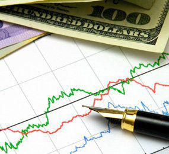

Swing trading is a dynamic approach to the financial markets, combining elements of both fundamental and technical analysis to exploit medium-term price movements. This style of trading is positioned between day trading's rapid pace and long-term investing's more gradual approach, offering a unique balance that attracts many market participants. By merging fundamental factors, such as earnings reports and economic indicators, with technical tools like charts and trendlines, swing traders aim to capture significant market swings and optimize their return on capital.

The advantages of swing trading are often offset by inherent challenges. Such trading requires managing increased volatility, which can be caused by unexpected news or market shifts. This volatility is double-edged, offering both opportunities and risks. Additionally, transaction costs can accumulate due to the relatively higher frequency of trades compared to longer-term strategies, making the impact of commissions on overall profitability a critical consideration.



Successfully navigating the complexities of swing trading requires a disciplined approach. Developing a structured daily routine is not just beneficial but essential. This routine allows traders to systematically assess market conditions, refine their strategies, and make informed decisions that align with their trading objectives. 

In this article, we explore the components of an effective swing trading routine. From pre-market preparation to after-hours review, each step is crafted to help traders efficiently manage their trades. By understanding these nuances and implementing a disciplined approach, traders can enhance their potential for higher returns while effectively managing the risks that accompany this trading style.

## Table of Contents

## Pre-Market Preparations

Swing traders typically begin their day early, often around 6:00 a.m. EST, in order to align with the opening hours of international markets and to assimilate the latest developments from overnight trading. This timeframe is vital for setting the tone for the day, beginning with a comprehensive review of market news and indicators that could impact the day's trading.

The first task is to assess the overall market sentiment. Traders rely on a variety of news sources, such as financial news websites, Bloomberg, CNBC, and economic reports, to gather information on global economic indicators, geopolitical events, and corporate news that could influence market movements. Understanding these factors helps traders anticipate market trends and adjust their strategies accordingly.

A critical element of the pre-market routine is analyzing sector growth and performance. This requires reviewing recent sector-specific developments to identify trends. For instance, if there is a positive development in the technology sector, traders may shift their focus to tech stocks that have the potential for upward movement. This analysis can be supported by tools such as stock screeners and sector indices, which provide a granular view of the performance and potential opportunities within specific sectors.

An important part of finding potential trades is monitoring SEC filings and press releases for special opportunities. These filings often contain crucial information like earnings reports, insider trading activities, and significant corporate actions, which can present lucrative trading opportunities. Websites like the SEC's EDGAR database are invaluable resources for accessing these documents efficiently.

Creating a daily watchlist is another essential activity during pre-market preparations. Traders curate this list based on fundamental catalysts such as earnings announcements, news about mergers and acquisitions, or large investor position changes. A systematic approach to building this watchlist ensures that traders are prepared to act quickly when the market opens, optimizing their chances for successful trades.

Additionally, revisiting existing positions is necessary to decide whether adjustments are required based on any new data or anticipated market movements. This involves checking stop-loss orders, setting price targets, and reviewing prior day trades to determine if holding, exiting, or augmenting current positions is advisable. 

By meticulously executing these pre-market preparations, swing traders position themselves to capitalize on significant market swings and enhance their trading efficacy throughout the day.

## Market Hours Activities

Market hours from 9:30 a.m. to 4:00 p.m. EST are a critical phase for swing traders, as they involve real-time market observation and executing trades based on the pre-market analysis. During these hours, swing traders rely heavily on Level II quotes, which provide them with detailed information about the buy and sell orders pending in the market. This data is essential for understanding market [liquidity](/wiki/liquidity-risk-premium) and identifying potential price movements, as it reveals the trading intentions of institutional and retail traders through the size and price of unexecuted orders.

Crafting an effective [exit](/wiki/exit-strategy) strategy is paramount for successful swing trading. Traders often turn to technical analysis to pinpoint optimal exit points. Tools such as Fibonacci extensions and resistance levels form the backbone of technical analysis, helping traders predict potential reversal points where the price might change direction. Fibonacci extensions use specific ratios derived from the Fibonacci sequence to project potential price areas of interest beyond the current trading range. For example:

$$
\text{Target Price} = \text{Swing High} + (\text{Swing High} - \text{Swing Low}) \times \text{Fibonacci Ratio}
$$

Resistance levels are price points where upward trends can pause due to a concentration of selling interest, serving as potential exit points.

Trading during market hours involves dynamic adjustments. Traders must remain vigilant to unexpected news or market shifts that could impact their positions. Precision in trade management is vital, with traders often adjusting stop-loss orders or taking partial profits to manage risk. They continuously evaluate their positions in response to unfolding market dynamics, ensuring alignment with the pre-established trading plan.

Moreover, swing traders regularly assess the risk-to-reward ratio of their active trades, a crucial element in deciding whether to exit a trade or adjust a position. This continuous evaluation aims to optimize gains while minimizing potential losses, reflecting the disciplined approach required for swing trading during market hours.

## After-Hours Market Review

After-hours trading, which takes place outside regular market hours (9:30 a.m. to 4:00 p.m. EST), presents unique challenges primarily due to reduced market liquidity. This low liquidity environment can lead to increased [volatility](/wiki/volatility-trading-strategies), meaning price movements might not reflect the actual market sentiment. Consequently, executing trades during this time can be risky and is generally not recommended. However, this period serves as an optimal opportunity for performance evaluation and strategic planning.

One critical activity for swing traders during after-hours is meticulously documenting all trades executed during the day. Accurate record-keeping is essential not only for tax purposes but also for systematic performance analysis. Traders can implement software tools or manual spreadsheets to log entries, exits, profit and loss data, and reasons for each trade. This practice enables traders to identify patterns or recurring issues in their trading strategies and make data-driven adjustments.

Another significant task is reassessing open positions. After-hours is a crucial time for reviewing any positions impacted by announcements made after the market has closed, such as earnings reports or corporate statements. These activities can significantly influence stock prices by the time the market opens the next day. Traders should consider using alert systems to notify them promptly of such announcements, allowing them to reassess positions and make informed decisions.

Traders may also take this time to evaluate broader market conditions and sector-specific news that could influence their holdings. This strategic analysis can inform decisions on holding, adding to, or exiting positions moving forward.

In summary, after-hours trading provides a valuable window for review and reflection, empowering swing traders to prepare better for the following trading day while maintaining discipline and focus.

## The Role of Algorithmic Trading

Algorithmic trading is an advanced technique utilized in swing trading that involves using computer algorithms to execute trades. These algorithms are designed to perform tasks at speeds and frequencies impossible for a human trader, often leveraging complex mathematical models and computations to make critical trading decisions. The primary advantage of [algorithmic trading](/wiki/algorithmic-trading) is its ability to process diverse market data and identify patterns or trends that would typically be missed by a human trader. This mechanized approach allows for executing trades with high efficiency, precision, and speed, minimizing human errors and emotional biases.

Algorithmic trading strategies can be crafted by using [machine learning](/wiki/machine-learning) models, statistical analysis, and [backtesting](/wiki/backtesting) historical market data. For example, machine learning models such as random forests, support vector machines, or neural networks can be trained on historical price data to predict future price movements, thus facilitating more informed trading decisions. Furthermore, algorithms can be programmed to follow specific trading rules, such as mean reversion or [momentum](/wiki/momentum) strategies, which further automates the trading process.

Despite the potential advantages, algorithmic trading does pose several challenges. Developing robust algorithms requires substantial expertise in both programming and financial markets. Moreover, market conditions are not static, and algorithms must be continuously refined and tested to maintain their effectiveness. This dynamic nature of markets may introduce unpredictable risks, and traders should combine algorithmic methods with human oversight to optimize performance. 

Consider the following simplified Python script as an example of a basic momentum trading algorithm:

```python
import pandas as pd

def momentum_strategy(data, window=5):
    # Calculate momentum
    data['momentum'] = data['Close'] - data['Close'].shift(window)

    # Generate trading signals
    data['signal'] = 0
    data.loc[data['momentum'] > 0, 'signal'] = 1  # Buy signal
    data.loc[data['momentum'] < 0, 'signal'] = -1 # Sell signal

    return data

# Assuming 'data' is a DataFrame with historical price data
data = pd.read_csv('historical_prices.csv')
result = momentum_strategy(data)
print(result)
```

This script calculates momentum as the difference between the current closing price and the closing price x days ago. Depending on whether the momentum is positive or negative, the algorithm generates a buy or sell signal, respectively. This simple strategy can be enhanced and adapted for more complex usage, integrating additional variables, constraints, and thresholds specific to the trader's strategy.

Understanding both manual and algorithmic trading methods is crucial for a comprehensive trading strategy. By effectively integrating algorithmic techniques with traditional human-led analysis, traders can achieve a balanced approach, optimizing their trading activities while potentially increasing returns.

## Conclusion: Charting a Course for Success

A systematic daily routine is integral to successful swing trading. By aligning with market rhythms, traders can position themselves to make informed decisions that capitalize on market movements. The benefits of such a routine are multi-fold, involving diligent preparation, strategic planning, and continuous evaluation of performance.

Preparation begins with early market assessments, where traders absorb financial news, economic data, and trends that may affect their trading strategy. This foundational step ensures that traders enter the market with a well-informed perspective, ready to identify opportunities and mitigate risks effectively.

Strategic planning involves crafting a plan that includes entry, exit, and risk management strategies. Employing technical analysis tools and fundamental insights allows traders to set realistic objectives and adapt to changing market conditions. Having clear guidelines helps minimize indecision and emotional responses, which can often lead to costly trading mistakes.

Continuous performance evaluation further enhances trading efficacy. By documenting trades, assessing outcomes, and reflecting on decisions, traders create a feedback loop that bolsters their decision-making skills. This process not only aids in refining strategies but also in fostering discipline and accountability.

Incorporating algorithmic trading strategies can augment these practices. Automation aids in the rapid execution of trades and reduces the potential for human error. By marrying algorithmic efficiency with human judgment, traders can potentially elevate their trading results.

In conclusion, the successful implementation of these practices can lead to optimized trading activities and enhanced market returns. Consistent application of a structured routine arms swing traders with the necessary tools and mindset to navigate the complexities of the market and achieve their financial goals.

## References & Further Reading

[1]: Bergstra, J., Bardenet, R., Bengio, Y., & Kégl, B. (2011). ["Algorithms for Hyper-Parameter Optimization."](https://dl.acm.org/doi/10.5555/2986459.2986743) Advances in Neural Information Processing Systems 24.

[2]: ["Advances in Financial Machine Learning"](https://www.amazon.com/Advances-Financial-Machine-Learning-Marcos/dp/1119482089) by Marcos Lopez de Prado

[3]: ["Evidence-Based Technical Analysis: Applying the Scientific Method and Statistical Inference to Trading Signals"](https://www.amazon.com/Evidence-Based-Technical-Analysis-Scientific-Statistical/dp/0470008741) by David Aronson

[4]: ["Machine Learning for Algorithmic Trading"](https://github.com/stefan-jansen/machine-learning-for-trading) by Stefan Jansen

[5]: ["Quantitative Trading: How to Build Your Own Algorithmic Trading Business"](https://www.amazon.com/Quantitative-Trading-Build-Algorithmic-Business/dp/1119800064) by Ernest P. Chan