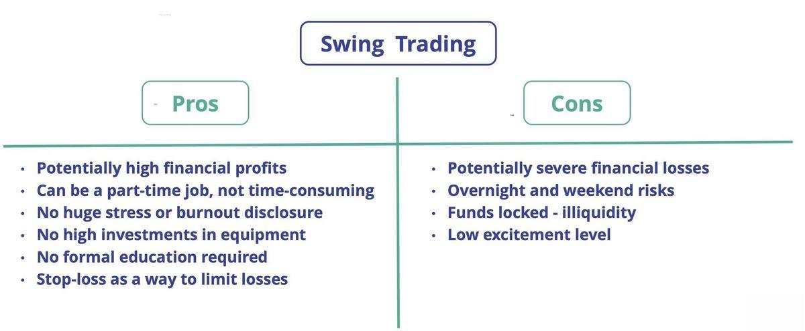

In the ever-evolving world of finance, investing has become a multifaceted field. Investors are increasingly faced with a broad spectrum of strategies, each offering distinct opportunities and challenges. Among the plethora of investment techniques, swing trading and algorithmic trading have emerged as prominent strategies favored by many modern investors.

Swing trading focuses on capturing short- to medium-term gains in financial markets. This strategy requires a keen understanding of technical analysis, allowing traders to identify and capitalize on market momentum shifts. By engaging in trades that typically last from a few days to several weeks, swing traders aim to exploit price fluctuations to generate profits. Despite its dynamic nature, swing trading can yield significant returns if executed with precision and acumen.



On the other hand, algorithmic trading, commonly referred to as algo trading, employs sophisticated computer programs to automate trading based on predefined criteria. By leveraging complex mathematical models and real-time data processing, algorithmic trading enables investors to execute a high volume of trades at unprecedented speeds. This approach minimizes human error and emotional influence in trading decisions, making it an attractive option for institutional investors and hedge funds focused on optimizing trading efficiency.

This article explores the intricacies of swing and algorithmic trading, offering insights into their respective advantages and drawbacks. By understanding these strategies, both novice and seasoned investors can enhance their investment repertoire and better navigate the complexities of modern financial markets.

## Table of Contents

## Understanding Swing Trading

Swing trading is an investment strategy that targets short- to medium-term gains through the buying and selling of financial instruments. This approach is characterized by holding positions for a duration ranging from a few days to several weeks. Unlike day trading, which involves executing multiple trades within a single day, swing trading focuses on capturing larger price movements or "swings" in the market while avoiding the need for constant market monitoring.

At the core of swing trading is technical analysis, a method used to evaluate potential trading opportunities by analyzing statistical trends derived from trading activity, such as price movement and volume. Traders employ a variety of technical indicators, such as moving averages, Bollinger Bands, and Relative Strength Index (RSI), to identify trends and possible entry and exit points. For instance, when a stock's price crosses above its 50-day moving average, it may signal a bullish trend, indicating a potential buying opportunity.

Momentum shifts are integral to swing trading. The strategy requires recognizing periods during which securities gain or lose value rapidly, which often precedes a price correction or reversal. Swing traders aim to enter the market at these reversal points to capitalize on the ensuing [momentum](/wiki/momentum). To optimize their chances of success, they may set stop-loss orders to limit potential losses and take-profit orders to secure gains at predetermined levels.

The ability to exploit price fluctuations effectively can lead to significant returns if the trades are well-timed and the market conditions favorable. However, it is vital to acknowledge that the [volatility](/wiki/volatility-trading-strategies) intrinsic to such trading methods also poses higher risks. Thus, swing traders must maintain strict discipline in managing risk and executing trades based on analytical evidence rather than emotional responses. 

Ultimately, swing trading is a dynamic and potentially lucrative approach that requires careful planning and execution. While it demands less time than [day trading](/wiki/day-trading-spy), it still necessitates a thorough understanding of market behavior and technical analysis to be successful.

## Pros and Cons of Swing Trading

Swing trading is known for its relative time flexibility compared to day trading, making it attractive to investors who cannot dedicate full-time hours to the markets. This approach allows traders to capture potentially higher returns because it capitalizes on short-term price movements. These movements offer opportunities to enter and [exit](/wiki/exit-strategy) positions based on changes in market momentum. The ability to trade over days or weeks rather than intraday provides investors the potential to benefit from larger price swings, which can often result in significant returns when traded correctly.

However, this strategy also carries inherent risks and disadvantages. Due to the frequent buying and selling of financial instruments, swing trading incurs higher transaction costs. These costs are influenced by brokerage fees, taxes, and the bid-ask spread, all of which can eat into profits over time, especially if the trader is not consistently accurate in their market predictions.

Market unpredictability is another major concern. If a trade goes against the trader's expectations, rapid and substantial losses can occur due to sudden price swings. This is particularly prevalent in volatile market conditions where price movements are less predictable.

Technical analysis, a cornerstone of swing trading, involves using historical price and [volume](/wiki/volume-trading-strategy) data to forecast future movements. However, reliance on technical indicators and chart patterns can sometimes lead to false signals. These false signals can result in entering or exiting trades at inappropriate times, leading to unsuccessful trades and potential financial losses. Traders should always consider supplementing technical analysis with a broader market understanding and risk management strategies to mitigate these risks effectively.

## Exploring Algorithmic Trading

Algorithmic trading, often referred to as algo trading, relies on computer programs to execute trades based on pre-established criteria. This technologically driven approach leverages advanced mathematical models and sophisticated algorithms to make trading decisions at speeds unattainable by human traders. The primary objective is to automate pre-defined trading strategies, ensuring swift and precise transaction execution in response to real-time market variables.

One key advantage of [algorithmic trading](/wiki/algorithmic-trading) is its ability to process and analyze vast data sets rapidly. Algorithms can scrutinize diverse financial data, recognizing patterns and executing trades in milliseconds. This capacity to handle large volumes of transactions efficiently is crucial in markets where time is a critical [factor](/wiki/factor-investing) in determining profit or loss.

Algorithmic trading significantly diminishes the influence of human emotion, a common stumbling block in traditional trading methods. This systematization reduces errors associated with emotional decision-making, such as panic selling or overly conservative buying. By adhering strictly to algorithmic protocols, this method promotes a disciplined and consistent trading strategy. For instance, the implementation of a moving average crossover strategy can be automated to execute trades whenever a predefined moving average condition is met. 

Python is commonly used for implementing algorithmic trading strategies due to its simplicity and extensive library support, such as NumPy for numerical computations and Pandas for data manipulation. An example of a simple algorithmic trading strategy in Python is illustrated below:

```python
import pandas as pd

# Load your data
data = pd.read_csv('stock_prices.csv')

# Calculate moving averages
data['SMA_50'] = data['Close'].rolling(window=50).mean()
data['SMA_200'] = data['Close'].rolling(window=200).mean()

# Define trading signals
data['Signal'] = 0
data.loc[data['SMA_50'] > data['SMA_200'], 'Signal'] = 1
data.loc[data['SMA_50'] < data['SMA_200'], 'Signal'] = -1

# Trades execution
data['Position'] = data['Signal'].diff()

print(data[['Close', 'SMA_50', 'SMA_200', 'Signal', 'Position']].tail())
```

This example demonstrates how a simple moving average crossover strategy might be automated, triggering buy or sell signals based on the crossover of the 50-day and 200-day moving averages.

Algorithmic trading is prevalent among institutional investors and hedge funds that benefit from the enhanced efficiency and execution speed it provides. These entities often employ strategies that range from statistical [arbitrage](/wiki/arbitrage) to high-frequency trading, exploiting minute price discrepancies across different markets or exchanges to generate profits. The strategy's reliance on algorithmic precision eliminates the possibility of human error and positions such investors to respond instantly to emerging opportunities or shifting market conditions.

In essence, algorithmic trading represents a fusion of finance and technology, facilitating improved trade execution and strategy implementation. However, the complexity and infrastructure required to develop effective algorithmic systems present significant barriers to entry, making it predominantly accessible to entities with substantial resources and technical expertise.

## Pros and Cons of Algorithmic Trading

Algorithmic trading offers numerous advantages in the modern trading environment, primarily due to its ability to execute orders at a speed and efficiency unmatched by human traders. This speed advantage allows algorithms to capitalize on fleeting market opportunities, executing trades in milliseconds. For example, a computer program can monitor multiple markets and execute trades based on specified criteria almost instantaneously. Such high-frequency trading can be crucial in markets where prices change quickly, offering an edge in terms of precision and timing.

A key benefit of algorithmic trading is its capacity to handle large volumes of data and identify investment opportunities in real-time. By leveraging complex mathematical models, algorithms can swiftly analyze diverse datasets, identifying patterns, trends, and correlations that human traders might overlook. The integration of [machine learning](/wiki/machine-learning) and [artificial intelligence](/wiki/ai-artificial-intelligence) (AI) further enhances this capability, allowing trading systems to improve and adapt over time.

However, the deployment of algorithmic trading systems involves significant upfront investments. Developing robust trading algorithms requires substantial technical expertise and resources. It encompasses costs related to acquiring high-quality data, computational infrastructure, and cybersecurity measures to protect against threats such as data breaches or algorithm manipulation.

Moreover, algorithmic trading is not without risks. Market volatility or irregularities can amplify the risks, potentially resulting in substantial financial losses. Algorithms operate based on pre-programmed criteria and are not inherently designed to account for unanticipated market events or structural changes. This limitation was famously illustrated during the "Flash Crash" on May 6, 2010, when algorithmic trading contributed to a rapid, albeit short-lived, collapse in stock prices.

Another drawback of pure algorithmic systems is their occasional lack of intuition and adaptability experienced human traders provide. While algorithms can process data and execute trades efficiently, they may struggle in dynamic contexts where nuanced judgment is required. Human traders can consider qualitative factors, unstructured data, and strategic considerations that a purely quantitative approach might miss.

In conclusion, while algorithmic trading offers speed and efficiency advantages, its effective deployment requires significant technical knowledge and investment. The inability of algorithms to incorporate human-like intuition and adapt to unforeseen events represents a critical limitation, necessitating cautious and informed application to mitigate potential risks.

## Choosing the Right Strategy

Determining the right trading strategy involves assessing individual objectives, risk tolerance, and market experience. Swing trading might attract those who seek an engaging investment method without needing to commit entirely. It allows part-time investors to participate in the market actively while still holding other professional responsibilities. Swing trading leverages market trends over days or weeks, offering potential profits through price fluctuations.

Algorithmic trading, on the other hand, is more suited for individuals with access to sophisticated technology and proficiency in data analysis. This strategy can handle substantial amounts of data and operationalize complex trading algorithms that eliminate emotional biases. For traders with the necessary resources, algorithmic trading can yield high-frequency trading opportunities with precision and speed unattainable by manual methods.

Combining these strategies can provide a balanced approach, leading to diversified profits and risk mitigation. By employing multiple tactics, investors can capitalize on various market conditions, compensating for the limitations inherent in any single method. A hybrid strategy might, for instance, use swing trading for engaging market trends and algorithmic trading for executing rapid transactions during volatile periods.

Consistent evaluation of these approaches is crucial. Investors must remain informed of market developments and continuously assess their strategy's effectiveness. Market conditions can shift rapidly, necessitating adaptability in trading strategies to maintain optimal performance. This involves reviewing performance metrics and making data-informed adjustments when necessary.

Ultimately, a well-rounded strategy accounts for individual circumstances and adapts to evolving market dynamics. By balancing long-term objectives with short-term opportunities, investors can maximize their success while minimizing exposure to market risks.

## Conclusion

In conclusion, both swing trading and algorithmic trading present investors with unique advantages and limitations, reflecting distinct methodologies tailored to different market environments. Understanding the mechanics of each approach is essential for investors to navigate potential pitfalls and make informed decisions. For instance, swing trading offers flexibility for those favoring short- to medium-term investment horizons, but it demands keen attention to market fluctuations and technical analysis. Conversely, algorithmic trading leverages technology and advanced mathematical models to make high-speed trading decisions, necessitating substantial initial investments in technology and proficiency in code and data analysis.

As market conditions constantly change, the ability to adapt and refine strategies is crucial. Swing traders must be vigilant in monitoring market trends and patterns, while algorithmic traders should regularly update algorithms to incorporate new data points and market variables. Both require a proactive approach to remain effective.

The financial landscape is dynamic and continuously evolving, emphasizing the importance of staying educated and adaptable. Investors who commit to continual education and market analysis can better position themselves to handle emerging opportunities and challenges within both trading strategies.

Ultimately, a well-rounded approach to investment strategies is vital to maximize opportunities and mitigate risks. Employing a combination of swing and algorithmic trading can diversify an investor's portfolio, offering a balanced avenue for pursuit of profits while cushioning against potential downturns. By critically evaluating each strategy's role in their overall investment plan, investors can optimize their chances for success in the ever-evolving world of finance.

## References & Further Reading

[1]: Bergstra, J., Bardenet, R., Bengio, Y., & Kégl, B. (2011). ["Algorithms for Hyper-Parameter Optimization."](https://papers.nips.cc/paper/4443-algorithms-for-hyper-parameter-optimization) Advances in Neural Information Processing Systems 24.

[2]: ["Advances in Financial Machine Learning"](https://www.amazon.com/Advances-Financial-Machine-Learning-Marcos/dp/1119482089) by Marcos Lopez de Prado

[3]: ["Evidence-Based Technical Analysis: Applying the Scientific Method and Statistical Inference to Trading Signals"](https://www.amazon.com/Evidence-Based-Technical-Analysis-Scientific-Statistical/dp/0470008741) by David Aronson

[4]: ["Machine Learning for Algorithmic Trading"](https://github.com/stefan-jansen/machine-learning-for-trading) by Stefan Jansen

[5]: ["Quantitative Trading: How to Build Your Own Algorithmic Trading Business"](https://www.amazon.com/Quantitative-Trading-Build-Algorithmic-Business/dp/1119800064) by Ernest P. Chan