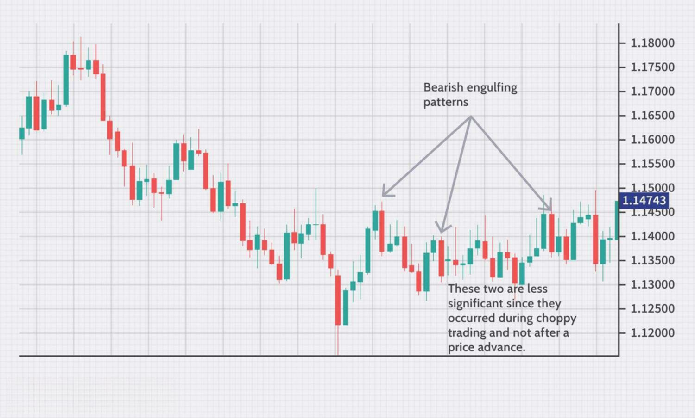

Swing trading futures is a unique and dynamic trading strategy that combines the inherent volatility of futures markets with the more stable approach of medium-term trades. Unlike day trading, which requires constant monitoring of market movements, swing trading typically holds positions from a few days to several weeks. This strategic holding period allows traders to capitalize on short-term market trends without the demand for continuous oversight. 

Futures markets themselves encompass a broad array of asset classes, including commodities, indices, and currencies, each presenting varying levels of volatility and risk. Futures contracts are standardized agreements to buy or sell an asset at a predetermined price at a specific point in the future. The leverage potential in futures trading can also be alluring, as it allows traders to manage large positions with a smaller capital outlay, increasing both the risk and potential returns.



Incorporating algorithmic trading into the swing trading of futures can enhance the strategy's effectiveness by automating decision-making processes. Algorithms, through complex mathematical models and historical data analysis, can identify trading opportunities and execute trades with precision and speed. This automated approach reduces the emotional biases often associated with manual trading, allowing for consistency and discipline in executing trades.

The integration of technology in trading strategies represents a significant advancement for both novice and experienced traders. By leveraging algorithmic tools, traders can optimize their approach, ensuring that no potential market opportunity is missed due to human limitations. Algorithmic trading also facilitates complex risk management strategies, including the automated setting of stop-loss and take-profit conditions, which are essential for managing the inherent risk of futures trading.

This article will explore the landscape of swing trading futures within algorithmic trading, detailing the strategies, capital requirements, and necessary steps to begin this trading approach. Whether starting as a futures trader or looking to integrate technology into an existing strategy, understanding and utilizing algorithms in swing trading can be a transformative experience. By gaining insights into the intricacies of futures contracts, the potential benefits of swing trading, and the optimization capabilities of algorithms, traders can position themselves for success in the dynamic world of financial markets.

## Table of Contents

## Understanding Swing Trading

Swing trading is a trading strategy that focuses on capturing short-term price movements, typically holding positions from a few days to several weeks. The primary aim of swing trading is to capitalize on the 'swings' in asset prices, whether they are upward or downward movements. This method often relies on technical analysis to identify potential trading opportunities, with traders utilizing various tools and indicators to guide their decisions.

At the core of swing trading is the analysis of price patterns and market trends through daily charts. Traders often employ technical indicators such as moving averages, relative strength index (RSI), and MACD (Moving Average Convergence Divergence) to pinpoint trends and potential reversal points. By analyzing these charts, swing traders can identify moments when an asset is likely to change direction, entering and exiting positions based on these predictive signals.

The strategy of swing trading offers certain advantages, especially for those who do not have the luxury of time to monitor the markets incessantly. Unlike [day trading](/wiki/day-trading-spy), which requires constant attention due to the fast pace and short duration of trades, swing trading allows traders to evaluate positions over a longer timeframe. This longer perspective grants traders the ability to manage trades without the need for continuous oversight, making it a feasible choice for those balancing trading with other commitments.

Despite its longer timeframe compared to day trading, swing trading still involves holding positions overnight, which introduces an additional layer of risk. Various factors, such as unexpected news events or economic reports, can impact market conditions while markets are closed, potentially affecting open positions. Therefore, swing traders must employ sound risk management strategies to mitigate potential losses.

Swing trading is distinct from high-frequency trading ([HFT](/wiki/high-frequency-trading-strategies)) in that it does not rely on executing a high [volume](/wiki/volume-trading-strategy) of trades in milliseconds. Instead, it capitalizes on broader market movements over several days. This approach requires traders to exercise patience and timing, allowing profits to accrue as trades develop over the swing duration.

Overall, swing trading is an adaptable strategy suitable for those who seek a balanced approach between the immediacy of day trading and the prolonged commitment of long-term investing. It leverages technical analysis to identify and exploit short- to medium-term price trends, offering a systematic methodology for participating in the financial markets.

## Futures Trading Essentials

Futures trading involves the buying and selling of standardized contracts that obligate the parties to transact an asset at a predetermined price at a specified future date. These contracts encompass a broad spectrum of asset classes, including commodities such as oil and wheat, financial indices, and various currencies. The standardized nature of futures contracts implies that each contract has specific terms, such as contract size, tick value, and expiration date, which are essential for traders to understand.

A defining feature of futures trading is the leverage it offers. Leverage allows traders to control significant contract values with a relatively modest capital investment. For instance, a trader may only need to deposit a small fraction of the total contract value as margin, which enhances the potential for substantial gains. However, leverage also amplifies the risk, which necessitates effective risk management strategies.

Futures markets are known for their inherent [volatility](/wiki/volatility-trading-strategies). Prices can fluctuate significantly within short timeframes, influenced by various factors like geopolitical events, economic reports, and changes in supply and demand dynamics. Due to this volatility, traders must develop robust risk management protocols to protect their capital. Such strategies typically include the use of stop-loss orders, diversification across different contracts, and maintaining adequate margin balances to weather adverse market movements.

Understanding contract specifications is crucial for success in futures trading. Each contract's details, including its size, tick value, and expiration date, directly impact the potential profits and losses from trades. For instance, the tick value determines the smallest price increment worth, affecting how profits and losses are calculated.

In summary, futures trading provides opportunities through its extensive asset coverage and leverage potential but requires a comprehensive understanding of contract specifications and diligent risk management due to its inherent volatility.

## The Role of Algorithms in Swing Trading Futures

Algorithmic trading significantly upgrades the process of swing trading in futures by automating data-driven decisions. This results in increased efficiency and reduced emotional biases. Algorithms swiftly scan multiple markets and timeframes, identifying trading opportunities with enhanced speed and precision. This capability is crucial for swing trading since the markets are continuously moving, and human traders might not be able to monitor and react as efficiently to these rapid changes.

One of the prominent advantages of using algorithms is the ability to execute trades round-the-clock. This 24/7 operational capability ensures that profitable opportunities are not overlooked, especially in the global futures markets where trading activity may occur across various time zones. This continuous monitoring and execution capability is beyond human capacity, making [algorithmic trading](/wiki/algorithmic-trading) a significant edge for swing traders.

Backtesting is another critical benefit of algorithmic trading in swing strategies. By applying algorithms to historical data, traders can refine their strategies to maximize the probability of success. This process involves the rigorous testing of trading rules against past market data to see how they would have performed. The results of [backtesting](/wiki/backtesting) can then be used to improve and optimize strategies before they are applied in live trading environments.

Risk management protocols are integral to any trading strategy, and algorithms can efficiently automate these tasks. Features like stop-loss and take-profit levels can be embedded directly into the trading algorithm. This automation ensures that the trades adhere to predetermined risk management guidelines, thereby preventing emotional decision-making and ensuring that the trade closes at the right time to either cut losses or take profits.

Integrating these functionalities into a cohesive algorithm requires a solid framework and programming skills, typically in languages like Python. Here's a simple Python snippet leveraging a moving average crossover strategy as an example of using algorithms for swing trading:

```python
import pandas as pd

# Sample data for demonstration purposes
data = pd.DataFrame({
    'price': [105, 110, 102, 115, 116, 118, 120, 119, 117]
})

# Calculate moving averages
data['short_mavg'] = data['price'].rolling(window=2).mean()
data['long_mavg'] = data['price'].rolling(window=4).mean()

# Generate signals
data['signal'] = 0
data['signal'][data['short_mavg'] > data['long_mavg']] = 1
data['signal'][data['short_mavg'] < data['long_mavg']] = -1

# Backtest strategy
data['position'] = data['signal'].shift()
data['strategy_return'] = data['position'] * data['price'].pct_change()

print(data)
```

This script calculates short and long moving averages of asset prices and generates buy/sell signals based on the crossover. Traders can expand such basic algorithms to incorporate complex strategies and adapt to different market conditions, thereby optimizing the futures swing trading process.

## Developing Strategies for Algo-Swing Trading

Effective algorithmic swing trading strategies rely heavily on technical indicators to detect viable trade signals within futures markets. These strategies are rooted in distinct methodologies such as mean reversion, [momentum](/wiki/momentum) trading, and breakouts. Each of these requires careful adaptation and tuning to different futures markets to maximize potential gains.

Mean reversion strategies are predicated on the statistical tendency for asset prices to return to their historical average. This approach assumes that deviations from the mean are temporary and will revert, offering opportunities to capitalize on these dislocations. Traders often employ technical indicators such as Bollinger Bands, which measure market volatility and provide a dynamic range around the moving average. A typical mean reversion strategy might involve buying when a price dips below the lower Bollinger Band and selling when it exceeds the upper band. Python can facilitate this through libraries like `numpy` and `pandas` for computation and `matplotlib` for visualization:

```python
import pandas as pd
import numpy as np
import matplotlib.pyplot as plt

# Example Code for Mean Reversion Strategy
data = pd.read_csv('futures_data.csv')  # Load your futures data
data['Moving Average'] = data['Close'].rolling(window=20).mean()
data['Bollinger High'] = data['Moving Average'] + (data['Close'].rolling(window=20).std() * 2)
data['Bollinger Low'] = data['Moving Average'] - (data['Close'].rolling(window=20).std() * 2)

# Plotting
plt.figure(figsize=(12, 6))
plt.plot(data['Close'], label='Close Price')
plt.plot(data['Bollinger High'], label='Bollinger High', linestyle='--')
plt.plot(data['Bollinger Low'], label='Bollinger Low', linestyle='--')
plt.legend(loc='upper left')
plt.show()
```

Momentum strategies focus on capturing gains by riding the crest of market trends, identifying and acting on strong directional price movements. Key indicators include the Relative Strength Index (RSI), which helps determine if an asset is overbought or oversold, influencing entry and [exit](/wiki/exit-strategy) points. A momentum-based strategy might initiate a buy when the RSI crosses above 30, indicating a bullish reversal from oversold conditions, and a sell when crossing below 70, signaling a bearish reversal from overbought conditions.

Breakout strategies exploit significant price movements past established support or resistance levels. Such breakouts often indicate the beginning of a substantial trend, providing opportunities for significant gains. Traders typically employ moving averages and volume indicators to confirm valid breakouts. A strategy may involve taking a long position when the price decisively breaks above a resistance level, sustained by above-average volume, while setting stop-losses just below the [breakout](/wiki/breakout-trading) point to manage potential reversals.

Customizing these strategies for various futures markets necessitates continuous optimization to accommodate intrinsic market volatility, contract specifications, and trading hours. Algorithmic tools permit backtesting against historical data to refine these strategies, ensuring robustness and adaptability to current market conditions. By iterating on strategy parameters and rigorously testing across different market scenarios, traders can enhance their trading algorithms' performance.

The intersection of technical analysis and automated execution facilitates a strategic edge in futures markets, allowing traders to respond swiftly to opportunities while managing risks effectively.

## Getting Started with Algo Swing Trading Futures

To embark on algo swing trading futures, it is essential to first acquire a solid understanding of the futures market, its inherent risks, and operational mechanics. Futures trading involves agreements to buy or sell an asset at a future date and set price, with the leverage potential possibly amplifying both gains and losses. Being well-versed with these aspects facilitates informed decision-making and effective risk management.

One of the primary steps involves selecting a robust trading platform. A suitable platform should support algorithmic execution, offer backtesting capabilities, and provide reliable and high-quality market data. Platforms like MetaTrader 5 or NinjaTrader are popular choices as they cater to algorithmic traders with these features. Moreover, the chosen platform should also offer API access for seamless integration of custom-developed algorithms.

Adequate capital is crucial in futures trading to meet the margin requirements and to diversify across multiple contracts. Margin requirements are predetermined deposits that act as a performance bond. Diversification reduces the risk of heavy losses by spreading exposure across different assets. Evaluating your financial situation to ensure capital adequacy for meeting these requirements is imperative.

The development or acquisition of proven trading algorithms is another critical step. These algorithms should be well-aligned with your risk tolerance and trading objectives. Technical indicators like moving averages or more sophisticated models such as [machine learning](/wiki/machine-learning) can be used to develop these algorithms. A simple Python example is illustrated below:

```python
import numpy as np
import pandas as pd
import talib

# Sample data
data = pd.DataFrame({
    'Close': [100, 102, 101, 105, 110, 108, 107]
})

# Calculate moving average
data['Moving_Avg'] = talib.SMA(data['Close'], timeperiod=3)

# Define a buy signal
data['Buy_Signal'] = np.where((data['Close'] > data['Moving_Avg']), 1, 0)

print(data)
```

This example calculates a simple moving average to generate a buy signal based on price and moving average crossovers. Before implementing, it is necessary to thoroughly backtest these algorithms with historical market data to validate their performance and ensure reliability.

Continuous learning and strategy refinement are critical to staying competitive. Market conditions are dynamic, necessitating regular updating and testing of algorithms to adjust to new patterns. Engaging with trader forums, attending webinars, and utilizing trading simulators are practical ways to enhance knowledge and adaptability.

In summary, beginning algo swing trading futures involves gaining an understanding of market mechanics, choosing the right technological infrastructure, ensuring adequate financial resources, leveraging effective algorithms, and committing to ongoing learning and adaptation. These are paramount to successfully navigating the complexities of the futures market using algorithmic strategies.

## Addressing Common Challenges

Ensuring algorithms are thoroughly backtested with historical data is a fundamental step in validating their efficacy before transitioning to live trading. Backtesting involves applying trading algorithms to past market data to ascertain how they would have performed. This process helps identify the strengths and weaknesses of an algorithm, allowing traders to refine their strategies. A comprehensive backtest should include various market conditions and consider transaction costs, including slippage and commissions, to provide an accurate performance estimate. Python libraries such as `pandas` and `[backtrader](/wiki/backtrader)` facilitate efficient backtesting by offering tools for data manipulation and strategy testing.

Managing the psychological pressures of swing trading can be challenging, but relying on data-driven decisions formulated by algorithms can alleviate some of this stress. Trust in the algorithm's capacity to make objective decisions can diminish the emotional highs and lows associated with manual trading. This trust, however, must be built on a solid foundation of understanding the underlying strategy and robust backtesting results. 

Despite the automation introduced by algorithms, vigilance against system failures remains essential. Contingency plans should be in place to address potential issues such as server outages or connectivity problems. Regular system checks and maintaining backup servers can mitigate these risks. A strategy for switching to manual control quickly in the event of a system malfunction is also advisable.

Understanding the regulatory environment concerning algorithmic trading is crucial for compliance with financial laws and regulations. Different regions may have varying requirements regarding reporting, transparency, and risk management. Traders must familiarize themselves with these regulations to avoid legal complications. Engaging with regulatory bodies or seeking legal advice may be prudent to ensure compliance.

Preparedness for black swan events—unpredictable occurrences with potentially severe consequences—is another critical aspect of managing algorithm performance. These events can lead to significant market disruption, rendering historical data less predictive. Adaptive algorithms, possibly incorporating machine learning techniques that respond to real-time data conditions, can be instrumental in navigating such scenarios. Additionally, maintaining diversified strategies can help mitigate the concentration risk associated with unexpected market shocks.

## Conclusion

Swing trading futures with an algorithmic approach offers the potential for superior risk-adjusted returns, primarily by automating decision-making processes that minimize emotional biases and enhance trading efficiency. The application of algorithmic strategies allows traders to continuously monitor markets and identify trading opportunities around the clock, capitalizing on market movements that might be missed by human traders restricted by time and capacity.

As both technology and market conditions evolve, adaptability and informed decision-making become essential components of maintaining a successful trading strategy. The integration of algorithms requires continuous learning and innovation to stay competitive. 

The process of swing trading using algorithms is invigorating, engaging both the creative and analytical faculties of traders. It demands a blend of creativity in developing strategies, discipline in adhering to systematic plans, and technological acumen to implement and maintain algorithms effectively. 

Ultimately, the success in this field arises not only from a robust understanding of trading mechanics but also from the ability to evolve with dynamic market conditions and technological advancements. Embracing change, refining methods, and capitalizing on technological tools mark the path to success in algorithmic swing trading of futures.

## References & Further Reading

[1]: Bergstra, J., Bardenet, R., Bengio, Y., & Kégl, B. (2011). ["Algorithms for Hyper-Parameter Optimization."](https://papers.nips.cc/paper/4443-algorithms-for-hyper-parameter-optimization) Advances in Neural Information Processing Systems 24.

[2]: ["Advances in Financial Machine Learning"](https://www.amazon.com/Advances-Financial-Machine-Learning-Marcos/dp/1119482089) by Marcos Lopez de Prado

[3]: ["Evidence-Based Technical Analysis: Applying the Scientific Method and Statistical Inference to Trading Signals"](https://www.amazon.com/Evidence-Based-Technical-Analysis-Scientific-Statistical/dp/0470008741) by David Aronson

[4]: ["Machine Learning for Algorithmic Trading"](https://github.com/stefan-jansen/machine-learning-for-trading) by Stefan Jansen

[5]: ["Quantitative Trading: How to Build Your Own Algorithmic Trading Business"](https://books.google.com/books/about/Quantitative_Trading.html?id=j70yEAAAQBAJ) by Ernest P. Chan