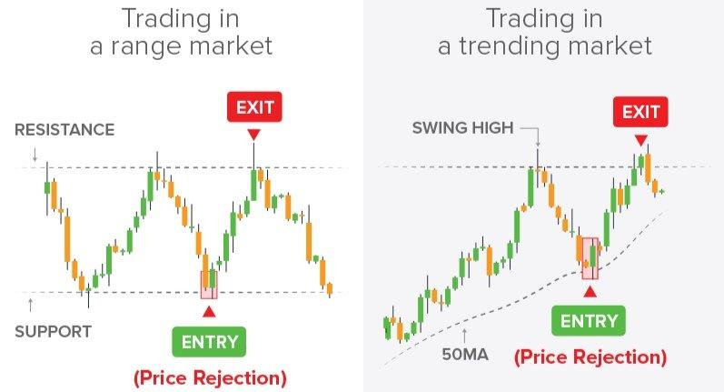

## Table of Contents

## What is swing trading and how does it differ from other trading styles?

Swing trading is a style of trading where people buy and sell stocks, currencies, or other financial instruments over a period of a few days to a few weeks. The goal is to make money from the 'swings' or changes in the price of these instruments. Swing traders look for patterns and trends in the market to decide when to buy and sell. They often use technical analysis, which means looking at charts and graphs to predict future price movements.

Swing trading is different from other trading styles like day trading and long-term investing. Day trading involves buying and selling within the same day, so day traders need to watch the market closely all day. It can be stressful and requires quick decisions. On the other hand, long-term investing means holding onto investments for months or years, focusing on the overall growth of the investment rather than short-term price changes. Swing trading sits in the middle, offering a balance between the fast pace of day trading and the patience of long-term investing. It allows traders to take advantage of short-term price movements without needing to monitor the market constantly.

## What are options and how are they used in swing trading?

Options are financial contracts that give you the right, but not the obligation, to buy or sell an asset at a specific price before a certain date. They can be used to bet on whether the price of a stock, for example, will go up or down. There are two main types of options: calls and puts. A call option lets you buy the asset at a set price, while a put option lets you sell it at that price. Options can be used to make money from small price changes or to protect other investments from big losses.

In swing trading, options can be a useful tool. Since swing traders aim to profit from price swings over a few days to weeks, options can help them do this with less money upfront than buying the stock outright. For example, if a swing trader thinks a stock's price will go up in the next week, they might buy a call option. If they're right and the stock price rises, they can make a profit by exercising the option or selling it for more than they paid. Options also let swing traders limit their risk, because the most they can lose is the money they spent on the option, no matter how much the stock price falls.

## What are the basic strategies for swing trading options?

One basic strategy for swing trading options is buying call options. If you think a stock's price will go up in the next few days or weeks, you can buy a call option. This gives you the right to buy the stock at a set price, called the strike price. If the stock price goes above the strike price, you can make money by either buying the stock at the lower strike price or selling the option for more than you paid. This strategy can be good for swing traders because it lets them make money from short-term price increases without needing a lot of money upfront.

Another strategy is buying put options. This is what you do if you think a stock's price will go down. A put option gives you the right to sell the stock at the strike price. If the stock price drops below the strike price, you can make money by selling the stock at the higher strike price or selling the option for more than you paid. This can be a useful strategy for swing traders who want to profit from short-term price drops and also want to limit their risk, since the most they can lose is the money they spent on the option.

A third strategy is using options to hedge other investments. If you own a stock and you're worried its price might drop in the short term, you can buy a put option on that stock. This can protect your investment because if the stock price falls, the put option will gain value, helping to offset your losses. This strategy can be helpful for swing traders who want to keep their investments safe while still trying to make money from short-term price swings.

## How can a beginner start swing trading options?

To start swing trading options as a beginner, first, you need to learn the basics. Options are contracts that give you the right to buy or sell a stock at a set price before a certain date. There are two types: call options, which you buy when you think the stock price will go up, and put options, which you buy when you think the stock price will go down. You should also learn about technical analysis, which is looking at charts and patterns to guess where the stock price might go next. There are many free resources online, like videos and articles, that can help you understand these concepts.

Once you feel comfortable with the basics, you can open a brokerage account that lets you trade options. Many brokers have special accounts for beginners with lower fees and tools to help you learn. Start with a small amount of money that you can afford to lose, and practice with paper trading, which is like playing a game where you trade without real money. This helps you get used to how options work without risking your money. As you get better, you can start trading with real money, but always keep learning and be ready to adjust your strategies as you gain more experience.

## What are the key indicators and tools used in swing trading options?

When swing trading options, traders often use technical indicators to help them decide when to buy and sell. One common indicator is the moving average, which shows the average price of a stock over a certain period of time. If the stock price moves above the moving average, it might be a good time to buy a call option, because the price could keep going up. Another useful tool is the Relative Strength Index (RSI), which tells you if a stock is overbought or oversold. If the RSI is above 70, the stock might be overbought and due for a price drop, so you might want to buy a put option. If the RSI is below 30, the stock might be oversold and due for a price increase, so you might want to buy a call option.

In addition to these indicators, swing traders often use chart patterns to make their decisions. For example, a "head and shoulders" pattern can signal that a stock's price is about to go down, which might be a good time to buy a put option. A "cup and handle" pattern can signal that a stock's price is about to go up, which might be a good time to buy a call option. Traders also use tools like option Greeks, which are measures like delta and theta that help you understand how the price of an option might change. Delta tells you how much the option price will change if the stock price changes, and theta tells you how much the option price will change as time goes by. By using these indicators and tools, swing traders can make more informed decisions about when to trade options.

## How do you manage risk when swing trading options?

Managing risk when swing trading options is important to protect your money. One way to do this is by setting stop-loss orders. A stop-loss order is like a safety net that automatically sells your option if the price drops to a certain level. This helps you limit how much money you can lose on a trade. Another way to manage risk is by only using a small part of your money for each trade. If you only use a little bit of your money, even if you lose on a trade, you won't lose everything.

Another important part of managing risk is understanding the Greeks, which are measures like delta and theta that tell you how the price of an option might change. Delta helps you know how much the option price will change if the stock price changes, and theta tells you how much the option price will change as time goes by. By understanding these, you can pick options that fit your risk level. Also, always make sure you have a plan before you start trading. Know when you will buy and sell, and stick to your plan. This can help you avoid making quick decisions that might lead to big losses.

## What are some common mistakes to avoid in swing trading options?

One common mistake in swing trading options is not having a clear plan. Without a plan, you might make quick decisions based on emotions instead of thinking things through. A good plan tells you when to buy and sell, and how much money you're willing to risk. Sticking to your plan can help you avoid big losses and make better trades.

Another mistake is not using stop-loss orders. A stop-loss order is like a safety net that automatically sells your option if the price drops too much. This can help you limit your losses. If you don't use stop-loss orders, you might lose more money than you planned if the market moves against you.

Lastly, some people put too much money into one trade. This is risky because if the trade goes wrong, you could lose a lot. It's better to spread your money across different trades. This way, even if one trade loses money, you won't lose everything.

## How can technical analysis enhance swing trading options strategies?

Technical analysis can really help swing traders make better decisions when trading options. It involves looking at charts and patterns to guess where the price of a stock might go next. For example, if you see a stock's price moving above its moving average, that might be a good time to buy a call option because the price could keep going up. Another useful tool is the Relative Strength Index (RSI), which tells you if a stock is overbought or oversold. If the RSI is above 70, the stock might be overbought and due for a price drop, so you might want to buy a put option. If the RSI is below 30, the stock might be oversold and due for a price increase, so you might want to buy a call option. By using these indicators, swing traders can make more informed choices about when to buy and sell options.

Chart patterns are also important in technical analysis for swing trading options. Patterns like "head and shoulders" can signal that a stock's price is about to go down, which might be a good time to buy a put option. On the other hand, a "cup and handle" pattern can signal that a stock's price is about to go up, which might be a good time to buy a call option. These patterns help traders spot potential price movements before they happen. By combining these chart patterns with other technical indicators, swing traders can create a more effective strategy for trading options, helping them to better time their trades and manage their risks.

## What advanced options strategies can be used in swing trading?

One advanced options strategy for swing trading is the "straddle." A straddle involves buying both a call option and a put option on the same stock with the same strike price and expiration date. This strategy can be useful if you think a stock's price will move a lot, but you're not sure which way it will go. If the stock price moves a lot in either direction, one of your options will make money. The downside is that it can be expensive because you're buying two options, but it can be a good way to make money from big price swings.

Another strategy is the "iron condor." This is more complicated, but it can help you make money if the stock price stays within a certain range. To do an iron condor, you sell an out-of-the-money call option and an out-of-the-money put option, and then buy a further out-of-the-money call option and a further out-of-the-money put option. This creates a range where you can make money if the stock price stays between the strike prices of the options you sold. It's a good strategy for swing trading when you think the stock price will stay steady for a while, but it requires careful planning and understanding of options.

## How does market volatility affect swing trading options strategies?

Market volatility can have a big impact on swing trading options strategies. When the market is very volatile, meaning prices are moving a lot, it can be both good and bad for swing traders. On the good side, more volatility means more chances to make money from big price swings. For example, if you think a stock's price will go up a lot in a short time, you might buy a call option. If you're right, you could make a lot of money. But on the bad side, more volatility also means more risk. Prices can move against you quickly, and you could lose money fast if you're not careful. So, when the market is volatile, swing traders need to be ready to act quickly and have good plans to manage their risk.

One way to deal with market volatility is to use strategies that can take advantage of big price moves in any direction. For example, a straddle involves buying both a call and a put option on the same stock. This can be good when you think a stock will move a lot but you're not sure which way. If the stock price goes up a lot, the call option makes money. If it goes down a lot, the put option makes money. Another strategy is to use stop-loss orders to limit your losses. If the market gets too volatile and the price moves against you, a stop-loss order can automatically sell your option to stop you from losing too much money. By understanding and planning for market volatility, swing traders can make better decisions and protect their investments.

## What role does fundamental analysis play in swing trading options?

Fundamental analysis can help swing traders make better decisions when trading options. It involves looking at a company's financial health and other important information to guess if its stock price will go up or down. For example, if a company is doing well and making more money than expected, its stock price might go up. This could be a good time to buy a call option. On the other hand, if a company is not doing well and losing money, its stock price might go down. This could be a good time to buy a put option. By using fundamental analysis, swing traders can pick the right options to trade based on what's happening with the company.

However, swing trading options usually focuses more on short-term price changes, so fundamental analysis is often used along with technical analysis. Technical analysis looks at charts and patterns to predict where the stock price might go next. While fundamental analysis can give you a good idea of the big picture, it might not be enough by itself for swing trading. That's because swing traders need to make quick decisions based on what's happening right now in the market. By combining fundamental analysis with technical analysis, swing traders can get a fuller picture of what might happen to a stock's price and make better trading choices.

## How can an expert optimize their swing trading options strategy for better returns?

An expert can optimize their swing trading options strategy by combining technical and fundamental analysis more effectively. They should use technical indicators like moving averages and the Relative Strength Index (RSI) to spot good times to buy and sell options. For example, if a stock's price moves above its moving average, it might be a good time to buy a call option. If the RSI shows a stock is overbought, it might be a good time to buy a put option. But technical analysis alone isn't enough. Experts should also look at the company's financial health and news that might affect its stock price. By combining these two types of analysis, they can make better guesses about where the stock price will go and pick the right options to trade.

Another way to optimize a swing trading options strategy is by using advanced strategies like straddles and iron condors. A straddle involves buying both a call and a put option on the same stock, which can be good when you think the stock will move a lot but you're not sure which way. An iron condor can help you make money if the stock price stays within a certain range. These strategies can help experts take advantage of different market conditions. Also, managing risk is very important. Experts should always use stop-loss orders to limit their losses and only use a small part of their money for each trade. By carefully planning their trades and using these strategies, experts can improve their chances of making better returns.

## What is Understanding Swing Trading?

Swing trading is a strategic approach within the financial markets aimed at capturing short to medium-term gains over a span of days to weeks. The primary objective is to exploit market swings or price fluctuations by positioning oneself to benefit from upward or downward trends as they manifest. This style of trading is grounded in the belief that securities are rarely in a state of constant equilibrium; they fluctuate due to market sentiment, macroeconomic factors, and specific news events.

The typical time frames for swing trading can range from a few days to a couple of weeks. This time horizon is longer than [day trading](/wiki/day-trading-spy), which requires entering and exiting positions within the same trading day, but shorter than long-term investing, which might involve holding positions for months or years. Swing traders aim to capitalize on expected price movements by identifying potential entry and [exit](/wiki/exit-strategy) points based on market analysis.

Key indicators and technical analysis tools are essential for swing traders in making informed decisions. Trend indicators, such as moving averages, are commonly used to gauge the direction and strength of a trend. A moving average, for instance, can smooth price data over a specified period, providing a clearer view of the trend. Popular forms include the simple moving average (SMA) and exponential moving average (EMA):

$$
\text{SMA} = \frac{P_1 + P_2 + \cdots + P_n}{n}
$$

$$
\text{EMA}_t = \left( \frac{P_t \times \left(\frac{2}{n+1}\right)}{\sum \left(\frac{2}{n+1}\right)^i} \right) + \text{EMA}_{t-1} \left(1-\frac{2}{n+1}\right)
$$

Momentum indicators like the relative strength index (RSI) assist in determining overbought or oversold conditions, which can signal potential reversals. The RSI, for example, can be calculated as:

$$
\text{RSI} = 100 - \left(\frac{100}{1+\frac{\text{Average Gain}}{\text{Average Loss}}}\right)
$$

Moreover, support and resistance levels help traders identify potential reversal areas where the price could change direction. Chart patterns like head and shoulders, price channels, and triangles are also used to forecast future price movements based on historical data.

Swing trading lies intermediate to other trading styles like day trading and long-term investing, each with its unique characteristics and risk profiles. Day trading involves rapid, intraday transactions requiring constant monitoring and a quick decision-making process, appealing to those who thrive in fast-paced environments. By contrast, long-term investing is rooted in a buy-and-hold philosophy, often influenced by [fundamental analysis](/wiki/fundamental-analysis) and focusing on steady growth over extended periods, minimizing transactional noise.

In conclusion, swing trading offers a distinct blend of technical analysis application and strategic market timing, providing traders with the agility to capitalize on market [volatility](/wiki/volatility-trading-strategies) while demanding a disciplined approach to manage risks inherent in price fluctuations.

## References & Further Reading

[1]: Bergstra, J., Bardenet, R., Bengio, Y., & Kégl, B. (2011). ["Algorithms for Hyper-Parameter Optimization."](https://papers.nips.cc/paper/4443-algorithms-for-hyper-parameter-optimization) Advances in Neural Information Processing Systems 24.

[2]: ["Advances in Financial Machine Learning"](https://www.amazon.com/Advances-Financial-Machine-Learning-Marcos/dp/1119482089) by Marcos Lopez de Prado

[3]: ["Evidence-Based Technical Analysis: Applying the Scientific Method and Statistical Inference to Trading Signals"](https://www.amazon.com/Evidence-Based-Technical-Analysis-Scientific-Statistical/dp/0470008741) by David Aronson

[4]: ["Machine Learning for Algorithmic Trading"](https://github.com/stefan-jansen/machine-learning-for-trading) by Stefan Jansen

[5]: ["Quantitative Trading: How to Build Your Own Algorithmic Trading Business"](https://www.amazon.com/Quantitative-Trading-Build-Algorithmic-Business/dp/1119800064) by Ernest P. Chan