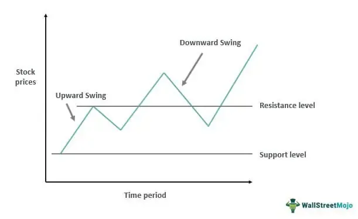

Swing trading is a widely utilized investment strategy that aims to capture short- to medium-term gains in financial markets over a few days to several weeks. This trading strategy emphasizes market timing, requiring traders to use technical analysis to identify price patterns and trends. Swing traders primarily rely on technical indicators such as moving averages, MACD, RSI, and stochastic oscillators to make informed decisions about entry and exit points. Unlike day trading, which involves closing all positions by the end of the trading day, swing trading allows positions to be held for longer periods, thereby providing the opportunity to benefit from larger price swings.

As financial markets have evolved with technological advancements, swing trading has experienced a transformation through the integration of algorithmic trading. Algorithmic trading involves the use of computer algorithms to execute trades at high speed and volume, guided by pre-set instructions regarding timing, price, and quantity. This approach has offered substantial advantages to swing traders by enhancing the precision and efficiency of trade execution. The use of algorithms enables traders to capitalize on market opportunities that may not be perceptible through manual analysis.



Options trading, a complex yet versatile financial instrument, can be seamlessly integrated into swing trading strategies. Options are derivatives that provide the right, but not the obligation, to buy or sell an underlying asset at a specified price before a certain date. Within swing trading, options offer strategic benefits, such as hedging against potential losses and leveraging positions to amplify potential returns. By incorporating options into their strategies, swing traders can hedge their positions against adverse market movements or speculate on anticipated price changes with greater confidence.

The surge in popularity of algorithmic trading has significantly impacted traditional swing trading methodologies. Algorithms can swiftly analyze vast amounts of data, enabling traders to swiftly adapt to changing market conditions. Moreover, these systems can effectively reduce human error, bias, and emotional influence in decision-making processes. By leveraging the strengths of algorithmic trading, traders can enhance their swing trading strategies, particularly when it comes to managing the intricacies of options trading.

Integrating options into algorithmic trading for swing traders provides multiple benefits. Algorithms can be programmed to execute complex options strategies, such as spreads, straddles, and strangles, with speed and precision. By automating these processes, traders can potentially capture gains from volatility in the options market more efficiently. Moreover, algorithms can manage and adjust options positions dynamically, adapting to new information and evolving market conditions in real time.

As the financial landscape continues to evolve, swing trading stands to benefit from the growing confluence of options and algorithmic trading. This integration not only optimizes trade execution but also enhances traders' ability to navigate the complexities of modern markets, promising a more robust and data-driven approach to investment strategies.

## Table of Contents

## Understanding Swing Trading

Swing trading is a strategic approach within the financial markets aimed at capturing short to medium-term gains over a span of days to weeks. The primary objective is to exploit market swings or price fluctuations by positioning oneself to benefit from upward or downward trends as they manifest. This style of trading is grounded in the belief that securities are rarely in a state of constant equilibrium; they fluctuate due to market sentiment, macroeconomic factors, and specific news events.

The typical time frames for swing trading can range from a few days to a couple of weeks. This time horizon is longer than [day trading](/wiki/day-trading-spy), which requires entering and exiting positions within the same trading day, but shorter than long-term investing, which might involve holding positions for months or years. Swing traders aim to capitalize on expected price movements by identifying potential entry and [exit](/wiki/exit-strategy) points based on market analysis.

Key indicators and technical analysis tools are essential for swing traders in making informed decisions. Trend indicators, such as moving averages, are commonly used to gauge the direction and strength of a trend. A moving average, for instance, can smooth price data over a specified period, providing a clearer view of the trend. Popular forms include the simple moving average (SMA) and exponential moving average (EMA):

$$
\text{SMA} = \frac{P_1 + P_2 + \cdots + P_n}{n}
$$

$$
\text{EMA}_t = \left( \frac{P_t \times \left(\frac{2}{n+1}\right)}{\sum \left(\frac{2}{n+1}\right)^i} \right) + \text{EMA}_{t-1} \left(1-\frac{2}{n+1}\right)
$$

Momentum indicators like the relative strength index (RSI) assist in determining overbought or oversold conditions, which can signal potential reversals. The RSI, for example, can be calculated as:

$$
\text{RSI} = 100 - \left(\frac{100}{1+\frac{\text{Average Gain}}{\text{Average Loss}}}\right)
$$

Moreover, support and resistance levels help traders identify potential reversal areas where the price could change direction. Chart patterns like head and shoulders, price channels, and triangles are also used to forecast future price movements based on historical data.

Swing trading lies intermediate to other trading styles like day trading and long-term investing, each with its unique characteristics and risk profiles. Day trading involves rapid, intraday transactions requiring constant monitoring and a quick decision-making process, appealing to those who thrive in fast-paced environments. By contrast, long-term investing is rooted in a buy-and-hold philosophy, often influenced by [fundamental analysis](/wiki/fundamental-analysis) and focusing on steady growth over extended periods, minimizing transactional noise.

In conclusion, swing trading offers a distinct blend of technical analysis application and strategic market timing, providing traders with the agility to capitalize on market [volatility](/wiki/volatility-trading-strategies) while demanding a disciplined approach to manage risks inherent in price fluctuations.

## The Role of Options in Swing Trading

Options trading is a critical aspect of swing trading, offering traders flexibility and strategic opportunities beyond conventional stock trading. Options are derivatives based on the value of underlying securities, such as stocks. They give the buyer the right, but not the obligation, to buy or sell the underlying asset at a specified price, known as the strike price, before or at the expiration date. The primary building blocks of options are calls and puts. A call option provides the right to buy, while a put option grants the right to sell.

**Strategic Advantages of Options in Swing Trading**

Swing traders benefit from options in several ways. One significant advantage is hedging, which allows traders to protect their positions against adverse market movements. By using options to hedge, traders can limit potential losses. For instance, a swing trader who holds a long position in a stock might purchase a put option to mitigate downside risk.

Leverage is another strategic advantage offered by options. Since options provide control over a larger number of shares with less capital than buying stocks outright, traders can achieve greater market exposure and potential returns. However, this comes with increased risk.

**Popular Options Strategies in Swing Trading**

Swing traders often employ various options strategies to enhance their trading results. Some common strategies include:

1. **Covered Call**: This involves holding a long position in a stock and selling call options on the same stock. The option premium received provides some income and partial protection against a decline in the stock's price.

2. **Protective Put**: In this strategy, a trader owns the stock and buys a put option for the same stock. It acts as an insurance policy, limiting the downside risk without capping the potential upside.

3. **Straddle**: This strategy involves purchasing both a call and a put option with the same strike price and expiration date. It is useful when a trader anticipates a significant price movement but is uncertain about the direction.

4. **Iron Condor**: This is a more sophisticated strategy that involves selling an out-of-the-money call and put, while simultaneously buying further out-of-the-money call and put options. It is suitable for traders expecting low volatility.

**Risks and Mitigation in Options Trading**

Despite their advantages, options trading carries inherent risks. The most significant risk is the potential for substantial losses due to leverage. Swing traders must be cautious and employ effective risk management strategies to mitigate these risks. This can be achieved by:

- **Setting Stop-Loss Limits**: Defining and adhering to stop-loss levels can help limit the maximum loss per trade.

- **Diversification**: By engaging in multiple strategies or spreading positions across different sectors or asset classes, traders can reduce the impact of a single adverse movement.

- **Continuous Monitoring**: Regularly reviewing trades and adjusting strategies based on market conditions can help minimize risks.

Risk management is crucial in options trading. Effective strategies, combined with a strong understanding of options mechanics, can allow swing traders to exploit market opportunities while safeguarding their portfolios.

## Algorithmic Trading: A Game Changer for Options Trading

Algorithmic trading refers to the use of computer algorithms to execute trading strategies at speeds and frequencies that are impossible for human traders. These algorithms can process vast amounts of market data, identify trading opportunities, and execute trades automatically based on predefined criteria. This form of trading has become a cornerstone of modern financial markets due to its efficiency, speed, and ability to execute complex strategies with precision.

The adoption of [algorithmic trading](/wiki/algorithmic-trading) in options markets has introduced several benefits. One of the primary advantages is the increased speed and precision in executing trades. Algorithms can react to market conditions in milliseconds, allowing traders to capitalize on fleeting opportunities and optimize their entry and exit points. This speed is particularly beneficial in options trading, where market prices can change rapidly due to factors such as underlying asset volatility, time decay, and changes in implied volatility.

Additionally, algorithms can optimize swing trading strategies that involve options by automating the decision-making process based on technical indicators and statistical models. For example, an algo-based system can continuously analyze market data to identify trends and patterns that indicate potential swing trade opportunities. By integrating options into these strategies, traders can enhance their profit potential while managing risk more effectively through strategic use of options instruments like calls and puts.

A typical algorithmic swing trading strategy involving options might include criteria for entering a trade when specific market conditions are met, such as a moving average crossover, a [breakout](/wiki/breakout-trading) from a defined price range, or changes in implied volatility that suggest a shift in market sentiment. Once a trade is initiated, the algorithm can automatically manage it by setting stop-loss orders, adjusting positions based on market movement, or exiting the trade once predefined profit targets are achieved.

Several tools and platforms are available to facilitate algorithmic options trading. Platforms like MetaTrader, TradeStation, and [Interactive Brokers](/wiki/interactive-brokers-api) offer robust environments for developing and deploying trading algorithms. These platforms often provide APIs, [backtesting](/wiki/backtesting) capabilities, and integration with market data sources, helping traders to develop and refine their strategies.

Python is a favored language for developing algorithmic strategies due to its extensive libraries and frameworks, such as Pandas for data manipulation, NumPy for numerical computations, and PyAlgoTrade or Zipline for backtesting strategies. A basic skeleton of an algorithmic trading script in Python, employing these libraries, might look like this:

```python
import pandas as pd
import numpy as np
from pyalgotrade import strategy
from pyalgotrade.barfeed import yahoofeed
from pyalgotrade.technical import ma

class MyStrategy(strategy.BacktestingStrategy):
    def __init__(self, feed, instrument):
        super(MyStrategy, self).__init__(feed)
        self.__instrument = instrument
        self.__prices = feed[instrument].getPriceDataSeries()
        self.__sma = ma.SMA(self.__prices, 15)

    def onBars(self, bars):
        if self.__sma[-1] is None:
            return

        bar = bars[self.__instrument]
        if bar.getClose() > self.__sma[-1]:
            self.enterLong(self.__instrument, 10)
        elif bar.getClose() < self.__sma[-1]:
            self.exitPosition(self.getPosition(deleteIfEmpty=False))

feed = yahoofeed.Feed()
feed.addBarsFromCSV("orcl", "orcl-2000.csv")
myStrategy = MyStrategy(feed, "orcl")
myStrategy.run()
```

This code demonstrates a simple moving average crossover strategy using historical data from Yahoo Finance, where a long position is entered when the closing price rises above a 15-period simple moving average (SMA), and exited when the price falls below it.

Overall, algorithmic trading has transformed the landscape of options trading by enabling more sophisticated, data-driven decision-making processes. As technology continues to evolve, the tools and capabilities available to traders are likely to expand further, paving the way for even more advanced algorithmic strategies.

## Developing an Algo-Based Swing Trading Strategy with Options

Developing an algorithm-based swing trading strategy with options involves a structured approach that focuses on various technical and strategic components. Here are the essential factors and steps involved in creating a robust trading algorithm that incorporates options:

### Key Factors to Consider

1. **Market Conditions**: Understand the market environment, such as volatility levels, economic indicators, and sector performance. Market conditions greatly influence options pricing and swing trading outcomes.

2. **Indicators and Signals**: Choose reliable technical indicators to identify swing trading opportunities. Common indicators include moving averages, RSI (Relative Strength Index), and MACD (Moving Average Convergence Divergence).

3. **Options Strategy Selection**: Determine which options strategies align with your market view and risk tolerance. Strategies may include covered calls, protective puts, or straddles.

4. **Risk Management**: Define risk parameters, such as maximum drawdown and stop-loss limits, to protect capital against large losses.

5. **Brokerage and Costs**: Consider the costs associated with options trading and algorithmic execution, including commissions and slippage.

### Step-by-step Guide to Creating a Basic Swing Trading Algorithm

1. **Define Trading Objectives**: Establish clear goals, such as desired returns and risk levels.

2. **Data Collection**: Gather historical price data and options chain data. Python's `yfinance` or `pandas_datareader` can be useful for this task.

   ```python
   import yfinance as yf  # For more datasets, visit: https://paperswithbacktest.com/datasets
   data = yf.download('AAPL', start='2020-01-01', end='2021-01-01')
   ```

3. **Develop Entry and Exit Criteria**: Using selected indicators, establish rules for entering and exiting trades. For example, a moving average crossover could signal potential trades.

   ```python
   data['SMA50'] = data['Close'].rolling(window=50).mean()
   data['SMA200'] = data['Close'].rolling(window=200).mean()

   # Example condition
   data['Signal'] = 0
   data['Signal'][50:] = np.where(data['SMA50'][50:] > data['SMA200'][50:], 1, -1)
   ```

4. **Implement Options Strategy**: Choose an options strategy based on the entry signal. For instance, use an options straddle when expecting high volatility.

5. **Use a Trading Platform**: Implement the algorithm on a trading platform that supports automation, such as QuantConnect or Interactive Brokers' API.

### Backtesting and Optimization

Backtest the strategy using historical data to gauge performance, adjusting parameters to enhance outcomes. Tools like Python's `[backtrader](/wiki/backtrader)` can assist in backtesting.

```python
import backtrader as bt

class MyStrategy(bt.Strategy):
    def __init__(self):
        self.sma50 = bt.indicators.SMA(period=50)
        self.sma200 = bt.indicators.SMA(period=200)

    def next(self):
        if self.sma50[0] > self.sma200[0]:
            # Enter logic for options position
            pass

cerebro = bt.Cerebro()
cerebro.addstrategy(MyStrategy)
cerebro.adddata(bt.feeds.YahooFinanceData(dataname='AAPL', fromdate='2020-01-01', todate='2021-01-01'))
cerebro.run()
```

### Successful Examples

1. **Pair Trading with Options**: A strategy where two correlated stocks are traded with options to optimize the pair's divergence and convergence patterns.

2. **Iron Condor in Trend Boundaries**: Used in range-bound markets, where an iron condor strategy capitalizes on stocks trading within a predicted price range.

3. **Covered Call Swing Strategy**: Involves holding a long position in a stock with a written call option to enhance returns in moderately bullish markets.

In summary, developing an algo-based swing trading strategy with options requires meticulous planning, testing, and refinement. By integrating appropriate technical indicators, risk management principles, and strategic options plays, traders can build potentially profitable algorithms. Continuous monitoring and adjustments are essential to adapting to dynamic market conditions and ensuring sustained performance.

## Risk Management in Algo Options Trading

Risk management is an essential component of algorithmic trading, particularly when incorporating options due to their complexity and the associated risks. Effective risk management helps traders mitigate potential losses while maximizing returns.

### The Importance of Risk Management in Algorithmic Trading

Algorithmic trading offers advantages such as speed, precision, and the ability to process large datasets. However, it also requires robust risk management to handle market volatility and unexpected events. Without proper safeguards, algorithms can exacerbate losses due to their rapid execution capabilities. Risk management encompasses strategies to control potential downsides while capitalizing on market opportunities.

### Strategies to Manage Risk When Trading Options through Algorithms

1. **Dynamic Hedging**: Algorithms can dynamically adjust positions to hedge against adverse price movements. For example, delta hedging involves maintaining a neutral delta position by balancing the number of options with the underlying asset.

2. **Stop-Loss Orders**: Incorporating stop-loss orders into algorithms helps automate the process of limiting potential losses. This ensures that positions are exited when they reach a predefined level of loss.

3. **Portfolio Optimization**: Using machine learning techniques, such as reinforcement learning, traders can optimize their portfolios to achieve a desired balance between risk and return.

4. **Volatility Controls**: Options are sensitive to volatility, making it crucial to include volatility measures like the VIX index in risk models to anticipate changes in the market environment.

### The Role of Position Sizing and Diversification in Minimizing Risk

Position sizing and diversification are vital in distributing risk and preventing excessive exposure to a single asset or strategy.

- **Position Sizing**: Algorithms can employ strategies like the Kelly Criterion to determine the ideal size of each trade, based on the probability of success and the expected return. This helps avoid over-leveraging and minimizes the impact of any single losing trade.

- **Diversification**: Diversifying across various options strategies and underlying assets reduces idiosyncratic risk. Algorithms can be programmed to evaluate correlations and allocate capital to achieve optimal diversification.

### Common Pitfalls in Options Trading and How Algorithms Can Help Avoid Them

1. **Overfitting**: Algorithms, especially those relying on historical data, may become too tailored to past trends, reducing their effectiveness in new market conditions. Regular backtesting with updated data and cross-validation techniques can help prevent overfitting.

2. **Liquidity Risk**: Poor liquidity can lead to unfavorable slippage and execution challenges. Algorithms can be designed to assess the liquidity of options contracts and adjust trading strategies accordingly.

3. **Emotional Bias**: Unlike human traders, algorithms operate without emotional influences, thus making more rational and consistent decisions. This eliminates biases such as fear and greed, which can adversely affect trading outcomes.

In conclusion, robust risk management strategies are crucial for effective algorithmic options trading. By employing dynamic hedging, optimizing portfolios, adjusting position sizes, and avoiding overfitting, traders can enhance their ability to manage risk while leveraging the speed and precision of algorithms in the complex world of options trading.

## Future Trends in Algo Trading with Options

Emerging technologies have transformed the financial trading landscape, particularly in the options market where algorithmic trading plays a crucial role. As technology evolves, several trends are reshaping how options trading is conducted.

Artificial Intelligence (AI) and Machine Learning (ML) are at the forefront of this transformation. These technologies enable the development of sophisticated trading algorithms capable of analyzing massive datasets swiftly, extracting patterns, and making informed trading decisions. AI models, such as neural networks, can predict market movements with greater accuracy by learning from historical data. This predictive capability is vital for swing traders who seek to capitalize on short- to medium-term price movements. Additionally, [reinforcement learning](/wiki/reinforcement-learning), a type of [machine learning](/wiki/machine-learning), allows algorithms to improve performance over time through a process of trial and error, adapting to fluctuating market conditions.

The regulatory environment is also expected to evolve in response to the rise of algorithmic options trading. As trading algorithms become more prevalent, regulators may impose stricter guidelines to ensure fair market practices and prevent market manipulation. This could involve more comprehensive reporting requirements and transparency in algorithm deployment. The goal of such regulations would be to foster trust in the markets and mitigate risks associated with high-frequency trading, such as flash crashes.

To stay competitive in this rapidly evolving landscape, traders need to equip themselves with a diverse set of skills and tools. Proficiency in data science and programming is becoming increasingly important, as traders need to develop and maintain complex trading algorithms. Familiarity with trading platforms and backtesting tools is essential to evaluate the performance of these algorithms under various market conditions.

Moreover, traders should focus on continual learning to keep abreast of technological advancements and shifting market paradigms. Understanding the application of cloud computing and quantum computing in trading, for instance, could offer significant advantages in terms of processing power and speed. Collaborative skills will also be vital as many trading strategies are developed in team environments, combining expertise from finance, technology, and data analytics sectors.

Overall, the confluence of emerging technologies and evolving regulations presents both opportunities and challenges in the options trading arena. Traders who harness these technologies effectively and adapt to regulatory changes are likely to gain a competitive edge, driving innovation and efficiency in the market.

## Conclusion

Integrating options into swing trading strategies with algorithmic support offers a myriad of benefits, enhancing both flexibility and precision for traders. Options provide the opportunity to hedge against potential losses while leveraging positions to maximize gains. Algorithmic trading, with its speed and objectivity, allows for the rapid execution of complex option strategies that might be cumbersome to implement manually. The combination of these instruments with algorithmic systems can lead to optimized entry and exit points, efficient management of risk, and improved overall performance in swing trading.

Technological advancements in trading have transformed the industry landscape, and traders are encouraged to embrace these changes to remain competitive. By integrating modern tools like algorithms and data analytics into their strategies, traders can harness greater efficiency and superior decision-making capabilities. However, the balance between automation and human oversight remains crucial. While algorithms can process vast amounts of data and execute trades at speeds unattainable by humans, human intuition and experience remain vital in responding to unexpected market dynamics and ensuring that ethical considerations are upheld.

Continuous learning and adaptation are essential in the rapidly evolving trading environment. With the fast-paced development of [artificial intelligence](/wiki/ai-artificial-intelligence), machine learning, and other emergent technologies, traders and developers must stay informed and enhance their skill sets accordingly. Engaging with ongoing education and staying updated with regulatory changes will ensure they can navigate the complexities of modern trading successfully. Embracing these elements will enable traders to continue thriving in a competitive market and capitalize on opportunities presented by technological innovation.

## References & Further Reading

[1]: Bergstra, J., Bardenet, R., Bengio, Y., & Kégl, B. (2011). ["Algorithms for Hyper-Parameter Optimization."](https://papers.nips.cc/paper/4443-algorithms-for-hyper-parameter-optimization) Advances in Neural Information Processing Systems 24.

[2]: ["Advances in Financial Machine Learning"](https://www.amazon.com/Advances-Financial-Machine-Learning-Marcos/dp/1119482089) by Marcos Lopez de Prado

[3]: ["Evidence-Based Technical Analysis: Applying the Scientific Method and Statistical Inference to Trading Signals"](https://www.amazon.com/Evidence-Based-Technical-Analysis-Scientific-Statistical/dp/0470008741) by David Aronson

[4]: ["Machine Learning for Algorithmic Trading"](https://github.com/stefan-jansen/machine-learning-for-trading) by Stefan Jansen

[5]: ["Quantitative Trading: How to Build Your Own Algorithmic Trading Business"](https://www.amazon.com/Quantitative-Trading-Build-Algorithmic-Business/dp/1119800064) by Ernest P. Chan