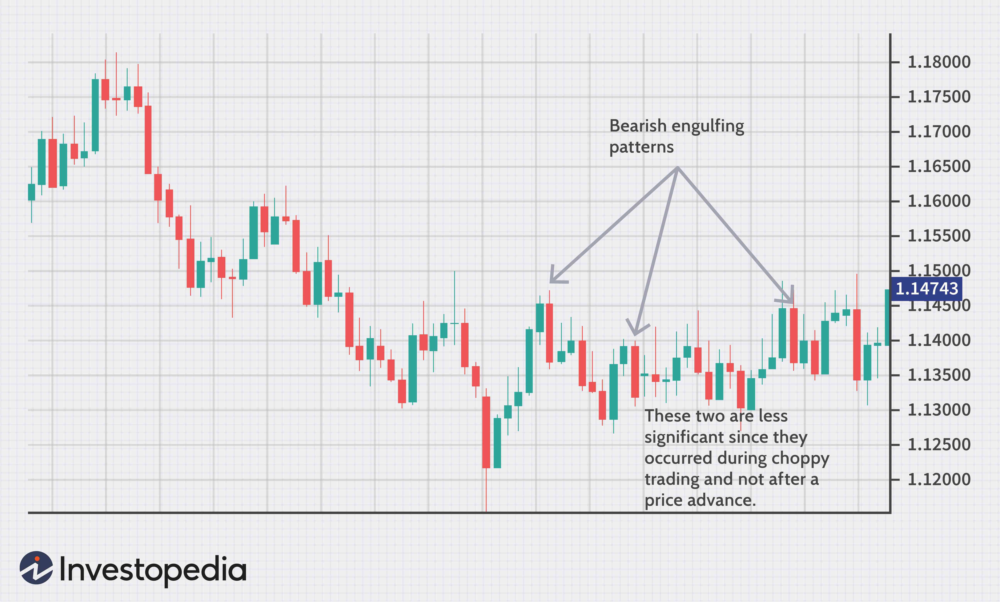

In financial markets, traders aim to exploit market fluctuations through diverse strategies. Swing trading has gained prominence as a favored approach, resonating with both individual and institutional investors due to its adaptability and potential for significant returns. Swing traders seek to capture price movements over the short to medium term, typically holding positions for several days to weeks, thereby allowing them to benefit from market 'swings' or fluctuations.

The advent of algorithmic trading technologies has profoundly transformed swing trading, enhancing both efficiency and precision. Algorithmic trading, characterized by the use of complex mathematical models and automated execution processes, allows traders to analyze vast amounts of data rapidly, thereby optimizing trade decisions and minimizing human errors. These technologies facilitate the timely identification of trading opportunities, thus maximizing profit potential while reducing risks associated with manual trading. 



This article explores the spectrum of swing trading strategies, highlighting how algorithmic trading can elevate trading outcomes. We'll examine the fundamentals of swing trading, the strategic use of algorithms to drive success, and the interplay between technological advancements and trading strategies. Emphasizing the principles that guide swing trading and the algorithms that support its execution, this exploration aims to provide a comprehensive understanding of their synergistic potential in navigating the complexities of the financial markets.

## Table of Contents

## Understanding Swing Trading

Swing trading represents a strategic approach within financial markets aimed at capturing moderate price movements in stocks or other financial instruments over short-to-medium term periods. Typically, swing traders hold positions from several days to weeks, allowing them to profit from anticipated 'swings' or oscillations in market prices. This contrasts with day trading, where positions are opened and closed within the same trading day, requiring frequent and rapid decision-making.

Central to swing trading is the identification of trends and reversals. Traders rely on market cycles, which imply that securities often move in predictable patterns consistent with broader market or business cycles. Recognizing these patterns allows traders to forecast whether a price will continue along its current trend or if it is likely to reverse direction.

Trend analysis is a foundational skill in swing trading, enabling traders to discern the prevailing direction of a market. By assessing historical data, traders can identify whether the trend is bullish (upward), bearish (downward), or neutral. This evaluation often involves technical analysis, which utilizes statistical indicators derived from historical price and [volume](/wiki/volume-trading-strategy) data to predict future market movements.

Technical indicators are integral tools for swing traders. Some widely used indicators include Moving Averages, the Relative Strength Index (RSI), and the Moving Average Convergence Divergence (MACD). Moving Averages help smooth price data for better trend visualization, while RSI provides insight into whether an asset is overbought or oversold. MACD, by comparing two different Moving Averages, identifies potential [momentum](/wiki/momentum) shifts in a security’s trend.

For instance, a simple moving average (SMA) can be calculated using the following formula:

$$
\text{SMA} = \frac{\sum_{i=1}^{n} P_i}{n}
$$

where $P_i$ represents the closing price of the security at day $i$, and $n$ is the number of periods considered in the moving average.

Successful swing trading necessitates strategic patience. Unlike [day trading](/wiki/day-trading-spy), it requires waiting for the right moment to enter or [exit](/wiki/exit-strategy) a position based on calculated assessments of likely market movements, rather than reacting to every market fluctuation. This deliberate approach aims to minimize transaction costs and maximize profit potential by avoiding unnecessary trading.

Thus, by combining trend analysis with technical indicators, swing traders aim to make informed decisions, seeking to capitalize on short-to-medium term price movements within a disciplined risk management framework.

## Core Swing Trading Strategies

Swing trading strategies combine various analytical methods to capitalize on short-to-medium term market movements. A core component of swing trading is its reliance on both technical and fundamental analyses, which guide traders in making informed decisions. Here, we delve into each major strategy and how they function.

### Technical Analysis

Technical analysis is the foundation of many swing trading strategies, focusing heavily on historical price data and chart patterns to predict future market movements. Traders utilize technical indicators such as moving averages, relative strength index (RSI), and MACD (Moving Average Convergence Divergence) to determine entry and exit points. Identifying patterns such as head and shoulders, triangles, and flags aids in anticipating potential price movements. The aim is to gain insights into market sentiment and momentum through graphical representations.

### Fundamental Analysis

While technical analysis focuses on price charts and trends, [fundamental analysis](/wiki/fundamental-analysis) incorporates economic data and market news to form trading decisions. This strategy involves examining factors such as earnings reports, interest rates, and geopolitical events that can influence a security's value. Traders assess whether a stock is overvalued or undervalued in light of external factors. By combining both analyses, swing traders can form a comprehensive perspective on potential price movements.

### Trend Following

Trend following is a strategy that capitalizes on securities displaying a strong directional movement, either upward or downward. The strategy operates on the principle that once a trend is established, it is likely to continue in that direction for some time. Traders leverage tools like the Average Directional Index (ADX) to determine the strength of a trend. The strategy is relatively straightforward but relies on discipline and precise timing to capitalize on momentum while avoiding false signals.

### Reversal Trading

Reversal trading involves identifying potential points where a stock might change its direction, providing opportunities to enter or exit positions profitably. This strategy is based on the premise that asset prices will eventually revert to their mean or experience a change in trend. Indicators such as Bollinger Bands and Fibonacci retracements can help signal potential reversals. Timing is critical, as entering too early or late can lead to significant losses. Successful reversal traders utilize sharp analytical skills to discern between genuine reversals and temporary pullbacks.

### Support and Resistance Levels

Support and resistance levels are pivotal in swing trading as they represent key price points where securities tend to change direction. Support levels are where prices stop falling and start rising, while resistance levels are where prices cease rising and begin to decline. Traders often use these levels to determine their entry and exit points, setting stop-loss orders to mitigate risk. Tools such as pivot points help in identifying these crucial levels, allowing traders to anticipate potential price movements.

To illustrate with Python code, traders might use the `pandas` library to calculate moving averages and identify support/resistance levels:

```python
import pandas as pd

# Sample DataFrame 'df' containing historical price data with columns 'Date' and 'Close'
df['MA20'] = df['Close'].rolling(window=20).mean()
df['Support'] = df['Close'].rolling(window=50).min()
df['Resistance'] = df['Close'].rolling(window=50).max()

# Example of identifying buy/sell signals based on moving average crossovers
df['Signal'] = 0  # Default signal
df.loc[(df['Close'] > df['MA20']) & (df['Close'].shift(1) <= df['MA20'].shift(1)), 'Signal'] = 1  # Buy signal
df.loc[(df['Close'] < df['MA20']) & (df['Close'].shift(1) >= df['MA20'].shift(1)), 'Signal'] = -1  # Sell signal
```

These strategies form the building blocks of a swing trader's toolkit, each with its distinct advantages and challenges. By integrating these methods, traders aim to optimize their ability to predict and profit from market movements.

## The Role of Algorithms in Swing Trading

Algorithmic trading involves the use of sophisticated computer programs to automate trading processes, providing significant advantages in swing trading. One of the primary benefits of algorithms is their ability to analyze vast amounts of data at speeds far beyond human capacity. This computational power allows traders to process complex data sets and extract actionable insights from market trends and historical patterns.

With algorithms, traders can identify patterns and execute trades at optimal times, enhancing trade precision and decision-making accuracy. For example, algorithms can utilize moving averages or oscillators to identify overbought or oversold conditions in the market, triggering trades based on pre-defined criteria. Consider a simplified Python snippet implementing a moving average crossover strategy:

```python
import numpy as np
import pandas as pd

# Example data
data = pd.Series([100, 102, 101, 105, 107, 111, 110, 112, 115])

# Calculate moving averages
short_window = 3
long_window = 5

data['short_mavg'] = data.rolling(window=short_window, min_periods=1, center=False).mean()
data['long_mavg'] = data.rolling(window=long_window, min_periods=1, center=False).mean()

# Generate signals
data['signal'] = 0.0
data['signal'][short_window:] = np.where(data['short_mavg'][short_window:] > data['long_mavg'][short_window:], 1.0, 0.0)

# Create positions
data['positions'] = data['signal'].diff()

print(data)
```

In this example, the algorithm generates a buy signal when the short-term moving average crosses above the long-term moving average, indicating a potential upward price movement.

High-frequency trading ([HFT](/wiki/high-frequency-trading-strategies)) and more complex algorithms have dramatically transformed the swing trading landscape. HFT exploits microsecond-level market inefficiencies and employs highly advanced algorithms to execute a large number of trades at extremely fast speeds. Although swing trading typically involves longer time frames than HFT, the precision and speed brought by algorithmic interventions are invaluable in swiftly capitalizing on favorable market conditions.

The benefits of [algorithmic trading](/wiki/algorithmic-trading) in swing trading are numerous. They include reduced human error and emotional bias, improved trade execution speed, and increased profit potential. By automating trading decisions, algorithms eliminate the psychological barriers that often plague human traders, enabling more consistent and objective trading practices. Additionally, the capacity to backtest strategies on historical data empowers traders to validate the effectiveness of their algorithms before deploying them in live markets.

In summary, the integration of algorithms in swing trading significantly enhances the ability to analyze, decide, and act in a fast-paced financial environment, ultimately leading to more efficient and profitable trading outcomes.

## Designing Effective Algo Trading Systems for Swing Trading

Designing effective algorithmic trading systems for swing trading necessitates a comprehensive approach that combines technical acumen with strategic foresight. At the heart of successful algorithmic systems lies thorough [backtesting](/wiki/backtesting) and validation processes. Backtesting involves simulating a trading strategy on historical data to evaluate its potential effectiveness. It is crucial to ensure that the algorithm performs well under various market conditions, such as different [volatility](/wiki/volatility-trading-strategies) levels and [liquidity](/wiki/liquidity-risk-premium) scenarios. This not only aids in refining the strategy but also in predicting future performance with a greater degree of confidence.

To optimize trading outcomes, defining clear entry and exit points is imperative. Entry points determine when to initiate a position based on predefined criteria, while exit points dictate when to close the position to either realize gains or cut losses. The use of technical indicators, such as moving averages or Relative Strength Index (RSI), can help in formulating these rules. For instance, a simple moving average crossover strategy may signal an entry point when a short-term moving average crosses above a long-term moving average, suggesting a potential uptrend.

Incorporating risk management protocols into algorithms is essential to protect against unexpected market downturns. These protocols could include setting stop-loss levels, which automatically close a position when it reaches a specific loss threshold, or using position sizing rules to limit the amount of capital allocated to any single trade. For example, a basic risk management strategy could involve allocating no more than 1-2% of the total portfolio to a single trade, thereby preserving capital over the long term.

Given the dynamic nature of financial markets, continuous monitoring and adjustment of trading algorithms are necessary. Market conditions can change rapidly, influenced by economic indicators, geopolitical events, or shifts in investor sentiment. Therefore, algorithms should be designed with flexibility to adapt to these changes. This could involve utilizing [machine learning](/wiki/machine-learning) techniques to enable the algorithm to learn from new data and adjust its trading parameters accordingly.

The combination of backtesting, clear trading rules, robust risk management, and continuous adaptation forms the foundation of an effective algorithmic trading system for swing trading. This approach not only enhances the potential for profitability but also mitigates risks associated with market volatility. Through careful design and ongoing refinement, traders can leverage algorithmic systems to navigate the complexities of financial markets with greater precision and confidence.

## Challenges and Considerations

Market complexity poses significant challenges for swing trading, as financial markets exhibit unpredictable behavior due to factors like geopolitical events, economic data releases, and investor sentiment. These variables create difficulties in formulating reliable trading strategies. To navigate this uncertainty, traders must constantly adapt their strategies, often incorporating complex models to anticipate market movements.

Technological dependence is another critical consideration for swing traders utilizing algorithmic systems. The reliance on sophisticated trading software necessitates robust systems to prevent failures, such as server downtime or software glitches, which could result in missed trading opportunities or erroneous trade executions. Ensuring high availability and redundancy in trading systems is vital to maintain operational security.

Regulatory compliance is essential for automated trading systems. Trading activities are subject to laws and regulations set by financial authorities, such as the Securities and Exchange Commission (SEC) in the United States or the Financial Conduct Authority (FCA) in the United Kingdom. Algorithmic traders must ensure their systems comply with regulations covering aspects like trade reporting, market manipulation, and data privacy. This often requires regular audits and updates to the trading algorithms and systems to align with evolving regulatory standards.

Market risks present a significant challenge for swing traders, as large market swings can lead to significant financial losses if trades are not properly managed. This necessitates the incorporation of stringent risk management strategies, such as stop-loss orders or hedging techniques, within the algorithmic systems to mitigate potential losses during volatile market conditions.

Developing and maintaining effective algorithms requires both technical and market expertise. Traders must possess a deep understanding of market dynamics and technical skills to design and refine algorithms capable of executing strategies efficiently. Keeping algorithms relevant in changing market conditions demands continuous monitoring, backtesting, and adjustments to the trading models. This ongoing process ensures that trading strategies remain effective and resilient against market changes. 

In summary, swing traders must adeptly address market complexity, technological reliance, regulatory compliance, and risk management while leveraging their technical and market knowledge to optimize their trading algorithms and strategies.

## Conclusion

Swing trading strategies, when augmented by algorithmic trading, present significant opportunities within financial markets. Algorithmic systems offer the ability to enhance profitability through increased trading efficiency and precision. However, these systems necessitate meticulous design and management to achieve the desired outcomes. Factors such as data integrity, algorithm robustness, and adaptability are critical to developing systems that can effectively respond to market changes.

A deep understanding of market behaviors and integrating robust risk management practices are essential components of successful algorithmic swing trading. Effective risk management involves defining clear strategies for entry and exit points and limiting potential losses, ensuring that traders can withstand market volatility.

The continued evolution of technologies and trading strategies will shape the future of swing trading. As machine learning and [artificial intelligence](/wiki/ai-artificial-intelligence) improve, they promise to offer even greater precision and effectiveness in trade execution. Traders who embrace these innovative tools will be better equipped to handle the complexities of modern financial markets, positioning themselves at a competitive advantage. By staying updated on technological advancements and refining their trading strategies, traders can maximize the potential of swing trading.

## Additional Resources

For those interested in expanding their understanding and capabilities in swing trading and algorithmic trading, numerous resources are available which can provide invaluable knowledge and support.

### Books on Swing Trading and Algorithmic Trading

1. **"Swing Trading for Dummies" by Omar Bassal**: This book offers a comprehensive guide for beginners, explaining the core concepts and strategies involved in swing trading. It provides practical tips on how to start successfully in the markets.

2. **"Algorithmic Trading: Winning Strategies and Their Rationale" by Ernie Chan**: Ernie Chan provides insights into developing and implementing algorithmic trading strategies. The book is ideal for traders looking to exploit market inefficiencies through algorithmic methods.

3. **"Quantitative Trading: How to Build Your Own Algorithms and Create a Winning Trading Business" by Ernie Chan**: This book guides readers through the process of creating their own quantitative trading systems, emphasizing practical application and real-world examples.

### Online Courses

1. **Coursera's "Machine Learning for Trading"**: This course explores the application of machine learning in the financial markets, covering topics that range from basic principles to advanced algorithmic strategies.

2. **Udemy's "Python for Finance: Investment Fundamentals & Data Analytics"**: Offering a mix of programming and finance theory, this course is designed to enhance your ability to backtest strategies and apply quantitative trading methods.

3. **EDX's "Algorithmic Trading and Finance Models with Python, R, and Stata"**: A comprehensive approach to learning algorithmic trading, enabling participants to understand finance models and implement trading algorithms efficiently.

### Forums and Communities

1. **Elite Trader**: A forum where traders from various backgrounds discuss strategies, market analysis, and trading experiences. It is a great place for networking and shared learning.

2. **QuantConnect Community**: This community offers a platform for discussing algorithmic trading and quantitative research. It supports collaborative projects and the sharing of ideas among trading enthusiasts.

3. **Reddit's r/algotrading**: A subreddit dedicated to algorithmic trading where users share insights, resources, and personal experiences related to developing trading systems.

### Tools and Software

1. **QuantConnect**: An algorithmic trading platform that provides tools for backtesting and developing trading strategies using Python, within a cloud-based environment.

2. **TradingView**: A versatile tool for market analysis, offering charting software and trading features that cater to both manual and automated strategies.

3. **MetaTrader**: Known for its comprehensive charting capabilities and the ability to implement automated trading systems (Expert Advisors), MetaTrader is a widely-used tool among retail traders.

### Regulatory Resources

1. **U.S. Securities and Exchange Commission (SEC)**: For traders in the United States, the SEC offers guidelines and resources on market regulations and compliance.

2. **Financial Conduct Authority (FCA)**: The UK's financial regulatory body provides resources and updates on compliance requirements critical for algorithmic trading.

3. **National Futures Association (NFA)**: The NFA offers resources on futures trading regulations, essential for traders in the commodities and futures markets.

These resources collectively cater to traders aiming to enhance their swing trading strategies, develop their trading algorithms, and maintain compliance with regulatory standards. By leveraging these resources, traders can expand their knowledge, enhance their skills, and effectively engage with dynamic financial markets.

## References & Further Reading

[1]: Bergstra, J., Bardenet, R., Bengio, Y., & Kégl, B. (2011). ["Algorithms for Hyper-Parameter Optimization."](https://papers.nips.cc/paper/4443-algorithms-for-hyper-parameter-optimization) Advances in Neural Information Processing Systems 24.

[2]: ["Advances in Financial Machine Learning"](https://www.amazon.com/Advances-Financial-Machine-Learning-Marcos/dp/1119482089) by Marcos Lopez de Prado

[3]: ["Evidence-Based Technical Analysis: Applying the Scientific Method and Statistical Inference to Trading Signals"](https://www.amazon.com/Evidence-Based-Technical-Analysis-Scientific-Statistical/dp/0470008741) by David Aronson

[4]: ["Machine Learning for Algorithmic Trading"](https://github.com/stefan-jansen/machine-learning-for-trading) by Stefan Jansen

[5]: ["Quantitative Trading: How to Build Your Own Algorithmic Trading Business"](https://www.amazon.com/Quantitative-Trading-Build-Algorithmic-Business/dp/1119800064) by Ernest P. Chan

[6]: Chan, Ernest P. ["Algorithmic Trading: Winning Strategies and Their Rationale"](https://github.com/ftvision/quant_trading_echan_book)

[7]: Glantz, Morton D., & Kissell, Robert. ["Multi-Asset Risk Modeling: Techniques for a Global Economy in an Electronic and Algorithmic Trading Era"](https://www.sciencedirect.com/book/9780124016903/multi-asset-risk-modeling)

[8]: Hull, John C. ["Options, Futures, and Other Derivatives"](https://www.pearson.com/en-us/subject-catalog/p/options-futures-and-other-derivatives/P200000005938/9780136939917)