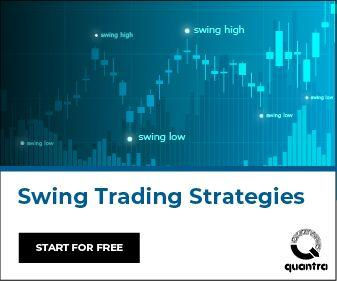

## Table of Contents

## What is swing trading and how does it differ from other trading styles?

Swing trading is a way of trading where you hold onto stocks or other investments for a few days to a few weeks. The goal is to make money from the ups and downs in the price of the investment during this time. People who do swing trading look for patterns and trends in the market to decide when to buy and sell. They try to catch the "swing" in the price movement, which is why it's called swing trading.

Swing trading is different from other trading styles like day trading and long-term investing. Day trading is when you buy and sell investments within the same day, trying to make quick profits from small price changes. It's a lot faster and more intense than swing trading. On the other hand, long-term investing is when you hold onto investments for months or years, hoping they will grow in value over time. Swing trading falls in between these two styles, as it's not as fast as day trading but not as slow as long-term investing. This makes it a good choice for people who want to be more active than long-term investors but don't want the stress and time commitment of day trading.

## What are the basic principles of swing trading?

Swing trading is all about trying to make money from the ups and downs of the market over a short period, usually a few days to a few weeks. The main idea is to find patterns in how prices move and use those patterns to decide when to buy and sell. Swing traders look for stocks or other investments that seem likely to go up in price soon. They buy these investments and then sell them when the price has gone up enough to make a profit. It's important to have a good plan and stick to it, knowing when to get in and out of trades.

Another key part of swing trading is managing risk. This means not putting all your money into one trade and using tools like stop-loss orders to limit how much you could lose. Swing traders also need to keep an eye on the bigger picture, like what's happening in the economy or with the company they're investing in, because these things can affect prices. It's a balance of trying to make money from short-term moves while also being aware of longer-term trends. By following these basic principles, swing traders aim to make consistent profits over time.

## How can a beginner identify potential swing trading opportunities?

For a beginner, identifying potential swing trading opportunities starts with learning to read charts and understand technical analysis. This means looking at price movements and patterns on a chart to guess where the price might go next. A common tool is the moving average, which smooths out price data to show a trend. If a stock's price goes above its moving average, it might be a good time to buy because the price could keep going up. On the other hand, if the price drops below the moving average, it might be a sign to sell. Beginners should also pay attention to support and resistance levels, which are price points where the stock often stops falling or rising. These levels can help predict where the price might turn around.

Another way to spot swing trading opportunities is by keeping up with news and events that could affect stock prices. For example, if a company is about to release a new product or report its earnings, the stock price might move a lot in response. Beginners can use economic calendars to track when these events are happening. It's also helpful to follow financial news and read analyst reports to get a sense of what's going on in the market. By combining technical analysis with an awareness of important news and events, beginners can start to see where the good opportunities might be. It takes practice and patience, but over time, they can get better at finding the right moments to buy and sell.

## What are the most common technical indicators used in swing trading?

In swing trading, some of the most common technical indicators that traders use are moving averages, the Relative Strength Index (RSI), and the Moving Average Convergence Divergence (MACD). Moving averages help traders see the overall trend of a stock's price by smoothing out the ups and downs. A simple moving average, for example, calculates the average price over a certain number of days. If the stock's price goes above the moving average, it might be a good time to buy because the price could keep going up. If it drops below, it might be a sign to sell.

The RSI is another useful tool that measures how fast and how much a stock's price is changing. It ranges from 0 to 100, and if it's over 70, the stock might be overbought, meaning it could go down soon. If it's under 30, the stock might be oversold, meaning it could go up soon. The MACD helps traders see the relationship between two moving averages of a stock's price. When the MACD line crosses above the signal line, it's often seen as a buy signal, and when it crosses below, it's seen as a sell signal. These indicators help swing traders make better decisions about when to buy and sell.

## How important is fundamental analysis in swing trading?

Fundamental analysis is not as important in swing trading as it is in long-term investing, but it still plays a role. Swing traders focus more on technical analysis, which looks at price patterns and trends to make trading decisions. However, understanding the basics of a company's financial health and news events can help swing traders make better choices. For example, if a company is about to release a new product or report earnings, knowing this can help a trader predict how the stock price might move in the short term.

Even though swing trading is about making quick profits from short-term price movements, ignoring [fundamental analysis](/wiki/fundamental-analysis) completely can be risky. A big change in a company's fundamentals, like a drop in earnings or a major lawsuit, can cause sudden price swings that a trader might not see coming just by looking at charts. By keeping an eye on fundamental factors, swing traders can better understand the bigger picture and avoid unexpected losses. So, while technical analysis is the main tool, a bit of fundamental analysis can make swing trading safer and more effective.

## What risk management techniques should swing traders use?

Swing traders need to use risk management techniques to protect their money. One important technique is setting stop-loss orders. A stop-loss order is like a safety net that automatically sells a stock if its price drops to a certain level. This helps limit how much money a trader can lose on a single trade. Another technique is not putting all your money into one trade. By spreading out the money across different trades, or diversifying, a trader can reduce the risk of losing everything at once.

It's also smart for swing traders to decide on a risk-reward ratio before they start trading. This means figuring out how much they are willing to lose compared to how much they hope to gain. A common ratio is 1:2, where a trader is okay with losing $1 for every $2 they hope to make. This helps keep trading decisions clear and stops traders from chasing after big wins without thinking about the risks. By using these simple risk management techniques, swing traders can protect their money and trade more safely.

## Can you explain the concept of support and resistance in the context of swing trading?

Support and resistance are important ideas in swing trading. They are like invisible lines on a price chart that help traders guess where a stock's price might stop going down or up. Support is a price level where the stock often stops falling and might start to go back up. It's like a floor that the price bounces off of. Resistance is the opposite; it's a price level where the stock often stops rising and might start to go back down. It's like a ceiling that the price bumps into.

Swing traders use support and resistance to decide when to buy and sell. If a stock's price gets close to a support level, a trader might think it's a good time to buy because the price could bounce back up. On the other hand, if the price gets close to a resistance level, a trader might think it's a good time to sell because the price could start to fall again. By watching these levels, swing traders can make better guesses about where the price might go next and plan their trades accordingly.

## How do swing traders use candlestick patterns to make trading decisions?

Swing traders use candlestick patterns to see what the market might do next. Candlestick patterns are shapes on a chart that show how the price of a stock moved during a certain time. For example, a "hammer" pattern looks like a hammer and can mean the price might go up soon. If a swing trader sees a hammer at a support level, they might decide it's a good time to buy because the price could bounce back up. Another pattern is the "shooting star," which looks like a star with a long top part. This can mean the price might go down soon, so a trader might sell if they see this pattern at a resistance level.

By looking at these patterns, swing traders can guess where the price might go next and make their trading decisions. They don't just look at one pattern but also see how it fits with other things like support and resistance levels or other technical indicators. For example, if a "bullish engulfing" pattern, where one big green candle completely covers a smaller red one, appears at a support level, it's a strong sign that the price might go up. This helps swing traders decide when to buy or sell to make the most profit while keeping their risks low.

## What are some advanced swing trading strategies that experienced traders might use?

Experienced swing traders often use a strategy called "[breakout](/wiki/breakout-trading) trading." This is when they look for a stock's price to move out of a certain range. If the price breaks above a resistance level, it might keep going up, so the trader buys. If it breaks below a support level, it might keep going down, so the trader sells. They use tools like Bollinger Bands to see when the price might break out. Bollinger Bands are lines on a chart that show how much the price has been moving around. If the price gets close to the top band, it might break out up, and if it gets close to the bottom band, it might break out down. This helps traders catch big moves early.

Another advanced strategy is "retracement trading." This is when traders look for a stock's price to pull back a bit after a big move. They use something called Fibonacci retracement levels to guess where the price might stop going down and start going back up. These levels are numbers like 38.2%, 50%, and 61.8% that show how far the price might pull back. If the price stops at one of these levels and starts to go up again, a trader might buy. They also look at other signs like candlestick patterns or the RSI to make sure the price is likely to go back up. This way, they can buy at a lower price and sell when it goes back up, making a profit from the retracement.

Some experienced traders also use "mean reversion" strategies. This is based on the idea that prices tend to go back to their average over time. If a stock's price has gone way above its average, it might come back down, so the trader sells. If it's gone way below its average, it might go back up, so the trader buys. They use tools like moving averages to see where the average price is. If the price is far away from the moving average, it might be a good time to trade. By understanding these patterns, experienced traders can make smart guesses about where the price might go next and plan their trades to make the most profit.

## How can swing traders adapt their strategies to different market conditions?

Swing traders need to change their strategies depending on whether the market is going up, going down, or staying the same. When the market is going up, or in a bull market, swing traders might look for stocks that are doing even better than the market. They can buy these stocks when they pull back a little and then sell them when they go up again. In a bull market, traders might use strategies like breakout trading, where they buy when the price breaks above a resistance level, expecting it to keep going up. They also need to be careful not to buy too late, as the price might not keep going up forever.

In a bear market, when the market is going down, swing traders have to be more careful. They might look for stocks that are not falling as fast as the market or stocks that are starting to go up a little. A good strategy in a bear market is mean reversion, where traders buy stocks that have fallen a lot and are now cheaper than their average price, hoping they will go back up. They can also use retracement trading, buying stocks when they pull back to a certain level and then selling them when they go up again. In a bear market, it's important to use stop-loss orders to limit losses, as the market can keep going down.

When the market is not going up or down much, or in a sideways market, swing traders can use strategies like range trading. This means buying stocks when they get close to the bottom of their price range and selling them when they get close to the top. They can also use breakout trading, but they need to be careful because the price might not break out of the range. In a sideways market, it's good to focus on stocks with strong fundamentals, as they are more likely to break out of the range if the market starts moving again. By adjusting their strategies to fit the market conditions, swing traders can keep making profits no matter what the market is doing.

## What role does psychology play in successful swing trading?

Psychology is a big part of swing trading. It's not just about knowing when to buy and sell; it's also about managing your feelings. When you're swing trading, you might feel scared if the price goes down or excited if it goes up. These feelings can make you do things that aren't part of your plan, like selling too soon or holding onto a losing trade for too long. Good swing traders learn to control their feelings and stick to their plan, even when the market is moving a lot. They know that feeling scared or excited is normal, but they don't let those feelings mess up their trading decisions.

Another important part of psychology in swing trading is having the right mindset. Successful swing traders believe in themselves and their strategies. They know that they won't win every trade, but they keep trying and learning from their mistakes. They also stay patient and don't rush into trades just because they want to make money fast. By staying calm and focused, they can make better decisions and do well over time. So, while knowing the technical stuff is important, being able to handle your feelings and keep a good mindset is just as important for successful swing trading.

## How can one evaluate the performance of their swing trading strategies over time?

To evaluate how well your swing trading strategies are doing over time, you need to keep track of your trades. Write down when you buy and sell, how much money you make or lose on each trade, and how long you hold onto each trade. This helps you see which strategies are working and which ones aren't. You can use a simple spreadsheet or a trading journal to keep all this information. By looking at your records, you can figure out if you're making more money than you're losing and if your strategies are getting better over time.

Another way to check your swing trading performance is by looking at your overall profit and loss. Calculate how much money you've made or lost over a certain period, like a month or a year. This gives you a big picture of how well you're doing. You can also compare your performance to the market or other traders to see if you're doing better or worse. By regularly reviewing your trades and your overall results, you can make changes to your strategies to improve your swing trading over time.

## What is Risk Management in Swing Trading?

Risk management is a critical component of successful swing trading, essential for preserving capital and ensuring long-term profitability. In swing trading, the goal is to capitalize on short- to medium-term price movements, and without proper risk management, traders are exposed to significant financial risks. 

One of the foundational risk management techniques in swing trading is the use of stop-loss orders. A stop-loss order is a predetermined price level at which a trade is automatically closed to limit a trader's loss. By setting a stop-loss, traders can ensure that their losses do not exceed a specific amount, protecting their capital from adverse market moves. This approach requires identifying suitable stop-loss levels based on factors such as [volatility](/wiki/volatility-trading-strategies), support and resistance levels, or a fixed percentage of the position size.

Position sizing is another crucial risk management tool. It involves determining the correct number of shares or contracts to trade, optimizing the balance between potential reward and risk. Proper position sizing is often calculated based on the trader's risk tolerance and the volatility of the asset. For instance, the formula to determine position size could be:

$$
\text{Position Size} = \frac{\text{Risk Capital}}{\text{Stop-Loss Amount}}
$$

where $\text{Risk Capital}$ represents the amount of money a trader is willing to lose on a trade, and $\text{Stop-Loss Amount}$ is the difference between the entry price and the stop-loss price.

Diversifying strategies can further safeguard traders against substantial losses. By employing a variety of strategies across different assets or markets, traders can reduce the impact of a single failure. Diversification ensures that not all trades are subject to the same risks, increasing the probability of achieving consistent returns.

Algorithmic trading platforms offer significant advantages in automating risk management processes. Algorithms can execute stop-loss orders automatically and adjust position sizing dynamically based on real-time data and predefined risk parameters. This automation reduces human error and emotional decision-making, providing a level of consistency and precision that manual trading struggles to achieve. For example, a Python snippet for an automated stop-loss mechanism might look like this:

```python
def check_stop_loss(current_price, stop_loss_price):
    if current_price <= stop_loss_price:
        execute_sell_order()

def execute_sell_order():
    # code to initiate sell order
    pass

current_price = get_current_market_price()  # hypothetical function
stop_loss_price = entry_price * 0.95  # 5% stop-loss level

check_stop_loss(current_price, stop_loss_price)
```

In summary, effective risk management in swing trading combines tactical techniques like stop-loss orders and position sizing with strategic considerations such as strategy diversification. The use of [algorithmic trading](/wiki/algorithmic-trading) platforms enhances these techniques through automation, minimizing potential losses and promoting discipline in trading practices.

## References & Further Reading

[1]: Jegadeesh, N., & Titman, S. (1993). ["Returns to Buying Winners and Selling Losers: Implications for Stock Market Efficiency."](https://www.bauer.uh.edu/rsusmel/phd/jegadeesh-titman93.pdf) Journal of Finance, 48(1), 65-91.

[2]: Connors, L., & Alvarez, C. (2009). ["Short Term Trading Strategies That Work: A Quantitative Guide to Trading Stocks."](https://www.amazon.com/Short-Term-Trading-Strategies-That/dp/0981923909) TradingMarkets.

[3]: Chan, E. P. (2008). ["Quantitative Trading: How to Build Your Own Algorithmic Trading Business."](https://github.com/ftvision/quant_trading_echan_book) Wiley.

[4]: Jansen, S. (2018). ["Machine Learning for Algorithmic Trading: Predictive models to extract signals from market and alternative data for systematic trading strategies with Python."](https://www.amazon.com/Machine-Learning-Algorithmic-Trading-alternative/dp/1839217715) Packt Publishing.

[5]: Lopez de Prado, M. (2018). ["Advances in Financial Machine Learning."](https://www.amazon.com/Advances-Financial-Machine-Learning-Marcos/dp/1119482089) Wiley.

[6]: Aronson, D. R. (2006). ["Evidence-Based Technical Analysis: Applying the Scientific Method and Statistical Inference to Trading Signals."](https://www.amazon.com/Evidence-Based-Technical-Analysis-Scientific-Statistical/dp/0470008741) Wiley.

[7]: Bergstra, J., Bardenet, R., Bengio, Y., & Kégl, B. (2011). ["Algorithms for Hyper-Parameter Optimization."](https://proceedings.neurips.cc/paper/2011/file/86e8f7ab32cfd12577bc2619bc635690-Paper.pdf) Advances in Neural Information Processing Systems 24.