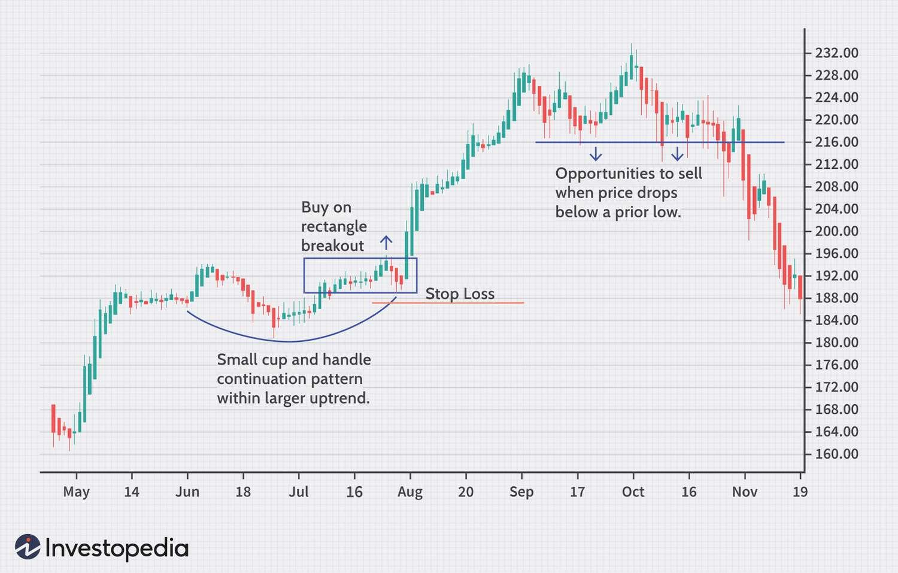

## Table of Contents

## What is swing trading and how does it differ from other trading styles?

Swing trading is a style of trading where people buy and sell stocks or other financial products over a few days to a few weeks. The goal is to make money from the ups and downs in the price of these products. Swing traders look for patterns in the price movements and use them to decide when to buy and sell. They usually hold onto their investments longer than day traders but shorter than long-term investors.

Swing trading is different from day trading because swing traders are okay with holding their investments overnight or even for several days. Day traders, on the other hand, buy and sell everything within the same day. Swing trading is also different from long-term investing. Long-term investors might hold onto their stocks for months or years, while swing traders are looking to make quick profits from short-term price changes. This means swing trading can be riskier than long-term investing but might be less stressful than day trading because you don't have to watch the market all day.

## What are the basic principles of swing trading for beginners?

Swing trading is all about finding the right moments to buy and sell stocks or other financial products over a short period, usually a few days to a few weeks. The main idea is to spot patterns in how prices move up and down. Beginners should start by learning to read charts and understand basic technical analysis. This means looking at things like moving averages, support and resistance levels, and other indicators that can show when a price might go up or down. It's important to practice using these tools on a demo account before risking real money.

Another key principle for beginners is to manage risk carefully. This means deciding how much money you're willing to lose on each trade and sticking to that limit. A common way to do this is by setting stop-loss orders, which automatically sell your investment if the price drops to a certain level. It's also a good idea to not put all your money into one trade. Instead, spread it out over different investments to reduce the risk. Remember, swing trading can be exciting, but it's important to stay calm and stick to your plan, even when the market gets wild.

## How do you identify potential swing trading opportunities in the market?

To find good swing trading opportunities, you need to look at charts and use technical analysis. This means watching for patterns in how prices move. For example, if a stock's price goes down to a certain level and then starts going up again, that level is called support. If the price goes up to a certain level and then starts going down again, that's called resistance. You can use tools like moving averages to see if the price is trending up or down. If a stock's price crosses above its moving average, it might be a good time to buy. If it crosses below, it might be a good time to sell.

Another way to spot opportunities is by looking at how much a stock's price is moving, called [volatility](/wiki/volatility-trading-strategies). If a stock's price is moving a lot, it might be a good swing trade because you can make more money from the big swings. But remember, more movement also means more risk. You can also use other indicators like the Relative Strength Index (RSI) to see if a stock is overbought or oversold. If the RSI is very high, the stock might be due for a price drop soon. If it's very low, the stock might be ready for a price increase. By combining these tools and watching the market closely, you can find good times to buy and sell.

## What technical indicators are most useful for swing trading?

For swing trading, some of the most useful technical indicators are moving averages, support and resistance levels, and the Relative Strength Index (RSI). Moving averages help you see the overall direction of a stock's price. For example, if the price is above the moving average, it might be trending up, which could be a good time to buy. If it's below, it might be trending down, which could be a good time to sell. Support and resistance levels show where the price might stop going down or up. If the price hits a support level and starts going up, that could be a good time to buy. If it hits a resistance level and starts going down, that could be a good time to sell.

Another useful indicator is the RSI, which tells you if a stock is overbought or oversold. If the RSI is over 70, the stock might be overbought, meaning it could soon go down in price. If it's under 30, the stock might be oversold, meaning it could soon go up in price. By watching these indicators, you can find the best times to buy and sell stocks for swing trading. It's important to use these tools together and not rely on just one, as they can help you make better decisions and manage your risk.

## How can fundamental analysis be incorporated into swing trading strategies?

Fundamental analysis can be a helpful tool for swing traders, even though it's usually used for longer-term investing. When you use [fundamental analysis](/wiki/fundamental-analysis), you look at things like a company's earnings, how much it's growing, and what's happening in its industry. This can help you decide if a stock is a good buy or not. For example, if a company's earnings are going up and it's doing better than its competitors, it might be a good time to buy its stock, even if you're just planning to hold it for a few days or weeks. By combining fundamental analysis with the patterns you see on stock charts, you can make smarter trading decisions.

Using fundamental analysis can also help you avoid some of the risks that come with swing trading. If you know a company is strong and has good future prospects, you might feel more confident holding onto its stock for a bit longer, even if the price goes down a little. This can help you ride out short-term dips and still make a profit when the price goes back up. Plus, by understanding the company's fundamentals, you can better guess how its stock might react to news or events in the market, which can be a big help in deciding when to buy and sell.

## What are common entry and exit strategies used in swing trading?

In swing trading, common entry strategies involve looking for specific patterns on stock charts. Traders often buy when a stock's price breaks above a resistance level or bounces off a support level. Another entry point is when the price crosses above a moving average, like the 50-day or 200-day moving average, signaling that the stock might start trending up. Some traders also use the Relative Strength Index (RSI) to find entry points. If the RSI is below 30, it means the stock might be oversold, and it could be a good time to buy because the price might soon go up.

Exit strategies in swing trading are just as important as entry strategies. A common way to exit a trade is to sell when the stock's price hits a resistance level or falls below a support level. Another exit strategy is to use a stop-loss order, which automatically sells the stock if its price drops to a certain level, helping to limit losses. Some traders also use a take-profit order, which sells the stock when it reaches a certain profit level. By setting these orders, swing traders can manage their risk and make sure they don't hold onto a stock for too long, missing out on profits.

## How do you manage risk and set stop-losses in swing trading?

Managing risk in swing trading is really important. One of the main ways to do this is by setting stop-loss orders. A stop-loss order is like a safety net that automatically sells your stock if the price drops to a certain level. This helps you limit how much money you could lose on a trade. For example, if you buy a stock at $50 and set a stop-loss at $45, your stock will be sold if the price hits $45, so you only lose $5 per share. It's a good idea to decide how much you're willing to lose before you even start trading and stick to that plan.

Another way to manage risk is by not putting all your money into one trade. This is called diversification. If you spread your money across different stocks, you reduce the risk of losing everything if one stock goes down a lot. It's also important to keep an eye on how much of your total money you're using for swing trading. Don't use money you can't afford to lose. By combining stop-loss orders and diversification, you can trade more safely and hopefully make some good profits without too much stress.

## What are the psychological aspects of swing trading and how can traders cope with them?

Swing trading can be tough on your mind because it involves making quick decisions and dealing with ups and downs in the market. It's easy to feel stressed or anxious when prices move a lot. Sometimes, traders might feel the urge to sell too soon if they see a small drop in price, or they might hold onto a losing trade hoping it will turn around. This is called emotional trading, and it can lead to bad decisions and losses. It's important for swing traders to stay calm and stick to their plan, even when the market gets wild.

One way to cope with the psychological challenges of swing trading is to set clear rules for when to buy and sell, and then follow those rules no matter what. This helps take the emotion out of trading. Another helpful tip is to take breaks and not watch the market all the time. It's also a good idea to keep a trading journal where you write down your thoughts and feelings. This can help you learn from your mistakes and understand what triggers your emotions. By practicing these habits, swing traders can better manage their stress and make smarter decisions.

## Can you explain advanced chart patterns and how they apply to swing trading?

Advanced chart patterns can help swing traders find good times to buy and sell stocks. One common pattern is the "head and shoulders," which looks like a person's head and two shoulders on a chart. It shows when a stock's price might be about to go down. The pattern has three peaks: the left shoulder, the head, which is the highest peak, and the right shoulder. When the price breaks below the "neckline," which is a line drawn between the lows of the two shoulders, it's often a sign to sell. Another pattern is the "double top," which looks like two mountain peaks next to each other. This means the stock's price hit a high point twice but couldn't go any higher, and it might start going down soon. When the price drops below the low point between the two peaks, it's a good time to sell.

Another useful pattern is the "cup and handle," which looks like a cup with a small handle on the right side. This pattern shows that the stock's price went down and then came back up, forming a rounded bottom like a cup. The handle is a small dip before the price starts going up again. When the price breaks above the top of the handle, it's a good sign to buy because the stock might keep going up. The "bull flag" is another pattern that swing traders watch for. It looks like a flag on a pole, with the pole being a sharp rise in price and the flag being a small dip or consolidation. When the price breaks out of the flag pattern, it's often a good time to buy because the stock might keep going up. By learning these patterns and watching for them on stock charts, swing traders can make better decisions about when to buy and sell.

## How do you adapt swing trading strategies to different market conditions?

Swing trading strategies need to change depending on what's happening in the market. In a bull market, when prices are going up a lot, swing traders might focus on buying stocks that are breaking out to new highs. They look for patterns like the "cup and handle" or "bull flag" because these often mean the price will keep going up. It's important to use less strict stop-losses in a bull market because small dips are normal, and you don't want to sell too soon and miss out on bigger gains. Also, traders might hold onto their stocks a bit longer to catch bigger swings in price.

In a bear market, when prices are going down a lot, swing traders need to be more careful. They might look for stocks that are bouncing off support levels or showing patterns like the "head and shoulders" or "double top," which can signal a good time to sell. In these conditions, it's smart to use tighter stop-losses to protect your money because the market can drop quickly. Traders might also focus on short selling, which means borrowing stocks to sell them and then buying them back at a lower price to make a profit. By understanding the market conditions and adjusting their strategies, swing traders can still make money no matter if the market is going up or down.

## What are some advanced swing trading techniques used by expert traders?

Expert swing traders often use advanced techniques like Fibonacci retracement to find good entry and exit points. Fibonacci retracement uses numbers to predict where a stock's price might go next. Traders draw lines on the chart at certain percentages, like 38.2%, 50%, and 61.8%, to see where the price might stop going down and start going up again. This helps them decide when to buy. For example, if a stock's price drops to the 61.8% level and then starts going up, that could be a good time to buy. Expert traders also use other tools like the Elliott Wave Theory, which looks at repeating patterns in the market to predict future price movements. By combining these tools, they can make more accurate predictions and improve their chances of making a profit.

Another advanced technique is using options to increase profits and manage risk. Options give traders the right to buy or sell a stock at a certain price in the future. Expert swing traders might buy call options if they think a stock's price will go up, or put options if they think it will go down. This can help them make more money from small price movements. They also use options to set up more complex strategies like straddles and strangles, which let them make money no matter which way the stock's price moves. By using options and other advanced tools, expert swing traders can fine-tune their strategies and handle different market conditions better.

## How can swing trading be optimized using algorithmic tools and software?

Swing traders can use algorithmic tools and software to make their trading better. These tools can look at a lot of data really fast and find patterns that might be hard for a person to see. For example, they can use software to scan lots of stocks and find the ones that match their trading rules. This can save a lot of time and help traders find good trades they might have missed. Some software also lets traders test their strategies on old data to see how well they would have worked in the past. This is called [backtesting](/wiki/backtesting), and it can help traders improve their plans before they use real money.

Another way algorithmic tools help is by automating parts of the trading process. Traders can set up rules in the software, like when to buy or sell a stock based on certain signals. This means the computer can do the trading for them, which can be faster and take out some of the emotion that can mess up trading decisions. Some tools also help with managing risk by setting automatic stop-losses and take-profit orders. By using these tools, swing traders can make their strategies more precise and manage their trades better, even when they're not watching the market all the time.

## What is Understanding Swing Trading?

Swing trading is a trading strategy that aims to capitalize on short to medium-term gains in financial markets, typically over a few days to several weeks. This approach involves exploiting market 'swings,' which are fluctuations caused by volatility. Traders engaged in swing trading often seek opportunities where they can enter and exit positions to benefit from potential price movements.

A fundamental aspect of swing trading is technical chart analysis. Traders rely on various tools and indicators to identify potential entry and [exit](/wiki/exit-strategy) points. These include support and resistance levels, trend lines, and pattern formations such as head and shoulders, double tops, and flag patterns. Recognizing these patterns is essential for anticipating future price movements and making informed trading decisions.

Risk management is a critical element of successful swing trading. Traders must define risk parameters such as stop-loss orders to protect against significant losses. Setting a stop-loss involves determining a pre-defined price level at which a trader will exit a losing position to prevent further loss. This approach helps maintain risk exposure at manageable levels while pursuing profitable opportunities.

Two key strategies that swing traders often employ are moving averages and pivot points. Moving averages smooth out price data to identify trends and reversals. The most common types are the simple moving average (SMA) and the exponential moving average (EMA). The SMA calculates the average of a security's prices over a specific period, while the EMA gives more weight to recent prices, making it more responsive to new information.

For instance, a 50-day moving average can provide insight into a medium-term trend, while a 200-day moving average is useful for identifying long-term direction. Crosses between shorter and longer moving averages can signal potential buy or sell points. For example, a bullish crossover occurs when a short-term moving average crosses above a long-term moving average, suggesting upward [momentum](/wiki/momentum).

Pivot points are another vital tool used by swing traders. They are calculated based on the high, low, and closing prices of the previous trading session and are used to predict support and resistance levels for the current trading session. The basic formula for the pivot point (P) is:

$$

P = \frac{\text{High} + \text{Low} + \text{Close}}{3}
$$

From this central pivot point, additional support and resistance levels can be calculated, offering traders a framework for potential price ranges.

Swing trading requires balancing analytical skills with disciplined execution. The goal is to identify promising trades and manage them effectively to capture profits from market swings. By leveraging tools like moving averages and pivot points, traders can enhance their decision-making process and improve their profitability in volatile markets.

## References & Further Reading

[1]: Bergstra, J., Bardenet, R., Bengio, Y., & Kégl, B. (2011). ["Algorithms for Hyper-Parameter Optimization."](https://papers.nips.cc/paper/4443-algorithms-for-hyper-parameter-optimization) Advances in Neural Information Processing Systems 24.

[2]: ["Advances in Financial Machine Learning"](https://www.amazon.com/Advances-Financial-Machine-Learning-Marcos/dp/1119482089) by Marcos Lopez de Prado

[3]: ["Evidence-Based Technical Analysis: Applying the Scientific Method and Statistical Inference to Trading Signals"](https://www.amazon.com/Evidence-Based-Technical-Analysis-Scientific-Statistical/dp/0470008741) by David Aronson

[4]: ["Machine Learning for Algorithmic Trading"](https://github.com/PacktPublishing/Machine-Learning-for-Algorithmic-Trading-Second-Edition) by Stefan Jansen

[5]: ["Quantitative Trading: How to Build Your Own Algorithmic Trading Business"](https://books.google.com/books/about/Quantitative_Trading.html?id=j70yEAAAQBAJ) by Ernest P. Chan