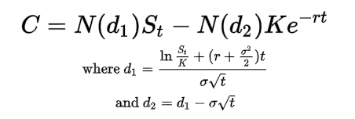

Swing trading is a tactical approach where traders capitalize on the 'swings' or fluctuations in asset prices over a short to medium timeframe, typically from a few days to several weeks. This style of trading seeks to profit from momentum in the market, catching the upswings and selling on the downswings. Options, on the other hand, are financial derivatives that grant the buyer the right, but not the obligation, to buy or sell an underlying asset at an agreed-upon price within a certain period. They offer the versatility to bet on both upward and downward market movements with a controlled risk profile.

The synergy between swing trading and options is potent. Options provide swing traders with flexibility and leverage. Unlike outright stock trades, options allow traders to take significant positions while putting up a fraction of the capital that would be required to own the stock outright, thus maximizing potential profits relative to investment. Moreover, the defined risk nature of options means traders know their maximum potential loss upfront, which is particularly beneficial for managing the short-term risks inherent in swing trading.

To hook you into the potential of swing trading with options, consider this: a study by the Chicago Board Options Exchange found that the BuyWrite index, a proxy for option trading strategies, outperformed the Standard & Poor's 500 index by an average of 2.6% per year from 1986 to 2006. This superior performance underscores the strategic edge that options can provide in swing trading scenarios. Add to this the success story of a seasoned swing trader who turned a modest $5,000 into $15,000 in just 90 days by astutely leveraging options during a particularly volatile earnings season, and the possibilities within options swing trading become vividly clear. While such results are not guaranteed and involve significant risk, they illustrate the potential when combining the precision of swing trading with the power of options[1].

## The Essence of Swing Trading in Options

At its heart, swing trading with options is about capturing profit from market momentum within a finite window, leveraging the power of options to amplify gains while managing risk. This trading discipline requires a blend of technical analysis, market sentiment reading, and the strategic use of options to exploit short-term price movements.

The core philosophy of swing trading in options lies in the recognition that stock prices move in waves or ‘swings’ which are driven by a myriad of factors, including corporate fundamentals, economic indicators, and market sentiment. Options swing traders harness these movements by employing calls and puts to speculate on directional moves. They might buy calls when anticipating an upswing or purchase puts when predicting a downturn. Options also allow traders to establish positions that benefit from market stasis or minor fluctuations, through strategies such as selling options premium.

Market psychology plays a pivotal role in swing trading, as traders must navigate through the emotional responses of the broader market. Fear and greed are powerful drivers of price swings, and successful swing traders are those who can keep a level head when these emotions are at their peak. A swing trader's mindset must be disciplined yet adaptable; they must stick to their trading plan but also be ready to pivot when the market environment changes.

Swing trading with options requires an understanding of the intrinsic and extrinsic value of options, volatility, and time decay. The swing trader leverages this knowledge to select options with the most advantageous pricing, capitalizing on discrepancies between the current market price and where they believe the price will go. They monitor implied volatility to identify options that are undervalued or overvalued and use time decay — the erosion of an option's value as it nears expiration — to their benefit, often selling options to capture premium as a form of income.

What sets swing traders apart is their rigorous approach to entering and exiting trades. They often employ technical analysis to identify potential entry and exit points, setting strict criteria for when to take profits or cut losses. This discipline is essential, as options have a finite life; timing is crucial to ensure that positions are not held so long that they lose value solely due to the passage of time.

## Deep Dive into Options for Swing Traders

Options are financial derivatives based on the value of underlying securities such as stocks. A call option gives the holder the right, but not the obligation, to buy a stock at a specified strike price before the option expires. Conversely, a put option gives the holder the right to sell the stock at a predetermined strike price before expiration.

The strike price is the fixed price at which the holder can buy or sell the underlying security. The expiration date is the last day the option can be exercised. Options that are "in the money" have intrinsic value - for calls, this means the stock price is above the strike price; for puts, it's below. "Out of the money" options, on the other hand, do not have intrinsic value and are worth less.

Options come with an expiration date, after which the rights they confer cease to exist. This temporal component introduces the concept of time decay, which refers to the reduction in the value of an option as it approaches its expiration date. The closer to expiration, the faster the value of the option declines, all else being equal.

Options are particularly suited to swing trading for several reasons:

1. **Leverage**: Options allow traders to control larger amounts of stock with a smaller investment, amplifying the potential returns on a price swing. For example, buying a call option might require significantly less capital than purchasing the stock outright, while still benefiting from upward price movements.
2. **Flexibility**: They provide the flexibility to capitalize on different market conditions. Swing traders can use options to speculate on upswings by buying calls, on downswings by buying puts, or on low volatility by selling options.
3. **Risk Management**: Options can also be used to manage risk through strategies like buying protective puts or creating spreads that limit downside exposure while still providing upside potential.
4. **Profit from Volatility**: Swing traders can profit from both directional moves and volatility. As volatility increases, so does the price of options, allowing traders to sell them at a premium.
5. **Capital Efficiency**: They are cost-effective as traders are not required to pay the full price for the stock, they can instead buy an option at a fraction of the stock’s cost.
6. **Strategic Alternatives**: There are numerous strategies that traders can apply to different market scenarios, such as straddles and strangles that allow traders to profit from large moves in either direction.
7. **Limited Risk**: When buying options, the maximum loss is limited to the premium paid for the option, which allows traders to define their risk threshold upfront.

Options' pricing is influenced by various factors beyond the price of the underlying asset - including time to expiration, volatility, and interest rates - which are encapsulated in models such as the Black-Scholes formula. These models help traders assess the fair value of options and make informed decisions on which contracts to trade.

Given the dynamic nature of options, swing traders must educate themselves on market movements and the specifics of options trading. Resources like the Options Clearing Corporation (OCC) offer educational material to help traders understand the complexities of options, and the Chicago Board Options Exchange (CBOE) provides a platform for options trading and resources on strategy and analysis.

## Picking the Right Options for Swing Trades

Selecting the right options for swing trading requires a multifaceted approach to analysis, one that encompasses not just the expected directional move of the underlying stock but also considers the unique characteristics of options as a derivative.

When analyzing stocks for potential swing trades using options, it is crucial to assess the company's fundamentals to ensure it stands on solid ground. This involves evaluating earnings reports, financial statements, and industry positioning. However, fundamental analysis in swing trading is often paired with a strong focus on technical analysis, as swing traders are typically more interested in price action and market sentiment than in long-term company performance.

The liquidity of options is a paramount consideration. Options with higher liquidity have tighter bid-ask spreads, which means lower transaction costs and better pricing for entering and exiting trades. Liquidity is often determined by the volume of options traded and the number of open contracts, or open interest. High liquidity in an option means you can trade it with ease, without significantly impacting the price.

Volatility is another critical factor for option traders. Historical volatility measures past price movements of the underlying stock, while implied volatility looks forward, reflecting the market’s view on the potential movement of the stock’s price. Implied volatility directly affects an option’s premium; higher implied volatility can lead to more expensive options, which can be beneficial when selling options, and vice versa. Swing traders use volatility to gauge potential trade profitability and to identify the right timing for trade execution.

Assessing the underlying stock performance is integral. A stock that exhibits a strong trend or a pattern of movement provides a clearer opportunity for swing trades. Swing traders should look for stocks that are likely to move significantly in either direction, rather than those that are stagnant or in a tight trading range.

Moreover, the choice between selecting in-the-money, at-the-money, or out-of-the-money options is dictated by the trader's risk tolerance and market view. In-the-money options are more expensive but have intrinsic value and less time decay (theta), making them a more conservative approach. At-the-money options are typically the focus of swing traders due to their balance between cost and potential profit. Out-of-the-money options are cheaper but riskier, as they require a more significant move in the underlying stock to become profitable.

The expiration date of options is also crucial. Swing traders usually opt for options with expiration dates that are not too far out, to reduce the cost of time decay, but far enough away to allow the anticipated stock move to unfold. A rule of thumb is to select an expiration date that extends beyond the expected swing period of the stock.

Option Greeks, which are measures of the sensitivity of an option’s price, also play a significant role. Delta, for instance, measures an option's sensitivity to a $1 change in the price of the underlying stock, and gamma measures the rate of change of delta. Theta indicates how much the option's price decreases as it approaches expiration. Vega shows sensitivity to volatility. These Greeks help in fine-tuning option selection and in setting up strategies that align with market outlooks and individual trade goals.

For those seeking external resources, platforms such as CBOE (Chicago Board Options Exchange) and NASDAQ provide robust data on option volume and interest, as well as tools for analyzing historical and implied volatility. Additionally, financial news websites such as Bloomberg and MarketWatch offer insights into market trends and stock performance that are useful when selecting options for swing trades[2].

## Technical Analysis for Swing Trading with Options

Technical analysis is a critical tool for swing traders, especially when combined with options trading, as it helps in pinpointing entry and exit points and in making educated decisions based on price movements and patterns rather than on emotional impulses.

Key technical indicators relevant to swing traders include:

1. **Moving Averages**: Simple Moving Average (SMA) and Exponential Moving Average (EMA) are widely used to smooth out price action and identify trends. For instance, the crossover of a short-term EMA above a long-term EMA may signal an uptrend, indicating a potential entry point for a call option.
2. **Relative Strength Index (RSI)**: This momentum oscillator helps identify overbought or oversold conditions. An RSI reading over 70 suggests an overbought scenario, often a signal for a potential downturn, whereas an RSI below 30 indicates an oversold condition, possibly presaging an upturn.
3. **MACD (Moving Average Convergence Divergence)**: MACD is a trend-following momentum indicator that shows the relationship between two moving averages of a stock’s price. A swing trader may look for signal line crossovers or the MACD crossing above or below zero for buy or sell signals.
4. **Bollinger Bands**: These bands widen or contract based on market volatility. A strategy might involve options purchases when the price of the stock is at the lower band, predicting a rebound.
5. **Volume**: Above-average trading volume can confirm the strength of a market move. Options traders might look for high volume in conjunction with price moves as a sign of entry.

As for chart patterns, traders often look for:

- **Head and Shoulders**: This pattern signals potential reversals in trends. An inverse head and shoulders during a downtrend can be a signal to buy call options.
- **Triangles**: Symmetrical, ascending, and descending triangles can indicate continuation or reversal. For example, a breakout from a symmetrical triangle could be an opportunity to buy a call or put option, depending on the direction of the breakout.
- **Flags and Pennants**: These are continuation patterns that suggest a consolidation period followed by a breakout. Options traders might use these patterns to buy options in anticipation of the breakout.

Case studies demonstrating the application of technical analysis include:

- **Apple Inc. (AAPL)**: In early 2021, AAPL showed a descending triangle pattern on the daily charts, signaling a potential bearish outcome. Traders who observed this could have capitalized on buying put options ahead of the breakdown, which proved profitable as the stock declined following the completion of the pattern.
- **Tesla, Inc. (TSLA)**: In mid-2020, TSLA exhibited a pennant pattern after a sharp rise, indicating a consolidation. An upward breakout, confirmed with increased volume, provided an opportunity for traders to buy call options, which resulted in significant gains as the stock continued to rally post-breakout.

These instances underscore the importance of confirming signals from multiple technical indicators and patterns before executing trades. Resources for learning and applying technical analysis include "Technical Analysis of the Financial Markets" by John J. Murphy, a comprehensive guide for novice to advanced traders, and platforms like TradingView or StockCharts, which offer extensive charting tools and real-time data for detailed technical analysis.

Swing trading with options, informed by disciplined technical analysis, enables traders to leverage market trends and volatility for potential profit while managing risks. As each trader’s strategy may differ, it’s crucial to back-test and paper-trade before risking actual capital based on technical signals.

## Advanced Swing Trading Strategies with Options

Advanced swing trading strategies involving options allow for flexibility, hedging, and leveraging different market conditions. These sophisticated strategies include spreads, straddles, and strangles, each catering to specific market sentiments and volatility scenarios.

**Spreads** involve buying and selling options of the same class, but with different strike prices or expiration dates. There are several types of spreads:

- **Vertical spreads** (bullish or bearish), constructed by purchasing and selling options with different strike prices but the same expiration date. These are used when traders expect moderate move in the underlying stock price.
- **Calendar spreads**, which involve options with the same strike price but different expiration dates, capitalizing on time decay for options with different expiries.

**Straddles and strangles** are strategies employed when a trader expects significant movement in the underlying stock but is uncertain about the direction.

- A **long straddle** involves buying a call and put option with the same strike price and expiration date, betting on volatility to push the stock significantly in either direction.
- A **long strangle** is a similar approach but uses out-of-the-money (OTM) call and put options to reduce the initial cost at the expense of needing a larger move in the underlying stock price to be profitable.

Adjusting these strategies in different market conditions is key:

- In a **high volatility environment**, premium prices for options are higher, making selling strategies like credit spreads more attractive. Traders might sell a call spread (bear call spread) if they believe the stock will not rise above a certain level.
- In **low volatility conditions**, when premiums are lower, buying strategies like long straddles or strangles can be favorable. Traders will gain if the stock makes a significant move.

However, one must consider the risk-to-reward ratio and the probability of profit when entering these positions. For instance, while selling a spread might offer a higher probability of profit with a limited reward, buying a straddle or strangle may present unlimited profit potential but with a lower probability of success and higher risk if the stock doesn’t move as much as needed.

These advanced options strategies can be quite complex and require a solid understanding of the Greeks (Delta, Gamma, Theta, Vega, and Rho), as they impact the price of options. A comprehensive resource for understanding and applying these Greeks is "Option Volatility and Pricing" by Sheldon Natenberg.

Additionally, adjusting strategies in response to market movements can involve rolling out options to later dates, or adjusting strike prices to manage losses or lock in profits. These adjustments must be made with a clear understanding of potential outcomes and transaction costs.

Given the complexity of these strategies, they are best executed on robust trading platforms that provide the necessary analytical tools, such as Thinkorswim by TD Ameritrade or Interactive Brokers’ Trader Workstation (TWS), both of which offer extensive tools for options traders.

Moreover, swing traders must stay abreast of market news and sentiment, as external factors can dramatically affect the success of these strategies. Services like Bloomberg or Reuters can be indispensable for receiving timely market news, while sentiment analysis tools like Market Sentiment indicators can assist in gauging the mood of the market[3][4].

## Market Conditions and Swing Trading Options

Market conditions are a critical component in determining the success of swing trading with options. The price of options is inherently tied to the underlying stock's performance, which is influenced by broader market trends. Therefore, swing traders must adeptly assess these trends to make informed decisions.

One key metric for assessing market trends is the **market index movement**. Indexes like the S&P 500, NASDAQ, and Dow Jones serve as barometers for market sentiment and direction. A rising market often corresponds with increased prices for call options and vice versa. Traders watch for divergence between market indexes and individual stock performance to spot potential swing trading opportunities.

The **Volatility Index (VIX)** is another essential tool. Commonly known as the "fear index," it measures the market's expectation of volatility over the coming 30 days. High VIX values denote high volatility, causing higher option premiums, which is crucial for option sellers. Conversely, low VIX levels suggest low market volatility, potentially favoring option buyers who seek cheaper premiums with the expectation that volatility will increase.

**Economic indicators** such as GDP growth rates, unemployment figures, and inflation data also influence market trends. For instance, strong economic indicators may lead to bullish market trends, affecting the pricing of options. Tools like the economic calendars provided by Forex Factory can help traders keep track of such indicators.

**Earnings reports and news events** are immediate forces that can cause significant swings in stock prices. Options traders use this to their advantage by gauging the implied move from the option's pricing before such events. Services like Earnings Whispers provide insights into upcoming earnings reports and expected volatility.

When it comes to **sentiment analysis**, it is about gauging the mood of the market or an individual stock. Sentiment indicators can range from simple put/call ratios, which measure the volume of trading in puts versus calls (with a high ratio potentially indicating bearish sentiment), to more complex measures like news and social media sentiment analysis.

**Social media sentiment analysis** tools, like StockTwits, parse out the bullish or bearish sentiment from traders' posts. The assumption is that a significant shift in sentiment on social media platforms could precede a move in the stock price, which is particularly useful for swing traders looking for early signals.

**Technical analysis** also plays a part in assessing market conditions. For instance, a strong uptrend on high volume could be an indication of sustained positive sentiment, while a downtrend on high volume might indicate the opposite.

Swing traders can also use **historical volatility** data to understand how much an asset typically moves over a specific period, which helps in setting realistic profit targets and stop-loss orders. Historical volatility can be contrasted with implied volatility to determine if options are relatively cheap or expensive.

## Entry and Exit Strategies for Options Swing Trading

In options swing trading, crafting effective entry and exit strategies is essential for capitalizing on price movements while managing risk. Entry strategies should focus on identifying the optimal timing and price to enter a trade, while exit strategies define when to take profits or cut losses to preserve capital.

**Entry Strategies**

Timing is crucial when entering an options swing trade. It's often advantageous to enter a position after a period of consolidation or following a pullback within a prevailing trend. This is where tools like the Relative Strength Index (RSI) and Moving Average Convergence Divergence (MACD) can be invaluable. For example, an RSI that moves back from an overbought or oversold condition may signal an entry point aligned with the underlying trend.

Price considerations for entry include the option's intrinsic and extrinsic values. It's generally preferable to enter a trade when the option's premium is relatively low, thereby reducing the cost of entry and potentially increasing the profit margin. Websites like the Chicago Board Options Exchange (CBOE) provide a vast array of tools and data that can help traders analyze option pricing and volatility.

**Exit Strategies**

Setting clear profit targets upfront can lead to more disciplined trading. These targets are often based on key support and resistance levels identified through technical analysis. Once the target is reached, the option can be sold to capture profits. Tools like Fibonacci retracement levels, available on platforms like TradingView, can aid in determining these critical price levels.

Stop losses are a critical exit strategy to prevent substantial losses. They are predetermined prices at which an option will be sold to limit a trader’s loss if the market moves unfavorably. The stop loss can be a static price level or a percentage from the entry point. For options traders, considering time decay is vital; as expiration approaches, options lose value, which should factor into where a stop loss is set.

Trailing stops offer a dynamic approach to exit strategies. They allow profits to run while protecting against significant losses by moving up with the option’s price. For instance, setting a trailing stop at a 10% drop from the option's highest price reached in the trade will lock in profits while giving the trade room to fluctuate before the stop is triggered.

The implementation of these strategies is greatly aided by brokerage platforms that offer sophisticated order types. Brokers like TD Ameritrade and Interactive Brokers allow traders to set complex orders that can automatically execute these strategies based on the trader's predetermined criteria[5][6].

## Risk Management in Swing Trading with Options

Risk management is paramount in swing trading with options due to the inherent leverage and time decay characteristics of options contracts. Effective risk management strategies can mean the difference between consistent profitability and erratic performance in trading.

**Risk Assessment and Management Techniques**

One of the most fundamental techniques in managing risk with options is position sizing. This involves determining the appropriate amount of capital to allocate to any single trade. A common rule of thumb is not to risk more than 1-2% of the trading capital on a single trade. This threshold helps ensure that a trader can survive a string of losses without significantly depleting their capital.

Another technique is the use of stop-loss orders, which automatically close out a trade at a predetermined price level to prevent further losses. These orders are essential in options trading due to the potential for rapid price swings.

Hedging is a sophisticated risk management strategy used in options trading. It involves taking an offsetting position to mitigate the risk of adverse price movements. For example, buying put options can hedge long stock positions, protecting against downside risk. The cost of such insurance needs to be weighed against the potential benefits, as it can eat into the profits.

**Portfolio Allocation and Diversification**

When it comes to portfolio allocation, options should generally comprise only a portion of an investor's overall portfolio due to their speculative nature. Diversifying across different securities, strike prices, expiration dates, and types of options (calls and puts) can help mitigate unsystematic risk.

Diversification can also be achieved by using different options strategies across various market conditions. Strategies such as covered calls or protective puts involve holding the underlying stock, which may provide some level of stability compared to trading options alone.

Moreover, the Greeks (Delta, Gamma, Theta, Vega, and Rho) play a crucial role in the risk management of an options portfolio. Delta, for instance, measures the sensitivity of an option's price to changes in the price of the underlying asset and can be used to establish a delta-neutral position, where the portfolio is not overly exposed to small price movements in the underlying stock.

Theta measures time decay, which is critical as options are time-sensitive instruments. Managing theta involves careful selection of expiration dates and sometimes rolling out positions to further-dated contracts to manage the effects of time decay on the portfolio's value[7][8].

## Execution: Timing Your Swing Trades

Timing is a critical element in swing trading with options, as it can influence the profitability of trades due to the options' expiration dates and time decay (Theta). The selection of the correct expiration period can leverage the time-sensitive nature of options to a trader's advantage, balancing the trade-off between the time for the trade to work out and the decay of the option’s value over time.

When selecting option contracts for swing trading, traders often choose expiration dates that are slightly beyond their expected time frame for the stock's move. This strategy accounts for the potential of time decay affecting the option's value, especially in the final month before expiration. For example, if a trader expects a stock to move over a week or two, they may opt for an option that expires in a month or more to ensure the swing has enough time to develop.

**Step-by-Step Guide on Executing Trades**

1. **Research and Analysis**:
    - Before entering a trade, conduct thorough research on the underlying stock.
    - Use technical analysis tools to identify potential entry and exit points.
2. **Selection of Option Contracts**:
    - Decide on call or put options based on bullish or bearish sentiment.
    - Choose the strike price that aligns with your analysis and trading plan.
    - Select an expiration date that gives the trade sufficient time to unfold, typically longer than the expected swing period.
3. **Choosing the Right Broker/Platform**:
    - Look for a broker with competitive commission rates to keep costs down.
    - Ensure the trading platform provides the necessary analytical tools.
    - Confirm that the broker's platform offers real-time data, essential for timely execution.
4. **Setting Up the Trade**:
    - Enter the position by placing an order with the selected strike price and expiration.
    - Use limit orders to control the price of entry, which can be crucial for options due to their spread.
5. **Trade Management**:
    - After entry, monitor the trade closely, keeping an eye on the stock's price action and the option's price behavior.
    - Be prepared to act if the market moves against your position or if profits can be taken earlier than anticipated.
6. **Executing the Exit**:
    - Exit the trade using market orders if immediate action is needed.
    - Employ limit orders or contingent orders to automate the exit at predetermined profit or loss thresholds.
7. **Review and Adjustment**:
    - After executing a trade, review the outcome to understand what worked and what didn’t.
    - Adjust your strategy as necessary for future trades.

**Choosing the Right Broker/Platform Considerations**[9][10]

- **Execution Speed**: Opt for brokers with a reputation for fast order execution.
- **Tools and Resources**: Availability of advanced charting and analysis tools can be beneficial.
- **Customer Support**: Good customer service is vital, especially when immediate assistance is needed.
- **Regulatory Compliance**: Ensure the broker is registered with and regulated by relevant financial authorities to guarantee a level of security and trustworthiness.

## Legal and Regulatory Considerations

Options trading, like all investment activities, is subject to a robust legal and regulatory framework designed to protect traders and maintain fair markets. In the United States, the primary regulator for options trading is the Securities and Exchange Commission (SEC), with the Financial Industry Regulatory Authority (FINRA) as an additional layer of oversight, particularly for broker-dealers. Options are also subject to rules set by the Options Clearing Corporation (OCC) and the exchanges where they are traded, such as the Chicago Board Options Exchange (CBOE).

Traders must comply with requirements such as the "know your customer" (KYC) and anti-money laundering (AML) rules, which are enforced by brokerages as per SEC and FINRA regulations. There are also specific rules regarding options trading, including but not limited to suitability requirements (FINRA Rule 2111), options account approvals, and the need for disclosures about the risks associated with options trading.

Beyond these, each type of options trade may be subject to different margin requirements. For instance, selling naked options (options sold without holding an underlying position) typically requires substantial margin as a buffer against the high risk of potentially unlimited losses.

Tax implications for options traders can be complex. In the U.S., the Internal Revenue Service (IRS) has detailed rules regarding the taxation of investments, including options trading. Options transactions can lead to short-term capital gains, which are taxed as ordinary income, or long-term capital gains, which have a lower tax rate depending on the holding period and the trader’s tax bracket. The “wash sale” rule is also something options traders need to be aware of; it disallows the claim of a loss on a security if a replacement security is purchased within a 30-day window surrounding the sale.

Reporting for options trading involves detailed record-keeping. Traders must report all of their transactions on Form 8949 and Schedule D of their tax return, which can become quite complex if a large number of trades are made throughout the year. Furthermore, changes in tax law, such as those affecting investment income, can also impact options traders.

Moreover, the Dodd-Frank Wall Street Reform and Consumer Protection Act brought about further regulations affecting the derivatives market, including options. This regulation aims to increase transparency and reduce risk in the financial system, particularly in the over-the-counter (OTC) derivatives market.

For traders operating in different jurisdictions, the legal and regulatory requirements can vary greatly. For example, the European Union has its own set of rules governed by the European Securities and Markets Authority (ESMA), and other countries have their regulatory bodies and tax laws.

It is imperative for options traders to stay informed about regulatory changes that could affect their trading activities. Consulting with a financial advisor or a tax professional is highly advisable to navigate the complex landscape of options trading regulations and tax laws[11][12][13].

## Swing Trading Options: The Psychology of Trading

In the realm of options trading, adherence to legal frameworks and regulatory considerations is as crucial as any trading strategy. In the United States, the Securities and Exchange Commission (SEC) oversees options trading, ensuring transparency and fairness. The Options Clearing Corporation (OCC) acts as the issuer and guarantor for option contracts, enforcing standards and managing the assignment of exercised options.

For regulatory compliance, traders must navigate through a series of rules. Options trading is governed by the “pattern day trader” rule, which pertains to those who execute four or more day trades within five business days in a margin account, provided the number of day trades is more than six percent of the customer's total trading activity for that same five-day period. Such traders must maintain a minimum equity of $25,000 in their margin account.

Tax implications for options traders are handled by the Internal Revenue Service (IRS). The tax treatment of options transactions depends on the nature of each trade. Most options trades fall under Section 1256 contracts, which are taxed at a 60/40 split between long-term and short-term capital gains, regardless of the holding period. This treatment benefits traders with lower blended tax rates. However, equity options are not Section 1256 contracts and are treated as short-term capital gains if the position is held for less than a year.

Reporting for options traders can be intricate. All transactions must be documented in detail, including dates, costs, proceeds, and the type of transaction. For IRS reporting, the form 1099-B is used by brokers to report proceeds from all sell transactions, which are necessary for the taxpayer to fill out Form 8949 and Schedule D, capturing capital gains and losses.

Due to the intricacies of tax laws and the potential for changes with new legislation, traders are often best served by consulting with tax professionals. This ensures compliance and an understanding of how legislative changes might affect trading strategies.

Globally, each country has its regulatory body, such as the Financial Conduct Authority (FCA) in the United Kingdom, and similar tax laws to the United States. It's imperative for options traders to be cognizant of the local laws in any market they operate.

## Practical Tools and Resources for Swing Traders

Swing traders wielding options as part of their strategic arsenal have at their disposal a wide array of tools and resources designed to streamline decision-making processes and enhance trading performance. These range from charting platforms to educational portals, each providing a unique edge in navigating the options market.

Charting software is indispensable for technical analysis, with platforms such as TradingView and Thinkorswim by TD Ameritrade offering comprehensive suites of drawing tools, historical data, and real-time market information. For options-specific analysis, software like the OptionsOracle and the Probability Lab at Interactive Brokers allows traders to visualize options strategies, calculate probabilities, and analyze risk/reward profiles.

Risk management tools, another cornerstone of successful trading, can be found within most brokerage platforms. These tools help traders set stop losses, create alerts, and track portfolio performance, aiding in the adherence to risk management rules.

Screeners and scanners are critical for identifying options trading opportunities. Finviz and Trade Ideas offer robust screening capabilities that filter stocks and options based on criteria such as volatility, volume, and technical indicators.

For market insights and sentiment analysis, resources like the Fear & Greed Index and social media sentiment trackers can provide a gauge of market emotions, which can be particularly relevant for swing traders looking to time their entry and exit points.

In addition to these tools, educational resources play a significant role in a trader’s development. Websites like Investopedia offer a wealth of information on options strategies, while the Chicago Board Options Exchange (CBOE) provides educational material specifically geared toward options trading.

Successful swing traders often emphasize the role of continuous learning and adaptability. Interviews and podcasts with seasoned traders can offer valuable insights into the practical application of strategies and the mindset required for trading options. The "Chat With Traders" podcast and YouTube channels such as "Option Alpha" frequently feature interviews with traders who share their experiences and tips for success.

Finally, community forums such as the r/options subreddit or the Elite Trader forum allow for the exchange of ideas and strategies amongst traders, while also serving as a platform for networking and mentorship opportunities.

The cumulative effect of leveraging these tools and resources can be substantial, providing traders with the knowledge and technical prowess to navigate the complexities of options trading. The direct application of insights gleaned from these tools, combined with first-hand advice from successful traders, can form a solid foundation upon which a swing trader can build a profitable trading career.

## Updates and Trends in Swing Trading with Options

Swing trading with options has seen a noticeable shift in recent years due to advancements in technology, increased accessibility, and changes in regulatory landscapes. Traders have been leveraging sophisticated algorithms, high-frequency trading systems, and comprehensive data analytics to gain an edge in timing the market and managing risks more effectively.

**Algorithmic Trading**: The rise of algorithmic trading has allowed swing traders to automate their strategies, including options trading. This trend towards automation helps in executing trades at optimal prices and speeds, which is crucial in options trading where timing can significantly impact profits.

**Machine Learning**: Machine learning models are increasingly being employed to predict market patterns and assist in making more informed trading decisions. These models analyze vast amounts of data and identify potential trading signals based on historical trends and probabilities.

**Social Sentiment Analysis**: Tools that gauge market sentiment from social media and news outlets are becoming more sophisticated. Sentiment analysis is now a significant factor considered by swing traders, as it can provide early indicators of market moves.

**Mobile Trading**: Improvements in mobile trading platforms mean that swing traders can now execute trades, monitor options chains, and perform technical analysis from anywhere, ensuring they never miss a market move.

**Broader Access to International Markets**: Technological advancements have made it easier for swing traders to access and trade international options markets, thereby diversifying their trading strategies and exposure.

The outlook for swing trading with options suggests a continuing trend towards more automation, advanced data analytics, and a growing emphasis on mobile and remote trading capabilities. Furthermore, the integration of AI and machine learning in trade decision-making processes could also become standard practice.

However, as technology advances, the need for strict risk management remains paramount. Swing traders must stay informed about regulatory changes, particularly those relating to digital assets and the use of personal data for trading.

## Conclusion

Swing trading with options emerges as a compelling strategy for those looking to amplify their market gains while effectively managing risks. By taking advantage of the inherent leverage and flexibility options offer, swing traders can capitalize on short- to medium-term price movements in the market. Throughout this guide, we've defined swing trading and options, exploring how they work in tandem to create lucrative trading opportunities. We've delved into the mechanics of options trading, highlighted key technical analysis tools, and unpacked advanced strategies to navigate various market conditions.

From understanding the psychology behind market moves to establishing solid entry and exit plans, we've covered the spectrum of knowledge required to excel in swing trading with options. The discussion extended to risk management, emphasizing the importance of a disciplined approach to portfolio allocation and the necessity of being abreast of legal and regulatory frameworks. Furthermore, we've provided insights into the latest technological advancements and how they are revolutionizing the way traders analyze data and execute trades.

In summary, success in swing trading with options is not serendipitous—it's the result of a well-rounded strategy, continuous learning, and an adaptive mindset. It's crucial to remain informed, disciplined, and emotionally resilient.

As markets evolve and new strategies emerge, we invite you to stay engaged with the content provided here. Your feedback and questions are vital to fostering a community of informed and successful swing traders. Whether you're just beginning or seeking to refine your approach, we encourage you to share your experiences and insights or reach out with inquiries. Let's continue the conversation and pursue trading excellence together.

💡 **Read more:**

- Trading strategies papers with code on [Equities](https://wiki.paperswithbacktest.com/trading-strategies/equities), [Cryptocurrencies](https://wiki.paperswithbacktest.com/trading-strategies/cryptocurrencies), [Commodities](https://wiki.paperswithbacktest.com/trading-strategies/commodities), [Currencies](https://wiki.paperswithbacktest.com/trading-strategies/currencies), [Bonds](https://wiki.paperswithbacktest.com/trading-strategies/bonds), [Options](https://wiki.paperswithbacktest.com/trading-strategies/options)
- [A curated list](https://github.com/paperswithbacktest/awesome-systematic-trading) of awesome libraries, packages, strategies, books, blogs, and tutorials for systematic trading
- [A bunch of datasets](https://huggingface.co/paperswithbacktest) for quantitative trading
- [A website to help you](https://paperswithbacktest.com/) become a quant trader and achieve financial independence

## Frequently Asked Questions

**What is swing trading with options?**

Swing trading with options involves holding options contracts for a period ranging from several days to weeks in an attempt to profit from price swings or trends in the underlying assets.

**How do options work in swing trading?**

In swing trading, options allow traders to leverage their position with less capital compared to buying stocks outright. Traders typically use call options to speculate on upward price movements and put options for downward price movements of the underlying stock.

**What are the key benefits of using options for swing trading?**

Options provide leverage, flexibility, limited risk for buyers, and the potential for significant returns with relatively low capital investment. They also allow traders to profit from both upward and downward market movements.

**How do I select the right strike price and expiration date for swing trading options?**

The right strike price and expiration date depend on your market analysis and forecast period. Generally, choose a strike price close to the current stock price and an expiration date that gives the underlying asset enough time to move but is not too far out, which could erode the option's value due to time decay.

**Can I swing trade options with a small account?**

Yes, swing trading options can be suitable for small accounts due to the lower capital requirement compared to purchasing stocks. However, it's important to manage risk carefully as options can be volatile.

**What technical indicators are best for swing trading options?**

Common technical indicators for swing trading options include moving averages, Relative Strength Index (RSI), MACD, and Bollinger Bands. Traders often use a combination of these to identify potential entry and exit points.

**What are the risks of swing trading options?**

The risks include the possibility of losing the entire premium paid for the option, increased volatility leading to rapid price changes, and the impact of time decay on option values.

**How important is volume when selecting an options contract?**

Volume is critical as it indicates liquidity. Higher volume ensures tighter bid-ask spreads and better prices for entering and exiting trades.

**How do I manage risk when swing trading with options?**

Risk management strategies include setting stop-loss orders, not allocating more than a certain percentage of your portfolio to a single trade, and using strategies like spreads to limit downside risk.

**Do I need a specific type of brokerage account to trade options?**

Yes, you need a brokerage account approved for options trading, which typically requires additional forms and agreements due to the risks associated with trading options.

**Are there any tax implications for swing trading options?**

Options trades are subject to taxation, and the specific tax treatment can depend on the duration of the trade and the country of residence. Short-term trades are often taxed at higher rates compared to long-term trades. It’s important to consult with a tax advisor for your individual situation.

## References & Further Reading

[1]: [Passive options-based investment strategies: The case of the CBOE S&P 500 BuyWrite Index](https://www.researchgate.net/publication/247907242_Passive_options-based_investment_strategies_The_case_of_the_CBOE_SP_500_BuyWrite_Index)

[2]: [Cboe Daily Market Statistics](https://www.cboe.com/us/options/market_statistics/daily/)

[3]: [Bloomberg](https://www.bloomberg.com/professional/solution/bloomberg-terminal/)

[4]: [Reuters](https://www.refinitiv.com/fr/products/eikon-trading-software)

[5]: [TD Ameritrade](https://www.tdameritrade.com/)

[6]: [Interactive Brokers](https://www.interactivebrokers.com/en/home.php)

[7]: The Chicago Board Options Exchange (CBOE) offers comprehensive educational materials on position sizing and the Greeks, which can be found at [www.cboe.com/learn](http://www.cboe.com/learn).

[8]: The Options Industry Council (OIC) provides free resources to educate investors about various options strategies and risk management techniques at [www.optionseducation.org](http://www.optionseducation.org/).

[9]: The Financial Industry Regulatory Authority (FINRA) provides a BrokerCheck tool to research the background of financial brokers and firms [www.finra.org/brokercheck](https://www.finra.org/brokercheck).

[10]: The Options Clearing Corporation (OCC) offers educational material on options trading and a list of options-friendly brokers [www.theocc.com](https://www.theocc.com/).

[11]: SEC’s official website for guidelines on options trading ([www.sec.gov](http://www.sec.gov/))

[12]: FINRA’s rules ([www.finra.org](http://www.finra.org/))

[13]: IRS’s publication on investment income and expenses (Publication 550) which is available on their official site ([www.irs.gov](http://www.irs.gov/))