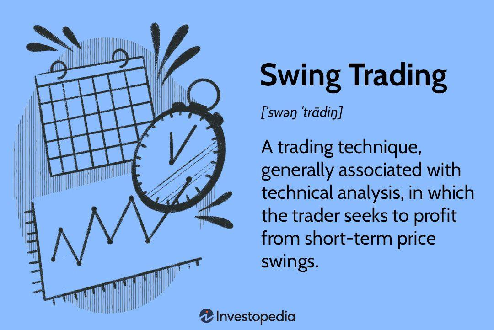

## Table of Contents

## What is swing trading?

Swing trading is a way of making money by buying and selling stocks, currencies, or other financial things over a few days to a few weeks. People who do swing trading try to find good times to buy something when its price is low and then sell it when the price goes up. They use charts and other tools to guess which way the price will go next.

Swing traders do not keep their investments for a very long time like some other investors. Instead, they look for short-term changes in the market. This can be a bit risky, but it can also make more money if done right. It's important for swing traders to have a good plan and to watch the market closely to make smart choices about when to buy and sell.

## How does swing trading differ from day trading and long-term investing?

Swing trading is different from day trading because swing traders hold onto their investments for a few days to a few weeks, while day traders buy and sell within the same day. Day traders try to make quick profits from small price movements throughout the day. They need to watch the market very closely all the time. On the other hand, swing traders look for bigger price swings that happen over several days or weeks. They don't need to watch the market every second, but they still need to check it regularly.

Swing trading also differs from long-term investing. Long-term investors hold onto their investments for months or years, aiming to benefit from the overall growth of a company or market over time. They are less concerned with short-term price changes and more focused on the long-term value of their investments. In contrast, swing traders are looking to make money from short-term trends and price movements. They are more active in buying and selling, trying to catch the ups and downs in the market to make profits more quickly than long-term investors.

## What are the key principles of swing trading?

Swing trading is all about finding the right moments to buy and sell. The main idea is to look for stocks or other financial things that are moving in a certain pattern. Traders use charts and other tools to spot these patterns. They try to buy when the price is low and sell when it goes up. This means they need to be good at guessing which way the price will go next. To do this, they often look at how the price has moved in the past and use that information to make decisions.

Another important part of swing trading is managing risk. Since swing traders hold onto their investments for a short time, they need to be careful. They set rules for themselves about how much they are willing to lose on a trade. If a trade starts going the wrong way, they might decide to sell and cut their losses before they get too big. This helps them protect their money. They also need to have a plan for taking profits. Knowing when to sell and take the money they've made is just as important as knowing when to buy.

Overall, swing trading requires patience and discipline. Traders need to stick to their plans and not let their emotions take over. They should always be learning and getting better at reading the market. By following these principles, swing traders can try to make money from the ups and downs in the market over short periods of time.

## What types of securities are typically used in swing trading?

Swing trading often uses stocks as the main type of security. Traders look for stocks that move a lot in price over a few days to a few weeks. They use charts and other tools to find stocks that are likely to go up or down soon. Stocks from different industries can be used, but swing traders often focus on ones that are popular and have a lot of trading activity. This makes it easier to buy and sell quickly when the time is right.

Besides stocks, swing traders also use other types of securities like exchange-traded funds (ETFs) and [forex](/wiki/forex-system) (foreign exchange). ETFs are like baskets of stocks that you can buy and sell like a single stock. They can be a good choice because they often follow the ups and downs of a whole market or industry. Forex trading involves buying and selling different currencies. It's popular in swing trading because currency prices can change a lot over short periods, giving traders chances to make money from these changes.

In addition to stocks, ETFs, and forex, some swing traders might also use options and futures. Options give traders the right to buy or sell a security at a certain price in the future. Futures are agreements to buy or sell something at a set price on a future date. Both options and futures can be used to make money from price movements without actually owning the security. However, they can be more complicated and risky, so traders need to understand them well before using them.

## How do you identify potential swing trading opportunities?

To find good swing trading opportunities, you need to look at charts and other tools to see how the price of a stock or other security is moving. You want to find patterns that show the price might go up or down soon. One way to do this is by using technical analysis, which means studying the price charts to see where the price has been and where it might go next. For example, if you see a stock's price going up and down in a regular pattern, you might decide to buy when it's low and sell when it goes back up. Another thing to look at is the [volume](/wiki/volume-trading-strategy), which is how many shares are being traded. If the volume is high, it can mean that more people are interested in the stock, and it might be a good time to trade.

You also need to keep an eye on the news and what's happening in the world. Sometimes, news about a company or the economy can make the price of a stock move a lot. For example, if a company announces good news like higher profits, its stock price might go up. Or if there's bad news like a new law that might hurt the company, the price might go down. By watching the news and understanding how it can affect prices, you can find times to buy low and sell high. It's also helpful to look at other people's opinions and predictions about the market. Sometimes, following what other traders are doing can give you ideas for your own trades.

## What technical analysis tools are essential for swing traders?

Swing traders use different tools to look at price charts and find good times to buy and sell. One important tool is moving averages, which help traders see the overall direction of a stock's price. There are short-term moving averages, like the 20-day moving average, and longer-term ones, like the 50-day or 200-day moving averages. When a short-term moving average crosses above a long-term one, it can be a sign to buy because the price might go up. If it crosses below, it might be time to sell because the price could go down. Another useful tool is the Relative Strength Index (RSI), which shows if a stock is overbought or oversold. If the RSI is over 70, the stock might be overbought and due for a price drop. If it's under 30, it might be oversold and ready for a price increase.

Charts are also very important for swing traders. They use candlestick charts to see the price movements in detail. Each candlestick shows the opening, closing, high, and low prices for a certain time period. Patterns like "doji" or "hammer" can signal that the price might change direction soon. Swing traders also use support and resistance levels to find good entry and [exit](/wiki/exit-strategy) points. Support is a price level where the stock tends to stop falling and start going up again. Resistance is where the stock stops rising and starts to fall. By drawing lines on the chart at these levels, traders can see where the price might bounce back or break through. All these tools help swing traders make smart choices about when to buy and sell.

## How do you manage risk in swing trading?

Managing risk in swing trading is really important because the market can be unpredictable. One way to do this is by setting stop-loss orders. A stop-loss order is like a safety net that tells your broker to sell a stock if it drops to a certain price. This helps you limit how much money you could lose on a trade. Another way to manage risk is by not putting all your money into one trade. Instead, you spread your money across different stocks or other securities. This way, if one trade goes bad, you won't lose everything.

Another important part of managing risk is knowing how much you are willing to lose on each trade. Before you start trading, decide on a percentage of your total money that you're okay with losing. This helps you keep your emotions in check and stick to your plan. Also, it's good to take profits when you can. Don't get too greedy and wait for the price to go even higher. If the price goes up to a level where you think it's good enough, sell and take your profits. This way, you can protect the money you've made and use it for future trades.

## What are common entry and exit strategies for swing traders?

Swing traders use different ways to decide when to buy and sell. One common entry strategy is to buy when a stock's price breaks out of a certain pattern on the chart. For example, if a stock has been moving up and down between two prices, a trader might buy when the price goes above the higher price. This can be a sign that the price might keep going up. Another entry strategy is to buy when a short-term moving average, like the 20-day moving average, crosses above a longer-term one, like the 50-day moving average. This is called a "golden cross" and can mean the stock's price is starting to go up.

For exiting trades, swing traders often use stop-loss orders to limit their losses. If a stock's price drops to a certain level, the stop-loss order will automatically sell the stock to stop the trader from losing too much money. Another exit strategy is to sell when the stock reaches a target price that the trader set before buying. This target price is based on where the trader thinks the price might go up to. Sometimes, traders also use a trailing stop, which moves up as the stock's price goes up. This way, they can keep making money as the price rises but still protect their profits if the price starts to fall.

## How important is market timing in swing trading?

Market timing is very important in swing trading. Swing traders try to make money from short-term price changes, so they need to buy and sell at the right times. If they buy a stock when its price is low and sell it when the price goes up, they can make a profit. But if they get the timing wrong, they might buy high and sell low, which means they lose money. That's why swing traders spend a lot of time looking at charts and using tools to guess when the price will go up or down.

Getting the timing right is not easy because the market can be unpredictable. Swing traders use things like moving averages and other technical indicators to help them decide when to trade. They also watch the news and other things that can affect stock prices. Even with all these tools, there's no guarantee that they'll always get the timing right. But by trying to time the market as best they can, swing traders hope to make more money than they lose.

## What are the psychological challenges faced by swing traders?

Swing trading can be tough on the mind because it involves making quick decisions and dealing with the ups and downs of the market. Traders often feel stressed and worried about losing money. It's easy to let emotions take over and make bad choices. For example, if a trade starts going the wrong way, a trader might feel scared and sell too soon, even if it's against their plan. Or if a trade is going well, they might get too excited and hold onto it for too long, hoping for even bigger profits. Staying calm and sticking to a plan is hard but important for success.

Another challenge is dealing with losses. Every trader loses money sometimes, but it can be hard not to get upset about it. Some traders might try to make up for a loss by taking bigger risks, which can lead to even more losses. It's important to accept that losses are part of trading and to learn from them instead of letting them affect future decisions. Keeping a clear mind and not letting wins or losses change the trading plan is key to doing well in swing trading.

## How can swing traders use fundamental analysis to enhance their strategies?

Swing traders can use [fundamental analysis](/wiki/fundamental-analysis) to make better trading choices by looking at a company's financial health and other important information. Fundamental analysis means checking things like the company's earnings, how much money it makes, and if it's growing. If a company is doing well and has good news, its stock price might go up. Swing traders can use this information to find stocks that might be good to buy because they think the price will go up soon. For example, if a company reports higher profits than expected, a swing trader might decide to buy the stock before the price goes up because of the good news.

Using fundamental analysis can also help swing traders avoid bad trades. If a company is not doing well or has bad news, its stock price might go down. By looking at the company's financial reports and news, swing traders can see if there are problems that might make the stock price drop. This way, they can decide not to buy the stock or sell it if they already own it. Combining fundamental analysis with technical analysis, which looks at price charts, can give swing traders a fuller picture of what might happen to a stock's price. This can help them make smarter decisions about when to buy and sell.

## What advanced techniques can expert swing traders employ to improve their performance?

Expert swing traders can use more advanced ways to get better at trading. One way is by using options strategies. Options are like bets on whether a stock's price will go up or down. By using options, traders can make money from small price changes without having to buy the stock itself. They can also use options to protect their money if a trade goes wrong. Another advanced technique is called [pair trading](/wiki/pair-trading). This means finding two stocks that usually move together and trading them at the same time. If one stock goes up more than the other, the trader can sell the one that went up and buy the one that didn't. This can help make money even when the market is not moving a lot.

Another thing expert swing traders do is use more complex technical indicators. They might use things like the Fibonacci retracement levels to find good times to buy and sell. These levels help traders see where the price might go next based on past movements. They also use more advanced chart patterns, like head and shoulders or cup and handle, to guess when a big price change might happen. By combining these advanced tools with their knowledge of the market, expert swing traders can make better guesses about where prices are going and make more money from their trades.

## What is the role of technical analysis in swing trading?

Technical analysis plays a vital role in swing trading, providing traders with tools to make data-driven decisions regarding price movements and trend identification. In swing trading, technical analysis focuses primarily on understanding price patterns and trends, which help in anticipating potential future movements in asset prices.

Traders employ various technical indicators to pinpoint trading opportunities and inform their trading strategies. Commonly used indicators include Moving Averages, the Moving Average Convergence Divergence (MACD), the Relative Strength Index (RSI), and Bollinger Bands.

1. **Moving Averages** are used to smooth out price action and identify the direction of the trend. By calculating the average price of a security over specific time periods—such as 20, 50, or 200 days—traders can determine whether a security is in an uptrend or downtrend. The formula for calculating a simple moving average (SMA) is:
$$
   \text{SMA} = \frac{\sum_{i=1}^{n} P_i}{n}

$$

   where $P_i$ represents the price of the asset at day $i$, and $n$ is the number of days.

2. **MACD** is a momentum indicator that shows the relationship between two moving averages of a security's price. It is calculated by subtracting the 26-period EMA from the 12-period EMA. The MACD line is then plotted alongside a 9-day EMA signal line, helping traders identify bullish or bearish momentum.

3. **RSI** measures the speed and change of price movements and is typically used to identify overbought or oversold conditions in a trading instrument. It is calculated using the formula:
$$
   \text{RSI} = 100 - \frac{100}{1 + \text{RS}}

$$

   where $\text{RS}$ (the average gain divided by the average loss) helps in determining the momentum of price movements.

4. **Bollinger Bands** consist of a middle band being an n-period SMA and two outer bands, each at a distance of k standard deviations from the middle band. These bands provide a relative definition of high and low prices, allowing traders to identify potential reversal points when a price touches or breaches these bands.

Technical analysis also aids in determining optimal entry and exit points in the market. This involves analyzing chart patterns such as head and shoulders, triangles, and double tops/bottoms, which can signal potential trend reversals or continuations. Identifying key support and resistance levels through these patterns enables traders to make informed decisions about where to place trades and set stop-loss orders.

Moreover, technical analysis provides a structured framework through which traders can assess price movements, reducing reliance on emotional judgment and increasing the probability of making profitable trades. By understanding historical price data and using a combination of technical indicators, swing traders can anticipate future trends and position themselves to take advantage of short- to medium-term price shifts.

## References & Further Reading

[1]: Bergstra, J., Bardenet, R., Bengio, Y., & Kégl, B. (2011). ["Algorithms for Hyper-Parameter Optimization."](https://papers.nips.cc/paper/4443-algorithms-for-hyper-parameter-optimization) Advances in Neural Information Processing Systems 24.

[2]: ["Advances in Financial Machine Learning"](https://www.amazon.com/Advances-Financial-Machine-Learning-Marcos/dp/1119482089) by Marcos Lopez de Prado

[3]: ["Evidence-Based Technical Analysis: Applying the Scientific Method and Statistical Inference to Trading Signals"](https://www.amazon.com/Evidence-Based-Technical-Analysis-Scientific-Statistical/dp/0470008741) by David Aronson

[4]: ["Machine Learning for Algorithmic Trading"](https://github.com/stefan-jansen/machine-learning-for-trading) by Stefan Jansen

[5]: ["Quantitative Trading: How to Build Your Own Algorithmic Trading Business"](https://books.google.com/books/about/Quantitative_Trading.html?id=j70yEAAAQBAJ) by Ernest P. Chan