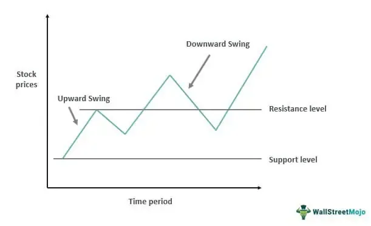

Swing trading with technical analysis in algo trading offers an intriguing intersection of two dynamic trading methodologies. Swing trading involves holding positions for several days to weeks, aiming to capitalize on expected upward or downward 'swings' in asset prices. This approach requires a tactical understanding of market movements, focusing on short- to medium-term changes rather than daily fluctuations or long-term trends. Traders identify these swings through various forms of analysis, seeking to capture significant portions of anticipated price moves within identified time frames.

Algorithmic trading, or algo trading, utilizes computer programs to automate specific pre-set trading strategies. Algorithms are designed to execute trades at speeds and frequencies that are impossible for a human trader to achieve. By employing algorithms, traders can eliminate emotional biases and ensure consistent execution of strategies. Algo trading can incorporate complex calculations, algorithms, and data feeds to determine optimal trading opportunities.



The combination of swing trading with algorithmic execution allows traders to leverage the strategic nature of swing trading with the precision and rapid response of automated systems. Technical analysis plays a pivotal role in this hybrid approach. Technical indicators such as Moving Averages, MACD (Moving Average Convergence Divergence), and RSI (Relative Strength Index) provide essential signals and frameworks that inform both the manual and automated decision-making processes in trading. These indicators can be integrated into algorithms, allowing them to analyze historical data, recognize patterns, and execute trades based on pre-defined criteria.

This article will explore how technical analysis aids in swing trading and its role in algorithmic trading strategies. By examining the interplay between these elements, traders can enhance their trading methodologies to effectively manage risk and maximize the potential for gains.

## Table of Contents

## Understanding Swing Trading

Swing trading is a trading strategy that focuses on capturing gains in financial instruments over a relatively short period, typically ranging from a few days to several weeks. The underlying premise of swing trading is to capitalize on expected upward or downward "swings" in asset prices. 

Traders engaged in swing trading employ various analytical techniques to identify swings in a security's price. These techniques often involve both fundamental analysis, which evaluates the intrinsic value of a security based on economic indicators and financial statements, and technical analysis, which examines past market data, primarily price and [volume](/wiki/volume-trading-strategy).

Swing trading sits between [day trading](/wiki/day-trading-spy) and trend trading. Day trading entails executing multiple trades within a single day, with traders typically closing all positions by the end of the trading session. In contrast, trend trading involves holding positions based on expected long-term trends, often spanning several months. Swing trading, therefore, serves as a middle ground, aiming to capture a significant portion of a potential price move without the need to monitor trades constantly or commit to long-term positions.

One of the main objectives of swing trading is to take advantage of market [volatility](/wiki/volatility-trading-strategies). By identifying key points where a security's price is likely to swing, traders can enter and [exit](/wiki/exit-strategy) positions strategically to maximize gains and minimize losses. This is usually achieved through identifying patterns such as head and shoulders, rectangles, flags, and triangles, which are indicative of potential future price movements.

Swing trading is versatile and can be applied across a wide range of financial instruments including stocks, commodities, and currencies. The universality of this approach makes it particularly appealing to a variety of traders, from novices to seasoned professionals. Whether trading on the New York Stock Exchange, in the [forex](/wiki/forex-system) market, or investing in commodities like gold, swing trading strategies can be readily adapted to suit different asset classes and market environments.

The inherent flexibility and potential for substantial gains make swing trading a popular choice among traders. However, like any trading strategy, it requires a thorough understanding of market dynamics and diligent risk management to ensure sustained success.

## Role of Technical Analysis in Swing Trading

Technical analysis plays a vital role in swing trading, providing traders with tools to make data-driven decisions regarding price movements and trend identification. In swing trading, technical analysis focuses primarily on understanding price patterns and trends, which help in anticipating potential future movements in asset prices.

Traders employ various technical indicators to pinpoint trading opportunities and inform their trading strategies. Commonly used indicators include Moving Averages, the Moving Average Convergence Divergence (MACD), the Relative Strength Index (RSI), and Bollinger Bands.

1. **Moving Averages** are used to smooth out price action and identify the direction of the trend. By calculating the average price of a security over specific time periods—such as 20, 50, or 200 days—traders can determine whether a security is in an uptrend or downtrend. The formula for calculating a simple moving average (SMA) is:
$$
   \text{SMA} = \frac{\sum_{i=1}^{n} P_i}{n}

$$

   where $P_i$ represents the price of the asset at day $i$, and $n$ is the number of days.

2. **MACD** is a momentum indicator that shows the relationship between two moving averages of a security's price. It is calculated by subtracting the 26-period EMA from the 12-period EMA. The MACD line is then plotted alongside a 9-day EMA signal line, helping traders identify bullish or bearish momentum.

3. **RSI** measures the speed and change of price movements and is typically used to identify overbought or oversold conditions in a trading instrument. It is calculated using the formula:
$$
   \text{RSI} = 100 - \frac{100}{1 + \text{RS}}

$$

   where $\text{RS}$ (the average gain divided by the average loss) helps in determining the momentum of price movements.

4. **Bollinger Bands** consist of a middle band being an n-period SMA and two outer bands, each at a distance of k standard deviations from the middle band. These bands provide a relative definition of high and low prices, allowing traders to identify potential reversal points when a price touches or breaches these bands.

Technical analysis also aids in determining optimal entry and exit points in the market. This involves analyzing chart patterns such as head and shoulders, triangles, and double tops/bottoms, which can signal potential trend reversals or continuations. Identifying key support and resistance levels through these patterns enables traders to make informed decisions about where to place trades and set stop-loss orders.

Moreover, technical analysis provides a structured framework through which traders can assess price movements, reducing reliance on emotional judgment and increasing the probability of making profitable trades. By understanding historical price data and using a combination of technical indicators, swing traders can anticipate future trends and position themselves to take advantage of short- to medium-term price shifts.

## Incorporating Technical Analysis in Algo Trading

Algorithmic trading, often abbreviated as algo trading, enhances the capabilities of technical analysis by automating its principles for executing trades. This integration enables traders to leverage historical data and technical indicators to generate trading signals, enhancing the precision and speed of trading decisions. 

Algorithms are capable of processing multiple technical indicators concurrently, which contributes to more robust decision-making. For instance, indicators like Moving Averages or the Relative Strength Index (RSI) can be simultaneously analyzed to confirm trade signals. This automated process allows for the detection of patterns and trends that might be missed by manual analysis.

One significant advantage of algo trading is its ability to scan market prices continuously. Algorithms can operate 24/7, eliminating human limitations and ensuring that no trading opportunities are overlooked. This continuous market surveillance allows for the timely execution of trades, often at speeds that surpass human capabilities. For example, when a predefined market condition is met, an algorithm can instantly execute a trade, thus capitalizing on price movements that occur in fractions of a second.

Furthermore, [algorithmic trading](/wiki/algorithmic-trading) helps in reducing emotional bias, a common challenge faced by traders. By adhering strictly to predefined rules and parameters, algorithms execute trades without the influence of fear or greed, which often skew human trading decisions. This objectivity facilitates more consistent trading outcomes over time.

To illustrate, consider the use of a simple trading strategy using the Moving Average Convergence Divergence (MACD) indicator in Python:

```python
import pandas as pd
import numpy as np

# Assume df is a DataFrame containing your trading data with a 'Close' column

def calculate_macd(df):
    short_ema = df['Close'].ewm(span=12, adjust=False).mean()
    long_ema = df['Close'].ewm(span=26, adjust=False).mean()
    macd = short_ema - long_ema
    signal = macd.ewm(span=9, adjust=False).mean()
    return macd, signal

df['MACD'], df['Signal'] = calculate_macd(df)

# Generating buy/sell signals
df['Signal Line Crossover'] = np.where(df['MACD'] > df['Signal'], 1, 0)  # 1 for buy, 0 for sell
df['Signal Line Crossover'] = df['Signal Line Crossover'].diff()

# Executing trades based on signal
for index, row in df.iterrows():
    if row['Signal Line Crossover'] == 1:  # Buy Signal
        print(f"Buy on {index}")
    elif row['Signal Line Crossover'] == -1:  # Sell Signal
        print(f"Sell on {index}")
```
The above code demonstrates how technical indicators can be programmed to automatically generate buy and sell signals based on the MACD strategy. This method exemplifies how algo trading can operationalize technical analysis, enhancing both efficiency and effectiveness in executing trading strategies.

## Building an Algorithmic Swing Trading Strategy

Developing an algorithmic swing trading strategy begins with formulating a well-structured trading plan. This plan should clearly define the assets to be traded, along with precise entry and exit rules. The choice of assets depends on factors such as [liquidity](/wiki/liquidity-risk-premium), volatility, and the trader's familiarity with the asset class. Once selected, establishing rules for entering and exiting trades is critical. These rules can be based on technical indicators, [fundamental analysis](/wiki/fundamental-analysis), or a combination of both.

Backtesting constitutes an essential step in evaluating the performance of the trading strategy. By simulating the strategy using historical market data, traders can assess the reliability and robustness of their approach. It is critical to ensure the [backtesting](/wiki/backtesting) period encompasses various market conditions to test the adaptability of the strategy. For instance, periods of high volatility, like financial crises, should be included to understand the strategy's performance in extreme situations.

Technical indicators such as the Moving Average Convergence Divergence (MACD) and the Relative Strength Index (RSI) can be programmed within the algorithm to automatically trigger buy or sell orders. The MACD helps in identifying changes in the strength, direction, [momentum](/wiki/momentum), and duration of a trend in a stock's price. The RSI, on the other hand, measures the speed and change of price movements, providing signals of overbought or oversold conditions. Here is an example of how one might code an RSI indicator in Python:

```python
def compute_rsi(prices, period=14):
    deltas = np.diff(prices)
    seed = deltas[:period+1]
    up = seed[seed >= 0].sum()/period
    down = -seed[seed < 0].sum()/period
    rs = up/down
    rsi = np.zeros_like(prices)
    rsi[:period] = 100. - 100./(1.+rs)

    for i in range(period, len(prices)):
        delta = deltas[i-1]  # Cause the diff is 1 shorter

        if delta > 0:
            upval = delta
            downval = 0.
        else:
            upval = 0.
            downval = -delta

        up = (up*(period-1) + upval)/period
        down = (down*(period-1) + downval)/period

        rs = up/down
        rsi[i] = 100. - 100./(1.+rs)

    return rsi
```

Risk management tools are crucial components of any algorithmic strategy, encompassing stop-loss and take-profit levels to limit potential losses and secure gains. A stop-loss order is set to sell a security when it reaches a certain price, preventing further losses. Conversely, a take-profit order ensures that profits are locked in once a target price is reached.

Constant monitoring and optimization of the algorithm are necessary, given the dynamic nature of financial markets. As market conditions evolve, the algorithm may require adjustments in its parameters to maintain its effectiveness. Adaptive algorithms, which learn and adjust based on market conditions, represent an advanced approach to maintaining strategy efficacy.

In summary, building an algorithmic swing trading strategy involves a systematic approach combining a clear trading blueprint, robust backtesting, and effective risk management tools. Continuous refinement ensures the strategy remains relevant amid the ever-changing market landscape.

## Advantages and Challenges of Algorithmic Swing Trading

Algorithmic swing trading leverages the automation features of algorithmic trading, providing various advantages to traders. One of the primary benefits is the elimination of emotions from the trading process. Emotions such as fear and greed can lead to irrational decisions; algorithmic systems execute pre-defined strategies consistently, resulting in more disciplined trading actions.

Furthermore, algorithmic systems are capable of processing large volumes of data. This capacity allows traders to analyze multiple assets simultaneously, identifying potential swing trading opportunities across different markets. The automation ensures rapid trade execution, often executing trades in milliseconds, a speed unmatched by human traders.

Despite these advantages, algorithmic swing trading also presents certain challenges. A key requirement is a high level of technical expertise. Developing and maintaining an algorithm requires proficiency in programming, a deep understanding of financial markets, and experience in integrating technical analysis into automated systems. Moreover, there is always the potential risk of algorithmic errors. Bugs in the code can lead to erroneous trading decisions, potentially resulting in significant financial losses.

To mitigate these risks, constant monitoring and periodic adjustments of the trading algorithms are essential. As market conditions evolve, strategies may require tuning to adapt to new patterns or shifts in volatility. This necessitates a commitment to ongoing development and optimization to ensure the system remains efficient and aligned with market conditions. Overall, while algorithmic swing trading offers significant advantages, success requires careful strategy formulation, rigorous testing, and continual refinement.

## Conclusion

Swing trading using technical analysis in algo trading offers traders numerous opportunities for enhancing their trading strategies. The structured approach of this methodology allows for systematic exploitation of price fluctuations, while reducing the risk of emotional interference in decision-making processes. By leveraging algorithmic trading, traders can achieve greater precision in executing trades and maintain consistency across varying market conditions.

To successfully implement swing trading with technical analysis in an algorithmic framework, traders need to foster a thorough understanding of key technical analysis concepts and develop robust algorithms capable of real-time market analysis. This involves selecting the appropriate technical indicators, programming algorithms for strategy execution, and setting precise entry and exit rules to capture optimal market movements.

Continuous optimization and risk management are pivotal to sustaining success in algorithmic swing trading. Continual monitoring and adjustments ensure that trading strategies remain effective amid changing market conditions. Implementing risk management tools like dynamic stop-loss and take-profit levels can mitigate potential losses and enhance overall profitability.

Traders aiming to improve their proficiency in this field should seek educational resources, such as those provided by QuantInsti, to refine their strategies and gain deeper market insights. By combining technical analysis expertise with algorithmic innovation, traders can effectively harness market opportunities and achieve long-term success in their trading endeavors.

## References & Further Reading

[1]: Bergstra, J., Bardenet, R., Bengio, Y., & Kégl, B. (2011). ["Algorithms for Hyper-Parameter Optimization."](https://papers.nips.cc/paper/4443-algorithms-for-hyper-parameter-optimization) Advances in Neural Information Processing Systems 24.

[2]: ["Advances in Financial Machine Learning"](https://www.amazon.com/Advances-Financial-Machine-Learning-Marcos/dp/1119482089) by Marcos Lopez de Prado

[3]: ["Evidence-Based Technical Analysis: Applying the Scientific Method and Statistical Inference to Trading Signals"](https://www.amazon.com/Evidence-Based-Technical-Analysis-Scientific-Statistical/dp/0470008741) by David Aronson

[4]: ["Machine Learning for Algorithmic Trading"](https://github.com/stefan-jansen/machine-learning-for-trading) by Stefan Jansen

[5]: ["Quantitative Trading: How to Build Your Own Algorithmic Trading Business"](https://books.google.com/books/about/Quantitative_Trading.html?id=j70yEAAAQBAJ) by Ernest P. Chan