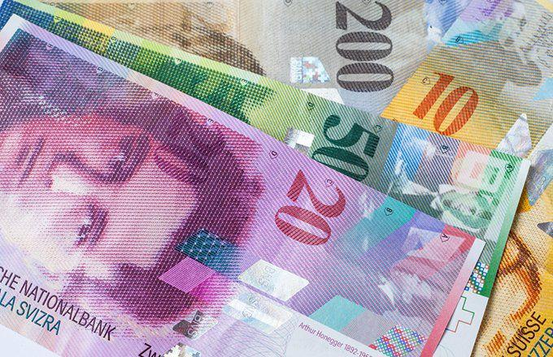

## Table of Contents

## What is the Swiss Franc and why is it considered a safe-haven currency?

The Swiss Franc is the official currency of Switzerland and Liechtenstein. It is often represented by the symbol CHF. The Swiss Franc is known for being a stable currency because Switzerland has a strong economy and a good political system. People trust the Swiss Franc because Switzerland is neutral in wars and has strict laws about money.

The Swiss Franc is considered a safe-haven currency because it is seen as a safe place to keep money during times of global uncertainty. When there are problems in the world, like financial crises or political instability, people move their money to safe-haven currencies like the Swiss Franc. This is because they believe their money will be safer and more stable in Swiss Francs. The Swiss National Bank also helps keep the currency stable by managing it carefully.

## How has the Swiss Franc performed as a long-term investment over the past decade?

Over the past decade, the Swiss Franc has generally been a strong and stable currency, making it a good long-term investment. From 2013 to 2023, the Swiss Franc has appreciated against many major currencies, including the Euro and the US Dollar. This means that if you had invested in Swiss Francs ten years ago, your money would likely be worth more today when converted back to your original currency. The stability of the Swiss economy and the Swiss National Bank's careful management have helped the Swiss Franc maintain its value over time.

However, the performance of the Swiss Franc has not been without fluctuations. In January 2015, the Swiss National Bank unexpectedly removed the cap on the Franc's value against the Euro, causing the Franc to surge in value. This event led to significant [volatility](/wiki/volatility-trading-strategies) in the short term, but the currency has since stabilized. Overall, the Swiss Franc's reputation as a safe-haven currency has continued to attract investors looking for a secure place to park their money during uncertain times, contributing to its strong performance as a long-term investment.

## What are the potential benefits of investing in Swiss Francs?

Investing in Swiss Francs can be a good choice because it is known as a safe-haven currency. This means that when there are problems in the world, like financial crises or political issues, people often move their money to Swiss Francs. They do this because they believe their money will be safer and more stable. Over the past decade, the Swiss Franc has generally gone up in value compared to other major currencies like the Euro and the US Dollar. So, if you had invested in Swiss Francs ten years ago, your money would likely be worth more today when you change it back to your original currency.

Another benefit of investing in Swiss Francs is the stability of the Swiss economy and the careful management by the Swiss National Bank. Switzerland has a strong economy and a good political system, which makes people trust the Swiss Franc. The Swiss National Bank works hard to keep the currency stable, which helps protect your investment. Even though there can be some ups and downs, like the big change in 2015 when the Swiss National Bank removed the cap on the Franc's value against the Euro, the Swiss Franc has shown it can recover and stay strong over time. This makes it a reliable choice for people looking to keep their money safe in the long run.

## What are the risks associated with holding Swiss Francs as a long-term investment?

Holding Swiss Francs as a long-term investment can have some risks. One big risk is that the value of the Swiss Franc can go up and down a lot, especially during times of big changes in the world. For example, in 2015, the Swiss National Bank suddenly stopped controlling the Franc's value against the Euro, and the Franc's value jumped a lot. This kind of sudden change can be risky if you need to use your money at that time.

Another risk is that the Swiss Franc might not always be the best choice for making your money grow. While it is good at keeping your money safe, it might not grow as fast as other investments like stocks or real estate. If you are looking to make your money grow a lot over time, the Swiss Franc might not be the best option. It is more about keeping your money safe than making it grow quickly.

Also, if you are not from Switzerland, you need to think about the cost of changing your money into Swiss Francs and back again. These costs can add up and might eat into any profits you make from the investment. So, it is important to think about these costs when deciding if holding Swiss Francs is right for you.

## How does the Swiss National Bank's monetary policy affect the value of the Swiss Franc?

The Swiss National Bank's monetary policy has a big impact on the value of the Swiss Franc. When the Swiss National Bank wants to make the Swiss Franc weaker, it can do things like lowering interest rates or buying other currencies. This makes it less attractive for people to hold Swiss Francs because they can get better returns elsewhere. On the other hand, if the Swiss National Bank wants to make the Swiss Franc stronger, it might raise interest rates or sell other currencies it holds. This makes the Swiss Franc more appealing to investors because they can earn more by holding it.

Sometimes, the Swiss National Bank makes big changes to its policy that can cause the Swiss Franc to move a lot. For example, in 2015, the Swiss National Bank suddenly stopped controlling the Franc's value against the Euro. This caused the Swiss Franc to jump in value very quickly. These kinds of big moves can be surprising and can affect how people see the Swiss Franc as a safe place to keep their money. Overall, the Swiss National Bank's actions are very important in deciding how strong or weak the Swiss Franc is.

## What impact do global economic conditions have on the Swiss Franc's performance?

Global economic conditions can have a big effect on how the Swiss Franc performs. When there are problems in the world, like financial crises or political instability, people often move their money to safe places. The Swiss Franc is seen as a safe-haven currency, so during these times, more people want to hold Swiss Francs. This increased demand can make the Swiss Franc stronger compared to other currencies. For example, during the 2008 financial crisis, the Swiss Franc went up in value because people were looking for a safe place to keep their money.

On the other hand, when the global economy is doing well and there is less uncertainty, the Swiss Franc might not be as strong. This is because people might be more willing to invest in riskier assets like stocks or other currencies that could give them higher returns. The Swiss National Bank also watches global economic conditions closely and might change its policies to keep the Swiss Franc stable. So, the performance of the Swiss Franc is closely tied to what is happening around the world.

## How does the Swiss Franc compare to other major currencies as a long-term investment?

The Swiss Franc is often seen as a good long-term investment because it is a safe-haven currency. This means that when there are big problems in the world, like financial crises or political issues, people move their money to Swiss Francs because they think it will be safer. Over the past ten years, the Swiss Franc has generally gone up in value compared to other major currencies like the Euro and the US Dollar. This means that if you had put your money into Swiss Francs a decade ago, it would likely be worth more today when you change it back to your original currency. The Swiss economy is strong and the Swiss National Bank works hard to keep the currency stable, which makes people trust the Swiss Franc.

However, the Swiss Franc might not be the best choice if you want your money to grow a lot over time. It is good at keeping your money safe, but it might not grow as fast as other investments like stocks or real estate. Also, if you are not from Switzerland, you need to think about the cost of changing your money into Swiss Francs and back again. These costs can add up and might eat into any profits you make from the investment. Compared to other major currencies like the US Dollar or the Euro, the Swiss Franc is more about keeping your money safe than making it grow quickly.

## What are the tax implications of investing in Swiss Francs for non-residents?

When non-residents invest in Swiss Francs, they need to think about taxes. In Switzerland, non-residents do not have to pay taxes on the interest they earn from Swiss Francs. This is good news because it means you get to keep all the interest you make. However, you might still have to pay taxes in your home country on the money you earn from your Swiss Franc investment. It's a good idea to check the tax rules in your own country to know what you have to pay.

Also, if you make money because the Swiss Franc goes up in value compared to your home currency, this might be seen as a capital gain. Some countries tax capital gains, and some do not. It depends on where you live. You should find out if your country taxes capital gains and how much you would have to pay. Talking to a tax advisor can help you understand all the tax rules and make sure you follow them correctly.

## How can investors gain exposure to the Swiss Franc, and what are the associated costs?

Investors can gain exposure to the Swiss Franc in a few ways. One common way is by buying Swiss Francs directly from a bank or a currency exchange service. This means you can hold the actual currency or keep it in a bank account. Another way is by investing in Swiss Franc-denominated assets, like Swiss bonds or stocks of Swiss companies. You can also use financial products like currency ETFs (Exchange Traded Funds) that track the value of the Swiss Franc. These methods let you benefit from any increase in the value of the Swiss Franc without actually holding the currency.

There are costs to consider when investing in Swiss Francs. When you buy or sell Swiss Francs through a bank or currency exchange, you will usually have to pay a fee or a spread, which is the difference between the buying and selling price. These costs can add up, especially if you are changing large amounts of money or doing it often. If you invest in Swiss Franc-denominated assets or currency ETFs, you might have to pay management fees or other charges. It's important to look at all these costs to see if investing in Swiss Francs is a good choice for you.

## What historical events have significantly influenced the value of the Swiss Franc?

Over the years, some big events have changed the value of the Swiss Franc a lot. One important event was the 2008 financial crisis. During this time, many people were worried about their money, so they moved it to safe places like the Swiss Franc. This made the Swiss Franc go up in value because more people wanted to hold it. Another big event was in January 2015 when the Swiss National Bank suddenly stopped controlling the Franc's value against the Euro. This was a surprise to everyone, and the Swiss Franc jumped in value very quickly. This event showed how the Swiss National Bank's actions can have a big impact on the currency.

Another event that affected the Swiss Franc was the European debt crisis that started around 2010. During this time, many countries in Europe were having money problems, and people were worried about the Euro. As a result, more people moved their money to the Swiss Franc, which made it stronger. These events show that the Swiss Franc often goes up in value when there are big problems in the world because people see it as a safe place to keep their money. The Swiss National Bank's careful management also helps keep the currency stable during these times.

## How do geopolitical risks affect the Swiss Franc's stability and attractiveness as an investment?

Geopolitical risks, like wars or political problems, can make the Swiss Franc more attractive to investors. When there are big issues in the world, people often look for safe places to keep their money. The Swiss Franc is seen as a safe-haven currency because Switzerland is neutral in wars and has a strong, stable economy. So, when there are geopolitical risks, more people want to hold Swiss Francs, which can make its value go up. This makes the Swiss Franc a good choice for investors who want to protect their money during uncertain times.

However, geopolitical risks can also cause the Swiss Franc to become more volatile. If there are sudden changes or surprises in the world, like the Swiss National Bank's decision in 2015 to remove the cap on the Franc's value against the Euro, the Swiss Franc can jump in value very quickly. This kind of sudden change can be risky for investors who need to use their money at that time. Even though the Swiss Franc is generally stable, these big events can shake things up and affect how people see it as a safe investment.

## What advanced strategies can expert investors use to hedge or leverage investments in Swiss Francs?

Expert investors can use advanced strategies like currency hedging to protect their investments in Swiss Francs. Hedging means taking steps to reduce the risk of losing money because of changes in currency values. One way to do this is by using forward contracts, which let investors agree on a price to buy or sell Swiss Francs at a future date. This can help them avoid big losses if the Swiss Franc's value goes down suddenly. Another way is by using options, which give investors the right, but not the obligation, to buy or sell Swiss Francs at a set price. This can be useful if they want to protect their investment but also want the chance to make more money if the Swiss Franc goes up in value.

Leveraging is another strategy that expert investors might use with Swiss Francs. Leveraging means using borrowed money to increase the amount they can invest, which can lead to bigger gains if the Swiss Franc goes up in value. One way to do this is by using currency futures, which are agreements to buy or sell Swiss Francs at a future date at a set price. By using futures, investors can control a large amount of Swiss Francs with a smaller amount of money. However, leveraging can also increase the risk of big losses if the Swiss Franc goes down in value. So, it's important for investors to understand these risks and use these strategies carefully.

## References & Further Reading

[1]: Bergstra, J., Bardenet, R., Bengio, Y., & Kégl, B. (2011). ["Algorithms for Hyper-Parameter Optimization."](https://papers.nips.cc/paper/4443-algorithms-for-hyper-parameter-optimization) Advances in Neural Information Processing Systems 24.

[2]: ["Advances in Financial Machine Learning"](https://www.amazon.com/Advances-Financial-Machine-Learning-Marcos/dp/1119482089) by Marcos Lopez de Prado

[3]: ["Evidence-Based Technical Analysis: Applying the Scientific Method and Statistical Inference to Trading Signals"](https://books.google.com/books/about/Evidence_Based_Technical_Analysis.html?id=MeoJAQAAMAAJ) by David Aronson

[4]: ["Machine Learning for Algorithmic Trading"](https://github.com/stefan-jansen/machine-learning-for-trading) by Stefan Jansen

[5]: ["Quantitative Trading: How to Build Your Own Algorithmic Trading Business"](https://www.amazon.com/Quantitative-Trading-Build-Algorithmic-Business/dp/1119800064) by Ernest P. Chan