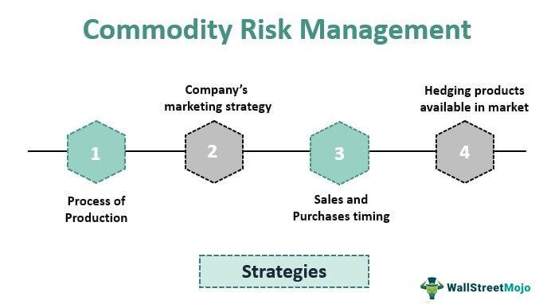

## Table of Contents

## What is a switch in commodity trading?

A switch in commodity trading is when a trader exchanges one commodity for another. This can happen for many reasons, like wanting to take advantage of better prices or to balance their trading portfolio. For example, a trader might switch from trading oil to trading natural gas if they think natural gas will be more profitable.

Switches are important because they help traders manage risk and adapt to changes in the market. If the price of one commodity goes down, a trader can switch to another commodity that might be doing better. This way, they can keep their investments safe and possibly make more money. It's like changing lanes on a highway to avoid traffic and reach your destination faster.

## How does a switch work in commodity trading?

In commodity trading, a switch happens when a trader decides to trade one type of commodity for another. This decision can be based on many things, like changes in market prices or wanting to spread out the risk in their trading portfolio. For example, if a trader sees that the price of wheat is going down but the price of corn is going up, they might switch from trading wheat to trading corn to make more money.

Switches are a key part of managing risk in trading. By switching commodities, traders can protect themselves from big losses if one commodity's price drops a lot. It's like moving money from a savings account with low interest to one with higher interest. This way, traders can keep their investments safe and possibly earn more. Switches help traders stay flexible and adapt to what's happening in the market.

## What are the common types of switches in commodity trading?

In commodity trading, one common type of switch is from one physical commodity to another. This means a trader might switch from trading oil to trading natural gas, or from wheat to corn. They do this because they think the new commodity will make them more money or because they want to spread their risk. For example, if the price of oil is going down, a trader might switch to natural gas, which might be doing better.

Another type of switch is from a physical commodity to a financial instrument related to that commodity. This means a trader might switch from trading actual oil to trading oil futures or options. Futures and options are contracts that let traders bet on the future price of a commodity without having to buy or sell the actual product. This can be less risky and can help traders make money even if the price of the physical commodity goes down.

These switches help traders manage their investments better. By switching between different commodities or between physical commodities and financial instruments, traders can protect themselves from big losses and take advantage of new opportunities in the market. It's all about staying flexible and adapting to what's happening in the world of trading.

## Can you provide examples of switches in commodity trading?

A trader might switch from trading oil to trading natural gas. Let's say the price of oil is going down, but the price of natural gas is going up. The trader sees this and decides to switch from oil to natural gas. By doing this, the trader hopes to make more money because natural gas is doing better in the market. This switch helps the trader take advantage of the changing prices and possibly earn more.

Another example is switching from a physical commodity to a financial instrument. Imagine a trader who is trading actual wheat. The trader hears that the price of wheat might go down soon. Instead of selling the wheat, the trader decides to switch to trading wheat futures. Futures are contracts that let the trader bet on the future price of wheat without having to buy or sell the actual wheat. This switch can be less risky and can help the trader make money even if the price of wheat goes down.

These switches are important for traders because they help them manage their investments better. By switching between different commodities or between physical commodities and financial instruments, traders can protect themselves from big losses and take advantage of new opportunities in the market. It's all about staying flexible and adapting to what's happening in the world of trading.

## What are the benefits of using switches in commodity trading?

Using switches in commodity trading helps traders manage their risk. When the price of one commodity goes down, a trader can switch to another commodity that might be doing better. This way, they can avoid big losses and keep their investments safe. For example, if oil prices are falling, a trader might switch to natural gas if its prices are going up. This flexibility helps traders stay in control and not lose all their money if one market goes bad.

Switches also let traders take advantage of new opportunities. If a trader sees that the price of corn is going up but wheat is going down, they can switch from wheat to corn to make more money. This is like changing lanes on a highway to get to your destination faster. By switching to commodities or financial instruments that are doing well, traders can increase their profits. It's all about being smart and adapting to what's happening in the market.

## What are the potential risks associated with switches in commodity trading?

Switches in commodity trading can be risky because they involve changing from one commodity to another or from a physical commodity to a financial instrument. If a trader switches at the wrong time, they might end up losing money. For example, if a trader switches from oil to natural gas thinking natural gas will do better, but then the price of natural gas goes down, the trader will lose money on the switch. It's like trying to catch a bus but getting on the wrong one.

Another risk is that switches can be complicated and hard to understand. If a trader doesn't know enough about the new commodity or financial instrument they are switching to, they might make bad decisions. This can lead to big losses. It's important for traders to do their homework and understand the market before making a switch. Otherwise, they might end up in a worse situation than before.

## How do switches affect the pricing and valuation of commodities?

Switches in commodity trading can change how commodities are priced and valued. When many traders switch from one commodity to another, it can affect the demand for those commodities. If lots of traders switch to natural gas from oil, the demand for natural gas might go up, making its price go up too. On the other hand, if fewer people want oil, its price might go down. This shows how switches can move prices by changing what traders are buying and selling.

Switches can also affect how traders value commodities. If traders switch to a commodity because they think it will do better in the future, they might value that commodity more highly. For example, if traders switch from wheat to corn because they think corn prices will rise, they are showing that they value corn more. This can lead to higher prices for corn because more people want to buy it. So, switches can change how traders see the value of different commodities, which in turn affects their prices.

## What strategies can traders use to manage risks associated with switches?

Traders can manage the risks of switches by doing a lot of research before they switch. They need to understand the market and know why they are switching. If they think the price of one commodity will go up, they should check if there are good reasons for this. They can look at news, market reports, and other information to make sure they are making a smart switch. By knowing more about the new commodity or financial instrument, traders can avoid making bad decisions that could lose them money.

Another way to manage risk is by not putting all their money into one switch. Traders can spread out their investments by switching only part of their portfolio. This way, if the switch doesn't work out, they won't lose everything. They can also use stop-loss orders, which are like safety nets that automatically sell a commodity if its price drops too much. This can help limit losses if the switch goes wrong. By being careful and using these strategies, traders can handle the risks of switching and keep their investments safer.

## How do regulatory frameworks impact the use of switches in commodity trading?

Regulatory frameworks can affect how traders use switches in commodity trading. Governments and financial authorities set rules that traders must follow. These rules can limit how often traders can switch or what kinds of commodities they can switch to. For example, there might be rules about how much money a trader can put into certain commodities or financial instruments. These regulations are there to keep the market fair and safe for everyone. But they can also make it harder for traders to switch quickly and take advantage of new opportunities.

Sometimes, regulatory frameworks can also make switches more complicated. Traders have to make sure they follow all the rules when they switch from one commodity to another or from a physical commodity to a financial instrument. If they don't, they could get in trouble with the regulators. This can slow down the switching process and make it less appealing for traders. But at the same time, these rules help prevent big problems in the market, like fraud or big losses that could hurt a lot of people. So, while regulations can limit how traders use switches, they also help keep the trading world stable and trustworthy.

## What are the advanced techniques for optimizing switch transactions?

Advanced techniques for optimizing switch transactions involve using technology and data analysis to make better decisions. Traders can use computer programs and algorithms to quickly analyze market trends and find the best times to switch from one commodity to another. These tools can look at a lot of data, like past prices, news, and even social media, to predict what might happen next. By using this information, traders can switch at the right time to make more money and avoid big losses. It's like having a smart helper that can see into the future and tell you when to make a move.

Another technique is using hedging strategies to protect against risks when switching. Hedging means taking actions to reduce the risk of losing money. For example, a trader might buy futures contracts for the new commodity they are switching to. This can help them lock in a good price and avoid losing money if the price suddenly goes down. By combining hedging with the data analysis from technology, traders can make safer switches and manage their investments better. It's all about using smart tools and strategies to stay ahead in the fast-changing world of commodity trading.

## How do global market conditions influence the effectiveness of switches?

Global market conditions can make switches in commodity trading more or less effective. If the world economy is doing well, prices for commodities like oil or wheat might go up. This can make switches more profitable because traders can buy and sell at better prices. On the other hand, if there's a big problem like a war or a natural disaster, it can make the market unpredictable. This might make switches riskier because prices can change a lot and traders might lose money if they switch at the wrong time.

Traders need to keep an eye on global events to make good switches. Things like changes in government policies, trade agreements, or even weather can affect commodity prices. If a trader knows about these things, they can switch to commodities that will do well because of these events. For example, if a new trade deal makes corn cheaper to import, a trader might switch to corn to take advantage of the lower price. But if they don't pay attention to what's happening around the world, their switches might not work out as well.

## What future trends might affect the use of switches in commodity trading?

In the future, technology might change how traders use switches in commodity trading. New computer programs and artificial intelligence could make it easier for traders to predict when to switch from one commodity to another. These tools can look at a lot of data quickly and help traders make better decisions. This means switches might become more common and more effective because traders can use technology to find the best times to switch and avoid big losses.

Another trend that might affect switches is changes in the world's environment and energy needs. As countries try to use less oil and more renewable energy, the demand for different commodities might change. Traders might need to switch more often to keep up with these changes. For example, if more people start using electric cars, the demand for oil might go down, but the demand for metals used in batteries might go up. Traders who can switch quickly to these new commodities might do better in the future.

## What is Understanding Commodity Trading?

Commodity trading involves the buying and selling of primary products and raw materials, such as oil, gold, and agricultural products. These commodities are essential inputs for a wide range of finished goods and are traded on various exchanges worldwide, either through spot trading or futures contracts.

In the context of spot trading, transactions occur for immediate delivery of the commodity, meaning buyers and sellers exchange actual goods and payment in real time. Futures contracts, on the other hand, are agreements to buy or sell a specific commodity at a predetermined price on a future date. This allows traders to hedge against the price volatility of the commodity markets but also to speculate on future price movements.

One primary risk in commodity trading is price volatility. Several factors contribute to this volatility, including market demand, geopolitical issues, and natural disasters. For instance, political instability in oil-producing regions can disrupt supply chains, causing oil prices to spike. Similarly, adverse weather conditions can impact agricultural production, leading to fluctuations in prices of crops like wheat or corn. These uncertainties can result in rapid price movements, making it critical for traders to assess market conditions continuously.

Leverage is another feature commonly used in commodity trading. Through leverage, traders can control a large position in a commodity with a relatively small amount of capital. This can significantly amplify potential gains when prices move favorably. However, it also magnifies potential losses, as even a slight adverse price movement can lead to substantial financial losses. The formula for calculating leveraged trading gains or losses can be expressed as:

$$
\text{Gain or Loss} = \text{Leverage} \times (\text{Final Price} - \text{Initial Price})
$$

Given the potential risks of high [volatility](/wiki/volatility-trading-strategies) and leverage, traders must employ robust risk management strategies to cushion against unexpected market movements.

## References & Further Reading

[1]: Black, F., & Scholes, M. (1973). ["The Pricing of Options and Corporate Liabilities."](https://www.cs.princeton.edu/courses/archive/fall09/cos323/papers/black_scholes73.pdf) Journal of Political Economy, 81(3), 637-654.

[2]: Hull, J. C. (2014). ["Options, Futures, and Other Derivatives"](https://books.google.com/books/about/Options_Futures_and_Other_Derivatives_eB.html?id=2iopDwAAQBAJ). Pearson.

[3]: Geman, H. (2005). ["Commodities and Commodity Derivatives: Modeling and Pricing for Agriculturals, Metals and Energy"](https://download.e-bookshelf.de/download/0000/5675/90/L-G-0000567590-0015270354.pdf). Wiley.

[4]: Lopez de Prado, M. (2018). ["Advances in Financial Machine Learning."](https://www.amazon.com/Advances-Financial-Machine-Learning-Marcos/dp/1119482089) Wiley.

[5]: Chan, E. P. (2008). ["Quantitative Trading: How to Build Your Own Algorithmic Trading Business"](https://github.com/ftvision/quant_trading_echan_book). Wiley.