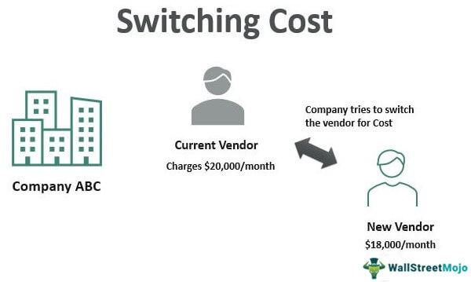

Switching costs refer to the expenses consumers face when changing from one product or service to another, encompassing both tangible and intangible aspects. These costs are particularly influential in sectors like finance and trading, where they play a critical role in shaping consumer behavior. In algorithmic trading, switching costs can be substantial and all-encompassing, including financial outlays for new technology, time expenditures for system adaptation, and emotional resistance to abandoning familiar platforms.

Understanding switching costs is essential for businesses aiming to retain their customers and for consumers striving to make well-informed decisions. Businesses seek to design strategies that minimize the perceived risks and efforts associated with switching, thereby enhancing customer loyalty and market retention. On the consumer side, awareness of these costs aids in evaluating the true implications of switching, ensuring decisions are based on a comprehensive understanding of the trade-offs involved.

This article investigates the significance of switching costs within algorithmic trading environments. Algorithmic trading platforms, characterized by their advanced technology and complex interfaces, present unique challenges in terms of switching costs. The barriers these costs create can hinder users from adopting superior strategies or platforms, impacting market competition and efficiency.

The subsequent sections of this article categorize switching costs into financial, emotional, and time-based dimensions. Financial costs might encompass fees to terminate existing contracts or regulatory compliance costs when onboarding new technology. Emotional costs refer to the distress or apprehension a consumer might feel when required to shift away from a trusted and familiar trading environment. Time-based costs focus on the time and effort necessary to become proficient with a new trading system, including the potential downtime that such transitions could entail.

By understanding and addressing these nuances, firms can tailor their customer acquisition and retention strategies more effectively, while consumers can make choices that best align with their goals and resources. Furthermore, understanding switching costs contributes to fostering competitive markets as businesses innovate to offer lower barriers to switching, thereby empowering consumers with choices that better meet their needs.

## Table of Contents

## Types of Switching Costs

Switching costs represent significant factors that can deter consumers from transitioning from one product or service to another. These costs can be categorized into three primary types: financial, emotional, and time-based.

**Financial Costs**: These involve the direct monetary expenses incurred when changing products or services. For instance, consumers might face fees for terminating existing contracts prematurely or incur the cost of purchasing new equipment or software. In many industries, suppliers impose these financial barriers to discourage consumers from switching, thereby securing market share. For example, in telecommunications, early termination fees can be a substantial deterrent for customers considering a change to another service provider.

**Emotional Costs**: Emotional costs pertain to the psychological discomfort or stress associated with leaving a familiar brand or service. This phenomenon is often related to brand loyalty. For many consumers, there is an inherent comfort in staying with a known entity, even if that entity no longer provides the best value. Emotional costs can be significant in industries where personal relationships and trust play a critical role, such as in financial services or healthcare. The fear of loss or regret upon switching to a less reliable or unknown service can further aggravate these costs.

**Time-based Costs**: These costs are associated with the time and effort required to learn and adapt to new processes or technology. The complexities involved in transitioning to a new system can demand considerable cognitive and practical efforts. For instance, switching from one software system to another may require extensive re-training and adjustment, influencing consumer decisions and slowing market dynamics. The learning curve can be steep in technologically advanced sectors, such as algorithmic trading, where mastery of new platforms might necessitate substantial investment in time and attention, pulling resources away from productive activities.

Each of these switching costs affects consumer decision-making in distinct ways, often influencing the competitive dynamics within a market. Consumers weigh these costs against potential benefits of switching, which can lead to inertia even when superior options are available. Consequently, markets with high switching costs may see reduced competition and innovation, because the barriers to change maintain existing power structures and customer bases. Addressing these costs, therefore, becomes crucial for businesses aiming to attract and retain consumers, and for consumers seeking to optimize their choices.

## Switching Costs in Algorithmic Trading

In [algorithmic trading](/wiki/algorithmic-trading), switching costs serve as a significant impediment to the adoption of new platforms or strategies by traders. These costs fall into several categories, each playing a critical role in decision-making processes.

Financial costs are often the most direct form of switching expense that traders face. These may involve substantial monetary investments required for purchasing new software or upgrading existing systems to be compatible with new trading platforms. For example, a trading firm might need to procure specialized hardware or subscription services for real-time data feeds essential for executing algorithms efficiently.

Time-based costs are another significant [factor](/wiki/factor-investing), stemming from the complexity of mastering new trading algorithms or systems. The learning curve associated with new technologies can be steep, and traders must invest considerable time to become proficient. This learning period can temporarily reduce a trader's efficiency and profitability, creating an opportunity cost. It requires an extensive phase of trial and error to test the effectiveness of new algorithms, further increasing the time investment.

Emotional costs are less tangible but equally important. Traders often develop an attachment to familiar systems and are reluctant to discard them, even when potentially more effective alternatives exist. This attachment can be attributed to the comfort and trust built over time with existing platforms, creating a psychological barrier to change.

Understanding these switching costs is vital for companies offering trading solutions. By comprehending these barriers, firms can devise strategies to lower the threshold for adoption, thus expanding their user base. Offering user-friendly interfaces, intuitive educational resources, and robust customer support can diminish the perceived risk associated with switching and encourage traders to transition to new platforms that may offer enhanced features or greater profitability potential.

## Impact on Consumer Behavior

Switching costs play a critical role in influencing consumer behavior by affecting their readiness to switch from one product or service to another. In many cases, these costs lead to customer lock-in, where individuals stay with a service provider not due to satisfaction, but because the cost of switching is perceived to be higher than the benefits of exploring alternatives. This can significantly reduce market competition, as incumbents maintain their customer base largely through these barriers rather than through superior offerings.

In algorithmic trading, the implications of switching costs can be particularly pronounced. Traders often face substantial financial, emotional, and time-based costs, which can deter them from adopting potentially more profitable strategies. For instance, financial costs might involve substantial monetary investments in new software or algorithmic solutions, while time costs might encompass the effort and complexity associated with mastering new trading platforms.

Moreover, the emotional aspect of switching costs cannot be underestimated. Traders develop reliance and trust in their existing systems, and the psychological barrier of venturing into uncharted territories can be daunting. This leads to a hesitation in shifting to new platforms, even when superior technological advancements are available.

The fear of disruption in trading operations intensifies these concerns. Algorithmic traders often operate in high-stakes environments where any glitches or delays can result in significant financial losses. The uncertainty of new systems' performance and the risk involved in transitioning contribute to the reluctance to switch platforms. This hesitation is often compounded by the cost of potential financial loss, making traders stick to their current platforms despite available better options.

Understanding these dynamics is crucial for stakeholders in the algorithmic trading sector, as high switching costs can hinder innovation and market evolution. Tackling these challenges requires addressing the factors that contribute to switching reluctance, ultimately leading to a more dynamic and competitive trading environment.

## Strategies to Overcome Switching Costs

Companies can effectively address switching costs by implementing a variety of strategies that cater to both financial and psychological barriers. Offering trial periods, discounts, or comprehensive training can significantly reduce the financial burden for consumers considering a switch. These initiatives allow potential users to experience new systems with minimal risk, facilitating a smooth transition.

Building an integrated ecosystem presents another strategic approach, enhancing user value through interconnected services that meet diverse needs within a single platform. By doing so, companies not only reduce perceived costs but also foster user loyalty by creating a seamless experience. This approach often involves integrating tools and services that complement each other, thus increasing the utility and satisfaction derived from their use.

For consumers, selecting platforms that present lower barriers to entry and offer greater flexibility can simplify the switch. Platforms with user-friendly interfaces or those providing interoperability with existing systems are particularly attractive, reducing the technical and time-based costs associated with learning new processes.

To further ease the transition, consumers should aim to acquire a comprehensive understanding of new systems before fully committing. Engaging with available resources such as tutorials, user communities, or support services can significantly reduce the time and effort required to adapt to new technologies. This proactive approach can minimize initial disruptions and enhance overall competency with the new platform.

In summary, by addressing switching costs through strategic incentives, companies can appeal to potential users, while consumers themselves can strategically select platforms that simplify the transition process and enhance their new user experience.

## Conclusion

Switching costs are pivotal in dictating consumer behavior and market trends in algorithmic trading. They can create significant obstacles for traders when considering a change in trading platforms or strategies. Addressing and fully grasping these costs may facilitate superior consumer choices and foster more competitive markets. For businesses, recognizing and mitigating switching costs can result in retaining customers while attracting new users through simplified transition processes.

Overcoming switching barriers is not without its challenges but can bring substantial long-term benefits to both consumers and companies. Traders may achieve improved profitability by transitioning to more efficient trading systems, provided the perceived costs are minimized. Additionally, companies that successfully lower these costs can expand their user base and enhance customer satisfaction.

Stakeholders in the trading and financial services sectors must consider these factors in strategic planning. By proactively addressing switching costs, firms can ensure that the barriers do not stifle market innovation or competition. This may involve transparent communication about costs, offering incentives such as training programs or cost-effective trial periods, and developing user-friendly solutions. Such strategies not only encourage consumer movement within the industry but also support the evolution of more dynamic and consumer-friendly financial markets.

## References & Further Reading

[1]: ["Quantitative Trading: How to Build Your Own Algorithmic Trading Business"](https://www.amazon.com/Quantitative-Trading-Build-Algorithmic-Business/dp/0470284889) by Ernest P. Chan

[2]: ["Machine Learning for Algorithmic Trading"](https://github.com/PacktPublishing/Machine-Learning-for-Algorithmic-Trading-Second-Edition) by Stefan Jansen

[3]: Bergstra, J., Bardenet, R., Bengio, Y., & Kégl, B. (2011). ["Algorithms for Hyper-Parameter Optimization."](https://proceedings.neurips.cc/paper/2011/file/86e8f7ab32cfd12577bc2619bc635690-Paper.pdf) Advances in Neural Information Processing Systems 24.

[4]: ["Evidence-Based Technical Analysis: Applying the Scientific Method and Statistical Inference to Trading Signals"](https://www.amazon.com/Evidence-Based-Technical-Analysis-Scientific-Statistical/dp/0470008741) by David Aronson

[5]: ["Advances in Financial Machine Learning"](https://www.amazon.com/Advances-Financial-Machine-Learning-Marcos/dp/1119482089) by Marcos Lopez de Prado