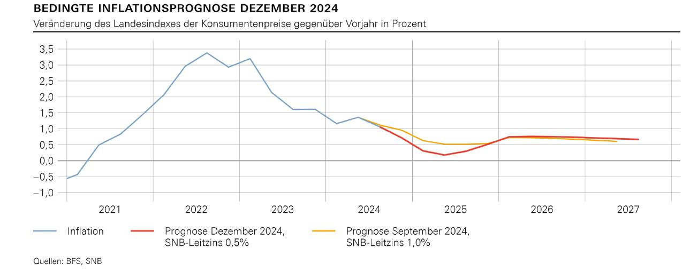

## Table of Contents

## What is the current interest rate in Switzerland?

The current interest rate in Switzerland is set by the Swiss National Bank (SNB). As of the latest update in 2023, the SNB has maintained its policy rate at 1.75%. This rate is part of the SNB's efforts to manage inflation and support economic stability in the country.

Interest rates in Switzerland have been relatively low for many years, but recent global economic conditions have led to adjustments. The SNB closely monitors economic indicators and adjusts the interest rate to balance inflation control with economic growth. This rate influences borrowing costs for businesses and consumers, affecting everything from mortgages to savings accounts.

## Why did Switzerland decide to cut interest rates?

Switzerland decided to cut interest rates to help their economy. When interest rates are lower, it's cheaper for people and businesses to borrow money. This can encourage them to spend more, which can help the economy grow. The Swiss National Bank, which is like Switzerland's central bank, looks at many things like how fast prices are going up (inflation) and how strong the economy is before deciding to change interest rates.

The decision to cut rates was also influenced by what was happening in the world economy. If other countries are having problems, it can affect Switzerland too. By lowering interest rates, the Swiss National Bank wanted to make sure Switzerland's economy stays strong and can handle any challenges from around the world. This way, they hope to keep jobs safe and keep the economy moving forward.

## How does a decline in inflation affect interest rates?

When inflation goes down, it can lead to lower interest rates. Inflation is when prices for things like food and gas go up over time. If inflation slows down, it means prices aren't rising as fast. The people who set interest rates, like the central bank, might decide to lower them because they want to keep the economy growing. Lower interest rates make it cheaper for people and businesses to borrow money, so they might spend more, which can help the economy.

But, it's not always that simple. Sometimes, if inflation is very low or even going down (which is called deflation), the central bank might keep interest rates the same or even raise them a bit. They do this to make sure people keep spending and the economy doesn't slow down too much. So, a decline in inflation can lead to lower interest rates, but the central bank looks at many things before deciding what to do.

## What was the inflation rate in Switzerland before the rate cut?

Before the Swiss National Bank decided to cut interest rates, the inflation rate in Switzerland was around 1.7%. This was a bit lower than what the bank had expected earlier in the year. Inflation means prices for things like food and rent were going up by about 1.7% every year.

The Swiss National Bank looks at inflation to help decide on interest rates. When they saw that inflation was at 1.7%, they thought it was a good time to lower interest rates. They wanted to make sure the economy kept growing and people could still afford to buy things, even if prices were going up a little bit.

## What is the expected impact of the interest rate cut on the Swiss economy?

The interest rate cut in Switzerland is expected to help the economy by making it cheaper for people and businesses to borrow money. When borrowing costs go down, people might decide to take out loans for things like buying a house or starting a new business. This can lead to more spending, which is good for the economy because it helps create jobs and keeps businesses busy.

The cut in interest rates might also make the Swiss franc weaker compared to other currencies. A weaker franc can make Swiss products cheaper for people in other countries to buy, which can help Swiss businesses sell more abroad. This could lead to more money coming into the Swiss economy, helping it grow even more. Overall, the interest rate cut is aimed at keeping the economy strong and helping it grow in a world where other countries might be facing challenges.

## How does the Swiss National Bank determine when to adjust interest rates?

The Swiss National Bank looks at many things to decide when to change interest rates. They pay close attention to inflation, which is how fast prices for things like food and rent are going up. If inflation is too high, they might raise interest rates to slow it down. If inflation is too low, they might lower interest rates to help the economy grow. They also look at how strong the economy is, like how many people have jobs and how much businesses are making.

Another thing they consider is what's happening in the world economy. If other countries are having problems, it can affect Switzerland too. The Swiss National Bank wants to make sure Switzerland's economy stays strong no matter what's happening elsewhere. They also think about the value of the Swiss franc compared to other currencies. If the franc is too strong, it can make Swiss products more expensive for people in other countries to buy, so they might adjust interest rates to help keep the franc at a good level.

## What are the potential risks associated with lowering interest rates?

Lowering interest rates can have some risks. One big risk is that it might make inflation go up too much. When interest rates are low, borrowing money becomes cheaper, so people and businesses might spend more. If everyone starts spending a lot more, prices for things like food and rent can go up faster than the central bank wants. This can make life harder for people because their money doesn't go as far.

Another risk is that it can create bubbles in the economy. When borrowing is cheap, people might take out loans to buy things like houses or stocks, even if the prices are already very high. If too many people do this, it can create a bubble where prices are much higher than they should be. If the bubble bursts, it can cause big problems for the economy, like a lot of people losing money or even losing their jobs.

Lastly, lowering interest rates can also affect the value of the country's currency. If interest rates are lower in Switzerland than in other countries, people might move their money to those other countries to get better returns. This can make the Swiss franc weaker, which can be good for Swiss businesses selling things abroad but bad for Swiss people buying things from other countries. It's a tricky balance that the Swiss National Bank has to manage carefully.

## How does the interest rate cut influence the Swiss Franc's value?

When the Swiss National Bank cuts interest rates, it can make the Swiss Franc weaker compared to other currencies. This happens because lower interest rates mean people can earn less money by keeping their savings in Swiss Francs. If other countries have higher interest rates, people might move their money there to get better returns. This movement of money can make the Swiss Franc less valuable.

A weaker Swiss Franc can be good for Swiss businesses that sell things to other countries. When the Franc is weaker, Swiss products become cheaper for people in other countries to buy. This can help Swiss companies sell more abroad and bring more money into the Swiss economy. But, it can also make things from other countries more expensive for people living in Switzerland, which might make life a bit harder for them.

## What has been the historical trend of interest rates in Switzerland?

Over the years, interest rates in Switzerland have been pretty low compared to many other countries. From the 1990s to the early 2000s, the Swiss National Bank kept interest rates around 2% to 3%. But then, in the late 2000s, they started to go down even more. By 2011, the Swiss National Bank set the interest rate to 0% and even went into negative territory in 2015, meaning banks had to pay to keep their money at the central bank. This was a big change and was done to help the Swiss economy and keep the Swiss Franc from getting too strong.

In recent years, interest rates have started to go up a bit. In 2022, the Swiss National Bank raised the interest rate from -0.75% to 1.75% over the course of the year. This was a big jump and was done to fight inflation, which was starting to go up around the world. The Swiss National Bank is always trying to find the right balance to keep the economy growing without letting inflation get out of control. They look at many things, like how fast prices are going up and how strong the economy is, to decide what to do with interest rates.

## How do Swiss interest rate changes compare to those of other major economies?

Swiss interest rates have been different from those in other big economies. For a long time, Switzerland had very low interest rates, even going into negative territory in 2015. This was not common in other countries. Many other big economies, like the United States and the European Union, also had low interest rates, but they didn't go negative as much as Switzerland did. The Swiss National Bank did this to help the Swiss economy and stop the Swiss Franc from getting too strong.

In recent years, as inflation started to go up around the world, many countries began to raise their interest rates. The United States, for example, started raising rates in 2022, and the European Central Bank did the same. Switzerland also raised its rates, going from -0.75% to 1.75% in 2022. But even with these increases, Swiss interest rates are still lower than in some other big economies. The Swiss National Bank tries to keep a balance to help the economy grow without letting inflation get too high.

## What are the long-term economic forecasts for Switzerland following this rate cut?

The long-term economic forecasts for Switzerland after the interest rate cut suggest that the economy could see steady growth. By making borrowing cheaper, the Swiss National Bank hopes more people and businesses will take out loans to buy things like houses or start new projects. This increased spending can help create more jobs and keep businesses busy. If everything goes well, the economy might grow at a good pace without prices going up too fast, which is what the Swiss National Bank wants.

However, there are some things to watch out for. If too many people start spending because of the lower rates, prices could go up too quickly, leading to higher inflation. Also, if the Swiss Franc gets weaker because of the rate cut, it might help Swiss businesses sell more abroad, but it could make things from other countries more expensive for people in Switzerland. The Swiss National Bank will need to keep a close eye on these things to make sure the economy stays on the right track in the long run.

## How might the interest rate cut affect Switzerland's monetary policy in the future?

The interest rate cut might make the Swiss National Bank keep a close eye on things like inflation and how strong the economy is. They will want to make sure that prices don't go up too fast because of the lower rates. If they see that inflation is starting to get too high, they might decide to raise interest rates again to slow it down. They will also look at how the Swiss Franc is doing compared to other currencies. If the Franc gets too weak, it could cause problems, so they might need to adjust their policies to keep it at a good level.

In the future, the Swiss National Bank might also think about other ways to help the economy grow without causing too much inflation. They could use other tools, like buying or selling government bonds, to control how much money is in the economy. This way, they can try to keep the economy growing at a good pace while making sure prices don't go up too fast. It's all about finding the right balance to keep Switzerland's economy strong and stable.

## References & Further Reading

[1]: ["Monetary Policy and the Swiss National Bank: An Overview"](https://www.snb.ch/en/the-snb/mandates-goals/monetary-policy) - Swiss National Bank

[2]: ["Switzerland's Monetary Policy Framework"](https://books.google.com/books/about/Switzerland.html?id=TkAYEAAAQBAJ) - Swiss National Bank Official Website

[3]: ["The Role of Algorithmic Trading in Fixed-Income Markets"](http://datascienceassn.org/sites/default/files/Machine%20Learning%20and%20Algorithmic%20Trading%20In%20Fixed%20Income%20Markets.pdf) - Bank for International Settlements

[4]: ["Advances in Financial Machine Learning"](https://www.amazon.com/Advances-Financial-Machine-Learning-Marcos/dp/1119482089) by Marcos Lopez de Prado

[5]: ["Impact of Algorithmic Trading on Market Dynamics"](https://www.researchgate.net/publication/378548435_Algorithmic_Trading_and_AI_A_Review_of_Strategies_and_Market_Impact) - Journal of Financial Economics