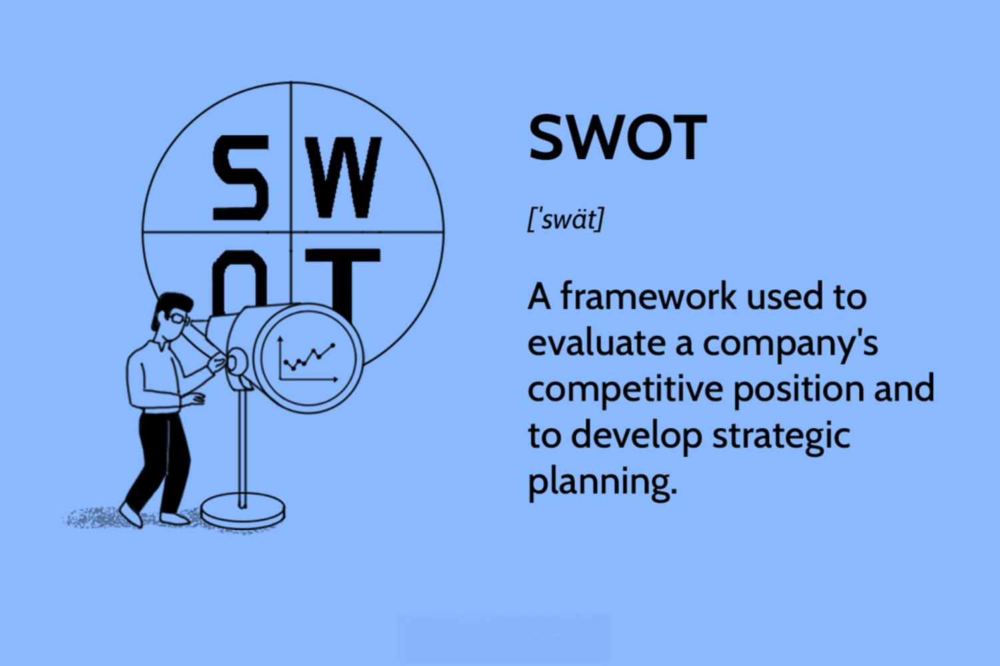

SWOT analysis is a structured planning method used to identify and assess the internal and external factors that impact an organization or project. The acronym SWOT stands for Strengths, Weaknesses, Opportunities, and Threats. Strengths and weaknesses are internal factors, whereas opportunities and threats are external elements. This analysis tool plays a crucial role in strategic business planning as it provides a systematic framework for evaluating the competitive position and potential strategic options of an organization. By understanding these four elements, businesses can leverage their strengths, mitigate their weaknesses, capitalize on opportunities, and defend against threats. This comprehensive understanding aids in formulating strategies that align with organizational objectives and market conditions.

Algorithmic trading, on the other hand, represents a significant advancement in financial markets through the use of pre-programmed instructions for trading decisions. Such trading systems utilize algorithms to automatically execute trades based on various criteria such as timing, price, and volume with a high level of speed and precision. The evolution of algorithmic trading has brought considerable efficiency compared to traditional manual trading, allowing for greater consistency in trading strategies and the ability to process large volumes of data rapidly. Different algorithmic trading strategies include trend following, arbitrage, market making, and more, each offering unique benefits aligned with specific trading goals.



The need to combine SWOT analysis with algorithmic trading strategies arises from the aim to develop robust, informed, and sustainable trading strategies that not only leverage technological advancements but are also grounded in strategic business acumen. By integrating SWOT into algorithmic trading, traders and businesses can identify and assess factors such as competitive advantage, market conditions, and operational efficiencies to enhance their decision-making processes. This combination supports a more comprehensive strategic planning approach, which aligns trading activities with broader organizational goals and market dynamics.

The objective of this article is to explore the synergy between SWOT analysis and algorithmic trading in strategic planning. By understanding how these concepts can interact, organizations can improve their strategic planning efforts in the financial markets, leading to more effective and informed business decisions. This article is structured to provide an understanding of SWOT analysis and algorithmic trading independently before exploring their intersection and combined potential in strategic planning. It will conclude with a discussion of the benefits, risks, and potential future trends of this integrated approach in strategic planning.

## Table of Contents

## Understanding SWOT Analysis

SWOT analysis is a strategic planning tool used to identify and evaluate the internal and external factors that can affect the performance and strategic direction of an organization. The acronym stands for Strengths, Weaknesses, Opportunities, and Threats, which are the four categories through which a comprehensive evaluation is conducted.

### Detailed Explanation of SWOT Analysis:

1. **Strengths** refer to the internal attributes and resources that contribute positively to achieving an organization's goals. These can include a strong brand reputation, a loyal customer base, efficient processes, or proprietary technology. Recognizing strengths allows businesses to leverage them in strategic planning.

2. **Weaknesses** are internal factors that may hinder an organization's ability to meet its objectives. These might involve poor brand reputation, high turnover rates, outdated technology, or limited resources. Identifying weaknesses is crucial for addressing them directly and preventing them from impacting business performance.

3. **Opportunities** represent external factors that an organization can capitalize on to enhance its performance or competitive edge. These can result from market growth, regulatory changes, technological advancements, or shifts in consumer behavior. Businesses that accurately identify opportunities can exploit them to achieve significant strategic gains.

4. **Threats** are external elements that could potentially cause trouble for an organization. These threats might come from competitive pressures, economic downturns, legal changes, or evolving consumer preferences. Understanding threats is essential for developing strategies to mitigate their impact.

### Importance of SWOT in Evaluating Business Environments:

SWOT analysis is invaluable for assessing both internal and external environments in which a business operates. It provides a structured approach to identifying and analyzing factors that can influence strategic success. By breaking down the environment into these four categories, businesses can develop a holistic view of their current situation and prepare adequately for future challenges and opportunities.

### Application of SWOT in Identifying Competitive Advantages:

Competitive advantages can be identified through the strengths quadrant of a SWOT analysis. When a business recognizes unique strengths that set it apart from competitors, it can focus on these areas to build a durable competitive advantage. For example, a company that identifies its high customer satisfaction rate as a strength can develop marketing strategies to highlight this advantage, attracting new customers and retaining existing ones.

### Examples of How Businesses Use SWOT Analysis for Strategic Decision-Making:

- **Apple Inc.**, a leader in technology, utilizes its brand strength and loyal customer base to venture into new product lines, ensuring alignment with market opportunities.

- **McDonald's** uses SWOT analysis to address growing health consciousness among consumers by recognizing the threat this poses and subsequently diversifying its menu to include healthier options.

- **Netflix** capitalized on the opportunity of increasing internet penetration worldwide by shifting its focus toward streaming services, thus expanding its customer base significantly.

By systematically identifying strengths, weaknesses, opportunities, and threats, businesses can make informed decisions that align with their strategic objectives, thereby improving their chances of success in a competitive market landscape.

 to Algorithmic Trading

Algorithmic trading, often referred to as algo trading, involves using computer algorithms to automate trading activities based on predetermined criteria or strategies. This methodology has revolutionized the financial markets by enabling traders to execute orders at speeds and frequencies beyond human capability. The concept originated in the 1970s with the introduction of electronic trading platforms and has since evolved significantly with advancements in technology.

The primary benefits of [algorithmic trading](/wiki/algorithmic-trading) include enhanced efficiency and precision. Algorithms can process a vast amount of market data and execute trades at optimal prices within milliseconds, reducing the risk of manual errors. This efficiency is particularly advantageous in markets with high [volatility](/wiki/volatility-trading-strategies), where rapid response times are crucial. Additionally, algo trading allows for [backtesting](/wiki/backtesting) of strategies using historical data, assisting in refining and optimizing trading models before deployment in live markets.

Numerous algorithmic trading strategies have been developed, catering to different market conditions and investor goals. Trend following, for instance, focuses on identifying and profiting from market trends, while mean reversion strategies assume that asset prices will revert to their historical averages over time. Arbitrage strategies exploit price discrepancies of the same asset across different markets or instruments, aiming for risk-free profits. Other strategies include [market making](/wiki/market-making), statistical [arbitrage](/wiki/arbitrage), and high-frequency trading, each utilizing specific algorithms to capitalize on unique market phenomena.

Currently, algorithmic trading dominates global financial markets. According to a 2020 report from Research and Markets, over 70% of the total trading [volume](/wiki/volume-trading-strategy) in the US equity markets was conducted through algorithmic platforms. The scope of algo trading is expanding beyond equities to include commodities, foreign exchange, and fixed-income markets.

Looking ahead, the future prospects for algorithmic trading appear promising. With the ongoing integration of [artificial intelligence](/wiki/ai-artificial-intelligence) and [machine learning](/wiki/machine-learning), algorithms are becoming more sophisticated, capable of learning from past trades and adjusting strategies in real-time. These advancements are expected to further enhance predictive accuracy and adaptability, potentially transforming the landscape of trading strategies. However, the increased complexity will require robust regulatory oversight to mitigate associated risks such as flash crashes and systemic threats.

In conclusion, algorithmic trading stands at the forefront of financial innovation, offering unmatched efficiency and precision in executing trades. As technology continues to advance, the role of algorithmic trading is likely to grow, presenting new opportunities and challenges for market participants.

## The Intersection of SWOT Analysis and Algorithmic Trading

SWOT analysis can serve as a potent tool in enhancing algorithmic trading strategies by systematically evaluating internal and external factors that influence trading performance. Combining SWOT analysis with algorithmic trading enables traders and strategists to gain a comprehensive understanding of their operational environment, thereby facilitating the development of resilient trading models.

### Identifying Strengths and Opportunities in Algo Trading through SWOT

In the context of algorithmic trading, strengths refer to the internal capabilities that provide a trading system with a competitive edge. These might include cutting-edge technologies, advanced algorithms, and a highly skilled development team. For example, access to high-frequency trading infrastructure or proprietary trading algorithms represents significant strengths. Algorithmic trading strategies can capitalize on market inefficiencies faster than traditional trading methods, which is a critical strength.

Opportunities in algorithmic trading can arise from external market conditions that favor systematic trading approaches. Market volatility, the emergence of new asset classes, or regulatory changes promoting transparency can be viewed as opportunities. By leveraging SWOT analysis, traders can align their strategies to exploit these favorable conditions, ensuring that the trading algorithms are positioned to maximize potential benefits.

### Addressing Weaknesses and Threats in the Context of Algo Trading

Weaknesses in algorithmic trading might include limitations in data quality, outdated technology, or inadequate risk management protocols. These internal challenges can impair the effectiveness of trading strategies, resulting in suboptimal performance or financial losses. SWOT analysis aids in the identification of such weaknesses, prompting strategic interventions to upgrade systems, enhance data quality, or improve risk management frameworks.

Threats encompass external factors that may challenge the effectiveness of algorithmic trading strategies. These can include sudden market disruptions, regulatory shifts that impose constraints on trading activities, or increased competition from other market players. By evaluating threats through SWOT analysis, traders can devise contingency plans and adjust their algorithms to mitigate potential negative impacts. For instance, incorporating adaptive algorithms that adjust to changing market conditions can be an effective threat-mitigation strategy.

### Examples of Successful Integration of SWOT Analysis in Developing Robust Algo Trading Models

One notable example of successfully integrating SWOT analysis into algorithmic trading is the use of machine learning algorithms that adapt to identified strengths and opportunities. For instance, a trading firm might leverage its strength in data analytics to build predictive models that anticipate market trends, thereby aligning with identified market opportunities. 

Consider a trading strategy coded in Python that continuously learns from market data:

```python
import numpy as np
from sklearn.ensemble import RandomForestClassifier

# Strength: Access to historical market data
market_data = np.random.rand(1000, 10)  # Example market data
target = np.random.randint(2, size=1000)  # Buy/Sell signals

# Initializing the model leveraging a strength in data processing
model = RandomForestClassifier(n_estimators=100)

# Training the model to capitalize on opportunities
model.fit(market_data, target)

# Predicting future market moves to exploit opportunities
future_data = np.random.rand(1, 10)
prediction = model.predict(future_data)
```

This example illustrates how a firm can use its strengths in computational power and data analytics to capture market opportunities by predicting market trends. Such strategies can be continuously refined by applying SWOT analysis to assess where improvements are needed and how external factors might influence performance. Ultimately, the integration of SWOT analysis with algorithmic trading allows organizations to create robust, adaptive trading models that are strategically aligned with both internal capabilities and external market conditions.

## Strategic Planning Using SWOT and Algo Trading

Strategic planning is a crucial aspect of business management, aiming to align organizational resources with its mission and vision to achieve long-term goals. When integrating SWOT analysis with algorithmic trading, businesses can refine their strategies by exactly matching their strengths and opportunities with automated decision-making in financial markets.

Incorporating SWOT insights into algo strategies involves systematically analyzing each component of the SWOT matrix to enhance algorithm capabilities. One approach is to leverage internal strengths, such as proprietary data or advanced computational infrastructure, to develop powerful algorithms. These strengths might be expressed in quantitative models that exhibit superior predictive accuracy or execution speed. For instance, if a company identifies its advanced data analytics as a strength, it can focus on developing complex algorithms such as machine learning models that analyze large datasets for trends and anomalies.

Weaknesses, such as limited access to market data or computational constraints, need addressing by prioritizing resources to mitigate these areas. Techniques such as [data augmentation](/wiki/data-augmentation) or strategic partnerships could be explored to overcome data limitations. Moreover, developing algorithms with optimized code can reduce computational demands, improving the efficiency of the trading system.

Opportunities, typically external factors, can be incorporated into trading strategies by identifying new markets or emerging trends. For instance, if a SWOT analysis highlights the growth potential in [cryptocurrency](/wiki/cryptocurrency) markets, the company can invest in developing algorithms tailored for cryptocurrency trading, potentially exploring strategies like arbitrage or trend-following.

Threats, such as regulatory changes or disruptive technologies, require strategies that enhance flexibility and resilience. Algorithms must be designed to quickly adapt to changing market conditions. One approach is integrating risk management components within the trading system. For example, algorithms can include stop-loss orders or dynamic reallocation of assets to minimize potential losses due to volatile market conditions.

A case study involving the combination of SWOT analysis with algorithmic trading could involve a [hedge fund](/wiki/hedge-fund-trading-strategies) that identifies artificial intelligence as both a strength and an opportunity. By leveraging its AI expertise, the fund develops sophisticated predictive models that outperform traditional market analysis methods, thereby gaining a competitive advantage.

Challenges exist in aligning SWOT analysis with algo trading strategies, including the dynamic nature of both SWOT components and market conditions. A significant challenge is maintaining updated SWOT assessments in fast-changing environments. Solutions include implementing automated systems capable of real-time SWOT evaluation, perhaps using natural language processing to analyze market news and sentiment, which can then be integrated into algorithmic decision-making.

In conclusion, through careful integration of SWOT insights, businesses can enhance their algorithmic trading strategies by ensuring they capitalize on strengths and opportunities while mitigating weaknesses and threats. This alignment not only leads to more robust trading systems but also supports long-term strategic objectives, offering a comprehensive approach to navigating the complexities of modern financial markets.

## Benefits and Risks of Merging SWOT Analysis with Algorithmic Trading

Merging SWOT analysis with algorithmic trading offers significant benefits for strategic planning in financial markets. By integrating SWOT's structured approach with the dynamic nature of algorithmic models, traders can optimize their strategies with a comprehensive understanding of internal and external market conditions.

**Benefits**

1. **Enhanced Decision-Making**: SWOT analysis provides a framework to evaluate the internal strengths and weaknesses of trading strategies while accounting for external opportunities and threats. This understanding allows traders to refine algorithms, improving decision-making processes. Algorithmic trading benefits from SWOT by gaining insights into the market conditions and adjusting strategies in real-time to optimize performance.

2. **Optimized Strategy Development**: By identifying strengths, such as robust algorithmic models or reliable data sources, traders can amplify these advantages. Similarly, understanding market opportunities allows the identification of new algorithmic strategies, potentially opening avenues for innovative arbitrage or hedging techniques.

3. **Risk Management**: SWOT enables the identification of threats, helping traders to anticipate potential market volatility or infrastructural challenges. Combining SWOT with algorithmic trading can lead to developing risk-adjusted models that can withstand critical market conditions. For instance, Python can be used to simulate various market conditions using Monte Carlo simulations, allowing traders to visualize potential risk scenarios:

   ```python
   import numpy as np

   def monte_carlo_simulation(num_simulations, num_days, start_price, daily_return, volatility):
       results = []
       for _ in range(num_simulations):
           price_series = [start_price]
           for _ in range(num_days):
               shock = np.random.normal(loc=daily_return, scale=volatility)
               price_series.append(price_series[-1] * (1 + shock))
           results.append(price_series)
       return results
   ```

**Risks**

1. **Data Overfitting**: With SWOT's emphasis on data analysis and algorithmic trading's dependency on historical data, there is a risk of overfitting models to past data, leading to underperformance in live markets. To mitigate this, in-sample and out-sample testing, as well as walk-forward optimization, can be employed.

2. **Complexity in Integration**: Aligning SWOT insights with algorithmic frameworks can be complex, requiring significant expertise in both domains. Establishing interdisciplinary teams with skills in strategic analysis and quantitative modeling can help address this challenge.

3. **Rapid Market Changes**: While SWOT provides a static analytical structure, financial markets can change rapidly, sometimes rendering SWOT insights obsolete. Regular updates and reviews of SWOT analyses are crucial to ensure relevance and to adapt algorithmic strategies promptly.

**Long-term Advantages**

Integrating SWOT analysis with algorithmic trading offers long-term benefits, including sustained competitive advantage and adaptive resilience in volatile markets. Businesses leveraging this integrated approach can proactively align their strategic objectives with market dynamics, enhancing both profitability and strategic foresight. This synergy not only improves trading outcomes but also fosters a culture of continuous improvement and strategic agility, essential for navigating the complexities of modern financial landscapes.

## Conclusion

SWOT analysis remains a crucial tool in strategic planning, offering businesses and traders a structured framework to evaluate the internal and external factors affecting their operations. By identifying strengths, weaknesses, opportunities, and threats, organizations can devise strategies that leverage their competitive advantages while mitigating potential challenges. This analytical technique is invaluable in a rapidly changing business environment, providing a clear pathway for informed decision-making and long-term planning.

When combined with algorithmic trading, SWOT analysis provides a new dimension to trading strategies. Algorithmic trading, by design, utilizes mathematical models and complex algorithms to optimize trading performance, offering benefits like increased efficiency, speed, and precision. Integrating SWOT insights into these trading algorithms allows traders to fine-tune their strategies by aligning them with the broader business landscape. For instance, recognizing external opportunities can lead to the development of algorithms that capitalize on emerging market trends, while understanding potential threats can help in fortifying trading systems against market volatilities.

Businesses and traders are encouraged to explore these synergies to enhance their strategic decision-making. The merger of SWOT analysis with algorithmic trading allows a holistic approach, uniting qualitative insights with quantitative precision. This integration not only enriches trading strategies but also aligns them with the organization's strategic objectives, leading to more robust and resilient business operations.

Looking ahead, the fusion of SWOT analysis and algorithmic trading is poised to become a cornerstone in strategic planning. As markets become increasingly dynamic and complex, the ability to adapt and pivot quickly will be vital. The possible evolution includes the use of artificial intelligence and machine learning to refine SWOT insights further, creating even more sophisticated trading algorithms. These advancements will empower businesses and traders to anticipate market movements with greater accuracy, ensuring sustained growth and competitive advantage in the future.

## References & Further Reading

[1]: Bergstra, J., Bardenet, R., Bengio, Y., & Kégl, B. (2011). ["Algorithms for Hyper-Parameter Optimization."](https://proceedings.neurips.cc/paper/2011/file/86e8f7ab32cfd12577bc2619bc635690-Paper.pdf) Advances in Neural Information Processing Systems 24.

[2]: ["Advances in Financial Machine Learning"](https://www.amazon.com/Advances-Financial-Machine-Learning-Marcos/dp/1119482089) by Marcos Lopez de Prado

[3]: ["Evidence-Based Technical Analysis: Applying the Scientific Method and Statistical Inference to Trading Signals"](https://www.amazon.com/Evidence-Based-Technical-Analysis-Scientific-Statistical/dp/0470008741) by David Aronson

[4]: ["Machine Learning for Algorithmic Trading"](https://github.com/PacktPublishing/Machine-Learning-for-Algorithmic-Trading-Second-Edition) by Stefan Jansen

[5]: ["Quantitative Trading: How to Build Your Own Algorithmic Trading Business"](https://www.amazon.com/Quantitative-Trading-Build-Algorithmic-Business/dp/0470284889) by Ernest P. Chan