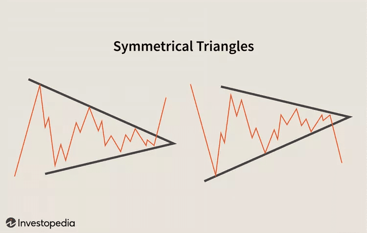

## Table of Contents

## What is a symmetrical triangle pattern in trading?

A symmetrical triangle pattern in trading is a chart pattern that looks like a triangle. It forms when the price of a stock or other asset moves between two lines that are getting closer together. One line goes up and the other goes down. This pattern shows that the market is not sure which way to go, so the price keeps getting squeezed into a smaller space.

Traders watch symmetrical triangles because they can signal that a big move is coming. When the price finally breaks out of the triangle, it usually goes in the direction of the breakout. If the price breaks above the top line, traders might buy, expecting the price to go up. If it breaks below the bottom line, they might sell, expecting the price to go down. It's important to wait for the breakout to happen before making a trade, to make sure the signal is strong.

## How can a symmetrical triangle pattern be identified on a chart?

To spot a symmetrical triangle pattern on a chart, you need to look for two lines that are getting closer together. One line will be drawn along the highs of the price, and it will slope downwards. The other line will be drawn along the lows of the price, and it will slope upwards. These two lines should meet at some point in the future, making the shape of a triangle. The price will move back and forth between these two lines, getting squeezed into a smaller and smaller space.

Once you see this pattern forming, it means the market is unsure about where the price will go next. The price is stuck between the two lines, and it's waiting for something to push it out of the triangle. When the price finally breaks out of the triangle, it can be a signal that a big move is coming. If the price breaks above the top line, it might go up a lot. If it breaks below the bottom line, it might go down a lot. So, watching for this [breakout](/wiki/breakout-trading) is important for traders who want to make a move based on the symmetrical triangle pattern.

## What does a symmetrical triangle indicate about market trends?

A symmetrical triangle shows that the market is not sure which way to go. It happens when the price of a stock or other thing you can trade moves between two lines that are getting closer together. One line goes up and the other goes down. This makes a triangle shape on the chart. The price keeps bouncing between these lines, getting squeezed into a smaller space. This means that buyers and sellers are fighting, but neither side is winning yet.

When the price finally breaks out of the triangle, it can tell us that a big move is coming. If the price breaks above the top line, it might mean the price will go up a lot. If it breaks below the bottom line, it might mean the price will go down a lot. Traders watch for this breakout because it can be a good time to buy or sell. So, a symmetrical triangle shows that the market is waiting for something to happen, and when it does, it can start a new trend.

## What are the key differences between a symmetrical triangle and other triangle patterns?

A symmetrical triangle is different from other triangle patterns like ascending and descending triangles. In a symmetrical triangle, the price moves between two lines that are getting closer together. One line goes up and the other goes down. This shows that the market is not sure which way to go. The price keeps getting squeezed into a smaller space until it breaks out. When it breaks out, it can go up or down, depending on which line it breaks through.

An ascending triangle has a flat top line and a bottom line that goes up. This pattern shows that buyers are getting stronger because the price keeps hitting the same high but making higher lows. It usually means the price will go up when it breaks out. A descending triangle is the opposite. It has a flat bottom line and a top line that goes down. This shows that sellers are getting stronger because the price keeps hitting the same low but making lower highs. It usually means the price will go down when it breaks out.

So, the main difference is that a symmetrical triangle shows the market is unsure, while ascending and descending triangles show that one side (buyers or sellers) is getting stronger. The direction of the breakout in a symmetrical triangle can go either way, but in ascending and descending triangles, the breakout usually goes in the direction that the stronger side is pushing.

## How should a trader interpret the breakout from a symmetrical triangle?

When the price breaks out of a symmetrical triangle, it's a big deal for traders. It means the market has finally made up its mind after being unsure for a while. If the price breaks above the top line of the triangle, it's a sign that the price might go up a lot. This is because the buyers have finally won the fight against the sellers. Traders might want to buy the stock or whatever they're trading when this happens, hoping to make money as the price goes up.

On the other hand, if the price breaks below the bottom line of the triangle, it's a sign that the price might go down a lot. This means the sellers have won the fight against the buyers. Traders might want to sell the stock or whatever they're trading when this happens, hoping to avoid losing money as the price goes down. It's important for traders to wait until the breakout actually happens before making a move, to make sure the signal is strong and not a fake one.

## What are the common volume patterns associated with symmetrical triangles?

When a symmetrical triangle forms, the [volume](/wiki/volume-trading-strategy) usually gets lower and lower as the pattern goes on. This means fewer people are trading as the price moves back and forth between the two lines of the triangle. The low volume shows that the market is not sure which way to go, and it's waiting for something to happen.

When the price finally breaks out of the symmetrical triangle, the volume usually goes up a lot. This means more people are trading because they think the price is going to move in the direction of the breakout. A big increase in volume when the price breaks out can make traders more sure that the breakout is real and not a fake one.

## What are the potential price targets after a symmetrical triangle breakout?

After a symmetrical triangle breaks out, traders often try to guess where the price might go next. One way to do this is by measuring the height of the triangle at its widest part, from the first high to the first low. Then, they add this height to the breakout point if the price breaks up, or subtract it from the breakout point if the price breaks down. This gives them a target price to aim for.

Another way to find a price target is by looking at other things on the chart, like support and resistance levels. These are places where the price has stopped moving before. If the price breaks out up, traders might look for the next resistance level as a target. If it breaks out down, they might look for the next support level. Both methods help traders plan their trades and know when to take profits or cut losses.

## How can traders use technical indicators to confirm a symmetrical triangle breakout?

Traders can use different technical indicators to make sure a breakout from a symmetrical triangle is real. One common indicator is the volume. When the price breaks out, traders look for a big jump in volume. This means more people are trading, which can show that the breakout is strong and not just a fake one. Another indicator is the moving average convergence divergence (MACD). If the MACD line crosses above the signal line when the price breaks out up, or below the signal line when it breaks out down, it can confirm the breakout.

Another useful indicator is the relative strength index (RSI). If the RSI is above 50 when the price breaks out up, or below 50 when it breaks out down, it can add more proof that the breakout is real. Some traders also use the Average Directional Index (ADX) to see if the trend is getting stronger after the breakout. If the ADX goes up after the breakout, it can show that the new trend is strong and likely to keep going. By using these indicators, traders can feel more sure about their trades and make better decisions.

## What are the risks and challenges of trading symmetrical triangle patterns?

Trading symmetrical triangle patterns can be tricky because there are risks and challenges to watch out for. One big risk is that the breakout might be fake. Sometimes the price breaks out of the triangle, but then it quickly goes back inside. This can trick traders into making bad trades. Another challenge is that the market can be very choppy while the triangle is forming. This means the price moves up and down a lot, making it hard to know when to buy or sell. Traders need to be patient and wait for a clear breakout before making a move.

Another risk is that the price target after a breakout might not be reached. Even if the breakout looks strong, the price might not go as far as traders expect. This can happen because of other things happening in the market that change the price. Traders also need to be careful about their timing. If they get into a trade too early or too late, they might miss out on the big move or lose money. Using technical indicators can help, but they are not perfect and can sometimes give wrong signals. So, traders need to be ready for surprises and have a plan to manage their risks.

## How does the duration of a symmetrical triangle affect its reliability?

The length of time a symmetrical triangle takes to form can change how much traders trust it. If a symmetrical triangle takes a long time to form, it can be seen as more reliable. This is because the longer the pattern takes, the more times the price bounces off the two lines of the triangle. This shows that the market is really stuck and waiting for a big move. Traders might feel more sure about the breakout if the triangle has been forming for a while.

On the other hand, if a symmetrical triangle forms quickly, it might not be as reliable. A short-term triangle might not have as many price bounces, so it might not show as strong a fight between buyers and sellers. This can make traders less sure about the breakout. They might need to see other signs, like a big jump in volume, to feel more confident about trading based on the breakout. So, the longer a symmetrical triangle takes to form, the more reliable it might be for traders.

## Can symmetrical triangles be used in different time frames, and how does this impact trading strategies?

Symmetrical triangles can be used on different time frames, like short-term charts that show minutes or hours, or long-term charts that show days or weeks. The time frame you choose can change how you trade. On a short-term chart, a symmetrical triangle might form quickly, and the breakout could happen in a few hours or less. Traders who use short-term charts might make quick trades, trying to make money from small price moves right after the breakout. They need to watch the market closely and be ready to act fast.

On a long-term chart, a symmetrical triangle might take weeks or months to form. The breakout could lead to a big move that lasts for a long time. Traders who use long-term charts might hold onto their trades for weeks or months, hoping to make money from bigger price moves. They don't need to watch the market as closely, but they need to be patient and wait for the right time to get in and out of their trades. So, the time frame you use can change how you trade symmetrical triangles and how long you hold onto your trades.

## What advanced techniques can be used to enhance the accuracy of trading symmetrical triangles?

To make trading symmetrical triangles more accurate, traders can use a few advanced techniques. One way is to use multiple time frames. This means looking at the same symmetrical triangle on different charts, like a short-term chart and a long-term chart. If the triangle looks the same on both charts, it can make traders more sure that the breakout will be real. Another technique is to use more than one technical indicator to confirm the breakout. For example, if the volume goes up a lot and the MACD line crosses the signal line at the same time as the breakout, it can make the signal stronger.

Another advanced technique is to watch for other chart patterns that might form at the same time as the symmetrical triangle. For example, if a symmetrical triangle forms near a big support or resistance level, it can make the breakout more important. Traders can also use Fibonacci retracement levels to find possible price targets after the breakout. By drawing these levels from the start of the triangle to the breakout point, traders can guess where the price might go next. Using these advanced techniques can help traders make better decisions and be more successful when trading symmetrical triangles.

## References & Further Reading

[1]: Bergstra, J., Bardenet, R., Bengio, Y., & Kégl, B. (2011). ["Algorithms for Hyper-Parameter Optimization."](https://papers.nips.cc/paper/4443-algorithms-for-hyper-parameter-optimization) Advances in Neural Information Processing Systems 24.

[2]: ["Advances in Financial Machine Learning"](https://www.amazon.com/Advances-Financial-Machine-Learning-Marcos/dp/1119482089) by Marcos Lopez de Prado

[3]: ["Evidence-Based Technical Analysis: Applying the Scientific Method and Statistical Inference to Trading Signals"](https://www.amazon.com/Evidence-Based-Technical-Analysis-Scientific-Statistical/dp/0470008741) by David Aronson

[4]: ["Machine Learning for Algorithmic Trading"](https://github.com/stefan-jansen/machine-learning-for-trading) by Stefan Jansen

[5]: ["Quantitative Trading: How to Build Your Own Algorithmic Trading Business"](https://www.amazon.com/Quantitative-Trading-Build-Algorithmic-Business/dp/1119800064) by Ernest P. Chan