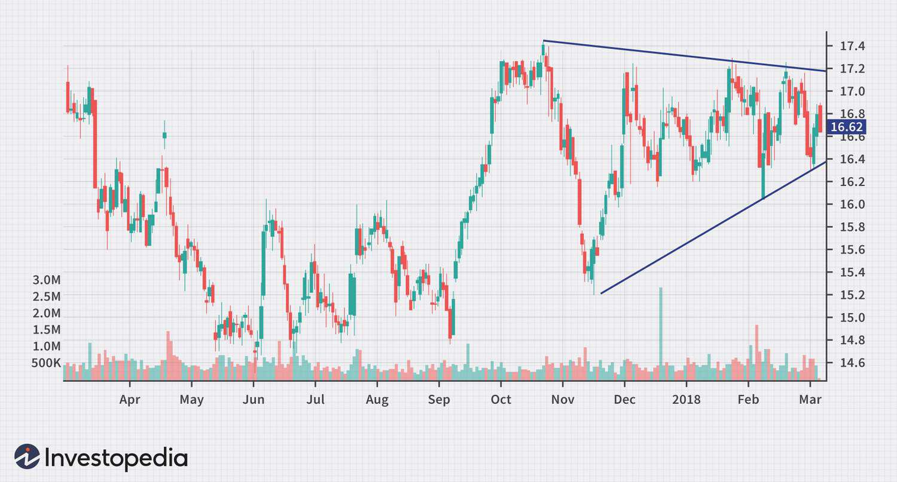

Understanding trading patterns is essential for both novice and experienced traders, as these patterns provide critical insights into potential market movements. Among the myriad of patterns used in technical analysis, the symmetrical triangle stands out due to its reliability and prevalence in various market conditions. This pattern is typically characterized by two converging trendlines that connect a series of lower highs and higher lows, indicating a period of consolidation. The symmetrical triangle signifies uncertainty in the market, often preceding a significant breakout in price direction. As such, it is a valuable tool for predicting potential future market trends.

Algorithmic trading, commonly referred to as algo trading, leverages these patterns to automate trading processes. By integrating technical patterns like the symmetrical triangle into algorithmic systems, trades can be executed automatically once certain conditions are met, reducing the need for human intervention. This automation not only increases the speed and efficiency of trading but also eliminates emotional biases, thus improving the likelihood of making data-driven decisions.



This article aims to explore the intersection of technical analysis and algorithmic trading, with a particular focus on the symmetrical triangle pattern. By examining how this pattern can be efficiently utilized within algorithmic trading strategies, we provide insights that can aid traders in honing their approaches and gaining a competitive edge in the market. Through a detailed analysis, we address how traders can incorporate the symmetrical triangle into their algo systems, the benefits of such incorporation, as well as the challenges they may face. By doing so, this exploration offers both a theoretical and practical framework for traders looking to capitalize on the predictive power of the symmetrical triangle in their trading endeavors.

## Table of Contents

## What is a Symmetrical Triangle?

A symmetrical triangle is a continuation chart pattern that emerges when two converging trendlines connect a sequence of lower highs and higher lows. This pattern is formed as the price of an asset fluctuates over time within a narrowing range, illustrating a period of consolidation and market indecision. The converging trendlines, which have roughly equal slopes, create a triangle shape on the price chart. As the asset trades within this pattern, the bulls and bears are at a relative equilibrium, leading to diminishing volatility.

The symmetrical triangle pattern is important for traders as it signals potential breakouts. These patterns typically precede a breakout in either a bullish or bearish direction. The breakout direction is generally determined by the prevailing trend before the formation of the triangle. In a bullish market, the breakout is more likely to occur to the upside, while in a bearish market, a downside breakout may be expected. 

Understanding the formation of symmetrical triangles aids traders in preparing for potential market movements. As the price approaches the apex of the triangle, traders often anticipate a breakout and position themselves accordingly to capture potential gains. Identifying this pattern allows traders to set strategic entry and exit points, capitalizing on the impending increase in price movement following the consolidation phase.

## Technical Analysis of Symmetrical Triangles

Technical analysis involves examining historical market data, such as price and [volume](/wiki/volume-trading-strategy), to predict future price movements. Symmetrical triangles are a type of continuation chart pattern that traders utilize to forecast potential [breakout](/wiki/breakout-trading) points. The symmetrical triangle is formed by two converging trendlines that connect a series of successively lower highs and higher lows. This pattern indicates a period of consolidation where market forces are relatively balanced, preceding a breakout. 

A key element in analyzing symmetrical triangles is the role of volume. Typically, volume diminishes as the pattern progresses and reaches its vertex, due to reduced trading activities during the consolidation phase. A significant surge in volume often accompanies the breakout, confirming the pattern's validity and suggesting the strength and direction of the subsequent price movement. Traders consider this volume confirmation crucial in distinguishing true breakouts from potential false signals.

Identifying precise entry and [exit](/wiki/exit-strategy) points within a symmetrical triangle pattern is essential for maximizing trade profitability. Traders generally enter a position either just before or immediately following the breakout, depending on their risk tolerance and strategy. Entry points are often determined just above or below the corresponding trendline. An exit strategy may involve setting a profit target based on the pattern's height at its widest point, projected in the breakout's direction.

In addition to volume analysis, symmetrical triangles are often augmented with technical indicators to refine signal accuracy. Moving averages, such as the 50-day and 200-day moving averages, help identify broader market trends and confirm the pattern's breakout direction. The Relative Strength Index (RSI), an oscillator that measures the magnitude of recent price changes, aids in identifying potential overbought or oversold conditions. These indicators provide additional confirmation and help traders decide the optimal timing for entering and exiting trades.

In summary, symmetrical triangles serve as a valuable tool in technical analysis, helping traders anticipate market breakouts. By effectively incorporating volume analysis and additional indicators, traders can develop strategies that maximize the potential of this pattern and optimize their trading decisions.

## Implementing Symmetrical Triangle in Algo Trading

Algorithmic trading, often referred to as algo trading, utilizes software to automate trading strategies, significantly minimizing human intervention. Implementing symmetrical triangles within an [algorithmic trading](/wiki/algorithmic-trading) framework requires careful consideration of coding precision, [backtesting](/wiki/backtesting), and risk management. 

Integrating symmetrical triangles into an algorithm begins with the precise coding of the pattern's rules. This involves identifying the two converging trendlines that form the symmetrical triangle by connecting a series of lower highs and higher lows. In Python, libraries such as NumPy for numerical analysis and Pandas for handling time-series can be advantageous in computing these patterns. 

```python
import numpy as np
import pandas as pd

# Example function to identify potential symmetrical triangle
def find_symmetrical_triangle(prices):
    # Calculate moving average (simplified for demonstration purposes)
    high_low_range = prices['high'] - prices['low']
    threshold = np.mean(high_low_range) * 0.02  # Define a threshold for breakout
    recent_trend = prices['close'].rolling(window=20).mean()
    trendline_one = np.max(prices['high'][-20:]) - threshold
    trendline_two = np.min(prices['low'][-20:]) + threshold

    # Check convergence
    converged = (trendline_one - trendline_two) < threshold
    return converged
```

Once the pattern is successfully identified, the algorithm must be designed to execute trades automatically upon confirmation of a breakout. This process typically relies on the acceleration or spike in market volume to confirm the breakout, a common feature of symmetrical triangles. Backtesting these strategies using historical data is crucial, as it allows the trader to refine parameters and evaluate the algorithm's performance in various market conditions.

Risk management is another critical component that should be incorporated within the algorithm. Techniques such as stop-loss orders or position sizing can help in mitigating potential losses. For instance, setting a stop loss just below the lower trendline for a long position can be effective. 

Advanced pattern recognition capabilities may also be embedded within the algorithm to enhance accuracy. Machine learning models, such as support vector machines or neural networks, can improve pattern detection by learning from historical price movements. This approach can enhance the algorithm's robustness in predicting breakouts with greater precision.

In conclusion, the implementation of symmetrical triangles in algorithmic trading demands a combination of precise technical coding, rigorous backtesting, and sound risk management strategies. By integrating advanced pattern recognition capabilities, traders can further enhance the accuracy and efficiency of their trading algorithms.

## Benefits of Using Algo Trading with Symmetrical Triangles

Algorithmic trading (algo trading) has revolutionized the way financial markets operate, particularly by incorporating technical patterns like symmetrical triangles. These patterns help in making informed trading decisions and enhance the overall efficiency of trading operations.

Algo trading executes trades with unprecedented speed and efficiency compared to manual trading methods. By leveraging predefined algorithms, trades can be executed in microseconds, often faster than a human trader can react. This rapid execution minimizes slippage, which is the difference between the expected price of a trade and the actual price.

Another significant benefit of algo trading is the elimination of emotional biases. Human traders are often influenced by fear, greed, and other emotions, leading to irrational decisions. Algo trading mitigates this by adhering strictly to mathematical and statistical models, ensuring decisions are consistent and based on data-driven insights derived from patterns such as symmetrical triangles.

Automated execution of trades helps in capitalizing on market opportunities swiftly. Financial markets are highly volatile and fluctuate rapidly, meaning there can be missed opportunities in a manual trading setup. Algo trading monitors the market continuously and executes trades the moment a breakout from a symmetrical triangle is confirmed, thus reducing the risk of missed opportunities.

Backtesting is a critical component of algo trading, allowing traders to test trading strategies on historical data before actual deployment. By simulating the performance of a strategy over historical market data, traders can refine their approach and anticipate how a particular strategy incorporating symmetrical triangles might perform in different market conditions. This process helps identify and rectify potential issues, improving the robustness of the trading strategy.

Furthermore, algo trading systems are designed to process vast amounts of data efficiently, spotting patterns more quickly and accurately than humans can. Advanced data processing and pattern recognition capabilities allow algorithms to identify symmetrical triangles and other important chart patterns in real-time. This capability gives traders an edge by enabling faster reactions to market movements.

In conclusion, integrating symmetrical triangles in algo trading strategies offers several advantages: speed, consistency, reduced emotional influence, opportunities for fine-tuning strategies through backtesting, and efficient pattern recognition. These benefits collectively enhance the precision and effectiveness of trading strategies, contributing to better trading outcomes in the fast-paced world of financial markets.

## Challenges and Limitations

Market conditions can shift unexpectedly, which can impact the reliability of the symmetrical triangle pattern in algorithmic trading. Financial markets are influenced by a plethora of factors, including economic indicators, geopolitical events, and investor sentiment, all of which can lead to unexpected fluctuations beyond the predictive power of chart patterns like the symmetrical triangle. Traders relying on these patterns should remain aware of such inherent unpredictabilities which may lead to false signals.

Developing algorithms capable of effective pattern recognition necessitates a high degree of technical expertise. Algorithm design requires a deep understanding of both programming and market dynamics to ensure accurate pattern detection and interpretation. This complexity is heightened by the need for algorithms to adapt to both bullish and bearish market conditions, capturing the symmetrical triangle’s nuances.

One substantial risk in designing algorithms is over-optimization, which occurs when an algorithm is too finely tuned to historical data, resulting in a model that performs well in backtesting but poorly in real-time trading scenarios. This condition, often referred to as "curve fitting," can mislead traders about the strategy's effectiveness due to its lack of ability to generalize across varied market conditions. Ensuring that algorithms are robust involves balancing complexity and simplicity to avoid overfitting the model.

The quality of data used in algorithmic trading is critical, especially in high-frequency trading settings where milliseconds count. Poor data quality can lead to incorrect interpretations of market trends and potential misfires in trading. Furthermore, managing latency, the delay between the occurrence of an event and the execution of a trade based on that event, is crucial. High latency can erode the advantages of algorithmic trading, as trades may be executed based on outdated information.

Lastly, adherence to regulatory standards remains essential in algorithmic trading. Regulations vary by region and market and may include constraints on the types of strategies employed, reporting requirements, and the need for circuit breakers to prevent runaway trades. Staying compliant with financial regulations not only helps avoid legal issues but also maintains the integrity of the trading process. Keeping up-to-date with evolving regulations is an ongoing challenge that traders and developers must address.

## Conclusion

The symmetrical triangle is an effective and versatile tool in technical analysis, providing traders with critical insights into potential market directions. By capturing periods of consolidation preceding possible breakouts, this pattern enables traders to make informed predictions about future price movements.

Incorporating symmetrical triangles into algorithmic trading strategies can significantly enhance trading efficiency. Algo trading systems rely on data and pattern recognition to execute trades automatically, which removes emotional biases that often affect manual trading decisions. The systematic nature of algo trading allows for more precise entry and exit points, reducing the likelihood of human error.

Nonetheless, traders and developers must remain vigilant about the various technical and regulatory challenges inherent in algorithmic trading. The development of effective algorithms requires substantial technical expertise and robust backtesting to avoid over-optimization—where algorithms perform excellently in testing environments but poorly in live conditions. Furthermore, adherence to regulatory requirements is crucial to ensure that trading practices remain compliant with financial market standards.

Continuous learning and strategy refinement are essential as the trading landscape is highly dynamic. Traders must stay informed about advances in technology and continuously evaluate the effectiveness of their strategies. This ongoing process helps in adapting to market changes and refining algorithms for improved performance.

Leveraging technology and robust analysis through the integration of symmetrical triangle patterns not only facilitates a more disciplined approach to trading but also provides a competitive edge in the market. By utilizing these tools and maintaining a commitment to technical and regulatory diligence, traders can maximize their potential for success in an ever-evolving trading environment.

## References & Further Reading

[1]: Bergstra, J., Bardenet, R., Bengio, Y., & Kégl, B. (2011). ["Algorithms for Hyper-Parameter Optimization."](https://papers.nips.cc/paper/4443-algorithms-for-hyper-parameter-optimization) Advances in Neural Information Processing Systems 24.

[2]: ["Advances in Financial Machine Learning"](https://www.amazon.com/Advances-Financial-Machine-Learning-Marcos/dp/1119482089) by Marcos Lopez de Prado

[3]: ["Evidence-Based Technical Analysis: Applying the Scientific Method and Statistical Inference to Trading Signals"](https://www.amazon.com/Evidence-Based-Technical-Analysis-Scientific-Statistical/dp/0470008741) by David Aronson

[4]: ["Machine Learning for Algorithmic Trading"](https://github.com/stefan-jansen/machine-learning-for-trading) by Stefan Jansen

[5]: ["Quantitative Trading: How to Build Your Own Algorithmic Trading Business"](https://www.amazon.com/Quantitative-Trading-Build-Algorithmic-Business/dp/1119800064) by Ernest P. Chan