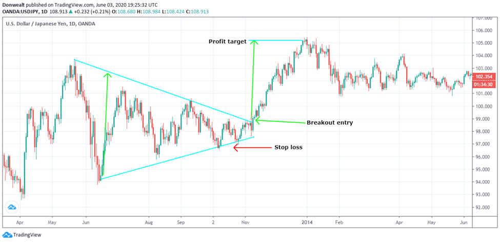

The symmetrical triangle pattern is a fundamental tool in technical analysis, often employed by algorithmic traders to enhance trading strategies. This chart pattern plays a critical role in identifying potential continuation patterns across various financial markets, providing insights that help traders predict future price movements. It is formed when the price of an asset is bounded by two converging trend lines: one connecting a series of descending highs and the other a series of ascending lows. This convergence indicates a market equilibrium, where the forces of supply and demand are temporarily balanced.

Recognizing symmetrical triangle patterns is vital for algorithmic traders who seek automated methods to capitalize on market conditions. These patterns signal periods of price consolidation that often precede significant breakouts. By identifying these patterns, traders can anticipate and react to potential market movements, thereby optimizing their entry and exit strategies. 



Understanding chart patterns like symmetrical triangles is essential for enhancing algorithmic trading strategies, as they provide a systematic approach to analyzing market behavior. By incorporating pattern recognition into algorithms, traders can automate decision-making processes and potentially increase profitability. As financial markets grow more complex, the ability to integrate technical analysis tools, such as symmetrical triangles, into algorithmic systems becomes increasingly valuable. This integration not only aids in identifying optimal trading opportunities but also helps in managing risks and executing trades with precision and speed.

## Table of Contents

## What is a Symmetrical Triangle Pattern?

A symmetrical triangle pattern is a chart formation commonly used in technical analysis characterized by two converging trend lines that connect a series of sequentially lower peaks and higher troughs. This pattern is notable for its structure, where the upper trend line descends while the lower trend line ascends, forming a shape that mirrors a triangle. The symmetrical triangle pattern typically emerges during periods of market consolidation, reflecting a temporary equilibrium between buyers and sellers as the market appears undecided about its next direction.

Structurally, the symmetrical triangle is formed through the convergence of the resistance line, downward sloping from successive lower highs, and the support line, upward sloping from consecutive higher lows. This continuous narrowing of price movement suggests diminishing volatility as the apex of the triangle approaches. The pattern lacks any inherent directional bias and thus is considered a neutral consolidation pattern. 

The defining characteristic of the symmetrical triangle is its potential to precede significant market movements, despite its appearance as a neutral formation. The eventual breakout, when prices move decisively outside the boundary of one of the trend lines, often signals strong momentum, marking the end of the consolidation phase. The direction of this breakout can be upward or downward; therefore, the symmetrical triangle does not predict the direction but indicates that a substantial move is likely imminent.

The equilibrium illustrated by the symmetrical triangle pattern represents a balanced state wherein the forces of supply (represented by sellers) and demand (represented by buyers) are equal, causing prices to fluctuate within the narrowing confines of the triangle. As the pattern progresses, the tug-of-war between buyers and sellers becomes more intense until a [breakout](/wiki/breakout-trading) occurs, driven by an influx of buying or selling pressure that tips the balance in one direction. Understanding this dynamic is crucial for traders seeking to anticipate market movements and adapt their strategies accordingly, particularly within [algorithmic trading](/wiki/algorithmic-trading) frameworks, where such insights can enhance the precision and timing of trade executions.

## Formation and Identification of Symmetrical Triangle Patterns

Symmetrical triangle patterns emerge in financial markets as a result of a balance between supply and demand forces, reflected in the converging trend lines formed by a series of descending highs and ascending lows. This convergence indicates a market that is consolidating and preparing for a significant move, although the direction remains initially undefined. The formation of this pattern requires at least two highs and two lows to be connected by trend lines that eventually converge towards a point known as the apex.

To identify symmetrical triangle patterns on various timeframes, traders can utilize several technical analysis tools and techniques. A typical approach involves plotting trend lines on price charts, identifying key pivot points that represent significant highs and lows. These points are then connected to form the symmetrical triangle. The timeframe selected for analysis—be it daily, weekly, or intraday—will influence the pattern's clarity and the subsequent trading strategy.

Technical indicators such as moving averages, the Relative Strength Index (RSI), and the Moving Average Convergence Divergence (MACD) can assist in recognizing and confirming these patterns. For instance, a narrowing range in MACD can corroborate the consolidation suggested by a symmetrical triangle, while RSI may help determine overbought or oversold conditions prior to a breakout.

Typical market conditions leading to the formation of symmetrical triangle patterns include periods of [volatility](/wiki/volatility-trading-strategies) contraction following a significant price movement. This often occurs post-earnings announcements, geopolitical events, or significant market news, where initial strong reactions are tempered by a phase of equilibrium as traders await further information or confirmation of the prevailing trend. 

By understanding these formations and employing technical tools, traders and algorithmic systems can better predict potential price movements, setting the stage for strategic entry and [exit](/wiki/exit-strategy) points. These patterns are not only indicative of market indecision but also serve as precursors to potentially profitable trading opportunities when a breakout eventually occurs.

## Using Symmetrical Triangle Patterns in Algo Trading

Algorithmic traders use symmetrical triangle patterns to automate trading decisions due to their predictive potential and clear structure. These patterns, formed by converging trend lines, serve as a cornerstone in the design of algorithms aiming to capitalize on breakout movements. By integrating symmetrical triangle patterns into trading algorithms, traders can optimize entry and exit points, enhancing the strategy's precision and effectiveness.

To automate trade decisions, algorithms first identify the formation of a symmetrical triangle by analyzing historical price data. Code can be developed to recognize descending peaks and ascending troughs, aligning them to form the symmetrical triangle structure. This identification process typically involves examining data across multiple timeframes, enhancing the robustness of the pattern's recognition.

The integration of symmetrical triangles into algorithms focuses on optimizing entry and exit points by predicting potential breakout directions. This often includes pre-programmed rules based on the triangle's characteristics. For instance, traders might employ a strategy where an algorithm triggers a buy order when the price breaks above the upper trend line or initiates a sell order if the price falls below the lower trend line.

One significant advantage of using algorithms is their ability to quickly identify and act on breakout signals. Automated systems can continuously monitor multiple markets and timeframes, providing an efficiency that manual trading lacks. This rapid recognition and execution minimize the risk of human error and the potential delay in trade execution.

Moreover, algorithms can incorporate filters to validate breakouts, helping to reduce the occurrence of false signals. These filters might include criteria such as [volume](/wiki/volume-trading-strategy) surges upon breakout or confirmation from complementary technical indicators. By automating these processes, algorithms enhance the reliability of symmetrical triangle breakouts, improving the overall success rate of trades.

The use of algorithms allows traders to systematically test and refine their strategies through [backtesting](/wiki/backtesting), using historical data to simulate performance. This process ensures that only the patterns with the highest predictive value are included in the live trading strategy, leading to more stable and profitable outcomes.

In conclusion, the leverage of symmetrical triangle patterns in algorithmic trading presents a strategic advantage by efficiently automating the detection and execution of trade opportunities. The capacity of algorithms to quickly and accurately process market data significantly amplifies a trader's ability to exploit symmetrical triangle breakouts effectively.

## Determining Breakouts and Their Directions

When analyzing symmetrical triangle patterns, predicting the direction of a breakout is crucial for implementing successful trading strategies. A symmetrical triangle signifies a period of consolidation, where neither buyers nor sellers have the upper hand, and the price could break out in either direction. Analyzing preceding trends can provide vital clues about the direction of the breakout. If the pattern appears after an uptrend, an upward breakout is more probable, and conversely, a downward trend preceding the pattern might lead to a downside breakout.

### Tools and Indicators for Breakout Predictions

#### Volume Analysis

Volume analysis is a critical tool for gauging breakout confirmations. Generally, a breakout accompanied by a surge in volume suggests a more robust trend-following move. Algorithmic strategies can incorporate volume analysis by monitoring changes in volume as the price approaches the triangle’s boundaries. A significant increase in volume as the price breaks the triangle lines often validates the breakout direction.

#### Moving Averages and Bollinger Bands

Moving averages, such as the 50-day or 200-day moving averages, can provide additional confirmation. If the breakout aligns with the moving average direction, it enhances the confidence of a sustained move. Bollinger Bands can also help by indicating volatility changes; when combined with symmetrical triangles, they reinforce the prediction when the price breaks the triangle boundary and also exits the Bollinger Band.

```python
import pandas as pd
import numpy as np

def calculate_moving_average(df, window):
    return df['Close'].rolling(window=window).mean()

def check_volume_spike(df, threshold):
    volume_avg = df['Volume'].rolling(window=20).mean()
    return df['Volume'] > volume_avg * threshold

# Example usage with a pandas DataFrame `df`
df['50_MA'] = calculate_moving_average(df, 50)
volume_spike = check_volume_spike(df, 1.5)
```

### Filtering False Breakouts

Detecting false breakouts is essential for refining prediction accuracy. False breakouts can lead to losses if not identified promptly. One strategy is to require double confirmation, where the price must close beyond the triangle boundary on multiple timeframes before the breakout is confirmed. Additionally, employing the Relative Strength Index (RSI) can check for overbought or oversold conditions that might suggest a false breakout. An RSI reading that is not aligned with the breakout direction can prevent premature trades.

False breakouts can also be filtered by waiting for a retest of the triangle boundary after the initial breakout. If the price returns to the breakout level and holds above (for an upwards breakout) or below (for a downwards breakout), it often confirms the authenticity of the breakout.

By employing these analytical tools and strategies, algorithmic trading systems can enhance their ability to predict and capitalize on genuine breakout movements from symmetrical triangle patterns, thereby improving trading outcomes and reducing false signal risks.

## Risk Management with Symmetrical Triangle Strategies

Effective risk management is crucial when employing symmetrical triangle strategies in trading. One primary aspect of risk management involves the strategic use of stop-loss and take-profit orders. Setting stop-loss orders helps protect capital by automatically closing a position once it reaches a predetermined loss level. This prevents further losses in case the market moves unfavorably. Conversely, take-profit orders secure gains by closing a position once it hits a desired profit target. Both mechanisms ensure that traders maintain disciplined exits, minimizing emotional decision-making.

Position sizing is another key component of risk management. It involves determining the amount of capital to allocate to a particular trade, crucial for managing overall trading risk. An effective position sizing strategy considers the trader's risk tolerance, the volatility of the asset, and the specific characteristics of the symmetrical triangle pattern being traded. A common approach is the fixed fractional method, where a fixed percentage of capital is risked per trade. For instance, risking 2% of total capital per trade ensures that no single loss significantly impacts the overall portfolio.

Capital allocation refers to distributing investment between various assets or trades. It aims to diversify risk, reducing the potential impact of any single adverse move in the market. For symmetrical triangle strategies, diversifying trades across different assets or timeframes can mitigate the risk associated with false breakouts.

Incorporating these risk management techniques in symmetrical triangle strategies involves a balance between safeguarding capital and maximizing potential returns. Traders can use software tools or algorithms to automate the setting of stop-loss and take-profit orders, ensuring consistency and precision. Here's a simplified example of how an algorithm might execute these orders in Python:

```python
# Example: Setting Stop-Loss and Take-Profit Orders
def calculate_orders(entry_price, risk, reward_ratio):
    stop_loss = entry_price - (entry_price * risk)
    take_profit = entry_price + (entry_price * risk * reward_ratio)
    return stop_loss, take_profit

entry_price = 100  # example entry price
risk = 0.02  # 2% risk
reward_ratio = 3  # 3:1 reward-to-risk ratio

stop_loss, take_profit = calculate_orders(entry_price, risk, reward_ratio)
print(f"Stop-Loss: {stop_loss}, Take-Profit: {take_profit}")
```

This example calculates the stop-loss and take-profit prices based on the predefined risk percentage and reward-to-risk ratio, thus helping in effective management of trades in the context of symmetrical triangle strategies.

## Incorporating Technical Indicators for Enhanced Accuracy

Incorporating technical indicators such as the Moving Average Convergence Divergence (MACD) and the Relative Strength Index (RSI) can significantly enhance the accuracy of trading strategies that utilize symmetrical triangle patterns. These indicators serve as complementary tools that refine algorithmic strategies and aid in confirming breakout signals, which are crucial in predicting potential market movements.

### Use of MACD with Symmetrical Triangles

The MACD is a trend-following [momentum](/wiki/momentum) indicator that showcases the relationship between two moving averages of a security's price. It consists of three components: the MACD line, the signal line, and the histogram. The MACD line is derived from the difference between the 12-day and 26-day exponential moving averages, while the signal line is the 9-day exponential moving average of the MACD line.

When applied to symmetrical triangle patterns, the MACD can provide insights into potential trend reversals or continuations. Traders often look for an intersection between the MACD line and the signal line as a confirmation of a breakout direction. For example:

- **MACD Line Crosses Above Signal Line:** This may indicate a potential bullish breakout from a symmetrical triangle.
- **MACD Line Crosses Below Signal Line:** Conversely, this might suggest a bearish breakout.

Python code to calculate MACD can be structured as follows:

```python
import pandas as pd

def calculate_macd(data, short_window=12, long_window=26, signal_window=9):
    short_ema = data['Close'].ewm(span=short_window, adjust=False).mean()
    long_ema = data['Close'].ewm(span=long_window, adjust=False).mean()
    macd = short_ema - long_ema
    signal = macd.ewm(span=signal_window, adjust=False).mean()
    return macd, signal

# Example usage with a DataFrame containing close prices
macd, signal = calculate_macd(df)
```

### Use of RSI with Symmetrical Triangles

The RSI is another momentum oscillator that measures the velocity and change of price movements. It oscillates between 0 and 100 and is typically used to identify overbought or oversold conditions of an asset. With symmetrical triangles, the RSI can help confirm the strength of a potential breakout:

- **RSI Above 70:** This often indicates overbought conditions, suggesting a possible bearish reversal or weak bullish breakout.
- **RSI Below 30:** This typically signals oversold conditions, pointing to a potential bullish reversal or weak bearish breakout.

Integrating the RSI with symmetrical triangle patterns helps filter out false breakouts by providing additional market context.

### Successful Integration Examples

A successful integration of MACD and RSI with symmetrical triangle patterns can significantly reduce the risk of false signals and improve the predictive power of trading algorithms. For instance, if a symmetrical triangle suggests a breakout and both MACD and RSI confirm the same direction:

- **Example 1:** A descending symmetrical triangle combined with an MACD bullish crossover and RSI rising from oversold levels strengthens the probability of an upward breakout.

- **Example 2:** An ascending symmetrical triangle accompanied by a MACD bearish crossover and RSI declining from overbought levels suggests an increased likelihood of a downward breakout.

Incorporating these technical indicators into algorithmic trading systems can lead to more informed decision-making processes, allowing traders to exploit market opportunities with higher confidence. The use of complementary indicators not only increases the robustness of trading strategies but also enhances their adaptability to varying market conditions.

## Backtesting Symmetrical Triangle Trading Strategies

Backtesting plays a critical role in validating symmetrical triangle trading strategies, as it provides traders with insights into the potential effectiveness and risks associated with these patterns. By using historical data, traders can simulate their strategies to see how they would have performed in the past, allowing for data-driven decisions and improvements.

Symmetrical triangle patterns are identified by their converging trend lines that connect a series of lower highs and higher lows. This pattern is often viewed as a continuation pattern, meaning the price is likely to break out in the direction of the prevailing trend. Backtesting such patterns involves simulating trades based on historical appearance of these triangles, providing an idea of success rates and profitability.

Recent studies have shown varied success rates for backtested symmetrical triangle strategies, largely dependent on market conditions and the quality of data used. For example, a study analyzing the U.S. stock market over a decade found that symmetrical triangle breakouts had about a 60-70% success rate when the preceding trend was aligned with the direction of the breakout. The study emphasized the importance of confirming triangle breakouts with other technical indicators, such as volume or moving averages, to increase success rates.

A typical approach to backtesting involves using software or programming languages like Python to automate the process. The backtest generally follows these steps:

1. **Data Collection**: Gather historical price data for the asset of interest.
2. **Pattern Recognition**: Use algorithms to identify instances of symmetrical triangles in the data. Libraries such as `TA-Lib` or custom scripts can be useful in identifying these patterns.
3. **Simulating Trades**: Execute simulated trades based on the identified patterns. This can involve setting entry and exit points typically at the breakouts and applying stop-loss and take-profit strategies.
4. **Performance Analysis**: Evaluate the performance of the strategy, focusing on metrics such as win-loss ratio, maximum drawdown, and return on investment (ROI).

For traders interested in implementing a basic backtest, Python provides accessible tools to do so. Here’s a simplified example:

```python
import pandas as pd
import talib as ta

# Load historical price data
price_data = pd.read_csv('historical_prices.csv')

# Calculate moving averages - a common complement to triangle strategies
price_data['SMA_50'] = ta.SMA(price_data['Close'], timeperiod=50)
price_data['SMA_200'] = ta.SMA(price_data['Close'], timeperiod=200)

# Identify symmetrical triangle patterns
# (This step would involve custom logic or machine learning to identify specific patterns)
# ...

# Mock logic: assume pattern identified and simulate trades
price_data['Signal'] = 0  # 1 for buy, -1 for sell

# Performance analysis logic
def backtest(data):
    initial_balance = 100000  # Initial capital
    positions = 0  # Number of shares
    balance = initial_balance

    for index, row in data.iterrows():
        if row['Signal'] == 1:  # Buy signal
            # Buy logic
            buy_price = row['Close']
            shares_to_buy = 100  # Example position size
            cost = shares_to_buy * buy_price
            if balance >= cost:
                balance -= cost
                positions += shares_to_buy

        elif row['Signal'] == -1 and positions > 0:  # Sell signal
            # Sell logic
            sell_price = row['Close']
            revenue = positions * sell_price
            balance += revenue
            positions = 0

    return_balance = balance + (positions * data.iloc[-1]['Close'])
    return return_balance - initial_balance

# Calculate returns
profit = backtest(price_data)
print(f'Total profit from backtest: ${profit}')

```

Backtest data provides crucial feedback for refining algorithmic trading models. Analyzing the results allows traders to identify weaknesses in their strategies, such as frequent false breakouts or unfavorable market conditions, and adjust parameters accordingly. Incorporating additional criteria, such as complementary indicators or adaptive position sizing, can improve the robustness and profitability of trading algorithms using symmetrical triangles. Overall, backtesting remains a vital tool for traders seeking to optimize their strategies before live trading, ensuring a more systematic approach to the dynamic and often unpredictable markets.

## Conclusion

Symmetrical triangle patterns are pivotal tools in the arsenal of algorithmic traders, renowned for their ability to pinpoint opportunities for potential market moves. These patterns typically emerge during periods of consolidation and are characterized by converging trend lines that represent a battle of wills between buyers and sellers striving for equilibrium. Once this equilibrium is disrupted, the ensuing breakout can result in significant price movements, making these patterns a valuable component for developing profitable trading strategies.

Algorithmic traders can harness the predictive prowess of symmetrical triangles to optimize both entry and exit points in their trading algorithms. By integrating such patterns, algorithms can be fine-tuned to respond to real-time market conditions, capturing breakout opportunities with heightened precision. Furthermore, the capability of algorithms to continuously monitor market dynamics facilitates the rapid adaptation of strategies, ensuring they remain effective in the face of ever-evolving trading landscapes.

However, the true potential of symmetrical triangle patterns is unlocked through the commitment to continuous learning and strategy refinement. As market dynamics shift, so too must the methodologies and tools used to interpret them. Traders who remain open to adaptation and continuously update their trading models in response to new data and emerging trends stand to benefit the most from these technical patterns.

In conclusion, while symmetrical triangle patterns offer promising prospects for profitable trading, their efficacy is ultimately governed by the trader's dedication to ongoing education and adaptability. Embracing this approach not only enhances algorithmic trading performance but also equips traders to adeptly navigate the complexities of financial markets.

## FAQs

### FAQs

**1. What is the symmetrical triangle pattern, and how does it differ from other triangle patterns?**

The symmetrical triangle pattern is a type of chart pattern used in technical analysis, characterized by two converging trend lines that represent a series of lower highs and higher lows. This pattern is typically regarded as a continuation pattern, indicating a period of consolidation before the price moves in the direction of the prior trend. Unlike ascending or descending triangles, which have one flat side and one sloping side, symmetrical triangles have two sloping sides, suggesting that neither buyers nor sellers have a definitive upper hand.

**2. Are symmetrical triangle patterns always reliable indicators of market direction?**

Not always. While symmetrical triangles can precede significant market moves, they do not inherently indicate the direction of the breakout. The previous trend often suggests likely continuation, but traders must remain cautious and consider additional factors and indicators to confirm a breakout direction. False breakouts are possible, which makes it essential to combine symmetrical triangle analysis with other technical tools for better reliability.

**3. How can algorithmic traders benefit from using symmetrical triangle patterns?**

Algorithmic traders can leverage symmetrical triangle patterns to automate their trading strategies by programming algorithms to detect these formations and make trading decisions based on predefined criteria. By doing so, they can systematically execute trades, optimize entry and exit points, and potentially capitalize on market opportunities presented by breakouts. The ability to process vast amounts of data quickly also allows algorithms to identify patterns with greater accuracy than manual analysis.

**4. What are some common misconceptions about trading with symmetrical triangle patterns?**

A common misconception is that symmetrical triangle patterns alone can precisely predict future price movements. In reality, while they are useful for understanding market consolidation, supplementary analysis is required to predict breakout directions accurately. Traders should avoid relying solely on these patterns and instead use them in conjunction with other technical indicators, such as volume or momentum indicators like MACD (Moving Average Convergence Divergence) or RSI (Relative Strength Index).

**5. Can you provide practical tips for effectively using symmetrical triangle patterns in trading?**

- **Combine Indicators:** Use symmetrical triangle patterns alongside other technical indicators. For instance, a rising volume on breakout can confirm the pattern's validity.

- **Define Clear Criteria:** Establish specific rules for entering and exiting trades, such as setting stop-loss and take-profit levels based on volatility and average true range (ATR).

- **Backtest Strategies:** Before deploying in live markets, backtest symmetrical triangle strategies using historical data to refine algorithms and improve performance.

- **Managed Risk:** Implement robust risk management protocols that include position sizing, capital allocation, and contingency planning for false breakouts.

- **Stay Updated:** Regularly update algorithms to reflect changing market conditions and incorporate new data insights to maintain effectiveness. 

By integrating symmetrical triangle patterns within a comprehensive trading strategy, traders can potentially enhance their profitability while managing risks strategically.

## References & Further Reading

[1]: Kirkpatrick, C. D., & Dahlquist, J. R. (2010). ["Technical Analysis: The Complete Resource for Financial Market Technicians"](https://books.google.com/books/about/Technical_Analysis.html?id=62-9CgAAQBAJ). FT Press.

[2]: Bulkowski, T. (2005). ["Encyclopedia of Chart Patterns"](https://books.google.com/books/about/Encyclopedia_of_Chart_Patterns.html?id=tIwlEAAAQBAJ). Wiley Trading.

[3]: Murphy, J. J. (1999). ["Technical Analysis of the Financial Markets: A Comprehensive Guide to Trading Methods and Applications"](https://www.amazon.com/Technical-Analysis-Financial-Markets-Comprehensive/dp/0735200661). New York Institute of Finance.

[4]: Pring, M. J. (2002). ["Technical Analysis Explained: The Successful Investor's Guide to Spotting Investment Trends and Turning Points"](https://www.amazon.com/Technical-Analysis-Explained-Fifth-Successful/dp/0071825177). McGraw-Hill Education.

[5]: Chan, E. P. (2008). ["Quantitative Trading: How to Build Your Own Algorithmic Trading Business"](https://github.com/ftvision/quant_trading_echan_book). Wiley Finance.

[6]: Williams, L. L. (2009). ["Long-Term Secrets to Short-Term Trading"](https://onlinelibrary.wiley.com/doi/book/10.1002/9781119200789). Wiley.