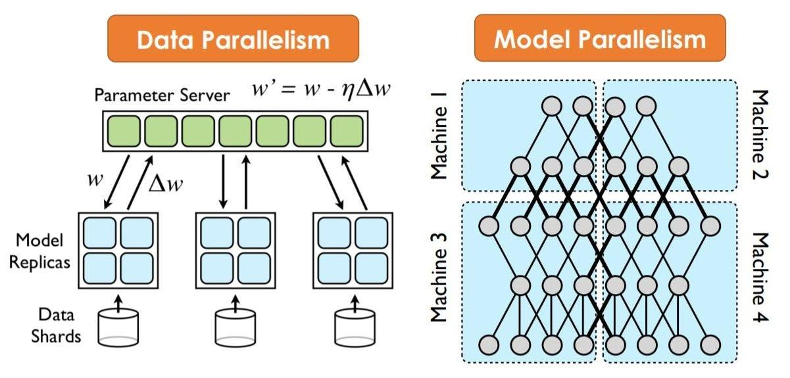

## Table of Contents

## What is Synchronous Pipeline Parallel in the context of machine learning?

Synchronous Pipeline Parallel is a technique used in machine learning to speed up the training of large models. Imagine you have a big model that is too large to fit on a single computer or to train quickly. With synchronous pipeline parallel, you can split the model into smaller parts, called stages, and use multiple computers or devices to work on these stages at the same time. Each stage processes a part of the data and passes it to the next stage. The key here is that all stages work in a coordinated way, waiting for each other to finish their part before moving to the next piece of data. This ensures that the training remains consistent and accurate.

In practice, this method can be visualized as a pipeline where data flows through the stages like water through pipes. For example, if you have a model with four stages, the first stage might process the initial part of the data, then pass it to the second stage, and so on until the fourth stage finishes its job. The stages must synchronize at certain points, which means they have to wait for each other before starting on the next batch of data. This synchronization can introduce some delay, but it helps maintain the integrity of the training process. Overall, synchronous pipeline parallel allows for faster training of large models by using the power of multiple devices in a coordinated manner.

## How does Synchronous Pipeline Parallel differ from other parallel processing techniques?

Synchronous Pipeline Parallel differs from other parallel processing techniques mainly in how it organizes and coordinates the work across multiple devices. In Synchronous Pipeline Parallel, the model is divided into stages, and each stage processes a part of the data before passing it to the next stage. All stages must wait for each other to finish processing their part of the current data batch before moving to the next one. This synchronization ensures that the training remains consistent and accurate, but it can introduce some delay. In contrast, other techniques like Data Parallelism involve replicating the entire model across multiple devices, where each device processes different parts of the data independently and then averages the results. This method does not require synchronization between devices for each data batch, which can lead to faster processing but may also introduce challenges in maintaining consistency.

Another technique, Asynchronous Pipeline Parallel, also splits the model into stages but allows each stage to work on different data batches without waiting for the others. This can lead to faster processing because there is less waiting time, but it can also result in less accurate training because the stages are not synchronized. For example, if one stage is much slower than the others, it might cause a backlog of data, leading to inconsistencies in the training process. In summary, Synchronous Pipeline Parallel offers a balance between speed and accuracy by ensuring all stages work in a coordinated manner, while other methods like Data Parallelism and Asynchronous Pipeline Parallel prioritize speed but may compromise on accuracy or consistency.

## What are the key components of a Synchronous Pipeline Parallel system?

In a Synchronous Pipeline Parallel system, the model is split into different stages. Each stage does its part of the work on the data and then passes it to the next stage. All stages must wait for each other to finish before moving to the next batch of data. This waiting is called synchronization. It helps make sure that the training stays accurate and consistent. The stages are usually put on different devices like GPUs or computers, so they can work at the same time.

The key to making this work well is good communication between the stages. They need to send data to each other quickly and without losing any information. There are also special ways to handle the data, like micro-batching, where the data is split into very small parts. This helps keep the pipeline full and reduces waiting time. Overall, Synchronous Pipeline Parallel helps train big models faster by using many devices together in a coordinated way.

## Can you explain the basic workflow of Synchronous Pipeline Parallel?

In Synchronous Pipeline Parallel, the model is divided into different stages, and each stage is usually assigned to a different device like a GPU or a computer. When the training starts, the first stage takes in a batch of data and processes it. After finishing its part, it sends the processed data to the second stage. This second stage then does its work on the data and passes it along to the next stage. This continues until the last stage finishes its job. The important thing here is that all stages must wait for each other to finish processing the current batch of data before starting on the next one. This waiting, or synchronization, ensures that the training stays accurate and consistent across all stages.

To make this process smoother, the data is often split into very small parts called micro-batches. This helps keep the pipeline full and reduces the time stages have to wait for each other. For example, while the first stage is working on the next micro-batch, the second stage can be finishing up the current one. This way, the pipeline stays busy and the training goes faster. The key to making Synchronous Pipeline Parallel work well is good communication between the stages. They need to send data to each other quickly and without losing any information. This coordinated effort allows big models to be trained much faster than they would be on a single device.

## What are the advantages of using Synchronous Pipeline Parallel in machine learning?

Synchronous Pipeline Parallel helps speed up the training of big [machine learning](/wiki/machine-learning) models. By splitting the model into smaller parts, or stages, and using multiple devices like GPUs or computers, the training can be done much faster. Each stage works on a part of the data and then passes it to the next stage. Because all stages wait for each other before moving to the next batch of data, the training stays accurate and consistent. This method is great for handling very large models that can't fit on one device.

Another advantage is that Synchronous Pipeline Parallel makes good use of the available hardware. By keeping the pipeline full with techniques like micro-batching, where the data is split into very small parts, the system reduces waiting time between stages. This means that all devices are busy most of the time, making the training process more efficient. Overall, Synchronous Pipeline Parallel is a powerful way to train big models faster and more effectively, using the power of multiple devices in a coordinated way.

## What are the potential challenges or limitations of implementing Synchronous Pipeline Parallel?

Implementing Synchronous Pipeline Parallel can be tricky because it requires all stages to wait for each other before moving to the next batch of data. This synchronization can introduce delays, especially if one stage is slower than the others. If the stages are not balanced well, some devices might sit idle while waiting, which can slow down the overall training process. Also, setting up the communication between stages can be complex. The data needs to be sent quickly and accurately between devices, which can be a challenge, especially if the network is not fast enough.

Another challenge is that Synchronous Pipeline Parallel requires careful management of memory. Each stage needs to store its part of the model and the data it's working on, which can use up a lot of memory. If the model is very large, this can be a problem, especially on devices with limited memory. Additionally, the need for synchronization means that the system might not scale as well as other methods like Asynchronous Pipeline Parallel. While Synchronous Pipeline Parallel ensures accuracy and consistency, it might not be the best choice for all situations, especially if speed is the top priority.

## How does the Chimera framework utilize Synchronous Pipeline Parallel?

The Chimera framework uses Synchronous Pipeline Parallel to speed up the training of big machine learning models. In Chimera, the model is split into different stages, and each stage is put on a different device like a GPU. When training starts, the first stage takes in a batch of data, does its work, and then sends the data to the next stage. This continues until the last stage finishes its job. All stages wait for each other to finish before moving to the next batch of data. This waiting, or synchronization, helps make sure the training stays accurate and consistent across all stages.

Chimera also uses a special technique called micro-batching to keep the pipeline full and reduce waiting time. Micro-batching splits the data into very small parts, so while one stage is working on the next micro-batch, another stage can be finishing up the current one. This keeps all devices busy and makes the training process more efficient. Good communication between the stages is key in Chimera, as the data needs to be sent quickly and without losing any information. This coordinated effort allows Chimera to train big models much faster than they would be on a single device.

## What role does GPipe play in Synchronous Pipeline Parallel processing?

GPipe is a system that uses Synchronous Pipeline Parallel to train big machine learning models faster. In GPipe, the model is split into different parts, called stages, and each stage is put on a different device like a GPU. When training starts, the first stage takes in a batch of data, does its work, and then sends the data to the next stage. This continues until the last stage finishes its job. All stages wait for each other to finish before moving to the next batch of data. This waiting, or synchronization, helps make sure the training stays accurate and consistent across all stages.

GPipe also uses a special technique called micro-batching to keep the pipeline full and reduce waiting time. Micro-batching splits the data into very small parts, so while one stage is working on the next micro-batch, another stage can be finishing up the current one. This keeps all devices busy and makes the training process more efficient. Good communication between the stages is key in GPipe, as the data needs to be sent quickly and without losing any information. This coordinated effort allows GPipe to train big models much faster than they would be on a single device.

## How can Synchronous Pipeline Parallel be optimized for different types of neural networks?

Synchronous Pipeline Parallel can be optimized for different types of neural networks by carefully choosing how to split the model into stages. For example, if you have a [convolutional [neural network](/wiki/neural-network)](/wiki/convolutional-neural-network) (CNN), you might want to split it at the layers where the data size changes a lot, like after a pooling layer. This way, each stage can handle a part of the network that makes sense with the data flow. For a recurrent neural network (RNN), you might split it at different time steps or at different layers, depending on how the network is structured. The key is to make sure each stage has a similar amount of work to do, so no stage slows down the whole process.

Another way to optimize Synchronous Pipeline Parallel is by adjusting the size of the micro-batches. Smaller micro-batches can help keep the pipeline full and reduce waiting time between stages, but they might also increase the overhead of communication between devices. On the other hand, larger micro-batches might make each stage take longer to process, but they can reduce the number of times data needs to be sent between stages. Finding the right balance depends on the specific neural network and the hardware you are using. By carefully tuning these settings, you can make Synchronous Pipeline Parallel work better for different types of neural networks.

## What are some real-world applications or case studies where Synchronous Pipeline Parallel has been successfully implemented?

One real-world application of Synchronous Pipeline Parallel is in training large language models like those used in natural language processing. For instance, researchers at Google used a system called GPipe to train models like BERT and Transformer-XL. By splitting the model into stages and using multiple GPUs, they were able to train these models much faster than on a single device. This allowed them to handle larger datasets and more complex models, improving the performance of their language understanding systems. The use of Synchronous Pipeline Parallel helped them achieve state-of-the-art results in tasks like text classification and language translation.

Another case study involves the use of Synchronous Pipeline Parallel in computer vision, specifically for training deep convolutional neural networks (CNNs) for image recognition. Researchers at NVIDIA implemented this technique to train models like ResNet on large datasets like ImageNet. By dividing the CNN into stages and using multiple GPUs, they were able to significantly reduce the training time. This not only sped up the development of new models but also allowed for more experimentation and fine-tuning, leading to better performance in image recognition tasks. The success of Synchronous Pipeline Parallel in these applications shows its potential to accelerate the training of complex neural networks across different domains.

## How does Synchronous Pipeline Parallel handle data dependencies and synchronization between different stages of the pipeline?

Synchronous Pipeline Parallel handles data dependencies by making sure that each stage of the pipeline waits for the previous stage to finish its work before starting on the next batch of data. This means that if the first stage is processing a batch of data, the second stage won't start until the first stage is done and has passed the data along. This waiting, or synchronization, ensures that the data flows correctly through the pipeline and that each stage gets the right information at the right time. For example, if you have a neural network split into four stages, the second stage won't start processing until the first stage has finished its part and sent the data over. This keeps the training process accurate and consistent.

To manage synchronization, Synchronous Pipeline Parallel uses a technique called micro-batching. This means breaking the data into very small parts, or micro-batches, so that while one stage is working on the next micro-batch, another stage can be finishing up the current one. This helps keep all the devices busy and reduces the time they have to wait for each other. For instance, if the first stage is working on the second micro-batch, the second stage can be finishing up the first micro-batch. This way, the pipeline stays full, and the training goes faster. Good communication between the stages is also important, as the data needs to be sent quickly and without losing any information.

## What are the latest research developments and future directions for Synchronous Pipeline Parallel in machine learning?

Recent research in Synchronous Pipeline Parallel has focused on improving its efficiency and scalability. One key development is the use of advanced scheduling algorithms to better balance the workload across different stages of the pipeline. Researchers are also exploring ways to reduce the overhead of synchronization by using techniques like gradient accumulation, which allows for more efficient use of hardware resources. Another area of focus is the integration of Synchronous Pipeline Parallel with other parallel processing techniques, such as data parallelism, to create hybrid approaches that can further speed up the training of large models. These developments aim to make Synchronous Pipeline Parallel more adaptable to various types of neural networks and hardware configurations.

Looking to the future, there is a strong interest in making Synchronous Pipeline Parallel more accessible and easier to implement. Researchers are working on developing user-friendly frameworks and tools that can automatically split models into stages and manage the pipeline, reducing the need for manual configuration. Additionally, there is a growing emphasis on optimizing Synchronous Pipeline Parallel for emerging hardware like specialized AI chips and distributed systems. As machine learning models continue to grow in size and complexity, the role of Synchronous Pipeline Parallel is expected to become even more critical, driving innovations in both the training and deployment of these models.