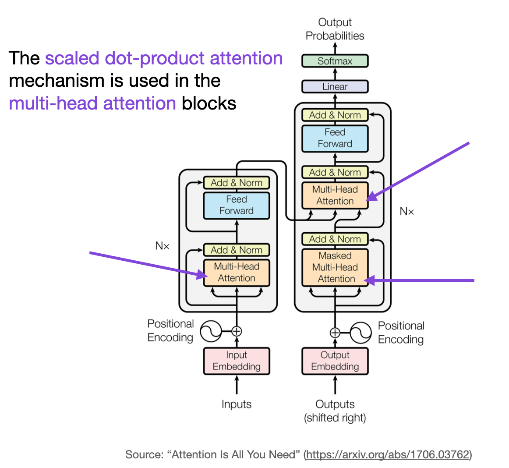

## Table of Contents

## What are attention mechanisms in machine learning?

Attention mechanisms in machine learning help models focus on the most relevant parts of the data when making predictions or generating responses. Imagine you're reading a long document and you need to answer a question about it. Instead of reading the entire document again, you'd quickly skim through it and focus on the parts that seem most relevant to the question. That's what attention mechanisms do for machine learning models. They allow the model to weigh the importance of different parts of the input data, improving the accuracy and efficiency of the model's output.

In practice, attention mechanisms are often used in natural language processing tasks, such as machine translation or text summarization. For example, when translating a sentence from English to French, the model uses attention to focus on the relevant English words while generating each French word. This helps the model produce more accurate translations by understanding the context and relationships between words. The attention mechanism can be represented mathematically, but at its core, it's about helping the model pay attention to what matters most in the input data.

## How do synthesized attention mechanisms differ from traditional attention mechanisms?

Synthesized attention mechanisms are a newer approach compared to traditional attention mechanisms. Traditional attention mechanisms, like those used in models such as transformers, work by calculating attention scores between all pairs of input elements. This process can be computationally expensive because it involves comparing every element to every other element. For example, in a transformer, the attention mechanism uses a formula like $$ \text{Attention}(Q, K, V) = \text{softmax}\left(\frac{QK^T}{\sqrt{d_k}}\right)V $$ to compute the attention weights, where Q, K, and V are query, key, and value matrices respectively.

Synthesized attention mechanisms aim to reduce this computational cost by generating attention patterns more efficiently. Instead of computing attention scores for all pairs, synthesized attention uses techniques like linear or sparse approximations to create attention patterns. This can make the model run faster and use less memory, which is especially helpful for large datasets or when working on devices with limited resources. For instance, a synthesized attention mechanism might use a simpler function to approximate the attention weights, allowing the model to focus on important parts of the input without the need for exhaustive comparisons.

Overall, the key difference between synthesized and traditional attention mechanisms lies in their approach to computing attention. Traditional methods are thorough but can be slow, while synthesized methods are faster but might sacrifice some accuracy. Both approaches have their place depending on the specific needs of the task at hand, such as the trade-off between speed and precision.

## What is Dense Synthesized Attention and how does it work?

Dense Synthesized Attention is a type of attention mechanism that aims to be both efficient and effective. Instead of calculating attention scores for every pair of input elements like traditional attention mechanisms, Dense Synthesized Attention uses a simpler method to create attention patterns. This method helps the model run faster and use less memory, which is great for working with large datasets or on devices with limited resources.

The way Dense Synthesized Attention works is by using a function to approximate the attention weights. This function is designed to capture the important relationships between input elements without needing to compare every element to every other element. For example, it might use a linear or sparse approximation to quickly generate attention patterns. This approach allows the model to focus on the most relevant parts of the input data, improving its performance while keeping the computational cost low.

## What are the advantages of using Dense Synthesized Attention in neural networks?

Dense Synthesized Attention offers several advantages when used in neural networks. One key benefit is its efficiency. Traditional attention mechanisms can be slow because they need to calculate attention scores for every pair of input elements. This can take a lot of time and memory, especially with large datasets. Dense Synthesized Attention solves this problem by using a simpler method to create attention patterns. Instead of comparing every element to every other element, it uses a function to quickly approximate the attention weights. This makes the model run faster and use less memory, which is great for working on devices with limited resources or when dealing with big data.

Another advantage of Dense Synthesized Attention is its ability to maintain good performance while being efficient. Even though it uses approximations to generate attention patterns, it can still capture the important relationships between input elements. This means the model can focus on the most relevant parts of the data without losing much accuracy. For example, in tasks like natural language processing, Dense Synthesized Attention can help the model understand the context and relationships between words more effectively, leading to better results in tasks like machine translation or text summarization.

## What is Random Synthesized Attention and what are its key features?

Random Synthesized Attention is a type of attention mechanism that uses randomness to create attention patterns. Instead of calculating attention scores for every pair of input elements like traditional attention mechanisms, Random Synthesized Attention generates attention weights using random processes. This approach can be much faster and use less memory because it doesn't need to do as many calculations. For example, it might use a random function to quickly create attention patterns that help the model focus on the important parts of the input data.

One key feature of Random Synthesized Attention is its simplicity. By using randomness, it can create attention patterns without the need for complex calculations. This makes it easier to implement and can be especially useful for tasks where speed is more important than precision. Another key feature is its flexibility. Because it uses random processes, Random Synthesized Attention can be adapted to different types of data and tasks, making it a versatile tool for [machine learning](/wiki/machine-learning) models.

## How does Random Synthesized Attention improve model performance?

Random Synthesized Attention improves model performance by making the attention mechanism faster and more efficient. Instead of calculating attention scores for every pair of input elements, which can be slow and use a lot of memory, Random Synthesized Attention uses random processes to quickly create attention patterns. This means the model can focus on the important parts of the data without doing as many calculations. For example, when processing a large text, the model can use Random Synthesized Attention to quickly identify the key words or phrases it needs to pay attention to, speeding up the overall process.

Another way Random Synthesized Attention helps is by adding a bit of randomness to the attention patterns. This can make the model more flexible and better at handling different types of data. When the model uses random processes to generate attention, it can sometimes find new and useful relationships between input elements that it might have missed with a more traditional approach. This can lead to better performance, especially in tasks where the data is varied or unpredictable.

## What is Factorized Random Synthesized Attention and how is it implemented?

Factorized Random Synthesized Attention is a type of attention mechanism that combines the ideas of factorization and randomness to make the attention process even more efficient. It works by breaking down the attention computation into smaller, more manageable parts, which are then combined using random processes. This approach helps the model focus on the most important parts of the input data without needing to do a lot of calculations. For example, instead of calculating attention scores for every pair of input elements, Factorized Random Synthesized Attention might use a simpler function to create attention patterns quickly.

To implement Factorized Random Synthesized Attention, you start by breaking down the input data into smaller factors. These factors are then used to generate attention weights using random processes. For instance, you might use a function to create a set of random matrices that represent the attention patterns. These matrices are then combined to form the final attention weights. This method can be represented mathematically as $$ \text{Attention} = \text{Combine}(\text{Random}(F_1), \text{Random}(F_2), ..., \text{Random}(F_n)) $$, where $$ F_1, F_2, ..., F_n $$ are the factors of the input data, and $$ \text{Random} $$ and $$ \text{Combine} $$ are functions that generate and combine the attention weights, respectively. This approach makes the model faster and more efficient, which is great for working with large datasets or on devices with limited resources.

## What are the computational benefits of using Factorized Random Synthesized Attention?

Factorized Random Synthesized Attention makes the attention process in neural networks faster and uses less memory. Instead of calculating attention scores for every pair of input elements, which can be slow and use a lot of computer resources, Factorized Random Synthesized Attention breaks down the input data into smaller parts called factors. It then uses random processes to quickly create attention patterns from these factors. This means the model can focus on the important parts of the data without doing a lot of calculations, making it much more efficient.

The computational benefits of this approach are clear when you look at how it works. For example, instead of using a formula like $$ \text{Attention}(Q, K, V) = \text{softmax}\left(\frac{QK^T}{\sqrt{d_k}}\right)V $$ to compute attention weights, Factorized Random Synthesized Attention uses a simpler method. It might use a function to create a set of random matrices that represent the attention patterns, which are then combined to form the final attention weights. This approach can be represented as $$ \text{Attention} = \text{Combine}(\text{Random}(F_1), \text{Random}(F_2), ..., \text{Random}(F_n)) $$, where $$ F_1, F_2, ..., F_n $$ are the factors of the input data. By breaking down the problem and using randomness, the model can work faster and use less memory, which is great for big datasets or devices with limited resources.

## What is Factorized Dense Synthesized Attention and how does it differ from other synthesized attention methods?

Factorized Dense Synthesized Attention is a type of attention mechanism that combines the ideas of factorization and dense synthesized attention to make the attention process more efficient. It works by breaking down the input data into smaller parts called factors. These factors are then used to create attention patterns using a dense synthesized approach, which means it uses a function to quickly approximate the attention weights instead of calculating them for every pair of input elements. This method helps the model focus on the most important parts of the data without needing a lot of calculations, making it faster and using less memory. For example, it might use a function to create a set of dense matrices that represent the attention patterns, which are then combined to form the final attention weights. This can be represented as $$ \text{Attention} = \text{Combine}(\text{Dense}(F_1), \text{Dense}(F_2), ..., \text{Dense}(F_n)) $$, where $$ F_1, F_2, ..., F_n $$ are the factors of the input data.

Factorized Dense Synthesized Attention differs from other synthesized attention methods like Random Synthesized Attention and Dense Synthesized Attention in how it generates and combines attention weights. Random Synthesized Attention uses randomness to create attention patterns, which can make the model faster but might not be as accurate as other methods. Dense Synthesized Attention uses a dense function to approximate attention weights, which is more accurate than random methods but still efficient. Factorized Dense Synthesized Attention takes the best of both worlds by breaking down the input data into factors and then using a dense function to create attention patterns. This approach is both efficient and accurate, making it a good choice for tasks where you need to balance speed and precision.

## How can Factorized Dense Synthesized Attention be optimized for specific tasks?

Factorized Dense Synthesized Attention can be optimized for specific tasks by adjusting how the input data is broken down into factors and how the dense function is used to create attention patterns. For example, if you're working on a task like machine translation, you might want to focus more on the relationships between words in the source and target languages. You can do this by setting up the factors to represent different parts of the sentences, like nouns, verbs, and adjectives. Then, you can use the dense function to create attention patterns that pay more attention to these important parts. This can help the model understand the context better and produce more accurate translations.

Another way to optimize Factorized Dense Synthesized Attention is by tweaking the parameters of the dense function. The dense function used to approximate attention weights can be adjusted to be more or less complex depending on the task. For instance, if you're working on a task where speed is more important than accuracy, you might use a simpler dense function that creates attention patterns quickly. On the other hand, if accuracy is more important, you can use a more complex dense function that takes a bit longer but produces more precise attention patterns. This flexibility allows you to tailor the attention mechanism to the specific needs of your task, making it a powerful tool for many different types of machine learning models.

## What are some real-world applications of synthesized attention mechanisms?

Synthesized attention mechanisms are used in many real-world applications, especially in natural language processing tasks. For example, they help improve machine translation systems. When translating a sentence from one language to another, the model needs to understand the relationships between words. Synthesized attention mechanisms allow the model to focus on the most important words in the source language while generating the translation. This makes the translation more accurate and natural-sounding. For instance, if you're translating a sentence from English to Spanish, the model can use synthesized attention to pay more attention to key nouns and verbs, helping it produce a better translation.

Another application of synthesized attention mechanisms is in text summarization. When you want to summarize a long document, the model needs to identify the most important information and create a concise summary. Synthesized attention helps the model focus on the key sentences or phrases that capture the main ideas of the text. This makes the summary more accurate and useful. For example, if you're summarizing a news article, the model can use synthesized attention to highlight the most important facts and events, making it easier for readers to get the main points quickly.

Synthesized attention mechanisms are also used in other areas like image processing and speech recognition. In image processing, they help models focus on the most relevant parts of an image when identifying objects or classifying scenes. For example, when identifying a car in a picture, the model can use synthesized attention to focus on the wheels and the shape of the car, improving its accuracy. In speech recognition, synthesized attention helps the model pay attention to the most important parts of the audio signal, making it better at understanding what people are saying. This can be especially helpful in noisy environments where the model needs to filter out background noise and focus on the speaker's voice.

## How do synthesized attention mechanisms impact the future development of machine learning models?

Synthesized attention mechanisms are changing the way machine learning models work by making them faster and more efficient. These mechanisms help models focus on the most important parts of the data without needing to do a lot of calculations. For example, instead of calculating attention scores for every pair of input elements using a formula like $$ \text{Attention}(Q, K, V) = \text{softmax}\left(\frac{QK^T}{\sqrt{d_k}}\right)V $$, synthesized attention uses simpler methods to create attention patterns. This makes the models run faster and use less memory, which is great for working with big datasets or on devices with limited resources. As a result, more people and organizations can use these models for tasks like machine translation, text summarization, and image processing.

In the future, synthesized attention mechanisms will likely lead to even more advanced and efficient machine learning models. As researchers and developers keep improving these mechanisms, models will become better at understanding and processing data quickly and accurately. This could mean better translations, more useful summaries, and more accurate image recognition. For example, a model using synthesized attention could help a doctor quickly understand a patient's medical history by summarizing key information from long reports. Overall, synthesized attention mechanisms are helping to push the boundaries of what machine learning models can do, making them more useful in everyday life.

## References & Further Reading

[1]: Vaswani, A., Shazeer, N., Parmar, N., Uszkoreit, J., Jones, L., Gomez, A. N., Kaiser, Ł., & Polosukhin, I. (2017). ["Attention is All You Need."](https://arxiv.org/abs/1706.03762) Advances in Neural Information Processing Systems.

[2]: Lin, T., and Tegmark, M. (2017). ["Why Does Deep and Cheap Learning Work So Well?"](https://arxiv.org/abs/1608.08225) Journal of Statistical Physics.

[3]: "Efficient Attention: Attention with Linear Complexities". Shazeer, N. (2020). [Published on Google AI Blog.](https://arxiv.org/abs/1812.01243)

[4]: Choromanski, K., Likhosherstov, V., Dohan, D., Song, X., Gane, A., Sarlo, C., Zadourian, E., Liu, S., Sarlos, T., & Weller, A. (2020). ["Rethinking Attention with Performers."](https://arxiv.org/abs/2009.14794) arXiv preprint arXiv:2009.14794.

[5]: Tay, Y., Dehghani, M., Bahri, D., & Metzler, D. (2020). ["Efficient Transformers: A Survey."](https://arxiv.org/abs/2009.06732) arXiv preprint arXiv:2009.06732.

[6]: Katharopoulos, A., Vyas, A., Pappas, N., & Fleuret, F. (2020). ["Transformers are RNNs: Fast Autoregressive Transformers with Linear Attention."](https://arxiv.org/abs/2006.16236) arXiv preprint arXiv:2006.16236.

[7]: "Attention Models in Deep Learning". Brownlee, J. (2021). [Published on the Machine Learning Mastery Blog.](https://scholar.google.com/citations?user=hVaJhRYAAAAJ&hl=en)

[8]: Ramachandran, P., & Liu, F. (2019). ["Stand-Alone Self-Attention in Vision Models."](https://dl.acm.org/doi/10.5555/3454287.3454294) arXiv preprint arXiv:1906.05909.