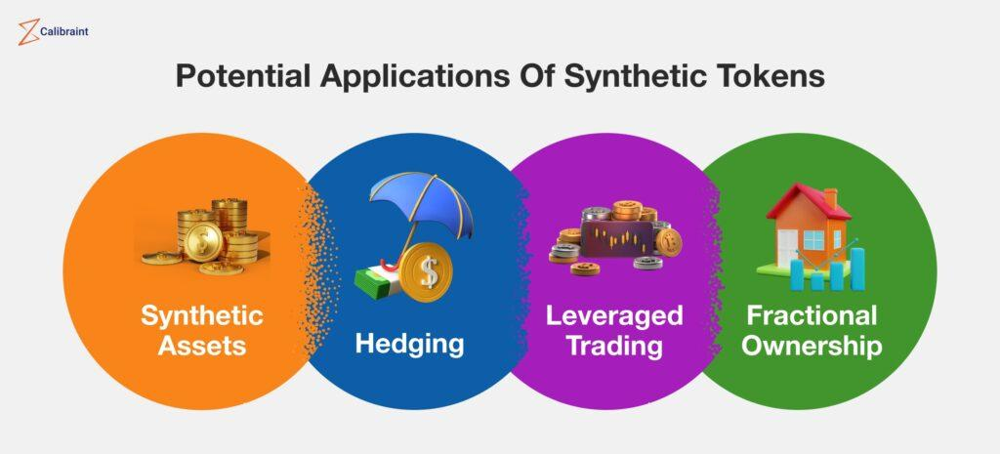

## Table of Contents

## What are synthetic assets in finance?

Synthetic assets in finance are financial instruments that mimic the behavior of other assets without actually owning them. They are created using a combination of different financial products like derivatives, such as options and futures, to replicate the performance of a specific asset or a basket of assets. For example, instead of buying a stock directly, an investor might use options and futures to create a synthetic version of that stock, which would rise and fall in value similarly to the actual stock.

These assets are popular because they offer flexibility and can be used for various purposes, such as hedging against risk or gaining exposure to markets that might be difficult to access directly. For instance, an investor might use synthetic assets to bet on the price movement of a commodity without having to store the physical commodity. However, synthetic assets can be complex and come with higher risks, so they are generally used by more experienced investors who understand the underlying mechanics and potential pitfalls.

## How do synthetic assets differ from traditional assets?

Synthetic assets and traditional assets are different in how they are made and used. Traditional assets are things you can own directly, like stocks, bonds, or real estate. They have a clear value and you can see what you own. Synthetic assets, on the other hand, are created using other financial tools, like options and futures. They don't own the actual asset but copy its behavior. This means you can invest in something without buying it directly.

The main difference is in the flexibility and purpose. Traditional assets are straightforward and often used for long-term investment or income. Synthetic assets are more complex and can be used for many things, like betting on price changes or protecting against risks. They let investors get into markets they can't easily reach, but they can also be riskier and harder to understand.

## What are the common types of synthetic assets?

Synthetic assets come in different forms, but some common types are synthetic stocks, synthetic commodities, and synthetic indices. A synthetic stock is made by using options to copy the price movements of a real stock. You don't own the stock itself, but you can still make money or lose money based on its price changes. Synthetic commodities work the same way but for things like gold or oil. You use futures contracts to bet on the price without needing to store the actual commodity. Synthetic indices are used to mimic the performance of a whole market or group of stocks, like the S&P 500, using a mix of options and futures.

These synthetic assets are useful because they let investors do things that might be hard with traditional assets. For example, if you want to invest in a foreign market that's hard to get into, you can use synthetic assets to do it without buying the actual stocks or commodities. They also help with risk management, like protecting your investments from big price drops. But synthetic assets can be tricky because they're complex and can be riskier. You need to understand how they work before using them.

## What are the benefits of using synthetic assets?

Synthetic assets offer a lot of benefits to investors. One big advantage is flexibility. They let you invest in things you might not be able to buy directly. For example, if you want to invest in a foreign market that's hard to get into, you can use synthetic assets to do it without buying the actual stocks or commodities. This means you can take advantage of opportunities that would otherwise be out of reach. Another benefit is that synthetic assets can help you manage risk. You can use them to protect your investments from big price drops or to bet on price changes without having to own the actual asset.

Another advantage of synthetic assets is that they can be cheaper to use than traditional assets. For instance, instead of buying a stock, you can use options to create a synthetic version of that stock, which might cost less. This can make investing more affordable, especially if you're working with a smaller budget. Plus, synthetic assets can be customized to fit your specific needs. You can create them to match exactly what you want to achieve, whether it's making money from price movements or protecting your other investments. This level of customization is something you don't always get with traditional assets.

## What are the risks associated with synthetic assets?

Synthetic assets can be risky because they are complex. They are made up of different financial tools like options and futures, which can be hard to understand. If you don't know how these tools work, you might make mistakes that cost you money. Also, because synthetic assets are not the real thing, they can act differently than you expect. This means you could lose money even if you think you're making a safe bet.

Another risk is that synthetic assets can be more volatile. This means their prices can go up and down a lot more than traditional assets. If the market changes suddenly, you could lose a lot of money quickly. Plus, synthetic assets often use leverage, which means you're borrowing money to invest. This can make your gains bigger, but it also makes your losses bigger if things go wrong. So, it's important to be careful and understand the risks before you start using synthetic assets.

## How are synthetic assets created?

Synthetic assets are created by using other financial tools like options and futures. Imagine you want to invest in a stock but don't want to buy it directly. You can use options, which are contracts that give you the right to buy or sell the stock at a certain price, to create a synthetic version of that stock. By combining a call option (which lets you buy the stock) and a put option (which lets you sell the stock), you can make something that acts just like the real stock. This synthetic stock will go up and down in value the same way the actual stock does, but you don't own the stock itself.

For example, if you want to bet on the price of gold without buying the actual metal, you can use futures contracts to create a synthetic commodity. Futures are agreements to buy or sell something at a future date. By using these contracts, you can mimic the price movements of gold without ever touching the physical metal. Synthetic assets like these are useful because they let you invest in things you might not be able to buy directly, but they can be tricky because they're made from complex financial tools.

## What role do smart contracts play in the creation of synthetic assets?

Smart contracts play a big role in creating synthetic assets, especially in the world of blockchain and cryptocurrencies. A smart contract is like a computer program that runs on a blockchain. It automatically does what it's supposed to do when certain conditions are met. For synthetic assets, smart contracts can be used to set up the rules for how these assets are created and managed. For example, if you want to create a synthetic version of a stock, a smart contract can handle the buying and selling of options and futures that make up the synthetic asset. This makes the process more automatic and transparent because everything is recorded on the blockchain.

Using smart contracts also makes it easier to trust synthetic assets. Because the rules are written into the code and can't be changed easily, everyone can see exactly how the synthetic asset works. This can help reduce the risk of fraud or mistakes. Plus, smart contracts can make it simpler to create new types of synthetic assets quickly. If you have a new idea for an asset, you can write a smart contract to bring it to life without needing a lot of paperwork or middlemen. This can open up new opportunities for investors and make the financial world more flexible and innovative.

## Can you explain how synthetic assets are used in DeFi (Decentralized Finance)?

In DeFi, synthetic assets are used to let people invest in things they can't easily buy directly. Imagine you want to bet on the price of gold or a stock without actually owning it. In DeFi, you can use platforms that run on blockchain technology to create synthetic versions of these assets. These platforms use smart contracts, which are like computer programs that automatically follow the rules you set. So, if you want to create a synthetic stock, the smart contract will handle all the buying and selling of options and futures needed to make it work. This means you can invest in almost anything, from stocks to commodities, without leaving the DeFi ecosystem.

Synthetic assets in DeFi also help with making money and managing risk. For example, you can use them to earn interest or to protect your other investments from big price drops. Because everything in DeFi is on the blockchain, it's all very transparent and secure. You can see exactly how the synthetic assets are created and managed, which helps build trust. Plus, DeFi makes it easier for anyone to create new types of synthetic assets. If you have a new idea, you can write a smart contract to bring it to life without needing banks or other middlemen. This opens up a lot of new opportunities for people to invest and innovate in the financial world.

## What regulatory challenges do synthetic assets face?

Synthetic assets face a lot of regulatory challenges because they are complex and new. Regulators worry about things like fraud, market manipulation, and protecting investors. Since synthetic assets are made from other financial tools like options and futures, it can be hard to know exactly what they are and how they work. This makes it tricky for regulators to make rules that keep everything safe and fair. They need to figure out how to watch over these assets without stopping innovation or making it too hard for people to use them.

Another challenge is that synthetic assets often use smart contracts on blockchains, which are not controlled by any one country or group. This means that different countries might have different rules about them, which can cause confusion and problems. Regulators need to work together to make sure that synthetic assets are used safely and fairly all over the world. They also need to keep up with new technology and find ways to protect people without slowing down the growth of new financial tools.

## How do synthetic assets impact financial markets?

Synthetic assets can change how financial markets work because they give investors more ways to bet on prices without owning the real thing. They let people invest in things like stocks, gold, or even whole markets without buying them directly. This can make markets more lively and bring in more investors. It also means that people can try out new ideas and create new types of investments, which can make the financial world more exciting and innovative.

But synthetic assets can also make markets more risky. Because they are complex and made from other financial tools, they can be hard to understand. If a lot of people use synthetic assets and something goes wrong, it could cause big problems in the market. Regulators need to watch carefully to make sure that synthetic assets don't cause too much trouble and that investors are protected. So, while synthetic assets can bring new opportunities, they also need to be handled carefully to keep the markets safe and fair.

## What are some real-world applications of synthetic assets?

Synthetic assets are used in many real-world ways. One common use is for people who want to invest in things like gold or oil without having to store the actual stuff. Instead of buying the real thing, they can use synthetic assets to bet on the price going up or down. This is helpful if you want to invest in something that's hard to get or too expensive to buy directly. For example, a farmer might use synthetic assets to protect against changes in the price of crops, so they know how much money they'll make at the end of the season.

Another way synthetic assets are used is in the world of cryptocurrencies and DeFi. In DeFi, people can create synthetic versions of stocks, commodities, or even whole markets using blockchain technology. This lets them invest in almost anything without leaving the DeFi platform. It's like having a whole world of investments at your fingertips, all managed by smart contracts. This can help people make money or protect their other investments from big price changes.

## What future developments can we expect in the field of synthetic assets?

In the future, we might see more people using synthetic assets because they are becoming easier to create and use, thanks to technology like blockchain and smart contracts. These tools let anyone make new types of synthetic assets without needing big banks or other middlemen. This could mean more choices for investors and new ways to make money or protect against risks. As more people get used to using cryptocurrencies and DeFi, synthetic assets could become a normal part of how we invest.

But there will also be challenges. Regulators will need to keep up with these new tools to make sure they are safe and fair for everyone. They will have to work together across different countries to set rules that protect investors without stopping innovation. As synthetic assets get more popular, we might see new ways to use them that we haven't even thought of yet. This could change how financial markets work and open up new opportunities for people all over the world.

## What is the understanding of financial assets?

Financial assets are economic resources that represent monetary value and can be traded within financial markets. These assets are primarily divided into categories such as stocks, bonds, and real estate investments, each offering differing levels of risk and potential returns. Understanding these distinctions is essential for investors when crafting a portfolio aligned with their financial objectives and risk tolerance.

Stocks, or equities, represent ownership shares in a corporation. Investors buy stocks with the expectation of capital gains and dividends, contributing to potential returns. However, stocks are known for their volatility, posing higher risk compared to other asset classes. The performance of stocks is influenced by various factors, including economic trends, company performance, and market sentiment. 

Bonds are debt securities issued by corporations, municipalities, or governments to raise capital. Investors in bonds act as lenders, receiving periodic interest payments and the return of principal upon maturity. Generally, bonds are considered safer than stocks, especially government bonds, which are viewed as low-risk due to their backing by national governments. However, bondholders face risks such as [interest rate](/wiki/interest-rate-trading-strategies) changes and credit risk. 

Real estate investments involve purchasing properties to generate rental income or capital appreciation. This asset class is valued for its potential to provide steady cash flow and hedge against inflation, but it requires significant capital and management expertise. Moreover, real estate carries [liquidity](/wiki/liquidity-risk-premium) risks as selling properties can be time-consuming and market-dependent.

When selecting financial assets, investors must align their choices with their financial goals and risk tolerance. Risk tolerance is a psychological measure of an investor's willingness to endure market fluctuations and potential losses. Diversification plays a critical role in risk management, as it involves spreading investments across various asset classes to mitigate the impact of poor performance in any one category. The concept follows the principle that different assets often react differently to market conditions, thereby reducing portfolio [volatility](/wiki/volatility-trading-strategies). 

For a balanced mix of investments, modern portfolio theory suggests the construction of a diversified portfolio that maximizes expected returns for a given level of risk. Mathematically, the risk and return of a portfolio can be assessed using the expected return formula and variance:

$$
\text{Expected Portfolio Return (E(R_p))} = \sum_{i=1}^{n} w_i \cdot E(R_i)
$$

$$
\text{Portfolio Variance ($\sigma_p^2$)} = \sum_{i=1}^{n} \sum_{j=1}^{n} w_i w_j \sigma_{ij}
$$

where $w_i$ is the weight of the asset in the portfolio, $E(R_i)$ is the expected return of the asset, and $\sigma_{ij}$ is the covariance between the returns of assets $i$ and $j$.

Investors should continuously evaluate the performance of their assets and rebalance their portfolios as necessary to ensure they remain aligned with their evolving financial needs and market conditions. In conclusion, financial assets offer various opportunities for wealth accumulation, and understanding their characteristics is fundamental for effective investment decision-making.

## References & Further Reading

[1]: Bergstra, J., Bardenet, R., Bengio, Y., & Kégl, B. (2011). ["Algorithms for Hyper-Parameter Optimization."](https://dl.acm.org/doi/10.5555/2986459.2986743) Advances in Neural Information Processing Systems 24.

[2]: ["Advances in Financial Machine Learning"](https://www.amazon.com/Advances-Financial-Machine-Learning-Marcos/dp/1119482089) by Marcos Lopez de Prado

[3]: ["Evidence-Based Technical Analysis: Applying the Scientific Method and Statistical Inference to Trading Signals"](https://www.amazon.com/Evidence-Based-Technical-Analysis-Scientific-Statistical/dp/0470008741) by David Aronson

[4]: ["Machine Learning for Algorithmic Trading"](https://github.com/stefan-jansen/machine-learning-for-trading) by Stefan Jansen

[5]: ["Quantitative Trading: How to Build Your Own Algorithmic Trading Business"](https://www.amazon.com/Quantitative-Trading-Build-Algorithmic-Business/dp/0470284889) by Ernest P. Chan