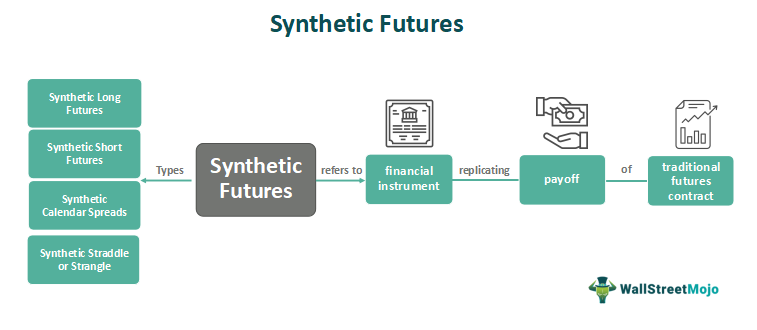

In the modern financial landscape, understanding the diverse array of investment types is crucial for investors aiming to maximize returns while managing risks. This article explores the intersection of synthetic finance, financial assets, and algorithmic trading, providing a comprehensive overview of how these elements are transforming the investment environment. 

Synthetic finance involves financial engineering to create new products that mimic the performance of existing assets or markets, without requiring direct ownership. This innovation allows for increased flexibility and access to a wider array of investment opportunities. Financial assets, such as stocks, bonds, and real estate investments, provide the foundational building blocks of portfolios, each offering unique risk and return profiles. Meanwhile, algorithmic trading uses sophisticated software to execute trades on financial markets at high speed and frequency, leveraging pre-defined criteria and advanced analytics.



By examining these areas, investors can identify new opportunities that enhance their portfolios. For instance, synthetic finance products can be used to hedge risks or gain exposure to otherwise inaccessible markets. Algorithmic trading, on the other hand, can improve execution efficiency and refine investment strategies through data-driven insights.

Employing a combination of these tools allows investors to navigate and thrive in the ever-evolving financial ecosystem. As technology continues to advance, staying informed on developments in synthetic finance and algorithmic trading will be pivotal in shaping the future of finance. This article aims to elucidate these key concepts and provide investors with actionable insights to optimize their portfolios and remain competitive in today's financial markets.

## Table of Contents

## Understanding Financial Assets

Financial assets are economic resources that represent monetary value and can be traded within financial markets. These assets are primarily divided into categories such as stocks, bonds, and real estate investments, each offering differing levels of risk and potential returns. Understanding these distinctions is essential for investors when crafting a portfolio aligned with their financial objectives and risk tolerance.

Stocks, or equities, represent ownership shares in a corporation. Investors buy stocks with the expectation of capital gains and dividends, contributing to potential returns. However, stocks are known for their volatility, posing higher risk compared to other asset classes. The performance of stocks is influenced by various factors, including economic trends, company performance, and market sentiment. 

Bonds are debt securities issued by corporations, municipalities, or governments to raise capital. Investors in bonds act as lenders, receiving periodic interest payments and the return of principal upon maturity. Generally, bonds are considered safer than stocks, especially government bonds, which are viewed as low-risk due to their backing by national governments. However, bondholders face risks such as [interest rate](/wiki/interest-rate-trading-strategies) changes and credit risk. 

Real estate investments involve purchasing properties to generate rental income or capital appreciation. This asset class is valued for its potential to provide steady cash flow and hedge against inflation, but it requires significant capital and management expertise. Moreover, real estate carries [liquidity](/wiki/liquidity-risk-premium) risks as selling properties can be time-consuming and market-dependent.

When selecting financial assets, investors must align their choices with their financial goals and risk tolerance. Risk tolerance is a psychological measure of an investor's willingness to endure market fluctuations and potential losses. Diversification plays a critical role in risk management, as it involves spreading investments across various asset classes to mitigate the impact of poor performance in any one category. The concept follows the principle that different assets often react differently to market conditions, thereby reducing portfolio [volatility](/wiki/volatility-trading-strategies). 

For a balanced mix of investments, modern portfolio theory suggests the construction of a diversified portfolio that maximizes expected returns for a given level of risk. Mathematically, the risk and return of a portfolio can be assessed using the expected return formula and variance:

$$
\text{Expected Portfolio Return (E(R_p))} = \sum_{i=1}^{n} w_i \cdot E(R_i)
$$

$$
\text{Portfolio Variance ($\sigma_p^2$)} = \sum_{i=1}^{n} \sum_{j=1}^{n} w_i w_j \sigma_{ij}
$$

where $w_i$ is the weight of the asset in the portfolio, $E(R_i)$ is the expected return of the asset, and $\sigma_{ij}$ is the covariance between the returns of assets $i$ and $j$.

Investors should continuously evaluate the performance of their assets and rebalance their portfolios as necessary to ensure they remain aligned with their evolving financial needs and market conditions. In conclusion, financial assets offer various opportunities for wealth accumulation, and understanding their characteristics is fundamental for effective investment decision-making.

## The Rise of Synthetic Finance

Synthetic finance has emerged as a transformative facet of modern financial markets, primarily through the innovative use of derivatives. Derivatives are financial contracts whose value is derived from an underlying asset, index, or rate. They serve as the cornerstone for creating synthetic financial instruments, which in turn offer investors exposure to various assets without necessitating actual ownership. This characteristic opens new horizons for both risk management and investment strategies.

Synthetic products, such as options, futures, and swaps, exemplify this innovation. Options grant the holder the right, but not the obligation, to buy or sell an asset at a predetermined price before a specified date. Futures are standardized contracts obligating parties to transact an asset at a future date and price. Swaps involve exchanging one set of cash flows for another, tailored to suit parties with varying financial needs. These instruments provide robust solutions for hedging, allowing investors to offset potential losses in their portfolio. Similarly, they are pivotal for speculating, enabling participants to profit from price movements without holding the underlying asset.

As financial technology advances, the utility of synthetic finance in portfolio management has grown substantially. Enhanced computational capabilities and sophisticated algorithms facilitate the construction and management of synthetic instruments with precision and efficiency. This evolution is reflected in the increasing complexity and customization of financial products available to investors, catering to specific risk-return profiles and investment objectives.

The strategic use of synthetic finance is also supported by advancements in data analytics. By leveraging large datasets, investors and portfolio managers can make informed decisions, optimize their portfolios, and minimize risk exposure. This confluence of technology and innovative financial instruments is reshaping the investment landscape, offering tailored solutions for various market conditions.

In summary, synthetic finance represents a paradigmatic shift, granting investors the tools to engage with markets more dynamically and effectively. Through derivatives, it dissolves traditional barriers to asset exposure and risk management, making it an indispensable component of contemporary financial strategy.

## Investment Types in Synthetic Finance

Exchange-Traded Funds (ETFs), Contracts for Difference (CFDs), and structured products are significant components of synthetic finance, offering diverse investment avenues. These products enable investors to gain exposure to various financial markets without owning the underlying assets directly.

Exchange-Traded Funds (ETFs) are investment funds traded on stock exchanges, similar to stocks. An [ETF](/wiki/etf-trading-strategies) holds assets such as stocks, commodities, or bonds and often operates with an [arbitrage](/wiki/arbitrage) mechanism designed to keep its trading close to its net asset value, though deviations can occasionally occur. ETFs offer a flexible and cost-effective way for investors to diversify their portfolios across different sectors and markets. Because they are traded publicly, ETFs provide transparency in pricing, liquidity, and the ability to employ different investment strategies, such as tax-loss harvesting.

Contracts for Difference (CFDs) are financial derivatives allowing traders to speculate on the price movements of various assets, including stocks, commodities, indices, and currencies, without owning them. CFDs enable trading on margin, which means that traders can open positions by depositing a fraction of the trade's total value, known as margin. This leverage can amplify both potential gains and losses, making CFDs popular for short-term trading strategies. Due to their speculative nature, CFDs are subject to stringent regulatory oversight in several jurisdictions.

Structured products are custom-designed financial instruments that often include derivatives to align with specific risk-return profiles for investors. They are typically constructed to meet particular investment strategies, such as capital protection, enhanced returns, or yield enhancement. Structured products can be tailored to fit an investor's market view or risk appetite, often involving a combination of bonds and derivatives such as options or swaps. The complexity of these products requires a thorough understanding to ensure they align with investor objectives and risk tolerance.

In conclusion, grasping the intricacies of ETFs, CFDs, and structured products is essential for making informed decisions in synthetic finance. These instruments offer unique opportunities to tailor an investment strategy to individual goals, but they also [carry](/wiki/carry-trading) specific risks and operational nuances that investors must navigate wisely.

## Algorithmic Trading: The Role of Technology

Algorithmic trading leverages advanced computer algorithms to conduct a vast number of trade operations at remarkable speeds and volumes, significantly transforming the efficiency of financial markets. Key components of [algorithmic trading](/wiki/algorithmic-trading) include the ability to analyze large datasets in real-time and execute trades based on predefined criteria, often faster than any human trader.

These algorithms can be engineered to detect market patterns and execute complex trading strategies with minimal human intervention. For instance, a common algorithmic strategy is [statistical arbitrage](/wiki/statistical-arbitrage), which seeks to exploit price inefficiencies in related securities. The implementation of this strategy can involve calculating statistical thresholds for buying and selling:

```python
import numpy as np

def calc_thresholds(prices, window=20, factor=1.5):
    rolling_mean = np.mean(prices[-window:])
    rolling_std = np.std(prices[-window:])
    buy_threshold = rolling_mean - factor * rolling_std
    sell_threshold = rolling_mean + factor * rolling_std
    return buy_threshold, sell_threshold
```

By automating trade execution, algorithmic trading greatly reduces transaction costs, a critical advantage for traders. The reduced cost mainly arises from the ability to execute strategies at optimal times and prices, commonly known as best execution. Additionally, algorithms can consistently apply trading rules across diverse market environments, enhancing market analytics and decision-making processes.

Despite its advantages, algorithmic trading also introduces considerable challenges. It can exacerbate market volatility, as high-frequency strategies often lead to rapid fluctuations in trading volumes and prices. This potential for increased volatility necessitates robust risk management systems to monitor and control the exposure of trading portfolios. Robust risk management might involve automated risk assessments carried out frequently to ensure compliance with risk thresholds:

```python
def calculate_risk_exposure(portfolio, market_data):
    # Simplified risk exposure calculation
    positions = portfolio.get_positions()
    exposure = 0
    for asset, quantity in positions.items():
        price = market_data.get(asset, 0)
        exposure += quantity * price
    return exposure
```

Moreover, algorithmic trading requires sophisticated infrastructure and technological expertise, posing a barrier to entry for smaller market participants. As these systems depend heavily on technology, they are also vulnerable to technological failures and cybersecurity threats.

In summary, while algorithmic trading offers substantial efficiencies and enhanced capabilities for market participants, it demands a comprehensive approach to risk management and technological investment to mitigate the inherent challenges and potential risks.

## Integrating Synthetic Finance and Algo Trading

Combining synthetic finance and algorithmic trading can significantly enhance the execution of investment strategies by leveraging the precision and speed of technology. Algorithms can manage synthetic financial products such as derivatives, optimizing entry and [exit](/wiki/exit-strategy) points based on predefined criteria or real-time market data. This optimization is achieved through complex calculations and data processing, which traditional manual trading methods cannot replicate.

### Algorithms in Managing Synthetic Products

Algorithms play a crucial role in analyzing vast amounts of market data, identifying patterns, and executing trades at speeds impossible for human traders. In the context of synthetic finance, algorithms can be specially designed to handle derivatives like options, futures, and swaps. For example, an algorithm might be programmed to execute trades when a specific derivative's price hits a particular threshold, maximizing profit potential while minimizing risk.

In practice, this might involve using models like the Black-Scholes for options pricing, or the Monte Carlo method to simulate possible future price movements of an asset. By integrating these mathematical models into trading algorithms, investors can improve the precision of their trading strategies.

### Enhanced Hedging and Risk Management

The integration of synthetic finance products with algorithmic trading facilitates more effective hedging and risk management. Synthetic products often allow investors to hedge against market movements by offering exposure to a particular market or asset without necessitating full ownership. Algorithms can automatically adjust these positions based on real-time risk assessments and market conditions, ensuring optimal hedging strategies.

For instance, an algorithm might continuously monitor the market for potential adverse price movements and execute counter-trades to mitigate risk exposure. By doing so, investors can maintain a balanced portfolio with reduced exposure to unfavorable market fluctuations.

### Technical and Strategic Understanding

Investors aiming to leverage synthetic finance and algorithmic trading must have a robust understanding of both the technical and strategic dimensions of these tools. Technically, they must grasp how algorithms are constructed and deployed, ensuring they operate as intended in dynamic market conditions. Strategically, it is essential to understand how these tools align with broader investment objectives, such as risk tolerance and return targets.

### Achieving Precision and Control

With the proper use of synthetic finance and algorithmic trading, investors can achieve greater precision and control over their investment portfolios. This is primarily due to the ability to make data-driven decisions and execute trades based on real-time analysis rather than solely relying on human judgment. The combination of algorithmic efficiency and synthetic products' flexibility provides a powerful means to optimize investment strategies.

In summary, the integration of synthetic finance and algorithmic trading represents a significant advancement in investment strategy execution. By harnessing the capabilities of technology and sophisticated financial instruments, investors can better navigate the complexities of modern financial markets, achieving enhanced results and improved risk management.

## Conclusion

The financial landscape is continuously reshaped by advances in synthetic finance and algorithmic trading, presenting both opportunities and challenges for investors. Those who adapt to these changes gain a competitive edge, unlocking new avenues for growth and diversification. By embracing technological innovations and financial engineering, investors can construct portfolios that are more resilient against market fluctuations and capable of higher efficiency.

To effectively navigate this evolving environment, continuous learning and adaptation are essential. Financial markets increasingly rely on sophisticated algorithms and synthetic instruments, making it crucial for investors to stay informed about emerging trends and technologies. This allows them to make informed decisions and exploit the unique benefits offered by these modern financial tools while mitigating associated risks.

Leveraging these financial innovations enables investors to enhance their strategic approaches. Synthetic finance provides the flexibility to tailor risk-return profiles through derivatives, while algorithmic trading introduces efficiencies in trade execution, cost reduction, and market analysis. Together, these elements empower investors to refine their investment strategies, achieving greater precision in managing their portfolios.

Investors should remain proactive, ensuring they can capitalize on the full potential these advancements offer. By integrating new technologies and maintaining a willingness to adapt, they are better positioned to thrive in this dynamic financial landscape, ensuring long-term success and stability in their investment endeavors.

## References & Further Reading

[1]: Bergstra, J., Bardenet, R., Bengio, Y., & Kégl, B. (2011). ["Algorithms for Hyper-Parameter Optimization."](https://dl.acm.org/doi/10.5555/2986459.2986743) Advances in Neural Information Processing Systems 24.

[2]: ["Advances in Financial Machine Learning"](https://www.amazon.com/Advances-Financial-Machine-Learning-Marcos/dp/1119482089) by Marcos Lopez de Prado

[3]: ["Evidence-Based Technical Analysis: Applying the Scientific Method and Statistical Inference to Trading Signals"](https://www.amazon.com/Evidence-Based-Technical-Analysis-Scientific-Statistical/dp/0470008741) by David Aronson

[4]: ["Machine Learning for Algorithmic Trading"](https://github.com/stefan-jansen/machine-learning-for-trading) by Stefan Jansen

[5]: ["Quantitative Trading: How to Build Your Own Algorithmic Trading Business"](https://www.amazon.com/Quantitative-Trading-Build-Algorithmic-Business/dp/0470284889) by Ernest P. Chan