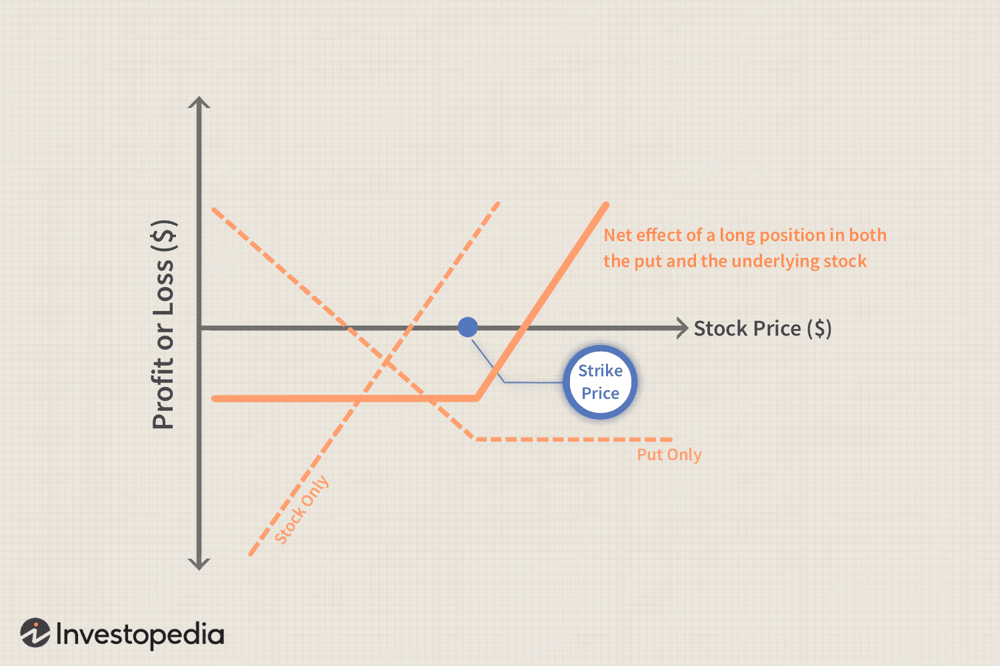

## Table of Contents

## What is a synthetic call option?

A synthetic call option is a way to mimic the payoff of a regular call option without actually buying one. It's created by combining a long position in the underlying stock with a long put option on that same stock. This combination gives you the potential for unlimited gains if the stock price goes up, just like a regular call option, but it also protects you from big losses if the stock price falls, thanks to the put option.

Think of it like this: if you own the stock and also buy a put option, you can sell the stock at the put's strike price no matter how low the stock price drops. This setup is similar to a call option because if the stock price rises above the put's strike price, you can keep the stock and benefit from the increase. So, a synthetic call gives you the upside of a call option while also providing a safety net if the stock price goes down.

## How does a synthetic call option differ from a traditional call option?

A synthetic call option and a traditional call option both give you the chance to make money if a stock's price goes up. But they are made in different ways. A traditional call option is a single contract you buy that lets you buy the stock at a set price before a certain date. If the stock price goes above that set price, you can buy the stock at the lower price and then sell it at the higher market price to make a profit. If the stock price stays below the set price, you just let the option expire and you only lose the money you paid for the option.

A synthetic call option, on the other hand, is made by combining two things: owning the stock and buying a put option on that stock. This setup lets you keep the stock if its price goes up, just like a traditional call option. But if the stock price goes down, the put option lets you sell the stock at the put's set price, which protects you from big losses. So, a synthetic call gives you the same upside as a traditional call but also adds a safety net if the stock price falls.

In simple terms, a traditional call option is a straightforward contract that you buy for a chance at profit, while a synthetic call is a strategy that involves owning the stock and using a put option to create a similar effect with added protection. Both can be useful, but they work differently and have different costs and risks.

## What are the components of a synthetic call option?

A synthetic call option is made up of two main parts: owning the stock and buying a put option on that same stock. When you own the stock, you have the potential to make money if the stock's price goes up. This is similar to what happens with a traditional call option, where you can buy the stock at a set price and then sell it at a higher market price for a profit.

The second part of a synthetic call is buying a put option. A put option gives you the right to sell the stock at a set price, no matter how low the stock's market price drops. This put option acts like a safety net. If the stock price falls, you can use the put option to sell the stock at the set price, which helps limit your losses. So, the combination of owning the stock and having a put option creates a synthetic call that gives you the upside of a traditional call option plus protection if the stock price goes down.

## How can a synthetic call option be constructed?

To create a synthetic call option, you need to do two things: buy the stock and buy a put option on that same stock. When you buy the stock, you own it, and if its price goes up, you make money. This is just like having a traditional call option, where you can buy the stock at a set price and then sell it for a profit if the market price is higher.

The second part is buying a put option. A put option lets you sell the stock at a set price, no matter how low the stock's market price goes. This acts like a safety net. If the stock price falls, you can use the put option to sell the stock at the set price, which helps you avoid big losses. So, by owning the stock and having a put option, you create a synthetic call that gives you the upside of a traditional call option plus protection if the stock price goes down.

## What are the potential benefits of using a synthetic call option?

Using a synthetic call option can give you a few important benefits. One big benefit is that it lets you make money if the stock's price goes up, just like a regular call option. When you own the stock and its price rises, you can sell it for a profit. This is similar to buying a call option and then selling the stock at a higher price than you paid for the option. So, a synthetic call gives you the same chance for big gains as a traditional call option.

Another benefit of a synthetic call is that it protects you from big losses if the stock's price goes down. This is because you also buy a put option, which lets you sell the stock at a set price even if the market price drops a lot. This safety net means you don't lose as much money as you would if you just owned the stock without the put option. So, while a traditional call option only costs you the price of the option if the stock goes down, a synthetic call limits your losses on the stock itself, making it a safer way to bet on a stock's price going up.

## What are the risks associated with synthetic call options?

Synthetic call options come with some risks you should know about. One big risk is the cost. When you make a synthetic call, you have to buy the stock and a put option. This can be more expensive than just buying a regular call option. If the stock price doesn't go up, you might lose money on both the stock and the put option. This means you could lose more than if you had just bought a traditional call option.

Another risk is that the stock price could drop a lot. Even though the put option gives you some protection, you still have to pay for it. If the stock price falls below the put's strike price, you might lose money on the stock, but you'll still have spent money on the put option. This means your total loss could be bigger than if you had just owned the stock without the put option. So, while a synthetic call can protect you from big losses, it doesn't make them go away completely.

## In what market conditions is a synthetic call option most effective?

A synthetic call option is most effective in market conditions where you think the stock price will go up, but you also want some protection if it goes down. If you believe the stock is going to rise, a synthetic call lets you make money just like a regular call option. But if the stock price starts to fall, the put option in the synthetic call helps limit your losses. This makes it a good choice when you're feeling positive about a stock but you're also a bit worried about what might happen if things don't go as planned.

In a volatile market, where stock prices can swing a lot, a synthetic call can be very useful. It gives you the chance to make big profits if the stock goes up, and it also protects you if the stock goes down. So, if the market is unpredictable and you want to take a chance on a stock going up but also want to be safe, a synthetic call can be a smart move. It's like having the best of both worlds: the upside of a call option and the safety of a put option.

## How does the cost of a synthetic call option compare to a traditional call option?

The cost of a synthetic call option is usually higher than the cost of a traditional call option. When you create a synthetic call, you have to buy the stock and a put option. The price of the stock can be a lot of money, and then you also have to pay for the put option. On the other hand, a traditional call option just costs you the price of the option itself, which is usually much less than buying the stock and a put option.

Even though a synthetic call is more expensive upfront, it can be worth it if you want to protect yourself from big losses. If the stock price goes down, the put option in the synthetic call lets you sell the stock at a set price, which limits how much money you can lose. With a traditional call option, if the stock price goes down, you just lose the money you paid for the option. So, while a synthetic call costs more at first, it gives you both the chance to make money if the stock goes up and protection if it goes down.

## Can you provide an example of a synthetic call option strategy in action?

Imagine you think that the price of XYZ stock, which is currently trading at $50, is going to go up. Instead of buying a traditional call option, you decide to use a synthetic call option strategy. You buy 100 shares of XYZ stock for $5,000 (100 shares x $50 per share). Then, you also buy a put option on XYZ stock with a strike price of $50 that expires in three months. This put option costs you $200. So, your total cost for the synthetic call is $5,200.

Now, let's see what happens if the stock price goes up or down. If the stock price rises to $60 by the time the put option expires, you can sell your 100 shares for $6,000 (100 shares x $60 per share). After subtracting your initial cost of $5,200, you make a profit of $800. This is similar to what would happen if you had bought a traditional call option and the stock price went up. But if the stock price falls to $40, you can use your put option to sell the stock at the $50 strike price. So, you sell your 100 shares for $5,000 (100 shares x $50 per share), and after subtracting your initial cost of $5,200, you lose $200. This is much better than if you had just owned the stock without the put option, because then you would have lost $1,000 (the difference between $5,000 and $4,000).

## What are some advanced techniques for optimizing a synthetic call option strategy?

One way to make a synthetic call option strategy work better is by [picking](/wiki/asset-class-picking) the right strike price for the put option. If you think the stock price will go up a lot, you might want to choose a put option with a lower strike price. This can save you money on the put option because it's cheaper, but it means you'll only be protected if the stock price falls below that lower price. On the other hand, if you're not sure how much the stock price will go up, you might want a put option with a higher strike price. This will cost more, but it gives you more protection if the stock price drops.

Another advanced technique is to use different expiration dates for the put option. If you think the stock price will go up quickly, you might choose a put option that expires soon. This can be cheaper and still give you protection for the time you need it. But if you think the stock price might take longer to go up, you might pick a put option that lasts longer. This will cost more, but it gives you protection for a longer time. By choosing the right strike price and expiration date, you can make your synthetic call option strategy work better for your goals and the way you think the stock price will move.

## How do tax implications differ between synthetic and traditional call options?

The tax implications for synthetic call options and traditional call options can be different because of how they are set up. When you use a synthetic call option, you own the stock and buy a put option. If you sell the stock at a profit, you'll have to pay capital gains tax on that profit. The put option's cost can also be used to reduce your taxable income if it expires worthless, but if you use the put option to sell the stock, it can change how your gains or losses are taxed. So, with a synthetic call, you might have to deal with taxes on the stock and the put option, which can be more complicated.

On the other hand, with a traditional call option, you only buy the option itself. If the option expires worthless, you can deduct the cost as a capital loss. If you exercise the option and sell the stock for a profit, you'll pay capital gains tax on the difference between the stock's sale price and the total cost of the option and the stock. Traditional call options are usually simpler for taxes because you're only dealing with the option, not the stock and a put option like in a synthetic call. So, while synthetic calls can give you more control and protection, they can also make your taxes more complicated.

## What are the regulatory considerations when using synthetic call options?

When you use synthetic call options, you need to know about the rules that the government and financial groups have set up. In the United States, the Securities and Exchange Commission (SEC) and the Financial Industry Regulatory Authority (FINRA) are the main groups that watch over options trading. They have rules to make sure trading is fair and safe. For example, they might ask you to have enough money or assets to cover your trades. This is called margin requirements. If you don't follow these rules, you could get into trouble or have to pay fines.

Also, different countries might have their own rules about options trading. If you're trading in another country, you need to learn about their laws too. Sometimes, these rules can be different from what you're used to in your own country. It's important to know these rules so you don't accidentally break them. Talking to a financial advisor or a lawyer can help you understand all the rules and make sure you're doing everything right when you use synthetic call options.

## What are Synthetic Call Options and How Do They Work?

A synthetic call option is an innovative strategy in options trading, composed by holding a long position in a stock and purchasing a put option for the same stock. This combination effectively replicates the payoff profile of a traditional call option. To understand its mechanics, let's consider the payoff structure of both traditional and synthetic calls. 

### Mechanics of a Synthetic Call

In a traditional call option, a trader gains the right to purchase a stock at a predetermined price (strike price) before the option expires. The profit from a call option can be defined as:

$$
\text{Profit} = \max(S_T - K, 0) - C
$$

where $S_T$ is the stock price at expiration, $K$ is the strike price, and $C$ is the call premium.

For a synthetic call, the structure involves:
1. **Long Stock Position**: Provides exposure to stock price movements.
2. **Long Put Option**: Provides the right to sell the stock at the put option's strike price.

The payoff of the synthetic call consists of:
$$
\text{Payoff} = S_T - S_0 + \max(K - S_T, 0) - P
$$

where $S_0$ is the initial stock price, and $P$ is the put premium. This structure implies that the payoff mirrors a traditional call, as any gain in the stock's value (beyond the strike price) is offset by exercising the put option. Thus, effectively allowing the trader to benefit similarly to holding a call option.

### Cost Implications and Flexibility

Choosing a synthetic structure often has cost and tactical advantages. Firstly, traders circumvent the direct cost of purchasing call options, which can be especially beneficial during periods of high implied [volatility](/wiki/volatility-trading-strategies) where option premiums are inflated. Instead, acquiring the stock and a put option can be financially more attractive. Also, synthetic calls offer flexibility in modifying positions, as traders can adjust either the underlying stock or the option to suit their strategic needs.

### Practical Applications of Synthetic Calls

Traders might prefer synthetic calls to traditional ones when stock prices are expected to rise, but put options are relatively cheaper due to lower implied volatility. For example, a trader confident about a stock's potential but wary of high call premiums can employ a synthetic strategy to achieve desired exposure at a reduced cost.

Moreover, synthetic options are used in tax-sensitive environments, as they involve directly holding the underlying stock, which may have different tax implications than directly holding options.

### Risks and Rewards

Implementing synthetic calls involves understanding both their benefits and inherent risks. Among the key risks is the exposure to stock price depreciation, a direct consequence of holding the underlying stock. Moreover, [liquidity](/wiki/liquidity-risk-premium) concerns in the options market can lead to execution risks.

Despite these risks, the synthetic call option strategy allows traders to customize their positions and potentially capitalize on cost efficiencies and strategic adjustments, making them a valuable tool for contemporary traders.

## References & Further Reading

[1]: Hull, J. C. (2012). ["Options, Futures, and Other Derivatives"](https://www.semanticscholar.org/paper/Options%2C-Futures%2C-and-Other-Derivatives-Hull/89bdee500c8623864fc9eb7a471546aa713acc44) (9th Edition). Pearson Education.

[2]: Natenberg, S. (1994). ["Option Volatility and Pricing: Advanced Trading Strategies and Techniques"](https://www.amazon.com/Option-Volatility-Pricing-Strategies-Techniques/dp/0071818774). McGraw-Hill Education.

[3]: Lopez de Prado, M. (2018). ["Advances in Financial Machine Learning"](https://www.amazon.com/Advances-Financial-Machine-Learning-Marcos/dp/1119482089). Wiley.

[4]: Luenberger, D. G. (1997). ["Investment Science"](https://www.amazon.com/Investment-Science-David-G-Luenberger/dp/0199740089). Oxford University Press.

[5]: Hull, J. (2010). ["Risk Management and Financial Institutions"](https://books.google.com/books/about/Risk_Management_and_Financial_Institutio.html?id=1J1QDwAAQBAJ) (5th Edition). Wiley.