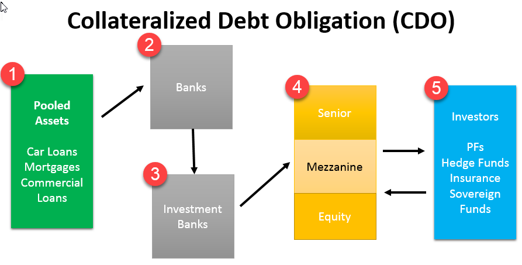

In recent years, the financial landscape has undergone significant transformation due to the introduction of innovative instruments such as Synthetic Collateralized Debt Obligations (CDOs). These financial derivatives are designed to mimic the performance of a portfolio of assets, allowing investors to gain exposure to diversified credit risk without directly owning the underlying assets. This evolution in financial products has been complemented by the rise of algorithmic trading, commonly known as algo trading, which automates trading processes through pre-programmed instructions executed at high speeds and volumes.

The integration of Synthetic CDOs with algo trading marks a pivotal shift in the way financial markets operate. Synthetic CDOs, utilizing mechanisms like credit default swaps (CDS), have become integral in transferring and managing credit risk among market participants. The creation of these instruments is purely based on the synthetic exposure to credit risks rather than tangible asset securities. On the other hand, algorithmic trading has revolutionized trade execution by using mathematical models and real-time data analysis, leading to significant improvements in market efficiency, liquidity, and accessibility.



This article aims to explore the intersection of Synthetic CDOs with algorithmic trading and their implications for modern finance. By examining their mechanics and market impact, we seek to provide insights into how these financial tools can be effectively leveraged for advanced trading strategies. Such understanding is vital for investors, traders, and financial analysts who wish to navigate and exploit the evolving dynamics of financial markets. Through a deep dive into the significance and operation of these instruments, we uncover how they shape investment decisions and risk management in contemporary finance. Understanding these dynamics is crucial for market participants aiming to stay ahead in a competitive and rapidly changing environment.

## Table of Contents

## Understanding Synthetic CDOs

Synthetic Collateralized Debt Obligations (Synthetic CDOs) are complex financial instruments designed to allow investors to gain exposure to a portfolio of credit risk without owning the underlying assets. At their core, Synthetic CDOs do not involve the physical acquisition of commodities or securities. Instead, they utilize credit default swaps (CDS) to manage and distribute risk among different parties.

### Mechanics of Synthetic CDOs

Synthetic CDOs function by forming a synthetic reference portfolio and issuing different tranches that vary in terms of associated risk and returns. These tranches are essentially slices of risk that investors can buy into, depending on their risk appetite.

1. **Credit Default Swaps (CDS)**: The primary mechanism involves the use of credit default swaps. A CDS is a financial derivative that transfers the credit exposure of fixed income products between parties. The buyer of a CDS receives credit protection, while the seller guarantees the creditworthiness of the asset. In the case of Synthetic CDOs, these swaps are integral as they replace the actual securities found in traditional CDOs. Their involvement allows these instruments to be based purely on credit risks.

2. **Synthetic Reference Portfolio**: This is a pool of credit default swaps that represents the underlying assets. Rather than holding actual loans or bonds, the CDO holds CDS contracts that reflect the credit risk of an assortment of reference entities. The performance and return on the tranches depend on the credit events (like default) affecting the entities included in this synthetic portfolio.

3. **Tranches**: Synthetic CDOs issue various tranches that cater to a spectrum of risk profiles. The tranches are structured hierarchically, ranging from senior to equity tiers:
   - **Senior Tranches**: These have the highest credit quality and are paid first during a credit event, thus bearing the lowest risk. Consequently, they offer lower returns.
   - **Mezzanine Tranches**: This middle layer takes more risk in exchange for potentially higher returns, being subordinate to senior tranches but senior to equity tranches.
   - **Equity Tranches**: The riskiest tranche absorbs initial losses, carrying the most significant risk and therefore potentially delivering the highest returns.

### Purpose of Synthetic CDOs

Synthetic CDOs are primarily used for credit risk transfer and speculative purposes. Financial institutions and investors may employ them to:
- **Diversify Risk**: By investing in a portfolio of credit risks, investors can spread their exposure, limiting the impact of any single credit event.
- **Gain Access to Credit Exposure**: They allow investors to profit from credit risk without the need to hold the actual underlying assets.
- **Speculate on Credit Events**: Traders often use Synthetic CDOs to speculate on creditworthiness changes in specific sectors or entities.

In contemporary financial markets, Synthetic CDOs offer a sophisticated means to hedge or gain exposure to credit risk. They are intricate instruments that require a detailed understanding of the underlying credit derivatives to assess accurately the risk-return profile.

## The Role of Algorithmic Trading in Finance

Algorithmic trading, commonly known as algo trading, involves using pre-programmed trading instructions to [carry](/wiki/carry-trading) out trades at speeds and volumes unattainable by human traders. This method of trading has significantly altered how financial markets operate by enhancing efficiency, [liquidity](/wiki/liquidity-risk-premium), and accessibility.

One of the primary advantages of [algorithmic trading](/wiki/algorithmic-trading) is the ability to execute trades in milliseconds, thus capitalizing on even the smallest fluctuations in market prices. Algorithms can handle orders far faster than any human and can also scan multiple markets and exchanges simultaneously. This capability results in better price discovery, optimal order execution, and reduced transaction costs, benefiting both individual traders and institutions.

Algorithmic trading utilizes complex mathematical models and formulas to automate trading decisions based on real-time market data. These models analyze historical data to predict future price movements, and they can incorporate a variety of indicators, including moving averages, relative strength indices, and stochastic oscillators. For instance, a simple moving average crossover strategy could be coded as:

```python
def moving_average_crossover(data, short_window, long_window):
    data['ShortMA'] = data['Close'].rolling(window=short_window, min_periods=1).mean()
    data['LongMA'] = data['Close'].rolling(window=long_window, min_periods=1).mean()
    data['Signal'] = 0.0  
    data['Signal'][short_window:] = np.where(data['ShortMA'][short_window:] 
                                             > data['LongMA'][short_window:], 1.0, 0.0)   
    data['Position'] = data['Signal'].diff()
    return data
```

In this example, 'short_window' and 'long_window' are parameters defining the periods for the moving averages, while data represents the pricing of an asset over time. This algorithm generates a buy signal when the short-term moving average crosses above the long-term moving average.

Algo trading influences asset pricing and market trends by enabling large orders to be executed systematically without causing significant market disruptions. The presence of algorithms in markets has increased liquidity, making it easier for buyers and sellers to find counterparties for their trades. Furthermore, market transparency has improved as algorithms provide continuous price quotations, thereby narrowing bid-ask spreads and enhancing the overall trading ecosystem.

To understand the deployment of algorithmic trading in financial markets, consider high-frequency trading ([HFT](/wiki/high-frequency-trading-strategies)), a subset of algorithmic trading characterized by extremely high speeds and order turnover rates. HFT firms aim to profit from the smallest price discrepancies, often holding positions for mere seconds. By exploiting minute price differentials across markets, HFT firms contribute to market efficiency by aligning prices across exchanges rapidly.

In conclusion, algorithmic trading plays a pivotal role in modern financial markets, serving as a backbone for how financial instruments, including Synthetic CDOs, are utilized and traded. Its ability to process vast amounts of data with speed and precision has transformed traditional trading paradigms, offering new methodologies for asset management and risk control. As the technology evolves and integrates further with advanced data analysis and modeling techniques, its influence on financial markets will continue to grow.

## Synthetic CDOs in the Context of Algo Trading

Synthetic CDOs align well with algorithmic trading strategies due to their capacity for dynamic pricing and trading. The integration of Synthetic CDOs with algo trading hinges on leveraging advanced data analytics, real-time pricing models, and automated execution strategies, providing both opportunities and complexities.

Algorithmic trading in the context of Synthetic CDOs involves deploying complex mathematical models that can efficiently assess credit risk and market conditions. Algorithms are capable of processing vast amounts of market data, identifying patterns, and executing trades at speeds unattainable by human traders. This capability enhances the precision of Synthetic CDO trading, allowing for optimized investment strategies and risk management. For instance, algorithms can utilize statistical methods to predict market movements, enabling traders to take advantage of [arbitrage](/wiki/arbitrage) opportunities or hedge against potential losses.

Furthermore, the implementation of [machine learning](/wiki/machine-learning) algorithms can enhance predictive accuracy. By analyzing historical data and learning from past market behaviors, machine learning models can anticipate price movements and adjust trading strategies accordingly. A typical approach might involve using time-series analysis or [reinforcement learning](/wiki/reinforcement-learning) algorithms to continuously improve trading performance based on market feedback.

Below is a basic example of how Python code might be used to predict market movements using a machine learning model like a decision tree:

```python
from sklearn.tree import DecisionTreeClassifier
from sklearn.model_selection import train_test_split
from sklearn.metrics import accuracy_score

# Sample data (features: market conditions, targets: price movements)
X = [[market_condition_1], [market_condition_2], ...]
y = [price_movement_1, price_movement_2, ...]

# Split data into training and testing sets
X_train, X_test, y_train, y_test = train_test_split(X, y, test_size=0.2, random_state=42)

# Initialize and train the decision tree classifier
clf = DecisionTreeClassifier()
clf.fit(X_train, y_train)

# Predict and evaluate model accuracy
y_pred = clf.predict(X_test)
accuracy = accuracy_score(y_test, y_pred)

print(f"Model accuracy: {accuracy * 100:.2f}%")
```

This synergy of Synthetic CDOs with algo trading signifies a frontier of innovation in financial engineering, potentially reshaping how these complex financial instruments are traded. Financial institutions use such integrations not only to manage risk effectively but also to enhance liquidity in CDO trading markets. Automated systems can swiftly adjust portfolios based on real-time data, reducing transaction costs and enhancing market efficiency.

Despite the opportunities, this fusion also necessitates robust risk management frameworks to address challenges such as model risk and market [volatility](/wiki/volatility-trading-strategies). As the financial landscape continues to advance, the integration of Synthetic CDOs and algorithmic trading represents a significant step forward in the evolution of financial markets.

## Risks and Challenges

Trading Synthetic Collateralized Debt Obligations (CDOs) through algorithmic systems introduces several inherent risks and challenges that market participants must navigate. 

One of the primary concerns is market volatility. Synthetic CDOs, being derivatives of credit default swaps, are inherently sensitive to fluctuations in market conditions. Rapid changes in market dynamics can lead to significant exposure and potential losses. For example, the abrupt shifts in credit spreads can affect the pricing of Synthetic CDO tranches, creating sharp valuation changes that algorithms must account for in real-time to mitigate financial losses.

Model risk also poses a significant challenge. The models employed in algorithmic trading strategies assume certain market conditions and behaviors that may not hold true under all scenarios. If a model's assumptions do not accurately reflect the actual market environment, it may lead to erroneous decisions and severe financial repercussions. The mathematical models used to assess the risk and price of Synthetic CDOs must, therefore, be robust and adaptive to a wide range of market conditions. Evaluation of a model's performance and regular recalibration are critical steps in ensuring its validity and reliability.

The synthetic nature of these products adds another layer of complexity. Unlike traditional asset-backed securities, Synthetic CDOs do not involve tangible assets, which means their value is solely dependent on the creditworthiness of the underlying reference entities. This reliance heightens the risk of default if those entities face financial difficulties. The absence of tangible collateral further complicates the assessment and management of risk associated with these instruments.

Regulatory scrutiny is another significant challenge. Given the global financial crisis's history and the role complex derivatives played in it, regulatory bodies closely monitor the trading of Synthetic CDOs. Compliance with rigorous transparency standards and reporting requirements is essential. Regulators aim to ensure that market participants have access to sufficient information to make informed decisions and that the systemic risk posed by these complex instruments is mitigated. Failure to meet regulatory standards can result in fines and other legal repercussions, impacting an institution's reputation and financial standing.

Transparency issues are compounded by the complex nature of Synthetic CDOs and the algorithms used to trade them. The intricacies of these financial instruments and the proprietary nature of algorithmic models can make it challenging to maintain transparency both for regulators and other market participants. Ensuring clarity in terms of pricing, trading strategies, and risk exposure is vital to maintain market confidence and integrity.

Risk management strategies must be robust and multifaceted to address these challenges. Diversification, stress testing, and regular model validation can help in mitigating potential pitfalls. Diversification across different assets and strategies reduces dependence on any single aspect of the market. Stress testing scenarios allow institutions to evaluate how their models and trading strategies will perform under extreme conditions. Regular model validation ensures that the algorithms remain accurate and responsive to market changes.

Understanding these risks is crucial for all participants involved in the trading of Synthetic CDOs and algorithmic trading markets. By acknowledging these complexities and implementing comprehensive risk management frameworks, financial institutions can better navigate the challenges presented by these advanced financial instruments.

## The Future of Synthetic CDOs and Algo Trading

The financial industry is undergoing rapid evolution, primarily driven by technological advancements and innovative market strategies. Synthetic CDOs and algorithmic trading are anticipated to become increasingly interconnected, thanks to the progress in financial technologies. The integration of these instruments with advanced technologies such as [artificial intelligence](/wiki/ai-artificial-intelligence) (AI), machine learning (ML), and big data analytics holds promise for enhancing the efficiency, precision, and scalability of trading operations.

Artificial intelligence and machine learning are crucial in analyzing vast datasets and making split-second trading decisions. These technologies can optimize algorithmic trading strategies by identifying patterns and predicting market movements with high confidence levels. AI-driven algorithms can analyze complex datasets from various sources, improving the predictive accuracy and execution efficiency of Synthetic CDO trades. For instance, unsupervised learning models can detect anomalies in trading patterns, thereby aiding risk management strategies.

Additionally, big data technologies facilitate the processing and analysis of immense volumes of data generated within the financial markets. This capacity allows traders to gain more granular insights into market conditions and asset performance. By incorporating real-time data analytics, financial institutions can better assess the market risk associated with Synthetic CDOs, leading to improved pricing strategies and risk mitigation techniques.

One potential development in this space is the integration of blockchain technology to enhance the transparency and security of transactions involving Synthetic CDOs. Blockchain can provide a decentralized ledger for recording trades, reducing the likelihood of fraudulent activities and improving trust among market participants.

The convergence of these technologies could also democratize access to complex financial instruments. With advanced algorithmic trading systems, smaller firms and individual investors might leverage sophisticated strategies that were once the domain of major financial institutions. This democratization could lead to increased market participation and liquidity.

In preparing for the future, stakeholders—ranging from financial analysts to policymakers—must remain cognizant of the technological trends shaping the markets. Embracing these advancements while ensuring robust regulatory frameworks will be vital to fostering innovation while safeguarding systemic stability. Understanding these developments will equip market participants with the knowledge and tools necessary to navigate the evolving landscape of Synthetic CDOs and algorithmic trading effectively. 

By staying informed and adaptable, financial entities can position themselves to harness the opportunities presented by these cutting-edge technologies, driving growth and efficiency in the financial markets.

## Conclusion

Synthetic CDOs and algorithmic trading represent a significant intersection of financial engineering and technology. These instruments and strategies, while complex, offer substantial opportunities for growth and innovation in finance. By synthesizing credit exposures through derivatives like credit default swaps and harnessing the power of rapid, data-driven decision-making through algorithms, market participants can access more diverse investment strategies and manage risks more effectively.

The mechanisms and implications of these financial instruments highlight their transformative impact on modern markets. Synthetic CDOs provide investors with tailored risk-return profiles, while algorithmic trading enhances market liquidity and efficiency. However, the advancement of these tools is not without challenges, particularly concerning risk management and regulatory compliance, which must evolve alongside the technologies to contain potential systemic risks.

As financial technology progresses, the integration of artificial intelligence and machine learning will further enhance the capabilities of algorithmic trading and Synthetic CDOs, enabling more sophisticated analysis and execution strategies. This ongoing evolution will shape the future of finance, presenting both new challenges and opportunities for all stakeholders involved.

A deeper understanding of these elements is essential for navigating the complexities of contemporary financial markets. By equipping participants with robust knowledge and tools, the potential to innovate and capitalize on this dynamic landscape is significantly enhanced, driving the future of finance towards unprecedented horizons.

## References & Further Reading

[1]: CDO Primer. (2008). "Understanding Credit Derivatives and Synthetic CDOs." JPMorgan, [Link](https://www.scribd.com/document/800683925/Capital-and-Capitalism-Old-Myths-New-Futures-1st-Edition-Rogene-A-Buchholz-download-pdf)

[2]: Fabozzi, F. J., & Kothari, V. (2008). ["Introduction to Securitization."](https://onlinelibrary.wiley.com/doi/book/10.1002/9781118266892) Wiley.

[3]: Duffie, D., & Singleton, K. J. (2003). ["Credit Risk: Pricing, Measurement, and Management."](https://www.cambridge.org/core/journals/astin-bulletin-journal-of-the-iaa/article/credit-risk-pricing-measurement-and-management-princeton-university-press-2003-darrell-duffie-and-kenneth-j-singleton/7094582AEF68A16E6CCC3613F237E997) Princeton University Press.

[4]: Aldridge, I. (2013). ["High-Frequency Trading: A Practical Guide to Algorithmic Strategies and Trading Systems."](https://www.ahmetbeyefendi.com/wp-content/uploads/2020/07/High-Frequency-Trading-Irene-Aldridge.pdf) Wiley.

[5]: Das, S. R., Uppal, R., & Sundaram, R. K. (2020). ["The Future of High-Frequency Trading."](https://scholar.google.com/citations?user=d33zFzkAAAAJ) Journal of Financial Economics, 142(3), 1037-1067.

[6]: Hull, J. C. (2018). ["Options, Futures, and Other Derivatives."](https://www.semanticscholar.org/paper/Options%2C-Futures%2C-and-Other-Derivatives-Hull/89bdee500c8623864fc9eb7a471546aa713acc44) Peason.

[7]: Lopez de Prado, M. (2018). ["Advances in Financial Machine Learning."](https://www.amazon.com/Advances-Financial-Machine-Learning-Marcos/dp/1119482089) Wiley.

[8]: Li, D. (2001). "On Default Correlation: A Copula Function Approach." The Journal of Fixed Income, 9(4), 43-54.