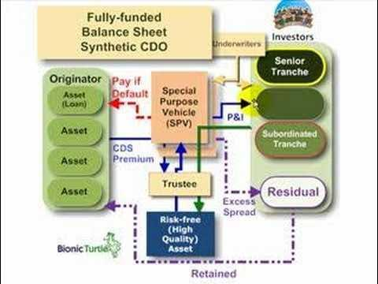

## Table of Contents

## What is a Synthetic Collateralized Debt Obligation (CDO)?

A Synthetic Collateralized Debt Obligation (CDO) is a type of financial product that lets investors bet on the performance of a group of loans or bonds without actually owning them. Instead of buying the actual loans or bonds, investors use credit default swaps, which are like insurance policies that pay out if the loans or bonds fail. This makes synthetic CDOs different from regular CDOs, which are made up of actual loans or bonds.

Synthetic CDOs became popular because they allowed investors to make big bets with less money upfront. However, they also became very risky, especially during the 2008 financial crisis. Many synthetic CDOs were based on risky home loans, and when those loans started to fail, the CDOs lost a lot of value. This led to huge losses for investors and played a big role in the financial crisis.

## How does a Synthetic CDO differ from a traditional CDO?

A Synthetic CDO and a traditional CDO both let investors bet on a group of loans or bonds, but they do it in different ways. A traditional CDO is made up of actual loans or bonds. Investors buy a piece of the CDO, which means they own a part of those loans or bonds. If the loans or bonds do well, the investors make money. If they do badly, the investors lose money.

On the other hand, a Synthetic CDO doesn't include the actual loans or bonds. Instead, it uses credit default swaps, which are like insurance policies. Investors bet on whether the loans or bonds will fail or not. If the loans or bonds fail, the credit default swaps pay out, and the investors can make money. This means investors can bet on the performance of loans or bonds without owning them.

The main difference is that a traditional CDO involves owning the actual assets, while a Synthetic CDO involves betting on those assets using credit default swaps. This makes Synthetic CDOs riskier because they can be based on very complex bets, which can lead to big losses if things go wrong, as seen during the 2008 financial crisis.

## What are the main components of a Synthetic CDO?

A Synthetic CDO is made up of two main parts: the reference portfolio and credit default swaps. The reference portfolio is a group of loans or bonds that the Synthetic CDO is betting on. These could be things like home loans, corporate bonds, or other types of debt. The investors don't actually own these loans or bonds; they just use them as a way to bet on how well they will do.

The other main part is credit default swaps. These are like insurance policies that pay out if the loans or bonds in the reference portfolio fail. Investors buy these swaps to bet that the loans or bonds will fail. If they do fail, the investors get money from the swaps. If the loans or bonds do well, the investors lose the money they paid for the swaps. This is how Synthetic CDOs let investors make big bets without owning the actual loans or bonds.

## What role do credit default swaps play in Synthetic CDOs?

Credit default swaps are like insurance policies that are really important in Synthetic CDOs. They let investors bet on whether a group of loans or bonds will fail without actually owning them. In a Synthetic CDO, the investors use these swaps to bet that the loans or bonds in the reference portfolio will fail. If the loans or bonds do fail, the credit default swaps pay out money to the investors. This means the investors can make money if the loans or bonds do badly.

On the other hand, if the loans or bonds do well, the investors lose the money they paid for the credit default swaps. This is how Synthetic CDOs work: they let investors make big bets on the performance of loans or bonds without having to buy them. Credit default swaps are what make this possible, and they can lead to big wins or big losses depending on how the loans or bonds do.

## Who are the typical investors in Synthetic CDOs?

The typical investors in Synthetic CDOs are often big financial institutions like banks, hedge funds, and insurance companies. These investors have a lot of money and are looking for ways to make big bets on the financial markets. They use Synthetic CDOs because they can make a lot of money if they guess right about whether loans or bonds will fail.

Sometimes, other investors like pension funds or wealthy individuals might also invest in Synthetic CDOs. They might be looking for high returns and are willing to take on the risk that comes with these complex financial products. However, because Synthetic CDOs can be very risky, they are usually more popular with investors who have a lot of experience and can handle the potential for big losses.

## What are the risks associated with investing in Synthetic CDOs?

Investing in Synthetic CDOs can be very risky. One big risk is that they are based on credit default swaps, which are like betting on whether loans or bonds will fail. If a lot of loans or bonds in the reference portfolio do fail, the investors can lose a lot of money. This is what happened during the 2008 financial crisis, when many Synthetic CDOs lost value because they were betting on risky home loans that started to fail.

Another risk is that Synthetic CDOs can be very complex and hard to understand. They involve a lot of complicated financial math and can be hard to predict. This means that even experienced investors can make mistakes and lose money. Also, because Synthetic CDOs let investors make big bets with less money upfront, the potential for big losses is even higher. If the market moves against the investors' bets, they can end up owing a lot more money than they put in.

## How is the performance of a Synthetic CDO measured?

The performance of a Synthetic CDO is measured by how well the loans or bonds in its reference portfolio do. If the loans or bonds do well and don't fail, the Synthetic CDO loses money because the credit default swaps don't pay out. On the other hand, if the loans or bonds fail, the credit default swaps pay out, and the Synthetic CDO can make money. This means the performance of a Synthetic CDO depends a lot on whether the investors guessed right about the loans or bonds failing.

Another way to measure the performance of a Synthetic CDO is by looking at its value over time. If the market thinks the loans or bonds in the reference portfolio are likely to fail, the value of the Synthetic CDO can go up because the credit default swaps become more valuable. But if the market thinks the loans or bonds will do well, the value of the Synthetic CDO can go down. This makes the performance of a Synthetic CDO very sensitive to changes in the market's view of the loans or bonds it's betting on.

## What was the impact of Synthetic CDOs on the 2008 financial crisis?

Synthetic CDOs played a big role in the 2008 financial crisis. They let investors make big bets on risky home loans without actually owning them. Many investors thought these home loans were safe, but they were wrong. When a lot of people couldn't pay back their home loans, the value of Synthetic CDOs dropped a lot. This caused huge losses for banks and other investors who had bet on these CDOs.

The losses from Synthetic CDOs made the financial crisis worse. Banks that had invested a lot in these CDOs lost a lot of money and had to be bailed out by the government. This led to a lot of fear and panic in the financial markets. People stopped trusting banks and each other, which made it hard for businesses to get loans and for the economy to keep going. The impact of Synthetic CDOs was a big reason why the 2008 financial crisis was so bad.

## How are Synthetic CDOs structured and tranched?

Synthetic CDOs are structured by grouping together a bunch of loans or bonds into what's called a reference portfolio. Investors don't actually own these loans or bonds; they just bet on how well they will do. The bets are made using credit default swaps, which are like insurance policies that pay out if the loans or bonds fail. The Synthetic CDO is then divided into different parts called tranches, which are like slices of a pie. Each tranche has a different level of risk and potential reward.

The tranches in a Synthetic CDO are set up so that some are safer and some are riskier. The safest tranches, called senior tranches, are the last to lose money if the loans or bonds fail. They get paid first and have the lowest risk, but they also have the lowest potential reward. The riskier tranches, called junior or equity tranches, are the first to lose money if things go wrong. They get paid last and have the highest risk, but they also have the chance for the biggest rewards if the loans or bonds do well. This way, investors can choose how much risk they want to take based on which tranche they buy.

## What regulatory changes have affected Synthetic CDOs post-2008?

After the 2008 financial crisis, regulators made big changes to how Synthetic CDOs work. They wanted to make sure that the same problems wouldn't happen again. One big change was that banks had to keep more money on hand to cover potential losses from Synthetic CDOs. This was to make sure that if the CDOs lost value, the banks wouldn't go broke. Also, regulators started to keep a closer eye on how banks used Synthetic CDOs and other complex financial products. They wanted to make sure that banks were being careful and not taking too many risks.

Another important change was that regulators made it harder for banks to hide the risks of Synthetic CDOs. They had to be more open about what was in the CDOs and how risky they were. This was to help investors understand what they were buying and make better decisions. Overall, these changes were meant to make the financial system safer and more stable, so that big bets on things like Synthetic CDOs wouldn't cause another crisis.

## How can Synthetic CDOs be used for risk management and speculation?

Synthetic CDOs can be used for risk management by letting investors protect themselves against the risk of loans or bonds failing. For example, if a bank has a lot of home loans and is worried that people might not be able to pay them back, the bank can buy a Synthetic CDO that bets on those loans failing. If the loans do fail, the Synthetic CDO pays out money to the bank, which helps cover the losses. This way, the bank can manage its risk and feel safer about the loans it has given out.

On the other hand, Synthetic CDOs can also be used for speculation. This means investors can make big bets on whether loans or bonds will fail without actually owning them. If an investor thinks a lot of home loans are going to fail, they can buy a Synthetic CDO that bets on those loans failing. If they are right and the loans do fail, they can make a lot of money from the Synthetic CDO. But if they are wrong and the loans do well, they can lose the money they put into the CDO. This makes Synthetic CDOs a way for investors to try to make big profits, but it also comes with a lot of risk.

## What are the current trends and future outlook for Synthetic CDOs?

After the 2008 financial crisis, Synthetic CDOs became less popular because they were seen as very risky. But in recent years, they have started to come back a little bit. Some investors are using them again because they can make big bets with less money upfront. Also, new rules have made Synthetic CDOs safer by making banks keep more money on hand and be more open about the risks. This has made some investors feel more comfortable using them again.

Looking to the future, Synthetic CDOs might keep growing slowly as long as the rules stay strict and investors are careful. They can be useful for managing risk and making big bets, but they will always be risky. If the economy stays stable and investors keep using them in a smart way, Synthetic CDOs could become a normal part of the financial world again. But if there's another big crisis, they might go back to being seen as too dangerous.

## References & Further Reading

[1]: CDO Primer. (2008). "Understanding Credit Derivatives and Synthetic CDOs." JPMorgan, [Link](https://www.scribd.com/document/800683925/Capital-and-Capitalism-Old-Myths-New-Futures-1st-Edition-Rogene-A-Buchholz-download-pdf)

[2]: Fabozzi, F. J., & Kothari, V. (2008). ["Introduction to Securitization."](https://onlinelibrary.wiley.com/doi/book/10.1002/9781118266892) Wiley.

[3]: Duffie, D., & Singleton, K. J. (2003). ["Credit Risk: Pricing, Measurement, and Management."](https://www.cambridge.org/core/journals/astin-bulletin-journal-of-the-iaa/article/credit-risk-pricing-measurement-and-management-princeton-university-press-2003-darrell-duffie-and-kenneth-j-singleton/7094582AEF68A16E6CCC3613F237E997) Princeton University Press.

[4]: Aldridge, I. (2013). ["High-Frequency Trading: A Practical Guide to Algorithmic Strategies and Trading Systems."](https://www.ahmetbeyefendi.com/wp-content/uploads/2020/07/High-Frequency-Trading-Irene-Aldridge.pdf) Wiley.

[5]: Das, S. R., Uppal, R., & Sundaram, R. K. (2020). ["The Future of High-Frequency Trading."](https://scholar.google.com/citations?user=d33zFzkAAAAJ) Journal of Financial Economics, 142(3), 1037-1067.

[6]: Hull, J. C. (2018). ["Options, Futures, and Other Derivatives."](https://www.semanticscholar.org/paper/Options%2C-Futures%2C-and-Other-Derivatives-Hull/89bdee500c8623864fc9eb7a471546aa713acc44) Peason.

[7]: Lopez de Prado, M. (2018). ["Advances in Financial Machine Learning."](https://www.amazon.com/Advances-Financial-Machine-Learning-Marcos/dp/1119482089) Wiley.

[8]: Li, D. (2001). "On Default Correlation: A Copula Function Approach." The Journal of Fixed Income, 9(4), 43-54.