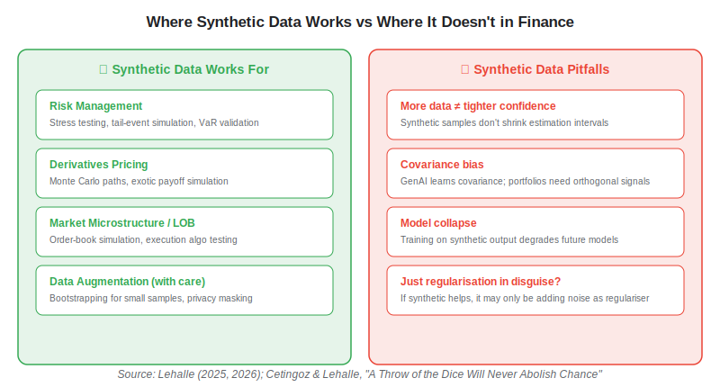
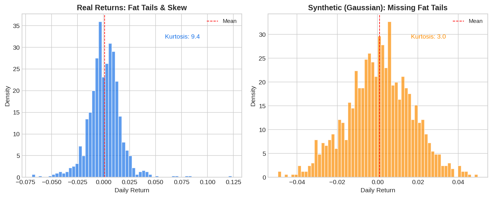

**Synthetic data** — artificially generated time series that mimic the statistical properties of real market data — is one of the most debated topics in modern quantitative finance. The promise is seductive: if you can generate unlimited realistic market scenarios, you can train better models, stress-test strategies more thoroughly, and overcome the chronic data scarcity that plagues finance. GANs, variational autoencoders, diffusion models, and copula-based simulators can all produce plausible-looking price paths. But does more synthetic data actually lead to better trading outcomes? The answer, grounded in both theory and recent research, is: *it depends entirely on what you use it for.*

## The Appeal: Why Quants Want Synthetic Data

Financial data is expensive, finite, and regime-dependent. A strategy developer building a momentum model has, at best, a few decades of daily data — and those decades contain only a handful of independent bull/bear cycles. For newly listed stocks, emerging-market assets, or novel instruments (crypto, DeFi), the history is even shorter. Synthetic data promises to fill these gaps by generating additional training samples that expand the effective dataset.

The tools are increasingly accessible. GANs (Generative Adversarial Networks) can learn to produce return series that match the marginal distribution of real data. Diffusion models generate paths conditioned on specified volatility regimes. Copula-based methods preserve cross-asset dependency structures. At a glance, the generated data often looks indistinguishable from real market data.

## Where Synthetic Data Actually Works

Charles-Albert Lehalle, in his 2025 and 2026 Quant Calendars, identifies four domains where synthetic financial data delivers genuine value — all characterised by the fact that the *process* being modelled is well-specified and the goal is *exploration of known dynamics*, not discovery of new signals.



**Risk management and stress testing.** Monte Carlo simulation of portfolio losses under extreme scenarios is the canonical use case. Here you are not trying to discover alpha — you are asking "what happens if volatility triples?" or "what if correlations spike to 1?" The synthetic paths are generated from explicit models (GBM, Heston, GARCH) whose parameters you control, making the exercise honest and useful.

**Derivatives pricing.** Pricing exotic options requires simulating thousands of asset paths under risk-neutral dynamics. This is synthetic data by definition, and it works because the pricing model specifies the exact process.

**Market microstructure simulation.** Testing execution algorithms against synthetic order-book dynamics lets you evaluate fill rates, slippage, and market impact without risking real capital. Simulators like ABIDES generate realistic limit-order-book behaviour, and the synthetic nature is a feature, not a bug.

**Data augmentation for small samples (with care).** Bootstrapping or generating additional samples for newly listed instruments can help stabilise model training. Marconi et al. (2025) found that synthetic data augmentation, combined with fine-tuning on real data, improved [time series foundation model](https://paperswithbacktest.com/wiki/time-series-foundation-models) performance on financial forecasting tasks.

## Where Synthetic Data Fails

The problems emerge when synthetic data is used to *train predictive models* that must generalise to real markets. Lehalle identifies four fundamental objections:

### 1. More Data Does Not Shrink Confidence Intervals

Adding synthetic samples does not provide new information about the real data-generating process. If your real dataset has 5,000 trading days, generating 50,000 synthetic days does not magically reduce estimation uncertainty. The confidence intervals around your parameter estimates remain bounded by the *real* sample size. Synthetic data can smooth noisy estimates (acting as a regulariser), but it cannot create information that does not exist.

### 2. Covariance Bias

Generative models (GANs, VAEs, diffusion) are optimised to reproduce the *covariance structure* of the training data — they learn the dominant shared variation. But long-short portfolio construction depends on *orthogonal* components — the idiosyncratic signals that distinguish one stock from another. A generator that perfectly captures the market factor may still produce useless data for alpha-seeking strategies because it averages away the very signals you need.

### 3. Model Collapse

A 2024 Nature paper demonstrated that training generative models on their own synthetic output leads to progressive degradation — the tails thin, diversity shrinks, and the distribution converges toward a bland mean. In finance, tail events (crashes, squeezes, flash crashes) are precisely what matter most. Synthetic data that under-represents tails is worse than no additional data at all.



### 4. Is It Just Regularisation?

If synthetic data improves model performance, the honest question is: is it doing anything beyond adding noise that acts as an implicit regulariser? In many cases, the answer is yes — and that is fine, but it means you could achieve the same effect with dropout, weight decay, or data augmentation techniques that do not require training a generative model.

## Python Example: Generating Synthetic Returns and Seeing the Problem

```python
import numpy as np
import matplotlib.pyplot as plt

np.random.seed(42)

# Real returns: fat-tailed (Student-t with df=4)
real_returns = np.random.standard_t(df=4, size=2000) * 0.01

# Naive synthetic: match mean and std, but use Gaussian
synthetic_returns = np.random.normal(
    loc=real_returns.mean(),
    scale=real_returns.std(),
    size=2000,
)

# Compare tail behaviour
real_extreme = np.abs(real_returns) > 0.03
synth_extreme = np.abs(synthetic_returns) > 0.03

print(f"Real: {real_extreme.sum()} extreme events (>{3}% move)")
print(f"Synthetic: {synth_extreme.sum()} extreme events")
# Synthetic systematically under-represents tail risk
```

This toy example illustrates the core issue: naive synthetic generation matches the first two moments (mean, variance) but under-represents the tails that drive real trading risk. More sophisticated generators (GANs with Wasserstein loss, diffusion models conditioned on volatility regimes) improve this, but perfectly reproducing the *stylised facts* of financial returns — fat tails, volatility clustering, leverage effects, long-range dependence — remains an open research problem.

## The Practical Verdict for Algo Traders

| Use case | Synthetic data helpful? | Caveat |
|---|---|---|
| Stress testing / VaR | Yes — core use case | Use explicit scenario models, not learned generators |
| Derivatives pricing | Yes — Monte Carlo paths | Standard practice, well understood |
| Execution algo testing | Yes — LOB simulation | Validate simulator realism |
| TSFM fine-tuning augmentation | Sometimes — with real data | Never replace real data, only supplement |
| Alpha discovery | No — fundamental limitation | Cannot create information not in real data |
| Expanding backtesting periods | Dangerous | Risk of model collapse and tail underestimation |

The safest approach for [systematic trading](https://paperswithbacktest.com/wiki/systematic-trading) is to use synthetic data where the data-generating process is explicit and controlled (simulation, stress testing), and to rely on real data for any task involving signal discovery or model training. When augmenting real data, always validate that the synthetic component reproduces the stylised facts — fat tails, volatility clustering, and cross-asset dependence — rather than just matching marginal distributions.

## Conclusion

Synthetic data for algo trading is neither a silver bullet nor a dead end. It works well for scenario exploration, risk management, and simulation — tasks where you control the data-generating process and the goal is exploration rather than discovery. It fails when mistaken for a substitute for real market data in training predictive models, because it cannot create information that does not exist in the original sample. For algo traders, the most honest framing is Lehalle's: "if synthetic data helps your model, ask whether the same result could be achieved by simpler regularisation." When the answer is no — when you need realistic extreme scenarios, order-book dynamics, or augmentation for genuinely data-scarce assets — synthetic data earns its place in the toolkit.

---

**Explore further on PapersWithBacktest:**
- Browse [backtested trading strategies](https://paperswithbacktest.com/strategies) with Python code and performance metrics
- Access [clean historical market data](https://paperswithbacktest.com/datasets) for equities, crypto, and futures — real data, not synthetic
- Take the [algo trading course](https://paperswithbacktest.com/course) — 60+ video lessons and notebooks
- Related wiki pages: [Time Series Foundation Models Explained](https://paperswithbacktest.com/wiki/time-series-foundation-models) · [How Are Neural Networks Used in Quantitative Trading?](https://paperswithbacktest.com/wiki/how-are-neural-networks-used-in-quantitative-trading)
