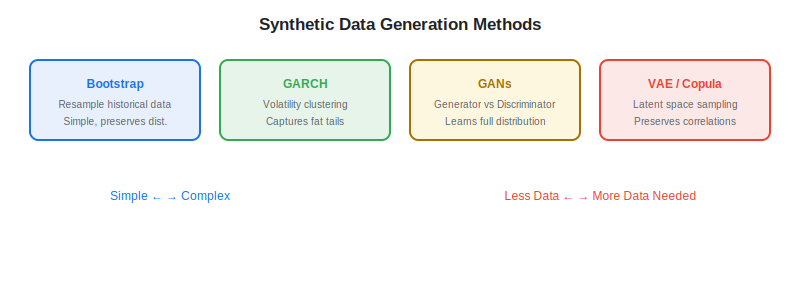
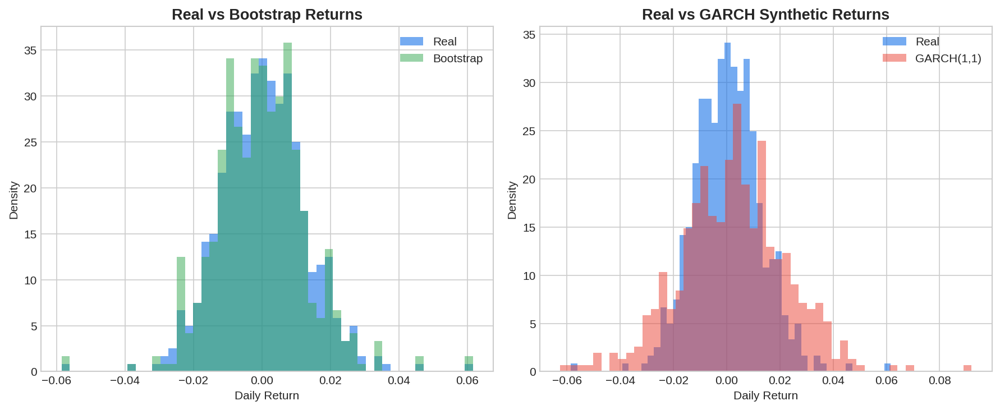

Synthetic data generation is rapidly becoming an essential tool in quantitative finance. By creating artificial datasets that mimic the statistical properties of real financial data — without exposing proprietary information or being constrained by limited historical samples — algo traders can train more robust machine learning models, stress-test strategies under conditions that never occurred, and overcome the chronic problem of insufficient data in [alternative data](https://paperswithbacktest.com/wiki/best-alternative-data) applications.

## What Is Synthetic Data in Finance?

Synthetic data consists of artificially generated data points that replicate the statistical distributions, correlations, and temporal dynamics of real financial data. Unlike historical data, synthetic data can be produced in arbitrary quantities and can simulate scenarios (market crashes, regime changes, liquidity crises) that may have occurred rarely or never in the historical record.

The primary applications in algo trading include augmenting small alternative data samples for ML training, generating stress-test scenarios for strategy robustness evaluation, privacy-preserving data sharing (e.g., sharing anonymized transaction data), and backtesting strategies across a wider range of market conditions than history provides.

The need for synthetic data in finance has become acute as machine learning models have grown more data-hungry. A deep learning model trained on 10 years of daily returns for 500 stocks has approximately 1.3 million data points — sounds large, but pales in comparison to the hundreds of millions of images used to train computer vision models or the trillions of tokens used for language models. Financial data is inherently scarce because markets generate returns at fixed frequencies (one daily close per stock per day, ~252 trading days per year), and the non-stationary nature of markets means that data from 20 years ago may not be representative of current dynamics.

Synthetic data offers an elegant solution: if you can faithfully model the statistical properties of financial returns — including their fat tails, volatility clustering, cross-asset correlations, and regime-switching behavior — you can generate arbitrarily large samples for training while preserving the essential characteristics that make financial data unique. This is particularly valuable for [alternative data](https://paperswithbacktest.com/wiki/best-alternative-data) signals, which typically have histories of only 5–10 years, giving you perhaps 20–40 quarterly observations per company — far too few to train complex models without augmentation.

The challenge, of course, is that "faithfully modeling" financial returns is enormously difficult. Financial time series exhibit a constellation of stylized facts — fat tails, volatility clustering, leverage effects, cross-sectional momentum and reversal, regime changes — that no single generative model captures perfectly. The art of synthetic data in finance lies in choosing the right generation method for your specific application and validating rigorously that the properties you care about are preserved.

## Key Synthetic Data Techniques

### Statistical Bootstrapping

The simplest approach: resample historical returns with replacement to create new synthetic paths. This preserves the empirical distribution but assumes independence between observations.

$$r^{syn}_t = r_{\pi(t)}, \quad \pi(t) \sim \text{Uniform}(1, T)$$

### Generative Adversarial Networks (GANs)

GANs train two neural networks — a generator that creates fake data and a discriminator that tries to distinguish fake from real. When the discriminator can no longer tell the difference, the generator produces realistic synthetic data. FinGAN and TimeGAN are popular variants adapted for financial time series.

### Variational Autoencoders (VAEs)

VAEs learn a compressed latent representation of the data and sample from this latent space to generate new data points. They are particularly useful for generating correlated multi-asset returns.

### Copula-Based Methods

Copulas model the dependence structure between variables separately from their marginal distributions. This allows generating synthetic data that preserves the correlation and tail-dependence structure of real financial data.



## Python Implementation: Synthetic Return Generation

```python
import numpy as np
import pandas as pd
from scipy import stats

class SyntheticReturnGenerator:
    """Generate synthetic financial returns using multiple methods."""
    
    def __init__(self, real_returns: np.ndarray):
        self.real = real_returns
        self.mu = np.mean(real_returns)
        self.sigma = np.std(real_returns)
        self.skew = stats.skew(real_returns)
        self.kurt = stats.kurtosis(real_returns)
    
    def bootstrap(self, n_samples: int, block_size: int = 5) -> np.ndarray:
        """Block bootstrap preserving short-term autocorrelation."""
        T = len(self.real)
        n_blocks = n_samples // block_size + 1
        indices = np.random.randint(0, T - block_size, n_blocks)
        blocks = [self.real[i:i+block_size] for i in indices]
        synthetic = np.concatenate(blocks)[:n_samples]
        return synthetic
    
    def parametric_gaussian(self, n_samples: int) -> np.ndarray:
        """Simple Gaussian with matched moments."""
        return np.random.normal(self.mu, self.sigma, n_samples)
    
    def student_t(self, n_samples: int, df: float = 5) -> np.ndarray:
        """Student-t distribution for fat tails."""
        raw = stats.t.rvs(df=df, size=n_samples)
        return raw * self.sigma + self.mu
    
    def garch_simulation(self, n_samples: int,
                         omega: float = 0.00001,
                         alpha: float = 0.08,
                         beta: float = 0.90) -> np.ndarray:
        """GARCH(1,1) simulation for volatility clustering."""
        returns = np.zeros(n_samples)
        sigma2 = np.zeros(n_samples)
        sigma2[0] = self.sigma ** 2
        
        for t in range(1, n_samples):
            sigma2[t] = omega + alpha * returns[t-1]**2 + beta * sigma2[t-1]
            returns[t] = self.mu + np.sqrt(sigma2[t]) * np.random.randn()
        
        return returns

# Example usage
np.random.seed(42)
real_returns = np.random.normal(0.0004, 0.012, 252)  # 1 year of daily returns

gen = SyntheticReturnGenerator(real_returns)
syn_bootstrap = gen.bootstrap(1000)
syn_garch = gen.garch_simulation(1000)

print(f"Real returns — mean: {real_returns.mean():.5f}, std: {real_returns.std():.5f}")
print(f"Bootstrap    — mean: {syn_bootstrap.mean():.5f}, std: {syn_bootstrap.std():.5f}")
print(f"GARCH        — mean: {syn_garch.mean():.5f}, std: {syn_garch.std():.5f}")
```



## Validating Synthetic Data Quality

Synthetic data is only useful if it faithfully reproduces the properties that matter for trading. Key validation checks:

| Property | Test | Acceptable Threshold |
|---|---|---|
| Marginal distribution | KS test vs. real data | p-value > 0.05 |
| Autocorrelation structure | Compare ACF plots | Visual match at lags 1-20 |
| Volatility clustering | ARCH test on synthetic | Significant clustering |
| Tail behavior | Compare VaR/CVaR | Within 10% of real |
| Cross-asset correlation | Compare correlation matrices | Frobenius norm < 0.1 |

## Limitations and Risks

**Mode collapse** in GANs: the generator may learn to produce only a subset of realistic scenarios, missing important tail events. Always validate synthetic data against multiple statistical tests.

**Stationarity assumption**: most generation methods assume the underlying process is stationary. In reality, financial markets exhibit regime changes that simple models cannot capture.

**False confidence**: abundant synthetic data can lead to [overfitting](https://paperswithbacktest.com/wiki/alternative-data-overfitting-pitfalls) if the synthetic generator does not capture all relevant data dynamics. Strategies that perform well on synthetic data may fail on real data.

## Conclusion

Synthetic data generation addresses one of the fundamental constraints in quantitative finance — the limited historical sample. For algo traders working with [alternative data](https://paperswithbacktest.com/wiki/how-can-alternative-data-be-integrated-into-quantitative-trading), where history may span only 5–10 years, synthetic augmentation can meaningfully improve model robustness. Start with simple methods (block bootstrap, GARCH) before investing in GANs or VAEs, and always validate rigorously.

---

**Explore further on PapersWithBacktest:**
- Browse [backtested trading strategies](https://paperswithbacktest.com/strategies) with Python code and performance metrics
- Access [clean historical market data](https://paperswithbacktest.com/datasets) for equities, crypto, and futures
- Take the [algo trading course](https://paperswithbacktest.com/course) — 60+ video lessons and notebooks
- Related wiki pages: [Alternative Data and Overfitting](https://paperswithbacktest.com/wiki/alternative-data-overfitting-pitfalls) · [Best Alternative Data Sources](https://paperswithbacktest.com/wiki/best-alternative-data)
